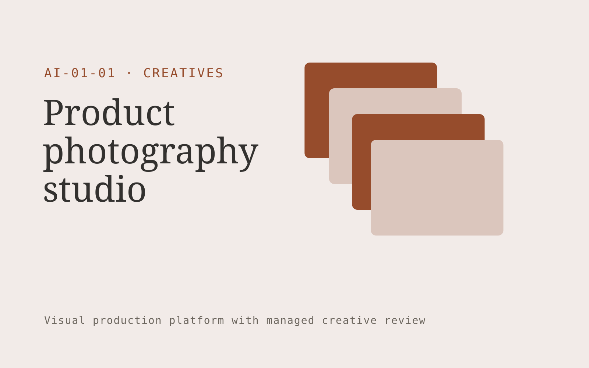

# Product photography studio

**AI-01-01 · Creatives** · Also fits: Marketing; Sales

> For marketing leads at independent furniture stores, turn product photographs, dimensions and brand references into approved lifestyle image set and product accuracy checklist. Address the recurring problem: new collections wait for expensive repeat shoots. The value hypothesis is a more complete, reviewable deliverable with less repeated preparation; the pilot must establish whether that benefit is real.

| | |
|---|---|
| **Buyer** | Marketing leads at independent furniture stores |
| **Problem** | New collections wait for expensive repeat shoots. |
| **Format** | Visual production platform with managed creative review |
| **USP** | Repeatable scenes across an entire furniture collection, with product accuracy checks. |

## The product
Key screens: Product library, scene canvas, approval gallery. Use a thumbnail gallery for projects, a large central editing canvas, and a right-hand panel for references, constraints and comments. Let users compare versions side by side. Display draft, changes requested and approved states. Provide a client preview link with comments anchored to the relevant asset. In this product, the first view is product library, followed by scene canvas and approval gallery.

## Core functionality
1. Isolate products without changing geometry.
2. Build reusable room scenes.
3. Lock colors and proportions.
4. Batch camera angles.
5. Compare original and generated details.
6. Export marketplace image sizes.

## Customer workflow
Create a brief, upload reference material, choose constraints, review a small set of directions, refine the selected direction, request client approval, and export a versioned delivery pack. Start with product photographs, dimensions and brand references and finish with approved lifestyle image set and product accuracy checklist.

## AI and human review
Use language models to interpret briefs and visual models where appropriate to generate or adapt assets. Keep factual attributes in structured fields. Validate dimensions and export formats through deterministic checks. A creative reviewer confirms visual quality and fidelity before delivery.

## Customer inputs
Product photographs, dimensions and brand references

## Customer deliverables
Approved lifestyle image set and product accuracy checklist

## Accounts and administration
Project ownership, asset versions, client comments, approval states, usage allowances, revision limits, download history and a rights record for supplied material.

## MVP scope
Begin with marketing leads at independent furniture stores and one recurring use case. Build the first two modules: isolate products without changing geometry; build reusable room scenes. Provide operator assistance for the third module: lock colors and proportions. Deliver approved lifestyle image set and product accuracy checklist through a manual review queue. Perform other necessary full-scope functions manually during the pilot. Include all applicable access, accuracy and professional-review controls from the start.

## After MVP validation
After paid pilots establish value, automate the remaining modules: batch camera angles; compare original and generated details; export marketplace image sizes. Add one validated source integration, reusable customer configuration and recurring delivery. Expand to additional teams, document formats or languages only after testing the new scope.

## Build dependencies
Asset upload and preview, asynchronous generation jobs, editable version history, reviewer access and tested export formats. High-fidelity production requires specialist creative QA.

## Integrations and data access
Existing artwork, campaign systems and client approval processes. Cloud asset storage, design-file import/export and publishing destinations. Start with file exchange and validate destination specifications before promising direct publishing. These are candidate integration categories, not verified supported connectors.

## Defensibility
A reusable library of approved styles, production constraints and review examples, together with reliable delivery for a narrow creative niche. For this idea, build around repeatable scenes across an entire furniture collection, with product accuracy checks. This advantage requires execution and accumulated customer trust; the base model alone is not a defensible asset.

## Alternatives and positioning
Freelancers, creative agencies, generic generation tools and existing design applications. Differentiate on this specific proposed advantage: repeatable scenes across an entire furniture collection, with product accuracy checks. Test it against the buyer's current method on the same task. Competitor coverage and uniqueness have not been established.

## Revenue model and test pricing (USD)
Test a USD 300-1,500 fixed pilot for one defined asset package. Offer a monthly production allowance after repeat demand. Quote complex video, 3D or specialist design separately. These are test prices, not market benchmarks.

## Main delivery costs
Generation attempts, video or image processing, storage, reviewer hours, client revision rounds and licensed source assets.

## Marketing message to test
> Product photography studio for marketing leads at independent furniture stores. Repeatable scenes across an entire furniture collection, with product accuracy checks. Demonstrate the claim through one product photographed into three consistent settings.

## Acquisition channels
Furniture e-commerce agencies and founder communities

## Lead magnet
One product photographed into three consistent settings

## First 30 days of marketing
- Week 1: interview five prospective buyers in this segment: marketing leads at independent furniture stores. Ask to see a recent example of the problem and their current process.
- Week 2: prepare this demonstration using authorized or synthetic material: one product photographed into three consistent settings.
- Week 3: present it through furniture e-commerce agencies and founder communities and seek one narrowly scoped paid pilot.
- Week 4: review approved images per revision hour, repeat collection orders, total delivery effort and a concrete renewal decision before increasing scope.

## Paid pilot and validation
Deliver one real creative brief with a capped asset count and revision allowance. Compare usable deliverables, reviewer time and client acceptance with the existing production method. For this idea, use product photographs, dimensions and brand references and evaluate approved lifestyle image set and product accuracy checklist. Agree success thresholds with the buyer before starting; collect a baseline for approved images per revision hour, repeat collection orders. A positive signal is payment and repeat use with acceptable quality and delivery cost, not a favorable demo reaction alone.

## Success metrics
Approved images per revision hour, repeat collection orders

## Retention and expansion
Save approved styles and constraints, offer repeat production batches, and expand only into adjacent asset formats the same buyer already commissions.

## Operating controls and limitations
Protect supplied asset rights, client approvals and product fidelity. Do not reuse private client assets across accounts. Validate source access and reviewer availability during the pilot. Maintain customer-level access, data deletion controls and a record of final approvals.

## Brand style (concept)

- Colors: `#913827` primary · `#54c9c5` accent · `#f1e7e4` surface · `#22201e` ink
- Type: Libre Baskerville for headings, IBM Plex Sans for text
- Voice: Confident, visual, craft-proud
- Demo site: [https://nexibeo.com/ideas/product-photography-studio/demo/](https://nexibeo.com/ideas/product-photography-studio/demo/)

## Investment indication

Indicative build budget, from MVP to full product. This is a planning range, not a quote; it excludes running costs such as model usage, hosting and reviewer hours.

| Phase | Scope | Timeline | Indicative budget |
|---|---|---|---|
| MVP | One buyer segment, one recurring use case; first modules: isolate products without changing geometry; build reusable room scenes. Manual review in the loop. | 6 weeks | $11,500 |
| Paid pilot | Accounts, roles, review states, audit trail and the first integration, hardened for two to three paying pilot customers. | 8 weeks | $15,500 |
| Full product | Remaining modules: batch camera angles; compare original and generated details; export marketplace image sizes. Self-serve onboarding, billing, monitoring and the wider integration set. | 14 weeks | $21,000 |
| **Total** | | 28 weeks | **$48,000** |

**Co-create this project with us:** [contact Nexibeo](https://nexibeo.com/ideas/product-photography-studio/#apply) and we build it with you.

## Research status
Concept proposal expanded from the 315-idea conversation. Demand, pricing, differentiation, build scope and integration feasibility are hypotheses, not verified market findings. Category link is inspiration rather than evidence of business viability.

## Credits and next steps

- **Estimation and building this idea:** see the full idea page on [nexibeo.com](https://nexibeo.com/ideas/product-photography-studio/) for more detail on estimation, and to co-create and build this idea with Nexibeo.
- **Become an AI-optimized specialist for Creatives:** [Complete AI Training](https://completeaitraining.com/certification/12b-ai-certification-for-creatives/).
- Field news: [AI news for Creatives](https://completeaitraining.com/all-ai-news-for-creatives/).
