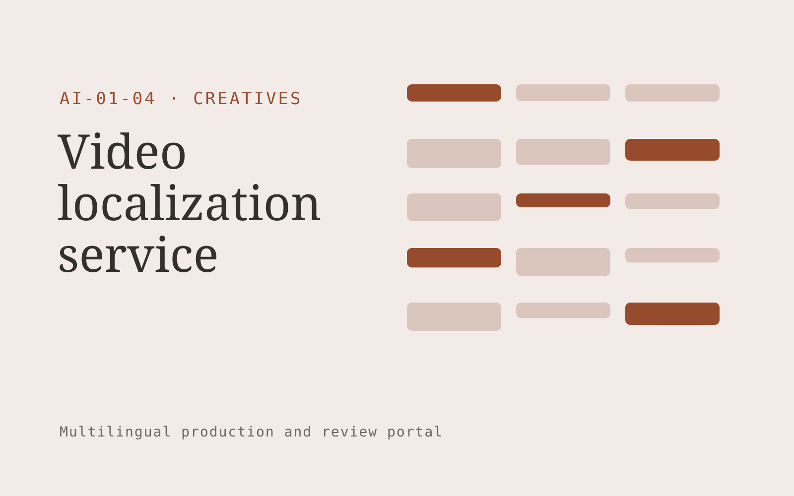

# Video localization service

**Creatives** · Also fits: Marketing; Sales; PR and Communications

> For learning video producers selling courses internationally, turn authorized video, transcript and pronunciation glossary into localized video, subtitle files and terminology log. Address the recurring problem: each language version requires disconnected transcription and editing work. The value hypothesis is a more complete, reviewable deliverable with less repeated preparation; the pilot must establish whether that benefit is real.

| | |
|---|---|
| **Buyer** | Learning video producers selling courses internationally |
| **Problem** | Each language version requires disconnected transcription and editing work. |
| **Format** | Multilingual production and review portal |
| **USP** | Terminology and speaker continuity across a full course library. |

## The product
Key screens: Video timeline, language comparison, reviewer queue. Use aligned source and target language panes with shared terminology highlights. Include a language status grid, reviewer assignment queue, and layout or timeline preview. Show unresolved ambiguities next to the affected passage. Keep approvals separate for each language and version. In this product, the first view is video timeline, followed by language comparison and reviewer queue.

## Core functionality
1. Transcribe with speaker labels.
2. Edit translated subtitles.
3. Align dubbed speech.
4. Track voice permissions.
5. Check on-screen text.
6. Export caption and video versions.

## Customer workflow
Upload authorized source content, confirm target languages and terminology, create translation drafts, assign qualified reviewers, reconcile source changes, check layout or timing, and deliver approved language versions. Start with authorized video, transcript and pronunciation glossary and finish with localized video, subtitle files and terminology log.

## AI and human review
Draft translations, transcribe media when applicable, suggest terminology and detect inconsistencies. Deterministic checks compare dates, numbers and identifiers. Qualified language reviewers decide idiomatic phrasing and specialist meaning. Voice work requires explicit permissions for the intended use.

## Customer inputs
Authorized video, transcript and pronunciation glossary

## Customer deliverables
Localized video, subtitle files and terminology log

## Accounts and administration
Language permissions, glossary versions, reviewer assignments, segment comments, source-change alerts, per-language approvals and delivery history.

## MVP scope
Begin with learning video producers selling courses internationally and one recurring use case. Build the first two modules: transcribe with speaker labels; edit translated subtitles. Provide operator assistance for the third module: align dubbed speech. Deliver localized video, subtitle files and terminology log through a manual review queue. Perform other necessary full-scope functions manually during the pilot. Include all applicable access, accuracy and professional-review controls from the start.

## After MVP validation
After paid pilots establish value, automate the remaining modules: track voice permissions; check on-screen text; export caption and video versions. Add one validated source integration, reusable customer configuration and recurring delivery. Expand to additional teams, document formats or languages only after testing the new scope.

## Build dependencies
Segment alignment, glossary enforcement, multilingual text handling, comparison views and qualified reviewers. Media projects also need timing and audio/video QA.

## Integrations and data access
Existing artwork, campaign systems and client approval processes. Document formats, subtitle formats, media storage and publishing systems. Confirm language, font and layout support for each requested output. These are candidate integration categories, not verified supported connectors.

## Defensibility
Customer-controlled approved terminology, reviewed translation examples and dependable specialist reviewer relationships. For this idea, build around terminology and speaker continuity across a full course library. This advantage requires execution and accumulated customer trust; the base model alone is not a defensible asset.

## Alternatives and positioning
Translation agencies, freelance linguists, generic machine translation and internal bilingual staff. Differentiate on this specific proposed advantage: terminology and speaker continuity across a full course library. Test it against the buyer's current method on the same task. Competitor coverage and uniqueness have not been established.

## Revenue model and test pricing (USD)
Quote an initial USD 300-1,200 batch for a defined word count or media duration and one target language. Charge separately for extra languages, specialist review and dubbing. Test recurring volume agreements after the pilot; prices are hypotheses.

## Main delivery costs
Source preparation, translation volume, transcription or dubbing, qualified reviewers, glossary maintenance and changed-source rework.

## Marketing message to test
> Video localization service for learning video producers selling courses internationally. Terminology and speaker continuity across a full course library. Demonstrate the claim through a reviewed sixty-second bilingual video sample.

## Acquisition channels
Course production agencies and international training providers

## Lead magnet
A reviewed sixty-second bilingual video sample

## First 30 days of marketing
- Week 1: interview five prospective buyers in this segment: learning video producers selling courses internationally. Ask to see a recent example of the problem and their current process.
- Week 2: prepare this demonstration using authorized or synthetic material: a reviewed sixty-second bilingual video sample.
- Week 3: present it through course production agencies and international training providers and seek one narrowly scoped paid pilot.
- Week 4: review correction minutes per video, acceptance by native reviewers, total delivery effort and a concrete renewal decision before increasing scope.

## Paid pilot and validation
Translate a representative sample and have an independent qualified reviewer assess it. Include a source revision to measure update handling. Track corrections, meaning preservation and total delivery effort. For this idea, use authorized video, transcript and pronunciation glossary and evaluate localized video, subtitle files and terminology log. Agree success thresholds with the buyer before starting; collect a baseline for correction minutes per video, acceptance by native reviewers. A positive signal is payment and repeat use with acceptable quality and delivery cost, not a favorable demo reaction alone.

## Success metrics
Correction minutes per video, acceptance by native reviewers

## Retention and expansion
Maintain approved terminology and reviewer continuity. Charge for ongoing source updates and add languages only when the buyer has a real publishing need.

## Operating controls and limitations
Protect supplied asset rights, client approvals and product fidelity. Do not reuse private client assets across accounts. Validate source access and reviewer availability during the pilot. Maintain customer-level access, data deletion controls and a record of final approvals.

## Brand style (concept)

- Colors: `#913e27` primary · `#54a0c9` accent · `#f1e7e4` surface · `#22201e` ink
- Type: Libre Baskerville for headings, IBM Plex Sans for text
- Voice: Confident, visual, craft-proud
- Demo site: [https://nexibeo.com/solutions/video-localization-service/demo/](https://nexibeo.com/solutions/video-localization-service/demo/)

## Investment indication

Indicative build budget, from MVP to full product. This is a planning range, not a quote; it excludes running costs such as model usage, hosting and reviewer hours. Built with Nexibeo's AI software development factory, most implementations take days to a few weeks of creation time, depending on availability.

| Phase | Scope | Creation time | Indicative budget |
|---|---|---|---|
| MVP | One buyer segment, one recurring use case; first modules: transcribe with speaker labels; edit translated subtitles. Manual review in the loop. | 6 days | $11,000 |
| Paid pilot | Accounts, roles, review states, audit trail and the first integration, hardened for two to three paying pilot customers. | 7 days | $14,500 |
| Full product | Remaining modules: track voice permissions; check on-screen text; export caption and video versions. Self-serve onboarding, billing, monitoring and the wider integration set. | 3 weeks | $20,000 |
| **Total** | | about 5 weeks | **$45,500** |

### Running costs per month (rough indication, untested)

| Stage | Hosting and infrastructure | AI usage | Total per month |
|---|---|---|---|
| MVP and paid pilot (about 3 customers) | $40–$80 | $100–$200 | **$140–$280** |
| Full product (about 50 customers) | $160–$320 | $1,230–$2,450 | **$1,390–$2,770** |

**Get this built:** [contact Nexibeo](https://nexibeo.com/solutions/video-localization-service/#apply). We build it with our AI software factory, usually in days to a few weeks, for you to run internally or offer to your clients.

## Research status
Concept proposal expanded from the 315-idea conversation. Demand, pricing, differentiation, build scope and integration feasibility are hypotheses, not verified market findings. Category link is inspiration rather than evidence of business viability.

## Credits and next steps

- **Estimation and having it built:** see the full solution page on [nexibeo.com](https://nexibeo.com/solutions/video-localization-service/) for more detail on estimation. Nexibeo builds it for you as a custom AI implementation, to run internally or to offer to your own clients.
- **Become an AI-optimized specialist for Creatives:** [Complete AI Training](https://completeaitraining.com/certification/12b-ai-certification-for-creatives/).
- Field news: [AI news for Creatives](https://completeaitraining.com/all-ai-news-for-creatives/).
