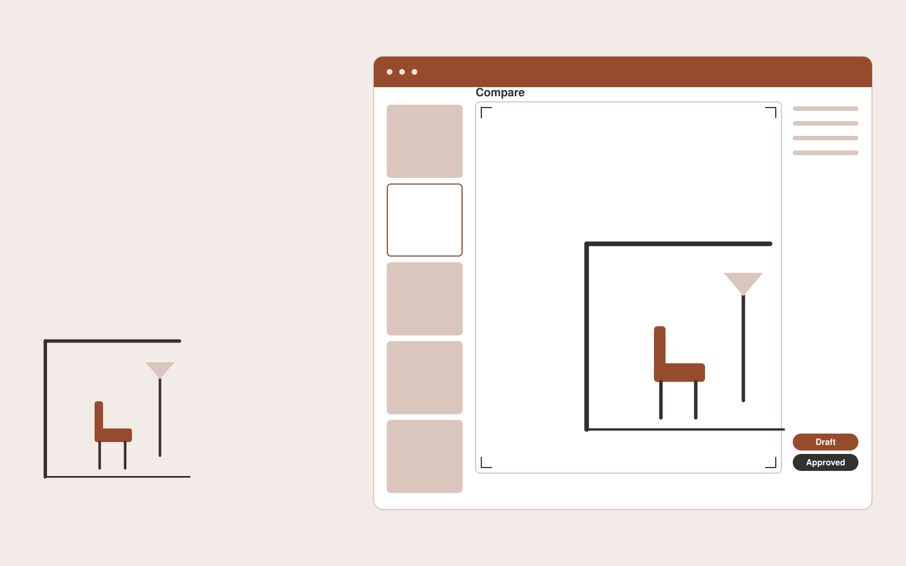

# Virtual staging studio

**Creatives** · Also fits: Marketing; Sales

> For real estate photographers serving vacant apartments, turn room photos, floor plans and staging preferences into labeled staged photo gallery with originals. Address the recurring problem: empty rooms perform poorly as marketing material and staging costs accumulate. The value hypothesis is a more complete, reviewable deliverable with less repeated preparation; the pilot must establish whether that benefit is real.

| | |
|---|---|
| **Buyer** | Real estate photographers serving vacant apartments |
| **Problem** | Empty rooms perform poorly as marketing material and staging costs accumulate. |
| **Format** | Visual production platform with managed creative review |
| **USP** | Consistent furnishing across views while preserving fixed property features. |

## The product
Key screens: Property gallery, room canvas, disclosure preview. Use a thumbnail gallery for projects, a large central editing canvas, and a right-hand panel for references, constraints and comments. Let users compare versions side by side. Display draft, changes requested and approved states. Provide a client preview link with comments anchored to the relevant asset. In this product, the first view is property gallery, followed by room canvas and disclosure preview.

## Core functionality
1. Detect room boundaries.
2. Preserve structural features.
3. Furnish consistent room sets.
4. Offer style comparisons.
5. Attach alteration disclosures.
6. Export agent-ready galleries.

## Customer workflow
Create a brief, upload reference material, choose constraints, review a small set of directions, refine the selected direction, request client approval, and export a versioned delivery pack. Start with room photos, floor plans and staging preferences and finish with labeled staged photo gallery with originals.

## AI and human review
Use language models to interpret briefs and visual models where appropriate to generate or adapt assets. Keep factual attributes in structured fields. Validate dimensions and export formats through deterministic checks. A creative reviewer confirms visual quality and fidelity before delivery.

## Customer inputs
Room photos, floor plans and staging preferences

## Customer deliverables
Labeled staged photo gallery with originals

## Accounts and administration
Project ownership, asset versions, client comments, approval states, usage allowances, revision limits, download history and a rights record for supplied material.

## MVP scope
Begin with real estate photographers serving vacant apartments and one recurring use case. Build the first two modules: detect room boundaries; preserve structural features. Provide operator assistance for the third module: furnish consistent room sets. Deliver labeled staged photo gallery with originals through a manual review queue. Perform other necessary full-scope functions manually during the pilot. Include all applicable access, accuracy and professional-review controls from the start.

## After MVP validation
After paid pilots establish value, automate the remaining modules: offer style comparisons; attach alteration disclosures; export agent-ready galleries. Add one validated source integration, reusable customer configuration and recurring delivery. Expand to additional teams, document formats or languages only after testing the new scope.

## Build dependencies
Asset upload and preview, asynchronous generation jobs, editable version history, reviewer access and tested export formats. High-fidelity production requires specialist creative QA.

## Integrations and data access
Existing artwork, campaign systems and client approval processes. Cloud asset storage, design-file import/export and publishing destinations. Start with file exchange and validate destination specifications before promising direct publishing. These are candidate integration categories, not verified supported connectors.

## Defensibility
A reusable library of approved styles, production constraints and review examples, together with reliable delivery for a narrow creative niche. For this idea, build around consistent furnishing across views while preserving fixed property features. This advantage requires execution and accumulated customer trust; the base model alone is not a defensible asset.

## Alternatives and positioning
Freelancers, creative agencies, generic generation tools and existing design applications. Differentiate on this specific proposed advantage: consistent furnishing across views while preserving fixed property features. Test it against the buyer's current method on the same task. Competitor coverage and uniqueness have not been established.

## Revenue model and test pricing (USD)
Test a USD 300-1,500 fixed pilot for one defined asset package. Offer a monthly production allowance after repeat demand. Quote complex video, 3D or specialist design separately. These are test prices, not market benchmarks.

## Main delivery costs
Generation attempts, video or image processing, storage, reviewer hours, client revision rounds and licensed source assets.

## Marketing message to test
> Virtual staging studio for real estate photographers serving vacant apartments. Consistent furnishing across views while preserving fixed property features. Demonstrate the claim through one disclosed staged room with an original-image comparison.

## Acquisition channels
Real estate photography businesses and brokerage partners

## Lead magnet
One disclosed staged room with an original-image comparison

## First 30 days of marketing
- Week 1: interview five prospective buyers in this segment: real estate photographers serving vacant apartments. Ask to see a recent example of the problem and their current process.
- Week 2: prepare this demonstration using authorized or synthetic material: one disclosed staged room with an original-image comparison.
- Week 3: present it through real estate photography businesses and brokerage partners and seek one narrowly scoped paid pilot.
- Week 4: review agent approval rate, repeat property orders, total delivery effort and a concrete renewal decision before increasing scope.

## Paid pilot and validation
Deliver one real creative brief with a capped asset count and revision allowance. Compare usable deliverables, reviewer time and client acceptance with the existing production method. For this idea, use room photos, floor plans and staging preferences and evaluate labeled staged photo gallery with originals. Agree success thresholds with the buyer before starting; collect a baseline for agent approval rate, repeat property orders. A positive signal is payment and repeat use with acceptable quality and delivery cost, not a favorable demo reaction alone.

## Success metrics
Agent approval rate, repeat property orders

## Retention and expansion
Save approved styles and constraints, offer repeat production batches, and expand only into adjacent asset formats the same buyer already commissions.

## Operating controls and limitations
Protect supplied asset rights, client approvals and product fidelity. Do not reuse private client assets across accounts. Validate source access and reviewer availability during the pilot. Maintain customer-level access, data deletion controls and a record of final approvals.

## Brand style (concept)

- Colors: `#915327` primary · `#54a2c9` accent · `#f1eae4` surface · `#22201e` ink
- Type: Manrope for headings, Manrope for text
- Voice: Confident, visual, craft-proud
- Demo site: [https://nexibeo.com/ideas/virtual-staging-studio/demo/](https://nexibeo.com/ideas/virtual-staging-studio/demo/)

## Investment indication

Indicative build budget, from MVP to full product. This is a planning range, not a quote; it excludes running costs such as model usage, hosting and reviewer hours.

| Phase | Scope | Timeline | Indicative budget |
|---|---|---|---|
| MVP | One buyer segment, one recurring use case; first modules: detect room boundaries; preserve structural features. Manual review in the loop. | 6 weeks | $11,500 |
| Paid pilot | Accounts, roles, review states, audit trail and the first integration, hardened for two to three paying pilot customers. | 8 weeks | $15,500 |
| Full product | Remaining modules: offer style comparisons; attach alteration disclosures; export agent-ready galleries. Self-serve onboarding, billing, monitoring and the wider integration set. | 14 weeks | $21,500 |
| **Total** | | 28 weeks | **$48,500** |

**Co-create this project with us:** [contact Nexibeo](https://nexibeo.com/ideas/virtual-staging-studio/#apply) and we build it with you.

## Research status
Concept proposal expanded from the 315-idea conversation. Demand, pricing, differentiation, build scope and integration feasibility are hypotheses, not verified market findings. Category link is inspiration rather than evidence of business viability.

## Credits and next steps

- **Estimation and building this idea:** see the full idea page on [nexibeo.com](https://nexibeo.com/ideas/virtual-staging-studio/) for more detail on estimation, and to co-create and build this idea with Nexibeo.
- **Become an AI-optimized specialist for Creatives:** [Complete AI Training](https://completeaitraining.com/certification/12b-ai-certification-for-creatives/).
- Field news: [AI news for Creatives](https://completeaitraining.com/all-ai-news-for-creatives/).
