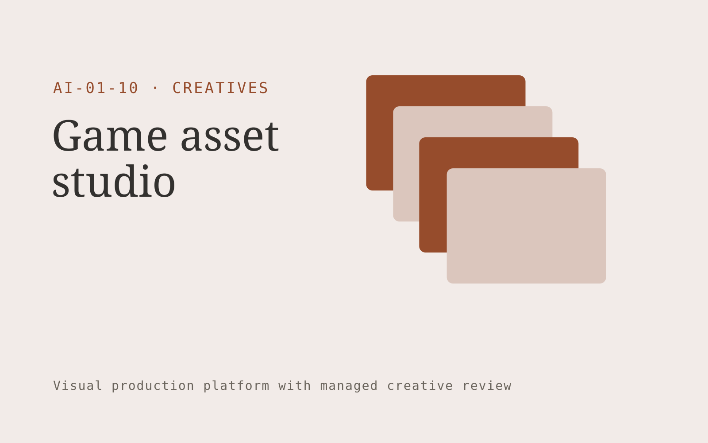

# Game asset studio

**Creatives** · Also fits: Marketing; Sales

> For independent game art directors building stylized games, turn art bible, existing assets and engine specifications into reviewed asset bundle and integration notes. Address the recurring problem: outsourced assets vary in style and require repeated rework. The value hypothesis is a more complete, reviewable deliverable with less repeated preparation; the pilot must establish whether that benefit is real.

| | |
|---|---|
| **Buyer** | Independent game art directors building stylized games |
| **Problem** | Outsourced assets vary in style and require repeated rework. |
| **Format** | Visual production platform with managed creative review |
| **USP** | A game-specific style library and human art direction throughout production. |

## The product
Key screens: Asset backlog, generation canvas, style review. Use a thumbnail gallery for projects, a large central editing canvas, and a right-hand panel for references, constraints and comments. Let users compare versions side by side. Display draft, changes requested and approved states. Provide a client preview link with comments anchored to the relevant asset. In this product, the first view is asset backlog, followed by generation canvas and style review.

## Core functionality
1. Capture style references.
2. Generate concept variations.
3. Check dimensions and palettes.
4. Prepare texture candidates.
5. Track asset versions.
6. Export organized engine handoffs.

## Customer workflow
Create a brief, upload reference material, choose constraints, review a small set of directions, refine the selected direction, request client approval, and export a versioned delivery pack. Start with art bible, existing assets and engine specifications and finish with reviewed asset bundle and integration notes.

## AI and human review
Use language models to interpret briefs and visual models where appropriate to generate or adapt assets. Keep factual attributes in structured fields. Validate dimensions and export formats through deterministic checks. A creative reviewer confirms visual quality and fidelity before delivery.

## Customer inputs
Art bible, existing assets and engine specifications

## Customer deliverables
Reviewed asset bundle and integration notes

## Accounts and administration
Project ownership, asset versions, client comments, approval states, usage allowances, revision limits, download history and a rights record for supplied material.

## MVP scope
Begin with independent game art directors building stylized games and one recurring use case. Build the first two modules: capture style references; generate concept variations. Provide operator assistance for the third module: check dimensions and palettes. Deliver reviewed asset bundle and integration notes through a manual review queue. Perform other necessary full-scope functions manually during the pilot. Include all applicable access, accuracy and professional-review controls from the start.

## After MVP validation
After paid pilots establish value, automate the remaining modules: prepare texture candidates; track asset versions; export organized engine handoffs. Add one validated source integration, reusable customer configuration and recurring delivery. Expand to additional teams, document formats or languages only after testing the new scope.

## Build dependencies
Asset upload and preview, asynchronous generation jobs, editable version history, reviewer access and tested export formats. High-fidelity production requires specialist creative QA.

## Integrations and data access
Existing artwork, campaign systems and client approval processes. Cloud asset storage, design-file import/export and publishing destinations. Start with file exchange and validate destination specifications before promising direct publishing. These are candidate integration categories, not verified supported connectors.

## Defensibility
A reusable library of approved styles, production constraints and review examples, together with reliable delivery for a narrow creative niche. For this idea, build around a game-specific style library and human art direction throughout production. This advantage requires execution and accumulated customer trust; the base model alone is not a defensible asset.

## Alternatives and positioning
Freelancers, creative agencies, generic generation tools and existing design applications. Differentiate on this specific proposed advantage: a game-specific style library and human art direction throughout production. Test it against the buyer's current method on the same task. Competitor coverage and uniqueness have not been established.

## Revenue model and test pricing (USD)
Test a USD 300-1,500 fixed pilot for one defined asset package. Offer a monthly production allowance after repeat demand. Quote complex video, 3D or specialist design separately. These are test prices, not market benchmarks.

## Main delivery costs
Generation attempts, video or image processing, storage, reviewer hours, client revision rounds and licensed source assets.

## Marketing message to test
> Game asset studio for independent game art directors building stylized games. A game-specific style library and human art direction throughout production. Demonstrate the claim through a small asset set matched to the existing art bible.

## Acquisition channels
Indie developer communities and game production studios

## Lead magnet
A small asset set matched to the existing art bible

## First 30 days of marketing
- Week 1: interview five prospective buyers in this segment: independent game art directors building stylized games. Ask to see a recent example of the problem and their current process.
- Week 2: prepare this demonstration using authorized or synthetic material: a small asset set matched to the existing art bible.
- Week 3: present it through indie developer communities and game production studios and seek one narrowly scoped paid pilot.
- Week 4: review usable assets per art review hour, repeat sprint orders, total delivery effort and a concrete renewal decision before increasing scope.

## Paid pilot and validation
Deliver one real creative brief with a capped asset count and revision allowance. Compare usable deliverables, reviewer time and client acceptance with the existing production method. For this idea, use art bible, existing assets and engine specifications and evaluate reviewed asset bundle and integration notes. Agree success thresholds with the buyer before starting; collect a baseline for usable assets per art review hour, repeat sprint orders. A positive signal is payment and repeat use with acceptable quality and delivery cost, not a favorable demo reaction alone.

## Success metrics
Usable assets per art review hour, repeat sprint orders

## Retention and expansion
Save approved styles and constraints, offer repeat production batches, and expand only into adjacent asset formats the same buyer already commissions.

## Operating controls and limitations
Protect supplied asset rights, client approvals and product fidelity. Do not reuse private client assets across accounts. Validate source access and reviewer availability during the pilot. Maintain customer-level access, data deletion controls and a record of final approvals.

## Brand style (concept)

- Colors: `#913f27` primary · `#54c5c9` accent · `#f1e7e4` surface · `#22201e` ink
- Type: Manrope for headings, Manrope for text
- Voice: Confident, visual, craft-proud
- Demo site: [https://nexibeo.com/ideas/game-asset-studio/demo/](https://nexibeo.com/ideas/game-asset-studio/demo/)

## Investment indication

Indicative build budget, from MVP to full product. This is a planning range, not a quote; it excludes running costs such as model usage, hosting and reviewer hours.

| Phase | Scope | Timeline | Indicative budget |
|---|---|---|---|
| MVP | One buyer segment, one recurring use case; first modules: capture style references; generate concept variations. Manual review in the loop. | 6 weeks | $12,000 |
| Paid pilot | Accounts, roles, review states, audit trail and the first integration, hardened for two to three paying pilot customers. | 8 weeks | $15,500 |
| Full product | Remaining modules: prepare texture candidates; track asset versions; export organized engine handoffs. Self-serve onboarding, billing, monitoring and the wider integration set. | 14 weeks | $21,500 |
| **Total** | | 28 weeks | **$49,000** |

### Running costs per month (rough indication, untested)

| Stage | Hosting and infrastructure | AI usage | Total per month |
|---|---|---|---|
| MVP and paid pilot (about 3 customers) | $40–$80 | $150–$310 | **$190–$390** |
| Full product (about 50 customers) | $160–$320 | $2,100–$4,200 | **$2,260–$4,520** |

**Co-create this project with us:** [contact Nexibeo](https://nexibeo.com/ideas/game-asset-studio/#apply) and we build it with you.

## Research status
Concept proposal expanded from the 315-idea conversation. Demand, pricing, differentiation, build scope and integration feasibility are hypotheses, not verified market findings. Category link is inspiration rather than evidence of business viability.

## Credits and next steps

- **Estimation and building this idea:** see the full idea page on [nexibeo.com](https://nexibeo.com/ideas/game-asset-studio/) for more detail on estimation, and to co-create and build this idea with Nexibeo.
- **Become an AI-optimized specialist for Creatives:** [Complete AI Training](https://completeaitraining.com/certification/12b-ai-certification-for-creatives/).
- Field news: [AI news for Creatives](https://completeaitraining.com/all-ai-news-for-creatives/).
