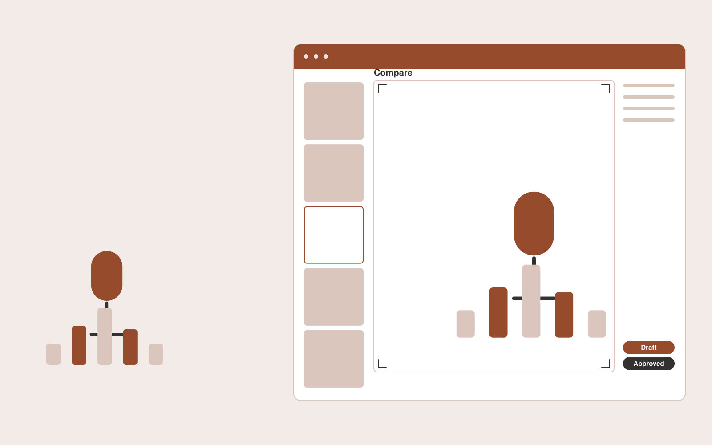

# Podcast promotion studio

**Creatives** · Also fits: Marketing; Sales

> For B2B podcast producers releasing weekly interviews, turn authorized episode video, transcript and brand assets into captioned clips, episode artwork and post drafts. Address the recurring problem: episodes ship without enough useful promotional material. The value hypothesis is a more complete, reviewable deliverable with less repeated preparation; the pilot must establish whether that benefit is real.

| | |
|---|---|
| **Buyer** | B2B podcast producers releasing weekly interviews |
| **Problem** | Episodes ship without enough useful promotional material. |
| **Format** | Visual production platform with managed creative review |
| **USP** | Every promotional asset remains linked to its source segment. |

## The product
Key screens: Episode library, clip timeline, campaign gallery. Use a thumbnail gallery for projects, a large central editing canvas, and a right-hand panel for references, constraints and comments. Let users compare versions side by side. Display draft, changes requested and approved states. Provide a client preview link with comments anchored to the relevant asset. In this product, the first view is episode library, followed by clip timeline and campaign gallery.

## Core functionality
1. Identify self-contained segments.
2. Preserve quote context.
3. Add editable captions.
4. Generate cover variants.
5. Adapt aspect ratios.
6. Package episode promotion schedules.

## Customer workflow
Create a brief, upload reference material, choose constraints, review a small set of directions, refine the selected direction, request client approval, and export a versioned delivery pack. Start with authorized episode video, transcript and brand assets and finish with captioned clips, episode artwork and post drafts.

## AI and human review
Use language models to interpret briefs and visual models where appropriate to generate or adapt assets. Keep factual attributes in structured fields. Validate dimensions and export formats through deterministic checks. A creative reviewer confirms visual quality and fidelity before delivery.

## Customer inputs
Authorized episode video, transcript and brand assets

## Customer deliverables
Captioned clips, episode artwork and post drafts

## Accounts and administration
Project ownership, asset versions, client comments, approval states, usage allowances, revision limits, download history and a rights record for supplied material.

## MVP scope
Begin with B2B podcast producers releasing weekly interviews and one recurring use case. Build the first two modules: identify self-contained segments; preserve quote context. Provide operator assistance for the third module: add editable captions. Deliver captioned clips, episode artwork and post drafts through a manual review queue. Perform other necessary full-scope functions manually during the pilot. Include all applicable access, accuracy and professional-review controls from the start.

## After MVP validation
After paid pilots establish value, automate the remaining modules: generate cover variants; adapt aspect ratios; package episode promotion schedules. Add one validated source integration, reusable customer configuration and recurring delivery. Expand to additional teams, document formats or languages only after testing the new scope.

## Build dependencies
Asset upload and preview, asynchronous generation jobs, editable version history, reviewer access and tested export formats. High-fidelity production requires specialist creative QA.

## Integrations and data access
Existing artwork, campaign systems and client approval processes. Cloud asset storage, design-file import/export and publishing destinations. Start with file exchange and validate destination specifications before promising direct publishing. These are candidate integration categories, not verified supported connectors.

## Defensibility
A reusable library of approved styles, production constraints and review examples, together with reliable delivery for a narrow creative niche. For this idea, build around every promotional asset remains linked to its source segment. This advantage requires execution and accumulated customer trust; the base model alone is not a defensible asset.

## Alternatives and positioning
Freelancers, creative agencies, generic generation tools and existing design applications. Differentiate on this specific proposed advantage: every promotional asset remains linked to its source segment. Test it against the buyer's current method on the same task. Competitor coverage and uniqueness have not been established.

## Revenue model and test pricing (USD)
Test a USD 300-1,500 fixed pilot for one defined asset package. Offer a monthly production allowance after repeat demand. Quote complex video, 3D or specialist design separately. These are test prices, not market benchmarks.

## Main delivery costs
Generation attempts, video or image processing, storage, reviewer hours, client revision rounds and licensed source assets.

## Marketing message to test
> Podcast promotion studio for B2B podcast producers releasing weekly interviews. Every promotional asset remains linked to its source segment. Demonstrate the claim through one episode converted into a coordinated sample campaign.

## Acquisition channels
Podcast production agencies and host newsletters

## Lead magnet
One episode converted into a coordinated sample campaign

## First 30 days of marketing
- Week 1: interview five prospective buyers in this segment: B2B podcast producers releasing weekly interviews. Ask to see a recent example of the problem and their current process.
- Week 2: prepare this demonstration using authorized or synthetic material: one episode converted into a coordinated sample campaign.
- Week 3: present it through podcast production agencies and host newsletters and seek one narrowly scoped paid pilot.
- Week 4: review approved clips per episode, recurring show retention, total delivery effort and a concrete renewal decision before increasing scope.

## Paid pilot and validation
Deliver one real creative brief with a capped asset count and revision allowance. Compare usable deliverables, reviewer time and client acceptance with the existing production method. For this idea, use authorized episode video, transcript and brand assets and evaluate captioned clips, episode artwork and post drafts. Agree success thresholds with the buyer before starting; collect a baseline for approved clips per episode, recurring show retention. A positive signal is payment and repeat use with acceptable quality and delivery cost, not a favorable demo reaction alone.

## Success metrics
Approved clips per episode, recurring show retention

## Retention and expansion
Save approved styles and constraints, offer repeat production batches, and expand only into adjacent asset formats the same buyer already commissions.

## Operating controls and limitations
Protect supplied asset rights, client approvals and product fidelity. Do not reuse private client assets across accounts. Validate source access and reviewer availability during the pilot. Maintain customer-level access, data deletion controls and a record of final approvals.

## Brand style (concept)

- Colors: `#914f27` primary · `#54a8c9` accent · `#f1e9e4` surface · `#22201e` ink
- Type: Manrope for headings, Manrope for text
- Voice: Confident, visual, craft-proud
- Demo site: [https://nexibeo.com/solutions/podcast-promotion-studio/demo/](https://nexibeo.com/solutions/podcast-promotion-studio/demo/)

## Investment indication

Indicative build budget, from MVP to full product. This is a planning range, not a quote; it excludes running costs such as model usage, hosting and reviewer hours. Built with Nexibeo's AI software development factory, most implementations take days to a few weeks of creation time, depending on availability.

| Phase | Scope | Creation time | Indicative budget |
|---|---|---|---|
| MVP | One buyer segment, one recurring use case; first modules: identify self-contained segments; preserve quote context. Manual review in the loop. | 7 days | $12,000 |
| Paid pilot | Accounts, roles, review states, audit trail and the first integration, hardened for two to three paying pilot customers. | 8 days | $15,500 |
| Full product | Remaining modules: generate cover variants; adapt aspect ratios; package episode promotion schedules. Self-serve onboarding, billing, monitoring and the wider integration set. | 3 weeks | $21,500 |
| **Total** | | about 6 weeks | **$49,000** |

### Running costs per month (rough indication, untested)

| Stage | Hosting and infrastructure | AI usage | Total per month |
|---|---|---|---|
| MVP and paid pilot (about 3 customers) | $40–$80 | $150–$310 | **$190–$390** |
| Full product (about 50 customers) | $160–$320 | $2,100–$4,200 | **$2,260–$4,520** |

**Get this built:** [contact Nexibeo](https://nexibeo.com/solutions/podcast-promotion-studio/#apply). We build it with our AI software factory, usually in days to a few weeks, for you to run internally or offer to your clients.

## Research status
Concept proposal expanded from the 315-idea conversation. Demand, pricing, differentiation, build scope and integration feasibility are hypotheses, not verified market findings. Category link is inspiration rather than evidence of business viability.

## Credits and next steps

- **Estimation and having it built:** see the full solution page on [nexibeo.com](https://nexibeo.com/solutions/podcast-promotion-studio/) for more detail on estimation. Nexibeo builds it for you as a custom AI implementation, to run internally or to offer to your own clients.
- **Become an AI-optimized specialist for Creatives:** [Complete AI Training](https://completeaitraining.com/certification/12b-ai-certification-for-creatives/).
- Field news: [AI news for Creatives](https://completeaitraining.com/all-ai-news-for-creatives/).
