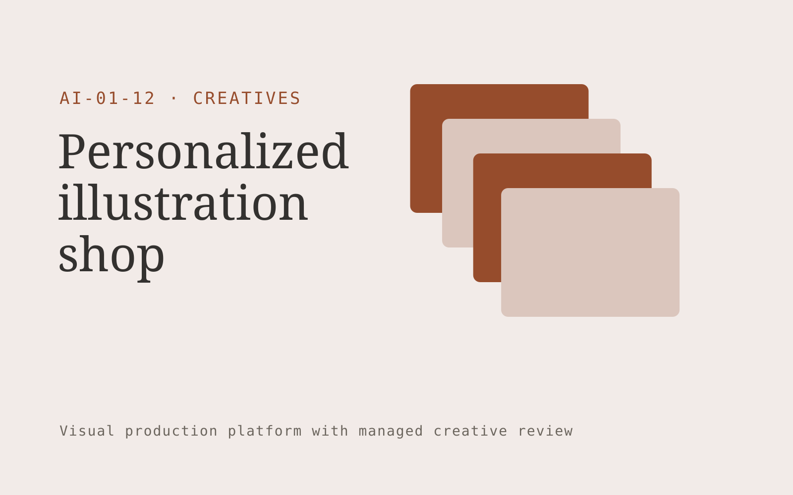

# Personalized illustration shop

**Creatives** · Also fits: Marketing; Sales

> For gift buyers commissioning family portraits and stories, turn consented photographs, family details and chosen art style into high-resolution illustration and optional story pages. Address the recurring problem: mass-produced gifts lack personal detail and consistent artistic quality. The value hypothesis is a more complete, reviewable deliverable with less repeated preparation; the pilot must establish whether that benefit is real.

| | |
|---|---|
| **Buyer** | Gift buyers commissioning family portraits and stories |
| **Problem** | Mass-produced gifts lack personal detail and consistent artistic quality. |
| **Format** | Visual production platform with managed creative review |
| **USP** | Artist-reviewed likeness and a clear revision process for personal gifts. |

## The product
Key screens: Order brief, artwork proof, delivery page. Use a thumbnail gallery for projects, a large central editing canvas, and a right-hand panel for references, constraints and comments. Let users compare versions side by side. Display draft, changes requested and approved states. Provide a client preview link with comments anchored to the relevant asset. In this product, the first view is order brief, followed by artwork proof and delivery page.

## Core functionality
1. Collect personalization choices.
2. Generate composition options.
3. Refine likeness manually.
4. Maintain family character references.
5. Manage proof approvals.
6. Export print-ready files.

## Customer workflow
Create a brief, upload reference material, choose constraints, review a small set of directions, refine the selected direction, request client approval, and export a versioned delivery pack. Start with consented photographs, family details and chosen art style and finish with high-resolution illustration and optional story pages.

## AI and human review
Use language models to interpret briefs and visual models where appropriate to generate or adapt assets. Keep factual attributes in structured fields. Validate dimensions and export formats through deterministic checks. A creative reviewer confirms visual quality and fidelity before delivery.

## Customer inputs
Consented photographs, family details and chosen art style

## Customer deliverables
High-resolution illustration and optional story pages

## Accounts and administration
Project ownership, asset versions, client comments, approval states, usage allowances, revision limits, download history and a rights record for supplied material.

## MVP scope
Begin with gift buyers commissioning family portraits and stories and one recurring use case. Build the first two modules: collect personalization choices; generate composition options. Provide operator assistance for the third module: refine likeness manually. Deliver high-resolution illustration and optional story pages through a manual review queue. Perform other necessary full-scope functions manually during the pilot. Include all applicable access, accuracy and professional-review controls from the start.

## After MVP validation
After paid pilots establish value, automate the remaining modules: maintain family character references; manage proof approvals; export print-ready files. Add one validated source integration, reusable customer configuration and recurring delivery. Expand to additional teams, document formats or languages only after testing the new scope.

## Build dependencies
Asset upload and preview, asynchronous generation jobs, editable version history, reviewer access and tested export formats. High-fidelity production requires specialist creative QA.

## Integrations and data access
Existing artwork, campaign systems and client approval processes. Cloud asset storage, design-file import/export and publishing destinations. Start with file exchange and validate destination specifications before promising direct publishing. These are candidate integration categories, not verified supported connectors.

## Defensibility
A reusable library of approved styles, production constraints and review examples, together with reliable delivery for a narrow creative niche. For this idea, build around artist-reviewed likeness and a clear revision process for personal gifts. This advantage requires execution and accumulated customer trust; the base model alone is not a defensible asset.

## Alternatives and positioning
Freelancers, creative agencies, generic generation tools and existing design applications. Differentiate on this specific proposed advantage: artist-reviewed likeness and a clear revision process for personal gifts. Test it against the buyer's current method on the same task. Competitor coverage and uniqueness have not been established.

## Revenue model and test pricing (USD)
Test USD 49-199 for one digital portrait with a defined number of people and two revision rounds. Offer extra characters, commercial usage or a coordinated story package separately. Physical printing is optional fulfillment, not required for the online model. Prices are unvalidated experiments.

## Main delivery costs
Generation attempts, video or image processing, storage, reviewer hours, client revision rounds and licensed source assets.

## Marketing message to test
> Personalized illustration shop for gift buyers commissioning family portraits and stories. Artist-reviewed likeness and a clear revision process for personal gifts. Demonstrate the claim through a style sampler showing the same portrait in three treatments.

## Acquisition channels
Gift search traffic and partnerships with print shops

## Lead magnet
A style sampler showing the same portrait in three treatments

## First 30 days of marketing
- Week 1: interview five prospective buyers in this segment: gift buyers commissioning family portraits and stories. Ask to see a recent example of the problem and their current process.
- Week 2: prepare this demonstration using authorized or synthetic material: a style sampler showing the same portrait in three treatments.
- Week 3: present it through gift search traffic and partnerships with print shops and seek one narrowly scoped paid pilot.
- Week 4: review proof approval rate, repeat gifting purchases, total delivery effort and a concrete renewal decision before increasing scope.

## Paid pilot and validation
Deliver one real creative brief with a capped asset count and revision allowance. Compare usable deliverables, reviewer time and client acceptance with the existing production method. For this idea, use consented photographs, family details and chosen art style and evaluate high-resolution illustration and optional story pages. Agree success thresholds with the buyer before starting; collect a baseline for proof approval rate, repeat gifting purchases. A positive signal is payment and repeat use with acceptable quality and delivery cost, not a favorable demo reaction alone.

## Success metrics
Proof approval rate, repeat gifting purchases

## Retention and expansion
Offer anniversary portraits, new family milestones and coordinated gift sets with explicit customer permission to retain reference photos.

## Operating controls and limitations
Protect supplied asset rights, client approvals and product fidelity. Do not reuse private client assets across accounts. Validate source access and reviewer availability during the pilot. Maintain customer-level access, data deletion controls and a record of final approvals.

## Brand style (concept)

- Colors: `#913527` primary · `#54b8c9` accent · `#f1e6e4` surface · `#22201e` ink
- Type: Manrope for headings, Manrope for text
- Voice: Confident, visual, craft-proud
- Demo site: [https://nexibeo.com/ideas/personalized-illustration-shop/demo/](https://nexibeo.com/ideas/personalized-illustration-shop/demo/)

## Investment indication

Indicative build budget, from MVP to full product. This is a planning range, not a quote; it excludes running costs such as model usage, hosting and reviewer hours.

| Phase | Scope | Timeline | Indicative budget |
|---|---|---|---|
| MVP | One buyer segment, one recurring use case; first modules: collect personalization choices; generate composition options. Manual review in the loop. | 6 weeks | $12,000 |
| Paid pilot | Accounts, roles, review states, audit trail and the first integration, hardened for two to three paying pilot customers. | 8 weeks | $15,500 |
| Full product | Remaining modules: maintain family character references; manage proof approvals; export print-ready files. Self-serve onboarding, billing, monitoring and the wider integration set. | 14 weeks | $21,500 |
| **Total** | | 28 weeks | **$49,000** |

**Co-create this project with us:** [contact Nexibeo](https://nexibeo.com/ideas/personalized-illustration-shop/#apply) and we build it with you.

## Research status
Concept proposal expanded from the 315-idea conversation. Demand, pricing, differentiation, build scope and integration feasibility are hypotheses, not verified market findings. Category link is inspiration rather than evidence of business viability.

## Credits and next steps

- **Estimation and building this idea:** see the full idea page on [nexibeo.com](https://nexibeo.com/ideas/personalized-illustration-shop/) for more detail on estimation, and to co-create and build this idea with Nexibeo.
- **Become an AI-optimized specialist for Creatives:** [Complete AI Training](https://completeaitraining.com/certification/12b-ai-certification-for-creatives/).
- Field news: [AI news for Creatives](https://completeaitraining.com/all-ai-news-for-creatives/).
