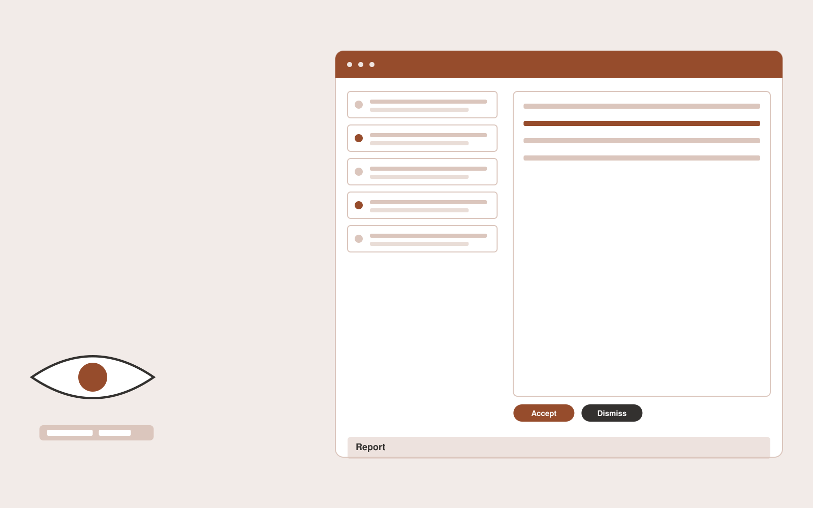

# Accessibility adaptation studio

**Creatives** · Also fits: Marketing; Sales; Operations

> For digital publishers maintaining multimedia libraries, turn videos, images, documents and accessibility requirements into reviewed captions, descriptions and remediation report. Address the recurring problem: content is published without reliable accessible alternatives. The value hypothesis is a more complete, reviewable deliverable with less repeated preparation; the pilot must establish whether that benefit is real.

| | |
|---|---|
| **Buyer** | Digital publishers maintaining multimedia libraries |
| **Problem** | Content is published without reliable accessible alternatives. |
| **Format** | Evidence review and quality assurance workspace |
| **USP** | Human review of meaning and context alongside automated issue detection. |

## The product
Key screens: Content inventory, issue queue, alternative editor. Open on a review queue ordered by reviewer-selected priorities. Show each finding beside the original evidence and applicable rule. Provide accept, dismiss and needs-information controls with reasons. A separate report view summarizes confirmed findings and unresolved items, not raw AI flags. In this product, the first view is content inventory, followed by issue queue and alternative editor.

## Core functionality
1. Draft image descriptions.
2. Generate caption candidates.
3. Check reading order.
4. Review transcript accuracy.
5. Assign specialist corrections.
6. Export accessible alternatives.

## Customer workflow
Agree review criteria, ingest a sample, generate candidate findings, inspect supporting evidence, let reviewers confirm or dismiss each item, assign corrections, and recheck the affected material. Start with videos, images, documents and accessibility requirements and finish with reviewed captions, descriptions and remediation report.

## AI and human review
Propose possible inconsistencies, omissions and rubric matches. Combine extraction with deterministic checks where rules are explicit. Reviewers make the final judgment. Keep false positives and missed cases visible during evaluation.

## Customer inputs
Videos, images, documents and accessibility requirements

## Customer deliverables
Reviewed captions, descriptions and remediation report

## Accounts and administration
Versioned review criteria, evidence links, reviewer decisions, disagreement handling, correction assignments, recheck status and exportable review history.

## MVP scope
Begin with digital publishers maintaining multimedia libraries and one recurring use case. Build the first two modules: draft image descriptions; generate caption candidates. Provide operator assistance for the third module: check reading order. Deliver reviewed captions, descriptions and remediation report through a manual review queue. Perform other necessary full-scope functions manually during the pilot. Include all applicable access, accuracy and professional-review controls from the start.

## After MVP validation
After paid pilots establish value, automate the remaining modules: review transcript accuracy; assign specialist corrections; export accessible alternatives. Add one validated source integration, reusable customer configuration and recurring delivery. Expand to additional teams, document formats or languages only after testing the new scope.

## Build dependencies
Evidence coordinates, versioned rules, reviewer decisions and a representative reference set. Measure misses as well as confirmed findings before scaling.

## Integrations and data access
Existing artwork, campaign systems and client approval processes. Source repositories, task trackers and report exports. Keep findings as review proposals until authorized owners accept the resulting actions. These are candidate integration categories, not verified supported connectors.

## Defensibility
A domain-specific review rubric and rights-cleared examples of confirmed defects, false alarms and reviewer reasoning. For this idea, build around human review of meaning and context alongside automated issue detection. This advantage requires execution and accumulated customer trust; the base model alone is not a defensible asset.

## Alternatives and positioning
Manual reviewers, checklists, generic scanning tools and specialist audit services. Differentiate on this specific proposed advantage: human review of meaning and context alongside automated issue detection. Test it against the buyer's current method on the same task. Competitor coverage and uniqueness have not been established.

## Revenue model and test pricing (USD)
Test USD 500-2,000 for a defined audit sample and report. Offer recurring review priced by reviewed items and specialist hours. Software-only access can follow a reliable reviewed service. All prices require validation.

## Main delivery costs
Document or media processing, model evaluation, expert review, false-positive handling, rechecks and customer-specific rubric calibration.

## Marketing message to test
> Accessibility adaptation studio for digital publishers maintaining multimedia libraries. Human review of meaning and context alongside automated issue detection. Demonstrate the claim through an annotated accessibility review of one content collection.

## Acquisition channels
Accessibility consultants and digital publishing associations

## Lead magnet
An annotated accessibility review of one content collection

## First 30 days of marketing
- Week 1: interview five prospective buyers in this segment: digital publishers maintaining multimedia libraries. Ask to see a recent example of the problem and their current process.
- Week 2: prepare this demonstration using authorized or synthetic material: an annotated accessibility review of one content collection.
- Week 3: present it through accessibility consultants and digital publishing associations and seek one narrowly scoped paid pilot.
- Week 4: review verified issues resolved, reviewer correction rate, total delivery effort and a concrete renewal decision before increasing scope.

## Paid pilot and validation
Have a qualified reviewer independently assess the same sample. Compare confirmed findings, false alarms and omissions. Repeat on unseen material before agreeing recurring volume. For this idea, use videos, images, documents and accessibility requirements and evaluate reviewed captions, descriptions and remediation report. Agree success thresholds with the buyer before starting; collect a baseline for verified issues resolved, reviewer correction rate. A positive signal is payment and repeat use with acceptable quality and delivery cost, not a favorable demo reaction alone.

## Success metrics
Verified issues resolved, reviewer correction rate

## Retention and expansion
Offer recurring reviews and rechecks of previously confirmed issues. Expand document or case types after validating the new rubric with qualified reviewers.

## Operating controls and limitations
Protect supplied asset rights, client approvals and product fidelity. Do not reuse private client assets across accounts. Validate source access and reviewer availability during the pilot. Maintain customer-level access, data deletion controls and a record of final approvals.

## Brand style (concept)

- Colors: `#915527` primary · `#547bc9` accent · `#f1eae4` surface · `#22201e` ink
- Type: Archivo for headings, Lora for text
- Voice: Confident, visual, craft-proud
- Demo site: [https://nexibeo.com/ideas/accessibility-adaptation-studio/demo/](https://nexibeo.com/ideas/accessibility-adaptation-studio/demo/)

## Investment indication

Indicative build budget, from MVP to full product. This is a planning range, not a quote; it excludes running costs such as model usage, hosting and reviewer hours.

| Phase | Scope | Timeline | Indicative budget |
|---|---|---|---|
| MVP | One buyer segment, one recurring use case; first modules: draft image descriptions; generate caption candidates. Manual review in the loop. | 4 weeks | $8,000 |
| Paid pilot | Accounts, roles, review states, audit trail and the first integration, hardened for two to three paying pilot customers. | 6 weeks | $9,500 |
| Full product | Remaining modules: review transcript accuracy; assign specialist corrections; export accessible alternatives. Self-serve onboarding, billing, monitoring and the wider integration set. | 9 weeks | $13,000 |
| **Total** | | 19 weeks | **$30,500** |

**Co-create this project with us:** [contact Nexibeo](https://nexibeo.com/ideas/accessibility-adaptation-studio/#apply) and we build it with you.

## Research status
Concept proposal expanded from the 315-idea conversation. Demand, pricing, differentiation, build scope and integration feasibility are hypotheses, not verified market findings. Category link is inspiration rather than evidence of business viability.

## Credits and next steps

- **Estimation and building this idea:** see the full idea page on [nexibeo.com](https://nexibeo.com/ideas/accessibility-adaptation-studio/) for more detail on estimation, and to co-create and build this idea with Nexibeo.
- **Become an AI-optimized specialist for Creatives:** [Complete AI Training](https://completeaitraining.com/certification/12b-ai-certification-for-creatives/).
- Field news: [AI news for Creatives](https://completeaitraining.com/all-ai-news-for-creatives/).
