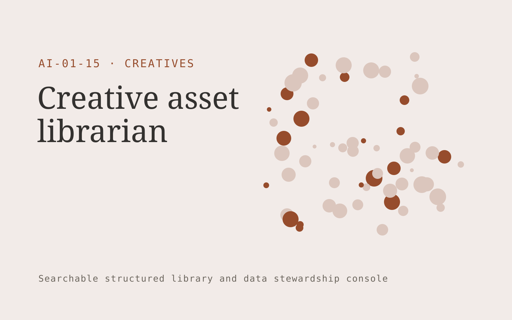

# Creative asset librarian

**Creatives** · Also fits: Marketing; Sales; IT and Development

> For creative operations managers at growing agencies, turn authorized image libraries, usage licenses and project metadata into searchable asset collection and rights exception list. Address the recurring problem: teams recreate assets because approved work is hard to find. The value hypothesis is a more complete, reviewable deliverable with less repeated preparation; the pilot must establish whether that benefit is real.

| | |
|---|---|
| **Buyer** | Creative operations managers at growing agencies |
| **Problem** | Teams recreate assets because approved work is hard to find. |
| **Format** | Searchable structured library and data stewardship console |
| **USP** | Search combines visual relevance with approval and usage rights. |

## The product
Key screens: Visual search, asset detail, rights dashboard. Use a searchable table or visual gallery with filters for the domain’s important attributes. Open each item into a detail drawer containing source records, ownership and history. Put proposed merges and field changes in a separate review queue. Provide a preview before any bulk export. In this product, the first view is visual search, followed by asset detail and rights dashboard.

## Core functionality
1. Generate descriptive tags.
2. Identify near-duplicates.
3. Track usage permissions.
4. Link assets to campaigns.
5. Search by visual similarity.
6. Flag expired licenses.

## Customer workflow
Import a limited collection, define canonical fields, suggest tags or mappings, review uncertain records, publish approved items, search and reuse them, and request periodic owner updates. Start with authorized image libraries, usage licenses and project metadata and finish with searchable asset collection and rights exception list.

## AI and human review
Suggest classifications, semantic tags, duplicate candidates and field mappings. Preserve original values. Use explicit validation for identifiers and units. Human stewards approve ambiguous merges and factual changes.

## Customer inputs
Authorized image libraries, usage licenses and project metadata

## Customer deliverables
Searchable asset collection and rights exception list

## Accounts and administration
Record ownership, access permissions, change proposals, original-value retention, version history, review dates, bulk import/export and duplicate resolution.

## MVP scope
Begin with creative operations managers at growing agencies and one recurring use case. Build the first two modules: generate descriptive tags; identify near-duplicates. Provide operator assistance for the third module: track usage permissions. Deliver searchable asset collection and rights exception list through a manual review queue. Perform other necessary full-scope functions manually during the pilot. Include all applicable access, accuracy and professional-review controls from the start.

## After MVP validation
After paid pilots establish value, automate the remaining modules: link assets to campaigns; search by visual similarity; flag expired licenses. Add one validated source integration, reusable customer configuration and recurring delivery. Expand to additional teams, document formats or languages only after testing the new scope.

## Build dependencies
Stable identifiers, an agreed data schema, reversible imports, mapping review and source ownership. Data quality work can exceed model development effort.

## Integrations and data access
Existing artwork, campaign systems and client approval processes. Source systems, catalog exports and cloud file storage. Start with reversible CSV or file imports and validate identifiers before any direct writes. These are candidate integration categories, not verified supported connectors.

## Defensibility
A useful niche taxonomy, customer-approved mappings and accumulated correction history that improve retrieval and reduce repeated cleanup. For this idea, build around search combines visual relevance with approval and usage rights. This advantage requires execution and accumulated customer trust; the base model alone is not a defensible asset.

## Alternatives and positioning
Spreadsheets, shared folders, existing asset or information management systems and manual data cleanup. Differentiate on this specific proposed advantage: search combines visual relevance with approval and usage rights. Test it against the buyer's current method on the same task. Competitor coverage and uniqueness have not been established.

## Revenue model and test pricing (USD)
Test USD 500-2,500 for one collection cleanup and launch, followed by USD 100-500 monthly for maintenance within agreed record limits. Larger migrations and complex rights management are separately scoped. Prices are hypotheses.

## Main delivery costs
Import cleanup, extraction, storage, indexing, steward review, duplicate investigation and recurring source updates.

## Marketing message to test
> Creative asset librarian for creative operations managers at growing agencies. Search combines visual relevance with approval and usage rights. Demonstrate the claim through a searchable demonstration using fifty approved assets.

## Acquisition channels
Agency operations communities and digital asset consultants

## Lead magnet
A searchable demonstration using fifty approved assets

## First 30 days of marketing
- Week 1: interview five prospective buyers in this segment: creative operations managers at growing agencies. Ask to see a recent example of the problem and their current process.
- Week 2: prepare this demonstration using authorized or synthetic material: a searchable demonstration using fifty approved assets.
- Week 3: present it through agency operations communities and digital asset consultants and seek one narrowly scoped paid pilot.
- Week 4: review search success, duplicate production avoided, total delivery effort and a concrete renewal decision before increasing scope.

## Paid pilot and validation
Clean and organize one representative collection. Have users perform real search or mapping tasks. Check every proposed merge in the sample and compare search success with the existing system. For this idea, use authorized image libraries, usage licenses and project metadata and evaluate searchable asset collection and rights exception list. Agree success thresholds with the buyer before starting; collect a baseline for search success, duplicate production avoided. A positive signal is payment and repeat use with acceptable quality and delivery cost, not a favorable demo reaction alone.

## Success metrics
Search success, duplicate production avoided

## Retention and expansion
Provide owner reminders and periodic cleanup. Add another collection only after record quality and retrieval are stable in the initial one.

## Operating controls and limitations
Protect supplied asset rights, client approvals and product fidelity. Do not reuse private client assets across accounts. Validate source access and reviewer availability during the pilot. Maintain customer-level access, data deletion controls and a record of final approvals.

## Brand style (concept)

- Colors: `#913a27` primary · `#54c9ba` accent · `#f1e7e4` surface · `#22201e` ink
- Type: Archivo for headings, Lora for text
- Voice: Confident, visual, craft-proud
- Demo site: [https://nexibeo.com/ideas/creative-asset-librarian/demo/](https://nexibeo.com/ideas/creative-asset-librarian/demo/)

## Investment indication

Indicative build budget, from MVP to full product. This is a planning range, not a quote; it excludes running costs such as model usage, hosting and reviewer hours.

| Phase | Scope | Timeline | Indicative budget |
|---|---|---|---|
| MVP | One buyer segment, one recurring use case; first modules: generate descriptive tags; identify near-duplicates. Manual review in the loop. | 4 weeks | $8,000 |
| Paid pilot | Accounts, roles, review states, audit trail and the first integration, hardened for two to three paying pilot customers. | 6 weeks | $9,500 |
| Full product | Remaining modules: link assets to campaigns; search by visual similarity; flag expired licenses. Self-serve onboarding, billing, monitoring and the wider integration set. | 10 weeks | $13,000 |
| **Total** | | 20 weeks | **$30,500** |

**Co-create this project with us:** [contact Nexibeo](https://nexibeo.com/ideas/creative-asset-librarian/#apply) and we build it with you.

## Research status
Concept proposal expanded from the 315-idea conversation. Demand, pricing, differentiation, build scope and integration feasibility are hypotheses, not verified market findings. Category link is inspiration rather than evidence of business viability.

## Credits and next steps

- **Estimation and building this idea:** see the full idea page on [nexibeo.com](https://nexibeo.com/ideas/creative-asset-librarian/) for more detail on estimation, and to co-create and build this idea with Nexibeo.
- **Become an AI-optimized specialist for Creatives:** [Complete AI Training](https://completeaitraining.com/certification/12b-ai-certification-for-creatives/).
- Field news: [AI news for Creatives](https://completeaitraining.com/all-ai-news-for-creatives/).
