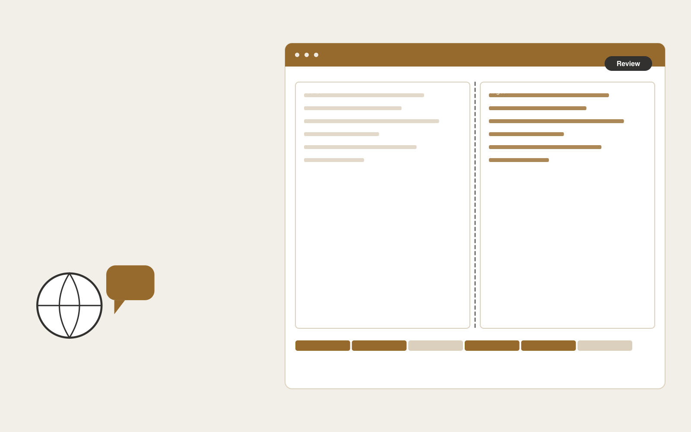

# Multilingual help desk service

**Customer Support** · Also fits: Operations; Product Development; PR and Communications

> For support leads at cross-border online retailers, turn ticket history, terminology and approved response examples into reviewed bilingual customer responses. Address the recurring problem: agents cannot reliably handle unfamiliar customer languages. The value hypothesis is a more complete, reviewable deliverable with less repeated preparation; the pilot must establish whether that benefit is real.

| | |
|---|---|
| **Buyer** | Support leads at cross-border online retailers |
| **Problem** | Agents cannot reliably handle unfamiliar customer languages. |
| **Format** | Multilingual production and review portal |
| **USP** | Order identifiers and product terms remain consistent through every translation. |

## The product
Key screens: Bilingual inbox, glossary, quality queue. Use aligned source and target language panes with shared terminology highlights. Include a language status grid, reviewer assignment queue, and layout or timeline preview. Show unresolved ambiguities next to the affected passage. Keep approvals separate for each language and version. In this product, the first view is bilingual inbox, followed by glossary and quality queue.

## Core functionality
1. Detect conversation language.
2. Translate messages.
3. Preserve order details.
4. Adapt tone.
5. Review sensitive wording.
6. Maintain language glossaries.

## Customer workflow
Upload authorized source content, confirm target languages and terminology, create translation drafts, assign qualified reviewers, reconcile source changes, check layout or timing, and deliver approved language versions. Start with ticket history, terminology and approved response examples and finish with reviewed bilingual customer responses.

## AI and human review
Draft translations, transcribe media when applicable, suggest terminology and detect inconsistencies. Deterministic checks compare dates, numbers and identifiers. Qualified language reviewers decide idiomatic phrasing and specialist meaning. Voice work requires explicit permissions for the intended use.

## Customer inputs
Ticket history, terminology and approved response examples

## Customer deliverables
Reviewed bilingual customer responses

## Accounts and administration
Language permissions, glossary versions, reviewer assignments, segment comments, source-change alerts, per-language approvals and delivery history.

## MVP scope
Begin with support leads at cross-border online retailers and one recurring use case. Build the first two modules: detect conversation language; translate messages. Provide operator assistance for the third module: preserve order details. Deliver reviewed bilingual customer responses through a manual review queue. Perform other necessary full-scope functions manually during the pilot. Include all applicable access, accuracy and professional-review controls from the start.

## After MVP validation
After paid pilots establish value, automate the remaining modules: adapt tone; review sensitive wording; maintain language glossaries. Add one validated source integration, reusable customer configuration and recurring delivery. Expand to additional teams, document formats or languages only after testing the new scope.

## Build dependencies
Segment alignment, glossary enforcement, multilingual text handling, comparison views and qualified reviewers. Media projects also need timing and audio/video QA.

## Integrations and data access
Support inboxes, help centers, order records and customer feedback systems. Document formats, subtitle formats, media storage and publishing systems. Confirm language, font and layout support for each requested output. These are candidate integration categories, not verified supported connectors.

## Defensibility
Customer-controlled approved terminology, reviewed translation examples and dependable specialist reviewer relationships. For this idea, build around order identifiers and product terms remain consistent through every translation. This advantage requires execution and accumulated customer trust; the base model alone is not a defensible asset.

## Alternatives and positioning
Translation agencies, freelance linguists, generic machine translation and internal bilingual staff. Differentiate on this specific proposed advantage: order identifiers and product terms remain consistent through every translation. Test it against the buyer's current method on the same task. Competitor coverage and uniqueness have not been established.

## Revenue model and test pricing (USD)
Quote an initial USD 300-1,200 batch for a defined word count or media duration and one target language. Charge separately for extra languages, specialist review and dubbing. Test recurring volume agreements after the pilot; prices are hypotheses.

## Main delivery costs
Source preparation, translation volume, transcription or dubbing, qualified reviewers, glossary maintenance and changed-source rework.

## Marketing message to test
> Multilingual help desk service for support leads at cross-border online retailers. Order identifiers and product terms remain consistent through every translation. Demonstrate the claim through a bilingual review of anonymized tickets.

## Acquisition channels
Cross-border commerce consultants

## Lead magnet
A bilingual review of anonymized tickets

## First 30 days of marketing
- Week 1: interview five prospective buyers in this segment: support leads at cross-border online retailers. Ask to see a recent example of the problem and their current process.
- Week 2: prepare this demonstration using authorized or synthetic material: a bilingual review of anonymized tickets.
- Week 3: present it through cross-border commerce consultants and seek one narrowly scoped paid pilot.
- Week 4: review translation correction rate, handling time, total delivery effort and a concrete renewal decision before increasing scope.

## Paid pilot and validation
Translate a representative sample and have an independent qualified reviewer assess it. Include a source revision to measure update handling. Track corrections, meaning preservation and total delivery effort. For this idea, use ticket history, terminology and approved response examples and evaluate reviewed bilingual customer responses. Agree success thresholds with the buyer before starting; collect a baseline for translation correction rate, handling time. A positive signal is payment and repeat use with acceptable quality and delivery cost, not a favorable demo reaction alone.

## Success metrics
Translation correction rate, handling time

## Retention and expansion
Maintain approved terminology and reviewer continuity. Charge for ongoing source updates and add languages only when the buyer has a real publishing need.

## Operating controls and limitations
Keep customer account access scoped. Escalate missing evidence and consequential exceptions to staff. Review quality alongside any speed measure. Validate source access and reviewer availability during the pilot. Maintain customer-level access, data deletion controls and a record of final approvals.

## Brand style (concept)

- Colors: `#917327` primary · `#5491c9` accent · `#f1ede4` surface · `#22201e` ink
- Type: DM Serif Display for headings, DM Sans for text
- Voice: Warm, clear, calm under pressure
- Demo site: [https://nexibeo.com/ideas/multilingual-help-desk-service/demo/](https://nexibeo.com/ideas/multilingual-help-desk-service/demo/)

## Investment indication

Indicative build budget, from MVP to full product. This is a planning range, not a quote; it excludes running costs such as model usage, hosting and reviewer hours.

| Phase | Scope | Timeline | Indicative budget |
|---|---|---|---|
| MVP | One buyer segment, one recurring use case; first modules: detect conversation language; translate messages. Manual review in the loop. | 5 weeks | $10,500 |
| Paid pilot | Accounts, roles, review states, audit trail and the first integration, hardened for two to three paying pilot customers. | 7 weeks | $13,500 |
| Full product | Remaining modules: adapt tone; review sensitive wording; maintain language glossaries. Self-serve onboarding, billing, monitoring and the wider integration set. | 12 weeks | $19,000 |
| **Total** | | 24 weeks | **$43,000** |

**Co-create this project with us:** [contact Nexibeo](https://nexibeo.com/ideas/multilingual-help-desk-service/#apply) and we build it with you.

## Research status
Concept proposal expanded from the 315-idea conversation. Demand, pricing, differentiation, build scope and integration feasibility are hypotheses, not verified market findings. Category link is inspiration rather than evidence of business viability.

## Credits and next steps

- **Estimation and building this idea:** see the full idea page on [nexibeo.com](https://nexibeo.com/ideas/multilingual-help-desk-service/) for more detail on estimation, and to co-create and build this idea with Nexibeo.
- **Become an AI-optimized specialist for Customer Support:** [Complete AI Training](https://completeaitraining.com/certification/12b-ai-certification-for-customer-support-specialists/).
- Field news: [AI news for Customer Support](https://completeaitraining.com/all-ai-news-for-customer-support/).
