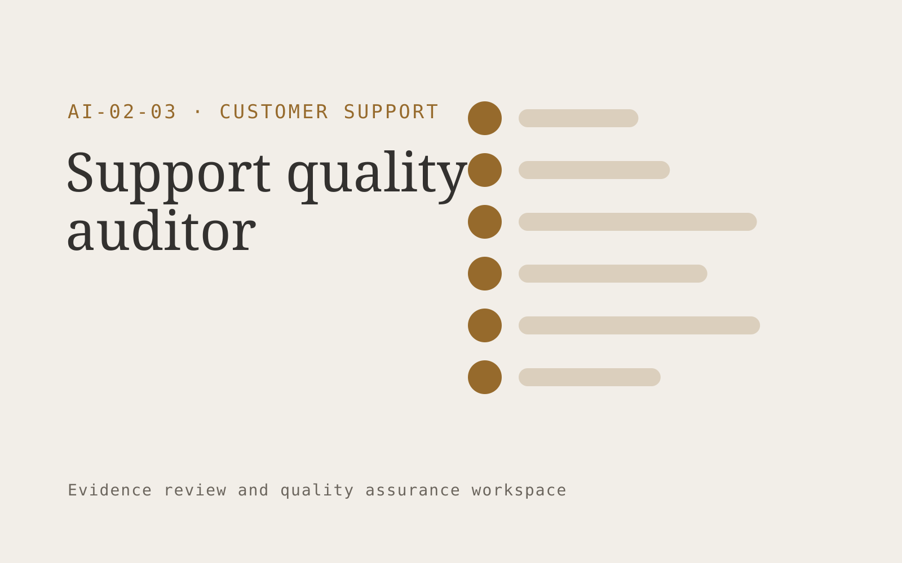

# Support quality auditor

**Customer Support** · Also fits: Operations; Product Development

> For quality leads at outsourced contact centers, turn authorized conversations and evaluation rubrics into evidence-linked quality reports. Address the recurring problem: small manual samples miss recurring service failures. The value hypothesis is a more complete, reviewable deliverable with less repeated preparation; the pilot must establish whether that benefit is real.

| | |
|---|---|
| **Buyer** | Quality leads at outsourced contact centers |
| **Problem** | Small manual samples miss recurring service failures. |
| **Format** | Evidence review and quality assurance workspace |
| **USP** | Every finding includes evidence and a reviewer challenge path. |

## The product
Key screens: Quality dashboard, conversation evidence, coaching queue. Open on a review queue ordered by reviewer-selected priorities. Show each finding beside the original evidence and applicable rule. Provide accept, dismiss and needs-information controls with reasons. A separate report view summarizes confirmed findings and unresolved items, not raw AI flags. In this product, the first view is quality dashboard, followed by conversation evidence and coaching queue.

## Core functionality
1. Apply agreed rubrics.
2. Highlight supporting excerpts.
3. Calibrate reviewer scores.
4. Sample edge cases.
5. Route disputed findings.
6. Track coaching actions.

## Customer workflow
Agree review criteria, ingest a sample, generate candidate findings, inspect supporting evidence, let reviewers confirm or dismiss each item, assign corrections, and recheck the affected material. Start with authorized conversations and evaluation rubrics and finish with evidence-linked quality reports.

## AI and human review
Propose possible inconsistencies, omissions and rubric matches. Combine extraction with deterministic checks where rules are explicit. Reviewers make the final judgment. Keep false positives and missed cases visible during evaluation.

## Customer inputs
Authorized conversations and evaluation rubrics

## Customer deliverables
Evidence-linked quality reports

## Accounts and administration
Versioned review criteria, evidence links, reviewer decisions, disagreement handling, correction assignments, recheck status and exportable review history.

## MVP scope
Begin with quality leads at outsourced contact centers and one recurring use case. Build the first two modules: apply agreed rubrics; highlight supporting excerpts. Provide operator assistance for the third module: calibrate reviewer scores. Deliver evidence-linked quality reports through a manual review queue. Perform other necessary full-scope functions manually during the pilot. Include all applicable access, accuracy and professional-review controls from the start.

## After MVP validation
After paid pilots establish value, automate the remaining modules: sample edge cases; route disputed findings; track coaching actions. Add one validated source integration, reusable customer configuration and recurring delivery. Expand to additional teams, document formats or languages only after testing the new scope.

## Build dependencies
Evidence coordinates, versioned rules, reviewer decisions and a representative reference set. Measure misses as well as confirmed findings before scaling.

## Integrations and data access
Support inboxes, help centers, order records and customer feedback systems. Source repositories, task trackers and report exports. Keep findings as review proposals until authorized owners accept the resulting actions. These are candidate integration categories, not verified supported connectors.

## Defensibility
A domain-specific review rubric and rights-cleared examples of confirmed defects, false alarms and reviewer reasoning. For this idea, build around every finding includes evidence and a reviewer challenge path. This advantage requires execution and accumulated customer trust; the base model alone is not a defensible asset.

## Alternatives and positioning
Manual reviewers, checklists, generic scanning tools and specialist audit services. Differentiate on this specific proposed advantage: every finding includes evidence and a reviewer challenge path. Test it against the buyer's current method on the same task. Competitor coverage and uniqueness have not been established.

## Revenue model and test pricing (USD)
Test USD 500-2,000 for a defined audit sample and report. Offer recurring review priced by reviewed items and specialist hours. Software-only access can follow a reliable reviewed service. All prices require validation.

## Main delivery costs
Document or media processing, model evaluation, expert review, false-positive handling, rechecks and customer-specific rubric calibration.

## Marketing message to test
> Support quality auditor for quality leads at outsourced contact centers. Every finding includes evidence and a reviewer challenge path. Demonstrate the claim through a rubric-calibrated review of twenty conversations.

## Acquisition channels
Contact center operations communities

## Lead magnet
A rubric-calibrated review of twenty conversations

## First 30 days of marketing
- Week 1: interview five prospective buyers in this segment: quality leads at outsourced contact centers. Ask to see a recent example of the problem and their current process.
- Week 2: prepare this demonstration using authorized or synthetic material: a rubric-calibrated review of twenty conversations.
- Week 3: present it through contact center operations communities and seek one narrowly scoped paid pilot.
- Week 4: review reviewer agreement, coaching follow-through, total delivery effort and a concrete renewal decision before increasing scope.

## Paid pilot and validation
Have a qualified reviewer independently assess the same sample. Compare confirmed findings, false alarms and omissions. Repeat on unseen material before agreeing recurring volume. For this idea, use authorized conversations and evaluation rubrics and evaluate evidence-linked quality reports. Agree success thresholds with the buyer before starting; collect a baseline for reviewer agreement, coaching follow-through. A positive signal is payment and repeat use with acceptable quality and delivery cost, not a favorable demo reaction alone.

## Success metrics
Reviewer agreement, coaching follow-through

## Retention and expansion
Offer recurring reviews and rechecks of previously confirmed issues. Expand document or case types after validating the new rubric with qualified reviewers.

## Operating controls and limitations
Keep customer account access scoped. Escalate missing evidence and consequential exceptions to staff. Review quality alongside any speed measure. Validate source access and reviewer availability during the pilot. Maintain customer-level access, data deletion controls and a record of final approvals.

## Brand style (concept)

- Colors: `#915827` primary · `#54a0c9` accent · `#f1eae4` surface · `#22201e` ink
- Type: Space Grotesk for headings, Inter for text
- Voice: Warm, clear, calm under pressure
- Demo site: [https://nexibeo.com/ideas/support-quality-auditor/demo/](https://nexibeo.com/ideas/support-quality-auditor/demo/)

## Investment indication

Indicative build budget, from MVP to full product. This is a planning range, not a quote; it excludes running costs such as model usage, hosting and reviewer hours.

| Phase | Scope | Timeline | Indicative budget |
|---|---|---|---|
| MVP | One buyer segment, one recurring use case; first modules: apply agreed rubrics; highlight supporting excerpts. Manual review in the loop. | 4 weeks | $7,000 |
| Paid pilot | Accounts, roles, review states, audit trail and the first integration, hardened for two to three paying pilot customers. | 5 weeks | $7,500 |
| Full product | Remaining modules: sample edge cases; route disputed findings; track coaching actions. Self-serve onboarding, billing, monitoring and the wider integration set. | 8 weeks | $10,500 |
| **Total** | | 17 weeks | **$25,000** |

**Co-create this project with us:** [contact Nexibeo](https://nexibeo.com/ideas/support-quality-auditor/#apply) and we build it with you.

## Research status
Concept proposal expanded from the 315-idea conversation. Demand, pricing, differentiation, build scope and integration feasibility are hypotheses, not verified market findings. Category link is inspiration rather than evidence of business viability.

## Credits and next steps

- **Estimation and building this idea:** see the full idea page on [nexibeo.com](https://nexibeo.com/ideas/support-quality-auditor/) for more detail on estimation, and to co-create and build this idea with Nexibeo.
- **Become an AI-optimized specialist for Customer Support:** [Complete AI Training](https://completeaitraining.com/certification/12b-ai-certification-for-customer-support-specialists/).
- Field news: [AI news for Customer Support](https://completeaitraining.com/all-ai-news-for-customer-support/).
