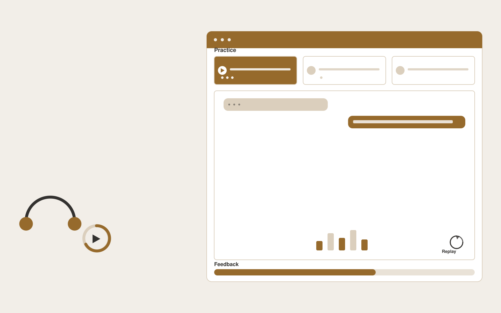

# Support onboarding simulator

**Customer Support** · Also fits: Operations; Product Development; Education

> For training managers at subscription service contact centers, turn approved scripts, ticket examples and service policies into practice transcripts and coaching plans. Address the recurring problem: new agents practice on live customers too early. The value hypothesis is a more complete, reviewable deliverable with less repeated preparation; the pilot must establish whether that benefit is real.

| | |
|---|---|
| **Buyer** | Training managers at subscription service contact centers |
| **Problem** | New agents practice on live customers too early. |
| **Format** | Interactive practice or facilitated workshop platform |
| **USP** | Practice scenarios generated from the team's actual support situations. |

## The product
Key screens: Scenario library, conversation simulator, feedback report. Use a scenario catalog with clear goals and difficulty settings. The main session area supports text, optional voice and visible context. Follow it with a replay or decision map, annotated feedback and a next-practice plan. Facilitators can author scenarios and review participant-selected sessions. In this product, the first view is scenario library, followed by conversation simulator and feedback report.

## Core functionality
1. Simulate customer personalities.
2. Introduce policy exceptions.
3. Score observable actions.
4. Show missed steps.
5. Replay difficult turns.
6. Track skill development.

## Customer workflow
Set the participant’s goal, choose or customize a scenario, conduct an interactive session, record choices or dialogue, review evidence-based feedback with a facilitator when needed, and repeat selected parts with changed constraints. Start with approved scripts, ticket examples and service policies and finish with practice transcripts and coaching plans.

## AI and human review
Generate responsive dialogue, alternative situations and structured reflection prompts. Ground feedback in agreed goals or rubrics. Treat creative choices and facilitator judgment as authoritative. Evaluate specific actions rather than infer personality or hidden traits.

## Customer inputs
Approved scripts, ticket examples and service policies

## Customer deliverables
Practice transcripts and coaching plans

## Accounts and administration
Participant-controlled session sharing, scenario versions, facilitator tools, replay history, rubric calibration, practice goals and exportable feedback.

## MVP scope
Begin with training managers at subscription service contact centers and one recurring use case. Build the first two modules: simulate customer personalities; introduce policy exceptions. Provide operator assistance for the third module: score observable actions. Deliver practice transcripts and coaching plans through a manual review queue. Perform other necessary full-scope functions manually during the pilot. Include all applicable access, accuracy and professional-review controls from the start.

## After MVP validation
After paid pilots establish value, automate the remaining modules: show missed steps; replay difficult turns; track skill development. Add one validated source integration, reusable customer configuration and recurring delivery. Expand to additional teams, document formats or languages only after testing the new scope.

## Build dependencies
Scenario state management, coherent dialogue, explicit rubrics, session replay and reviewer feedback. Voice interaction adds latency and audio QA requirements.

## Integrations and data access
Support inboxes, help centers, order records and customer feedback systems. Learning portals, calendar scheduling and authorized session exports. Make recording, sharing and retention controls explicit in the product. These are candidate integration categories, not verified supported connectors.

## Defensibility
Realistic domain scenarios, qualified facilitator relationships and reviewed examples of useful feedback and successful practice. For this idea, build around practice scenarios generated from the team's actual support situations. This advantage requires execution and accumulated customer trust; the base model alone is not a defensible asset.

## Alternatives and positioning
Human coaching, workshops, static courses, roleplay with colleagues and general chat tools. Differentiate on this specific proposed advantage: practice scenarios generated from the team's actual support situations. Test it against the buyer's current method on the same task. Competitor coverage and uniqueness have not been established.

## Revenue model and test pricing (USD)
Test USD 300-1,500 for a facilitated team pilot, or USD 20-80 per participant monthly for self-serve practice with limited usage. Bespoke workshops and expert coaching are separately scoped. Pricing is hypothetical.

## Main delivery costs
Scenario design, voice processing if used, model interaction length, facilitator review, rubric calibration and learner support.

## Marketing message to test
> Support onboarding simulator for training managers at subscription service contact centers. Practice scenarios generated from the team's actual support situations. Demonstrate the claim through a realistic first-week agent practice session.

## Acquisition channels
Customer service training providers

## Lead magnet
A realistic first-week agent practice session

## First 30 days of marketing
- Week 1: interview five prospective buyers in this segment: training managers at subscription service contact centers. Ask to see a recent example of the problem and their current process.
- Week 2: prepare this demonstration using authorized or synthetic material: a realistic first-week agent practice session.
- Week 3: present it through customer service training providers and seek one narrowly scoped paid pilot.
- Week 4: review rubric improvement, trainer correction rate, total delivery effort and a concrete renewal decision before increasing scope.

## Paid pilot and validation
Run a short scenario with representative participants, then repeat with a different case. Ask a qualified coach or facilitator to assess usefulness and observable improvement independently of the AI feedback. For this idea, use approved scripts, ticket examples and service policies and evaluate practice transcripts and coaching plans. Agree success thresholds with the buyer before starting; collect a baseline for rubric improvement, trainer correction rate. A positive signal is payment and repeat use with acceptable quality and delivery cost, not a favorable demo reaction alone.

## Success metrics
Rubric improvement, trainer correction rate

## Retention and expansion
Release relevant new scenarios, support repeat practice and offer facilitator review. Expand to another role only with appropriate scenarios and calibrated feedback.

## Operating controls and limitations
Keep customer account access scoped. Escalate missing evidence and consequential exceptions to staff. Review quality alongside any speed measure. Validate source access and reviewer availability during the pilot. Maintain customer-level access, data deletion controls and a record of final approvals.

## Brand style (concept)

- Colors: `#915e27` primary · `#5474c9` accent · `#f1ebe4` surface · `#22201e` ink
- Type: Space Grotesk for headings, Inter for text
- Voice: Warm, clear, calm under pressure
- Demo site: [https://nexibeo.com/solutions/support-onboarding-simulator/demo/](https://nexibeo.com/solutions/support-onboarding-simulator/demo/)

## Investment indication

Indicative build budget, from MVP to full product. This is a planning range, not a quote; it excludes running costs such as model usage, hosting and reviewer hours. Built with Nexibeo's AI software development factory, most implementations take days to a few weeks of creation time, depending on availability.

| Phase | Scope | Creation time | Indicative budget |
|---|---|---|---|
| MVP | One buyer segment, one recurring use case; first modules: simulate customer personalities; introduce policy exceptions. Manual review in the loop. | 4 days | $8,000 |
| Paid pilot | Accounts, roles, review states, audit trail and the first integration, hardened for two to three paying pilot customers. | 5 days | $9,000 |
| Full product | Remaining modules: show missed steps; replay difficult turns; track skill development. Self-serve onboarding, billing, monitoring and the wider integration set. | 9 days | $12,500 |
| **Total** | | about 4 weeks | **$29,500** |

### Running costs per month (rough indication, untested)

| Stage | Hosting and infrastructure | AI usage | Total per month |
|---|---|---|---|
| MVP and paid pilot (about 3 customers) | $30–$60 | $50–$110 | **$80–$170** |
| Full product (about 50 customers) | $110–$210 | $420–$840 | **$530–$1,050** |

**Get this built:** [contact Nexibeo](https://nexibeo.com/solutions/support-onboarding-simulator/#apply). We build it with our AI software factory, usually in days to a few weeks, for you to run internally or offer to your clients.

## Research status
Concept proposal expanded from the 315-idea conversation. Demand, pricing, differentiation, build scope and integration feasibility are hypotheses, not verified market findings. Category link is inspiration rather than evidence of business viability.

## Credits and next steps

- **Estimation and having it built:** see the full solution page on [nexibeo.com](https://nexibeo.com/solutions/support-onboarding-simulator/) for more detail on estimation. Nexibeo builds it for you as a custom AI implementation, to run internally or to offer to your own clients.
- **Become an AI-optimized specialist for Customer Support:** [Complete AI Training](https://completeaitraining.com/certification/12b-ai-certification-for-customer-support-specialists/).
- Field news: [AI news for Customer Support](https://completeaitraining.com/all-ai-news-for-customer-support/).
