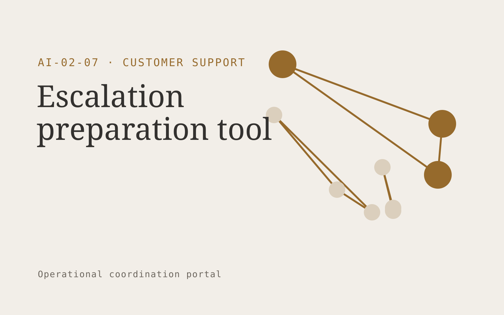

# Escalation preparation tool

**Customer Support** · Also fits: Operations; Product Development; Management

> For technical support leads at B2B software firms, turn ticket history, logs and attempted fixes into complete specialist escalation briefs. Address the recurring problem: specialists repeatedly reconstruct incomplete handoffs. The value hypothesis is a more complete, reviewable deliverable with less repeated preparation; the pilot must establish whether that benefit is real.

| | |
|---|---|
| **Buyer** | Technical support leads at B2B software firms |
| **Problem** | Specialists repeatedly reconstruct incomplete handoffs. |
| **Format** | Operational coordination portal |
| **USP** | Structured evidence packages matched to each specialist team's requirements. |

## The product
Key screens: Escalation inbox, case timeline, specialist handoff. Use a queue or timeline as the opening view, with clear owners, dates and current states. Each case opens into its source context, proposed actions and discussion. Give external participants a limited form or status page. Make the next required action visible without opening every record. In this product, the first view is escalation inbox, followed by case timeline and specialist handoff.

## Core functionality
1. Summarize problem context.
2. Extract reproduction details.
3. List attempted fixes.
4. Identify missing evidence.
5. Assign specialist queues.
6. Track handoff acceptance.

## Customer workflow
Create a case from approved inputs, identify required actions, confirm owners and dates, request missing information, approve proposed communications or changes, track completion, and retain a handover record. Start with ticket history, logs and attempted fixes and finish with complete specialist escalation briefs.

## AI and human review
Extract candidate actions and relevant context, classify requests and draft communications. Use explicit rules for scheduling, state transitions and permissions. People confirm obligations and approve consequential actions before execution.

## Customer inputs
Ticket history, logs and attempted fixes

## Customer deliverables
Complete specialist escalation briefs

## Accounts and administration
Role permissions, task ownership, deadlines, reminders, approval gates, exception handling, action history, duplicate prevention and reversible configuration.

## MVP scope
Begin with technical support leads at B2B software firms and one recurring use case. Build the first two modules: summarize problem context; extract reproduction details. Provide operator assistance for the third module: list attempted fixes. Deliver complete specialist escalation briefs through a manual review queue. Perform other necessary full-scope functions manually during the pilot. Include all applicable access, accuracy and professional-review controls from the start.

## After MVP validation
After paid pilots establish value, automate the remaining modules: identify missing evidence; assign specialist queues; track handoff acceptance. Add one validated source integration, reusable customer configuration and recurring delivery. Expand to additional teams, document formats or languages only after testing the new scope.

## Build dependencies
Explicit state definitions, owner mapping, approval rules, idempotent actions, notifications and recovery procedures. Workflow reliability matters more than fluent text.

## Integrations and data access
Support inboxes, help centers, order records and customer feedback systems. Calendars, email, task managers and relevant business records. Use draft actions and supervised handoffs first, then enable only specifically authorized writes. These are candidate integration categories, not verified supported connectors.

## Defensibility
Customer-specific workflow rules, reliable handoffs, operational history and integrations that make the service part of daily work. For this idea, build around structured evidence packages matched to each specialist team's requirements. This advantage requires execution and accumulated customer trust; the base model alone is not a defensible asset.

## Alternatives and positioning
Shared inboxes, spreadsheets, task boards and existing workflow automation products. Differentiate on this specific proposed advantage: structured evidence packages matched to each specialist team's requirements. Test it against the buyer's current method on the same task. Competitor coverage and uniqueness have not been established.

## Revenue model and test pricing (USD)
Test USD 750-2,500 setup plus USD 200-800 monthly for one bounded workflow and team. Cap case volume and implementation scope. Larger operational integrations need separate quotes. Prices are hypotheses.

## Main delivery costs
Workflow configuration, integration maintenance, model calls, notification delivery, exception support and monitoring.

## Marketing message to test
> Escalation preparation tool for technical support leads at B2B software firms. Structured evidence packages matched to each specialist team's requirements. Demonstrate the claim through before-and-after comparison of an anonymized escalation.

## Acquisition channels
Technical support communities

## Lead magnet
Before-and-after comparison of an anonymized escalation

## First 30 days of marketing
- Week 1: interview five prospective buyers in this segment: technical support leads at B2B software firms. Ask to see a recent example of the problem and their current process.
- Week 2: prepare this demonstration using authorized or synthetic material: before-and-after comparison of an anonymized escalation.
- Week 3: present it through technical support communities and seek one narrowly scoped paid pilot.
- Week 4: review rejected handoffs, time to specialist action, total delivery effort and a concrete renewal decision before increasing scope.

## Paid pilot and validation
Run one recurring workflow with a small team. Track every handoff and exception, verify completed actions, and compare handling time and missed commitments with the prior process. For this idea, use ticket history, logs and attempted fixes and evaluate complete specialist escalation briefs. Agree success thresholds with the buyer before starting; collect a baseline for rejected handoffs, time to specialist action. A positive signal is payment and repeat use with acceptable quality and delivery cost, not a favorable demo reaction alone.

## Success metrics
Rejected handoffs, time to specialist action

## Retention and expansion
Report completed actions and recurring exceptions. Maintain the workflow as policies change, then add one adjacent handoff with clear ownership.

## Operating controls and limitations
Keep customer account access scoped. Escalate missing evidence and consequential exceptions to staff. Review quality alongside any speed measure. Validate source access and reviewer availability during the pilot. Maintain customer-level access, data deletion controls and a record of final approvals.

## Brand style (concept)

- Colors: `#916e27` primary · `#5454c9` accent · `#f1ede4` surface · `#22201e` ink
- Type: Space Grotesk for headings, Inter for text
- Voice: Warm, clear, calm under pressure
- Demo site: [https://nexibeo.com/ideas/escalation-preparation-tool/demo/](https://nexibeo.com/ideas/escalation-preparation-tool/demo/)

## Investment indication

Indicative build budget, from MVP to full product. This is a planning range, not a quote; it excludes running costs such as model usage, hosting and reviewer hours.

| Phase | Scope | Timeline | Indicative budget |
|---|---|---|---|
| MVP | One buyer segment, one recurring use case; first modules: summarize problem context; extract reproduction details. Manual review in the loop. | 5 weeks | $8,500 |
| Paid pilot | Accounts, roles, review states, audit trail and the first integration, hardened for two to three paying pilot customers. | 6 weeks | $10,000 |
| Full product | Remaining modules: identify missing evidence; assign specialist queues; track handoff acceptance. Self-serve onboarding, billing, monitoring and the wider integration set. | 10 weeks | $14,000 |
| **Total** | | 21 weeks | **$32,500** |

**Co-create this project with us:** [contact Nexibeo](https://nexibeo.com/ideas/escalation-preparation-tool/#apply) and we build it with you.

## Research status
Concept proposal expanded from the 315-idea conversation. Demand, pricing, differentiation, build scope and integration feasibility are hypotheses, not verified market findings. Category link is inspiration rather than evidence of business viability.

## Credits and next steps

- **Estimation and building this idea:** see the full idea page on [nexibeo.com](https://nexibeo.com/ideas/escalation-preparation-tool/) for more detail on estimation, and to co-create and build this idea with Nexibeo.
- **Become an AI-optimized specialist for Customer Support:** [Complete AI Training](https://completeaitraining.com/certification/12b-ai-certification-for-customer-support-specialists/).
- Field news: [AI news for Customer Support](https://completeaitraining.com/all-ai-news-for-customer-support/).
