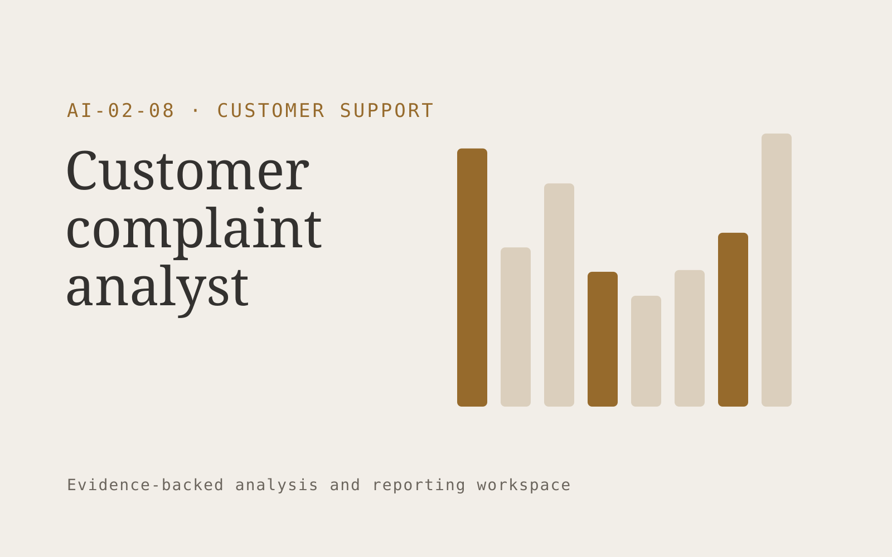

# Customer complaint analyst

**Customer Support** · Also fits: Operations; Product Development; Science and Research

> For customer experience leads at consumer subscription brands, turn tickets, reviews and approved customer surveys into prioritized complaint report with source evidence. Address the recurring problem: complaint themes are disconnected from operational decisions. The value hypothesis is a more complete, reviewable deliverable with less repeated preparation; the pilot must establish whether that benefit is real.

| | |
|---|---|
| **Buyer** | Customer experience leads at consumer subscription brands |
| **Problem** | Complaint themes are disconnected from operational decisions. |
| **Format** | Evidence-backed analysis and reporting workspace |
| **USP** | Complaint evidence connects directly to accountable operational changes. |

## The product
Key screens: Theme map, evidence explorer, action tracker. Open with a compact overview and filters for the relevant period or segment. Let users drill from each theme or metric into underlying records. Keep source definitions and missing-data notes near the result. Use an action panel to assign investigations and record what was learned. In this product, the first view is theme map, followed by evidence explorer and action tracker.

## Core functionality
1. Group related complaints.
2. Separate severity from frequency.
3. Show source examples.
4. Segment by product.
5. Assign improvement owners.
6. Track recurrence.

## Customer workflow
Agree definitions, import authorized data, validate coverage and identifiers, compute transparent measures, group relevant evidence, review findings, assign investigations or improvements, and repeat on a comparable period. Start with tickets, reviews and approved customer surveys and finish with prioritized complaint report with source evidence.

## AI and human review
Classify text, summarize evidence and propose explanations to investigate. Compute financial or operational measures with deterministic code. Separate observed patterns from causal claims and preserve examples that contradict the summary.

## Customer inputs
Tickets, reviews and approved customer surveys

## Customer deliverables
Prioritized complaint report with source evidence

## Accounts and administration
Dataset permissions, field mappings, metric definitions, source drill-down, saved filters, reviewer annotations, recurring reports and action ownership.

## MVP scope
Begin with customer experience leads at consumer subscription brands and one recurring use case. Build the first two modules: group related complaints; separate severity from frequency. Provide operator assistance for the third module: show source examples. Deliver prioritized complaint report with source evidence through a manual review queue. Perform other necessary full-scope functions manually during the pilot. Include all applicable access, accuracy and professional-review controls from the start.

## After MVP validation
After paid pilots establish value, automate the remaining modules: segment by product; assign improvement owners; track recurrence. Add one validated source integration, reusable customer configuration and recurring delivery. Expand to additional teams, document formats or languages only after testing the new scope.

## Build dependencies
Stable identifiers, consistent metric definitions, deterministic calculations, source lineage and representative review samples. Poor coverage must remain visible.

## Integrations and data access
Support inboxes, help centers, order records and customer feedback systems. Read-only business data exports, reporting databases and task trackers. Reconcile source totals before scheduling recurring data refreshes. These are candidate integration categories, not verified supported connectors.

## Defensibility
Domain-specific definitions, trusted source mappings and a history connecting findings to actions and observed results. For this idea, build around complaint evidence connects directly to accountable operational changes. This advantage requires execution and accumulated customer trust; the base model alone is not a defensible asset.

## Alternatives and positioning
Analysts, business intelligence dashboards, spreadsheets and general text summarization tools. Differentiate on this specific proposed advantage: complaint evidence connects directly to accountable operational changes. Test it against the buyer's current method on the same task. Competitor coverage and uniqueness have not been established.

## Revenue model and test pricing (USD)
Test USD 500-2,000 for an initial analysis of one bounded dataset. Offer USD 250-1,000 monthly for repeat reporting at agreed volume. Data cleanup and specialist analysis are separately priced. These are test ranges.

## Main delivery costs
Data preparation, reconciliation, classification, expert interpretation, customer-specific definitions and recurring reporting support.

## Marketing message to test
> Customer complaint analyst for customer experience leads at consumer subscription brands. Complaint evidence connects directly to accountable operational changes. Demonstrate the claim through a sample complaint-to-action report.

## Acquisition channels
Customer experience consultancies

## Lead magnet
A sample complaint-to-action report

## First 30 days of marketing
- Week 1: interview five prospective buyers in this segment: customer experience leads at consumer subscription brands. Ask to see a recent example of the problem and their current process.
- Week 2: prepare this demonstration using authorized or synthetic material: a sample complaint-to-action report.
- Week 3: present it through customer experience consultancies and seek one narrowly scoped paid pilot.
- Week 4: review theme accuracy, recurring complaint volume, total delivery effort and a concrete renewal decision before increasing scope.

## Paid pilot and validation
Analyze one historical period and review findings with the responsible domain owner. Reconcile headline measures, inspect counterexamples and ask the buyer to choose a concrete follow-up action. For this idea, use tickets, reviews and approved customer surveys and evaluate prioritized complaint report with source evidence. Agree success thresholds with the buyer before starting; collect a baseline for theme accuracy, recurring complaint volume. A positive signal is payment and repeat use with acceptable quality and delivery cost, not a favorable demo reaction alone.

## Success metrics
Theme accuracy, recurring complaint volume

## Retention and expansion
Repeat the same definitions each reporting period and track whether findings lead to useful action. Expand data sources without breaking historical comparability.

## Operating controls and limitations
Keep customer account access scoped. Escalate missing evidence and consequential exceptions to staff. Review quality alongside any speed measure. Validate source access and reviewer availability during the pilot. Maintain customer-level access, data deletion controls and a record of final approvals.

## Brand style (concept)

- Colors: `#915327` primary · `#54b4c9` accent · `#f1eae4` surface · `#22201e` ink
- Type: Space Grotesk for headings, Inter for text
- Voice: Warm, clear, calm under pressure
- Demo site: [https://nexibeo.com/ideas/customer-complaint-analyst/demo/](https://nexibeo.com/ideas/customer-complaint-analyst/demo/)

## Investment indication

Indicative build budget, from MVP to full product. This is a planning range, not a quote; it excludes running costs such as model usage, hosting and reviewer hours.

| Phase | Scope | Timeline | Indicative budget |
|---|---|---|---|
| MVP | One buyer segment, one recurring use case; first modules: group related complaints; separate severity from frequency. Manual review in the loop. | 4 weeks | $7,000 |
| Paid pilot | Accounts, roles, review states, audit trail and the first integration, hardened for two to three paying pilot customers. | 5 weeks | $7,500 |
| Full product | Remaining modules: segment by product; assign improvement owners; track recurrence. Self-serve onboarding, billing, monitoring and the wider integration set. | 8 weeks | $10,500 |
| **Total** | | 17 weeks | **$25,000** |

**Co-create this project with us:** [contact Nexibeo](https://nexibeo.com/ideas/customer-complaint-analyst/#apply) and we build it with you.

## Research status
Concept proposal expanded from the 315-idea conversation. Demand, pricing, differentiation, build scope and integration feasibility are hypotheses, not verified market findings. Category link is inspiration rather than evidence of business viability.

## Credits and next steps

- **Estimation and building this idea:** see the full idea page on [nexibeo.com](https://nexibeo.com/ideas/customer-complaint-analyst/) for more detail on estimation, and to co-create and build this idea with Nexibeo.
- **Become an AI-optimized specialist for Customer Support:** [Complete AI Training](https://completeaitraining.com/certification/12b-ai-certification-for-customer-support-specialists/).
- Field news: [AI news for Customer Support](https://completeaitraining.com/all-ai-news-for-customer-support/).
