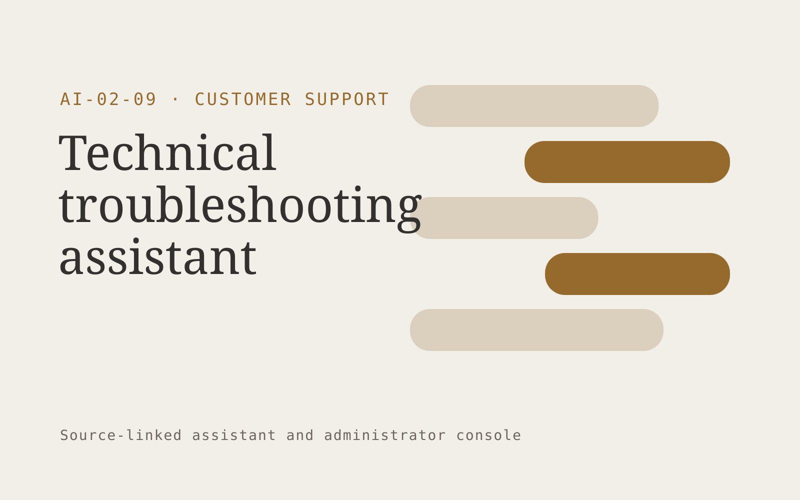

# Technical troubleshooting assistant

**Customer Support** · Also fits: Operations; Product Development; IT and Development

> For service managers at connected appliance brands, turn model manuals, approved diagnostic trees and fault codes into diagnostic record and repair referral summary. Address the recurring problem: customers abandon complex diagnostic instructions. The value hypothesis is a more complete, reviewable deliverable with less repeated preparation; the pilot must establish whether that benefit is real.

| | |
|---|---|
| **Buyer** | Service managers at connected appliance brands |
| **Problem** | Customers abandon complex diagnostic instructions. |
| **Format** | Source-linked assistant and administrator console |
| **USP** | Model-aware diagnostic sequences with explicit stopping conditions. |

## The product
Key screens: Diagnostic chat, device context, service handoff. Give end users a simple search or conversation surface with short answers and expandable citations. Administrators get source status, unanswered questions and handoff queues. Show the source date beside relevant answers. Keep conversation context available to the staff member receiving an escalation. In this product, the first view is diagnostic chat, followed by device context and service handoff.

## Core functionality
1. Identify device models.
2. Interpret approved error codes.
3. Branch diagnostic steps.
4. Record attempted actions.
5. Stop unsafe sequences.
6. Prepare repair handoffs.

## Customer workflow
Add an approved collection, assign source owners and access rules, test representative questions, let users ask questions, retrieve supporting passages, answer or request clarification, and hand off unresolved cases with their context. Start with model manuals, approved diagnostic trees and fault codes and finish with diagnostic record and repair referral summary.

## AI and human review
Retrieve permitted passages and generate answers constrained to those sources. Use structured rules for transactional facts. Detect missing context and refuse to invent unsupported details. Store reviewer corrections for evaluation and controlled knowledge updates.

## Customer inputs
Model manuals, approved diagnostic trees and fault codes

## Customer deliverables
Diagnostic record and repair referral summary

## Accounts and administration
Source ownership, document permissions, freshness checks, conversation history, human handoff, feedback, test questions, usage limits and access logs.

## MVP scope
Begin with service managers at connected appliance brands and one recurring use case. Build the first two modules: identify device models; interpret approved error codes. Provide operator assistance for the third module: branch diagnostic steps. Deliver diagnostic record and repair referral summary through a manual review queue. Perform other necessary full-scope functions manually during the pilot. Include all applicable access, accuracy and professional-review controls from the start.

## After MVP validation
After paid pilots establish value, automate the remaining modules: record attempted actions; stop unsafe sequences; prepare repair handoffs. Add one validated source integration, reusable customer configuration and recurring delivery. Expand to additional teams, document formats or languages only after testing the new scope.

## Build dependencies
Permission-filtered retrieval, document versioning, a question evaluation set, staff handoff and a source update process. Reliability depends on source quality and scope.

## Integrations and data access
Support inboxes, help centers, order records and customer feedback systems. Approved knowledge repositories, websites, service desks and staff messaging systems. Validate access inheritance and use read-only ingestion for the initial deployment. These are candidate integration categories, not verified supported connectors.

## Defensibility
A maintained domain knowledge collection, realistic evaluation questions, useful escalation paths and integrations in the customer’s daily work. For this idea, build around model-aware diagnostic sequences with explicit stopping conditions. This advantage requires execution and accumulated customer trust; the base model alone is not a defensible asset.

## Alternatives and positioning
Manual search, static FAQs, general chat tools and support or intranet suites. Differentiate on this specific proposed advantage: model-aware diagnostic sequences with explicit stopping conditions. Test it against the buyer's current method on the same task. Competitor coverage and uniqueness have not been established.

## Revenue model and test pricing (USD)
Test USD 500-2,000 setup plus USD 150-600 monthly for one defined source collection and usage allowance. Price multi-location deployments and specialist support separately. Validate willingness to pay; these are hypotheses.

## Main delivery costs
Document ingestion, retrieval and generation, source maintenance, support, evaluation and staff time handling unresolved cases.

## Marketing message to test
> Technical troubleshooting assistant for service managers at connected appliance brands. Model-aware diagnostic sequences with explicit stopping conditions. Demonstrate the claim through an interactive demonstration for one common fault.

## Acquisition channels
Appliance distributors and service networks

## Lead magnet
An interactive demonstration for one common fault

## First 30 days of marketing
- Week 1: interview five prospective buyers in this segment: service managers at connected appliance brands. Ask to see a recent example of the problem and their current process.
- Week 2: prepare this demonstration using authorized or synthetic material: an interactive demonstration for one common fault.
- Week 3: present it through appliance distributors and service networks and seek one narrowly scoped paid pilot.
- Week 4: review safe resolution rate, unnecessary repeat steps, total delivery effort and a concrete renewal decision before increasing scope.

## Paid pilot and validation
Restrict the assistant to one collection and test answered, ambiguous and unanswerable questions. Run supervised use before wider rollout. Measure correctness, escalation quality and staff effort. For this idea, use model manuals, approved diagnostic trees and fault codes and evaluate diagnostic record and repair referral summary. Agree success thresholds with the buyer before starting; collect a baseline for safe resolution rate, unnecessary repeat steps. A positive signal is payment and repeat use with acceptable quality and delivery cost, not a favorable demo reaction alone.

## Success metrics
Safe resolution rate, unnecessary repeat steps

## Retention and expansion
Review unanswered questions and source freshness monthly. Expand to another source collection or team only after the existing assistant meets its agreed accuracy and handoff criteria.

## Operating controls and limitations
Keep customer account access scoped. Escalate missing evidence and consequential exceptions to staff. Review quality alongside any speed measure. Validate source access and reviewer availability during the pilot. Maintain customer-level access, data deletion controls and a record of final approvals.

## Brand style (concept)

- Colors: `#916327` primary · `#5495c9` accent · `#f1ebe4` surface · `#22201e` ink
- Type: Space Grotesk for headings, Inter for text
- Voice: Warm, clear, calm under pressure
- Demo site: [https://nexibeo.com/ideas/technical-troubleshooting-assistant/demo/](https://nexibeo.com/ideas/technical-troubleshooting-assistant/demo/)

## Investment indication

Indicative build budget, from MVP to full product. This is a planning range, not a quote; it excludes running costs such as model usage, hosting and reviewer hours. Built with Nexibeo's AI software development factory, most implementations take days to a few weeks of creation time, depending on availability.

| Phase | Scope | Creation time | Indicative budget |
|---|---|---|---|
| MVP | One buyer segment, one recurring use case; first modules: identify device models; interpret approved error codes. Manual review in the loop. | 2 days | $5,500 |
| Paid pilot | Accounts, roles, review states, audit trail and the first integration, hardened for two to three paying pilot customers. | 3 days | $5,500 |
| Full product | Remaining modules: record attempted actions; stop unsafe sequences; prepare repair handoffs. Self-serve onboarding, billing, monitoring and the wider integration set. | 6 days | $7,500 |
| **Total** | | about 2 weeks | **$18,500** |

### Running costs per month (rough indication, untested)

| Stage | Hosting and infrastructure | AI usage | Total per month |
|---|---|---|---|
| MVP and paid pilot (about 3 customers) | $30–$60 | $60–$120 | **$90–$180** |
| Full product (about 50 customers) | $110–$210 | $530–$1,050 | **$640–$1,260** |

**Co-create this project with us:** [contact Nexibeo](https://nexibeo.com/ideas/technical-troubleshooting-assistant/#apply) and we build it with you.

## Research status
Concept proposal expanded from the 315-idea conversation. Demand, pricing, differentiation, build scope and integration feasibility are hypotheses, not verified market findings. Category link is inspiration rather than evidence of business viability.

## Credits and next steps

- **Estimation and building this idea:** see the full idea page on [nexibeo.com](https://nexibeo.com/ideas/technical-troubleshooting-assistant/) for more detail on estimation, and to co-create and build this idea with Nexibeo.
- **Become an AI-optimized specialist for Customer Support:** [Complete AI Training](https://completeaitraining.com/certification/12b-ai-certification-for-customer-support-specialists/).
- Field news: [AI news for Customer Support](https://completeaitraining.com/all-ai-news-for-customer-support/).
