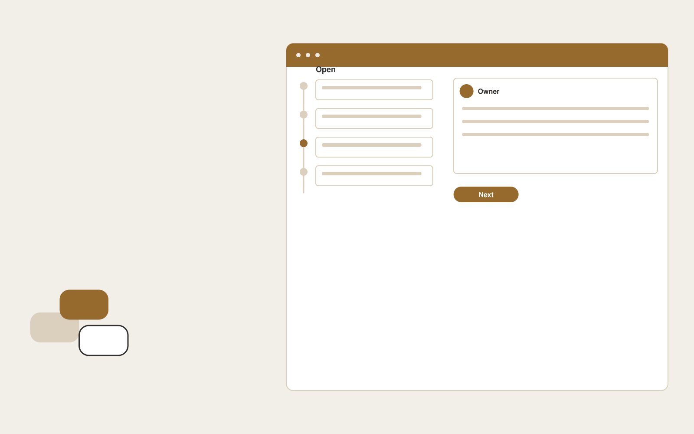

# Community support organizer

**Customer Support** · Also fits: Operations; Product Development; Management

> For community managers at developer tool companies, turn authorized forum posts and approved documentation into moderation queue and reviewed answer drafts. Address the recurring problem: useful answers disappear while repeated questions accumulate. The value hypothesis is a more complete, reviewable deliverable with less repeated preparation; the pilot must establish whether that benefit is real.

| | |
|---|---|
| **Buyer** | Community managers at developer tool companies |
| **Problem** | Useful answers disappear while repeated questions accumulate. |
| **Format** | Operational coordination portal |
| **USP** | Preserves community context while reducing repetitive moderator work. |

## The product
Key screens: Unanswered queue, duplicate clusters, answer editor. Use a queue or timeline as the opening view, with clear owners, dates and current states. Each case opens into its source context, proposed actions and discussion. Give external participants a limited form or status page. Make the next required action visible without opening every record. In this product, the first view is unanswered queue, followed by duplicate clusters and answer editor.

## Core functionality
1. Identify unanswered questions.
2. Find related threads.
3. Draft cited replies.
4. Suggest documentation gaps.
5. Route expert questions.
6. Track accepted answers.

## Customer workflow
Create a case from approved inputs, identify required actions, confirm owners and dates, request missing information, approve proposed communications or changes, track completion, and retain a handover record. Start with authorized forum posts and approved documentation and finish with moderation queue and reviewed answer drafts.

## AI and human review
Extract candidate actions and relevant context, classify requests and draft communications. Use explicit rules for scheduling, state transitions and permissions. People confirm obligations and approve consequential actions before execution.

## Customer inputs
Authorized forum posts and approved documentation

## Customer deliverables
Moderation queue and reviewed answer drafts

## Accounts and administration
Role permissions, task ownership, deadlines, reminders, approval gates, exception handling, action history, duplicate prevention and reversible configuration.

## MVP scope
Begin with community managers at developer tool companies and one recurring use case. Build the first two modules: identify unanswered questions; find related threads. Provide operator assistance for the third module: draft cited replies. Deliver moderation queue and reviewed answer drafts through a manual review queue. Perform other necessary full-scope functions manually during the pilot. Include all applicable access, accuracy and professional-review controls from the start.

## After MVP validation
After paid pilots establish value, automate the remaining modules: suggest documentation gaps; route expert questions; track accepted answers. Add one validated source integration, reusable customer configuration and recurring delivery. Expand to additional teams, document formats or languages only after testing the new scope.

## Build dependencies
Explicit state definitions, owner mapping, approval rules, idempotent actions, notifications and recovery procedures. Workflow reliability matters more than fluent text.

## Integrations and data access
Support inboxes, help centers, order records and customer feedback systems. Calendars, email, task managers and relevant business records. Use draft actions and supervised handoffs first, then enable only specifically authorized writes. These are candidate integration categories, not verified supported connectors.

## Defensibility
Customer-specific workflow rules, reliable handoffs, operational history and integrations that make the service part of daily work. For this idea, build around preserves community context while reducing repetitive moderator work. This advantage requires execution and accumulated customer trust; the base model alone is not a defensible asset.

## Alternatives and positioning
Shared inboxes, spreadsheets, task boards and existing workflow automation products. Differentiate on this specific proposed advantage: preserves community context while reducing repetitive moderator work. Test it against the buyer's current method on the same task. Competitor coverage and uniqueness have not been established.

## Revenue model and test pricing (USD)
Test USD 750-2,500 setup plus USD 200-800 monthly for one bounded workflow and team. Cap case volume and implementation scope. Larger operational integrations need separate quotes. Prices are hypotheses.

## Main delivery costs
Workflow configuration, integration maintenance, model calls, notification delivery, exception support and monitoring.

## Marketing message to test
> Community support organizer for community managers at developer tool companies. Preserves community context while reducing repetitive moderator work. Demonstrate the claim through a backlog review of unanswered community questions.

## Acquisition channels
Developer community managers

## Lead magnet
A backlog review of unanswered community questions

## First 30 days of marketing
- Week 1: interview five prospective buyers in this segment: community managers at developer tool companies. Ask to see a recent example of the problem and their current process.
- Week 2: prepare this demonstration using authorized or synthetic material: a backlog review of unanswered community questions.
- Week 3: present it through developer community managers and seek one narrowly scoped paid pilot.
- Week 4: review time to useful response, accepted answers, total delivery effort and a concrete renewal decision before increasing scope.

## Paid pilot and validation
Run one recurring workflow with a small team. Track every handoff and exception, verify completed actions, and compare handling time and missed commitments with the prior process. For this idea, use authorized forum posts and approved documentation and evaluate moderation queue and reviewed answer drafts. Agree success thresholds with the buyer before starting; collect a baseline for time to useful response, accepted answers. A positive signal is payment and repeat use with acceptable quality and delivery cost, not a favorable demo reaction alone.

## Success metrics
Time to useful response, accepted answers

## Retention and expansion
Report completed actions and recurring exceptions. Maintain the workflow as policies change, then add one adjacent handoff with clear ownership.

## Operating controls and limitations
Keep customer account access scoped. Escalate missing evidence and consequential exceptions to staff. Review quality alongside any speed measure. Validate source access and reviewer availability during the pilot. Maintain customer-level access, data deletion controls and a record of final approvals.

## Brand style (concept)

- Colors: `#914f27` primary · `#54b8c9` accent · `#f1e9e4` surface · `#22201e` ink
- Type: Playfair Display for headings, Source Sans 3 for text
- Voice: Warm, clear, calm under pressure
- Demo site: [https://nexibeo.com/ideas/community-support-organizer/demo/](https://nexibeo.com/ideas/community-support-organizer/demo/)

## Investment indication

Indicative build budget, from MVP to full product. This is a planning range, not a quote; it excludes running costs such as model usage, hosting and reviewer hours. Built with Nexibeo's AI software development factory, most implementations take days to a few weeks of creation time, depending on availability.

| Phase | Scope | Creation time | Indicative budget |
|---|---|---|---|
| MVP | One buyer segment, one recurring use case; first modules: identify unanswered questions; find related threads. Manual review in the loop. | 5 days | $8,500 |
| Paid pilot | Accounts, roles, review states, audit trail and the first integration, hardened for two to three paying pilot customers. | 6 days | $10,500 |
| Full product | Remaining modules: suggest documentation gaps; route expert questions; track accepted answers. Self-serve onboarding, billing, monitoring and the wider integration set. | 10 days | $14,500 |
| **Total** | | about 4 weeks | **$33,500** |

### Running costs per month (rough indication, untested)

| Stage | Hosting and infrastructure | AI usage | Total per month |
|---|---|---|---|
| MVP and paid pilot (about 3 customers) | $30–$60 | $40–$90 | **$70–$150** |
| Full product (about 50 customers) | $110–$210 | $280–$560 | **$390–$770** |

**Co-create this project with us:** [contact Nexibeo](https://nexibeo.com/ideas/community-support-organizer/#apply) and we build it with you.

## Research status
Concept proposal expanded from the 315-idea conversation. Demand, pricing, differentiation, build scope and integration feasibility are hypotheses, not verified market findings. Category link is inspiration rather than evidence of business viability.

## Credits and next steps

- **Estimation and building this idea:** see the full idea page on [nexibeo.com](https://nexibeo.com/ideas/community-support-organizer/) for more detail on estimation, and to co-create and build this idea with Nexibeo.
- **Become an AI-optimized specialist for Customer Support:** [Complete AI Training](https://completeaitraining.com/certification/12b-ai-certification-for-customer-support-specialists/).
- Field news: [AI news for Customer Support](https://completeaitraining.com/all-ai-news-for-customer-support/).
