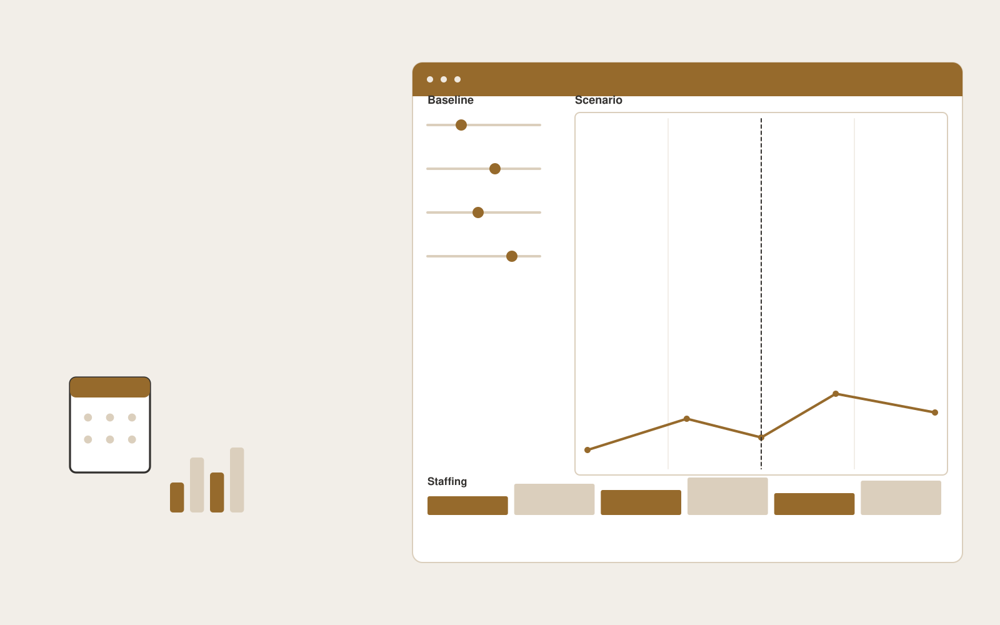

# Support demand planning tool

**Customer Support** · Also fits: Operations; Product Development; Finance

> For workforce planners at seasonal online retailers, turn historical ticket counts, campaign dates and staffing capacity into demand scenarios and staffing recommendations. Address the recurring problem: staffing plans ignore launches and seasonal ticket spikes. The value hypothesis is a more complete, reviewable deliverable with less repeated preparation; the pilot must establish whether that benefit is real.

| | |
|---|---|
| **Buyer** | Workforce planners at seasonal online retailers |
| **Problem** | Staffing plans ignore launches and seasonal ticket spikes. |
| **Format** | Assumption-driven planning and decision workspace |
| **USP** | Transparent event assumptions and error tracking for support-specific planning. |

## The product
Key screens: Demand calendar, assumptions, staffing scenarios. Place editable drivers and constraints beside a clearly labeled scenario output. Include a baseline view, comparison chart or schedule, and an assumptions history. Let users trace a proposed quantity or date back to its inputs. Keep forecasts distinct from actual results. In this product, the first view is demand calendar, followed by assumptions and staffing scenarios.

## Core functionality
1. Import volume history.
2. Flag missing periods.
3. Model seasonal patterns.
4. Add event assumptions.
5. Compare capacity scenarios.
6. Backtest forecasts.

## Customer workflow
Validate baseline inputs, confirm definitions and constraints, select editable assumptions, calculate feasible alternatives, inspect sensitivities, let the responsible person approve a plan, and compare later actuals with the recorded assumptions. Start with historical ticket counts, campaign dates and staffing capacity and finish with demand scenarios and staffing recommendations.

## AI and human review
Extract input context and explain scenario differences. Use deterministic calculations or explicit optimization for quantities, compatibility, dates and prices. Show uncertain assumptions. Never let generated prose silently change the calculation rules.

## Customer inputs
Historical ticket counts, campaign dates and staffing capacity

## Customer deliverables
Demand scenarios and staffing recommendations

## Accounts and administration
Scenario versions, baseline reconciliation, constraint checks, assumption ownership, reviewer approvals, plan exports and actual-versus-plan tracking.

## MVP scope
Begin with workforce planners at seasonal online retailers and one recurring use case. Build the first two modules: import volume history; flag missing periods. Provide operator assistance for the third module: model seasonal patterns. Deliver demand scenarios and staffing recommendations through a manual review queue. Perform other necessary full-scope functions manually during the pilot. Include all applicable access, accuracy and professional-review controls from the start.

## After MVP validation
After paid pilots establish value, automate the remaining modules: add event assumptions; compare capacity scenarios; backtest forecasts. Add one validated source integration, reusable customer configuration and recurring delivery. Expand to additional teams, document formats or languages only after testing the new scope.

## Build dependencies
A defensible calculation model, explicit units, constraint validation and representative boundary tests. Advanced forecasting or optimization needs adequate historical data.

## Integrations and data access
Support inboxes, help centers, order records and customer feedback systems. Read-only operational exports, calendars and finance or inventory records as relevant. Start with plan exports and retain human approval for execution. These are candidate integration categories, not verified supported connectors.

## Defensibility
A validated domain model, customer-approved constraints and forecast or decision history that improves practical planning. For this idea, build around transparent event assumptions and error tracking for support-specific planning. This advantage requires execution and accumulated customer trust; the base model alone is not a defensible asset.

## Alternatives and positioning
Spreadsheets, planners, specialist forecasting tools and existing scheduling or configuration software. Differentiate on this specific proposed advantage: transparent event assumptions and error tracking for support-specific planning. Test it against the buyer's current method on the same task. Competitor coverage and uniqueness have not been established.

## Revenue model and test pricing (USD)
Test USD 750-3,000 for a scoped planning setup and review, then USD 200-900 monthly for refreshes within agreed complexity. Data integration and optimization are separately scoped. All ranges are hypotheses.

## Main delivery costs
Data preparation, domain modeling, validation, scenario computation, reviewer support and ongoing assumption maintenance.

## Marketing message to test
> Support demand planning tool for workforce planners at seasonal online retailers. Transparent event assumptions and error tracking for support-specific planning. Demonstrate the claim through a historical forecast backtest using customer data.

## Acquisition channels
Support workforce consultants

## Lead magnet
A historical forecast backtest using customer data

## First 30 days of marketing
- Week 1: interview five prospective buyers in this segment: workforce planners at seasonal online retailers. Ask to see a recent example of the problem and their current process.
- Week 2: prepare this demonstration using authorized or synthetic material: a historical forecast backtest using customer data.
- Week 3: present it through support workforce consultants and seek one narrowly scoped paid pilot.
- Week 4: review forecast error, understaffed intervals, total delivery effort and a concrete renewal decision before increasing scope.

## Paid pilot and validation
Reproduce a known historical plan, test missing inputs and boundary constraints, then run a new scenario. Compare feasibility, reconciliation and observed error rather than judging the quality of the explanation alone. For this idea, use historical ticket counts, campaign dates and staffing capacity and evaluate demand scenarios and staffing recommendations. Agree success thresholds with the buyer before starting; collect a baseline for forecast error, understaffed intervals. A positive signal is payment and repeat use with acceptable quality and delivery cost, not a favorable demo reaction alone.

## Success metrics
Forecast error, understaffed intervals

## Retention and expansion
Refresh inputs, compare recorded assumptions with actual outcomes and refine validated constraints. Expand scenario complexity only when the buyer uses it for a decision.

## Operating controls and limitations
Keep customer account access scoped. Escalate missing evidence and consequential exceptions to staff. Review quality alongside any speed measure. Validate source access and reviewer availability during the pilot. Maintain customer-level access, data deletion controls and a record of final approvals.

## Brand style (concept)

- Colors: `#915f27` primary · `#5499c9` accent · `#f1ebe4` surface · `#22201e` ink
- Type: Playfair Display for headings, Source Sans 3 for text
- Voice: Warm, clear, calm under pressure
- Demo site: [https://nexibeo.com/ideas/support-demand-planning-tool/demo/](https://nexibeo.com/ideas/support-demand-planning-tool/demo/)

## Investment indication

Indicative build budget, from MVP to full product. This is a planning range, not a quote; it excludes running costs such as model usage, hosting and reviewer hours.

| Phase | Scope | Timeline | Indicative budget |
|---|---|---|---|
| MVP | One buyer segment, one recurring use case; first modules: import volume history; flag missing periods. Manual review in the loop. | 4 weeks | $7,000 |
| Paid pilot | Accounts, roles, review states, audit trail and the first integration, hardened for two to three paying pilot customers. | 5 weeks | $8,000 |
| Full product | Remaining modules: add event assumptions; compare capacity scenarios; backtest forecasts. Self-serve onboarding, billing, monitoring and the wider integration set. | 8 weeks | $10,500 |
| **Total** | | 17 weeks | **$25,500** |

**Co-create this project with us:** [contact Nexibeo](https://nexibeo.com/ideas/support-demand-planning-tool/#apply) and we build it with you.

## Research status
Concept proposal expanded from the 315-idea conversation. Demand, pricing, differentiation, build scope and integration feasibility are hypotheses, not verified market findings. Category link is inspiration rather than evidence of business viability.

## Credits and next steps

- **Estimation and building this idea:** see the full idea page on [nexibeo.com](https://nexibeo.com/ideas/support-demand-planning-tool/) for more detail on estimation, and to co-create and build this idea with Nexibeo.
- **Become an AI-optimized specialist for Customer Support:** [Complete AI Training](https://completeaitraining.com/certification/12b-ai-certification-for-customer-support-specialists/).
- Field news: [AI news for Customer Support](https://completeaitraining.com/all-ai-news-for-customer-support/).
