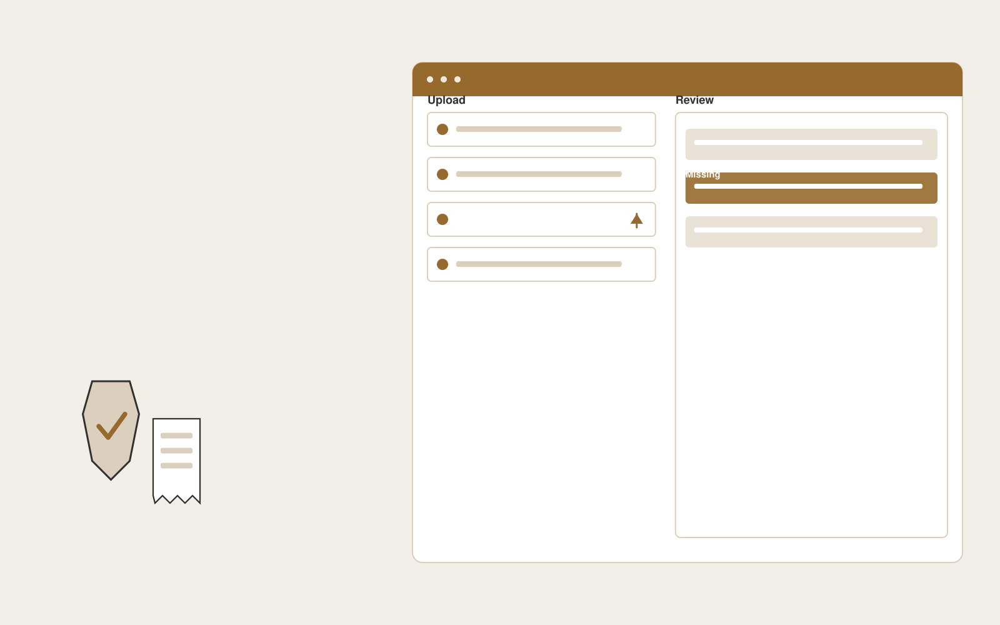

# Warranty intake assistant

**Customer Support** · Also fits: Operations; Product Development

> For after-sales managers at consumer electronics brands, turn receipts, serial numbers, photos and warranty terms into warranty evidence pack for staff review. Address the recurring problem: warranty cases lack proof of purchase and product identification. The value hypothesis is a more complete, reviewable deliverable with less repeated preparation; the pilot must establish whether that benefit is real.

| | |
|---|---|
| **Buyer** | After-sales managers at consumer electronics brands |
| **Problem** | Warranty cases lack proof of purchase and product identification. |
| **Format** | Client intake portal and staff exception queue |
| **USP** | Evidence completeness before anyone evaluates warranty entitlement. |

## The product
Key screens: Claim portal, evidence checklist, review queue. Give submitters a mobile-friendly step-by-step form with document uploads and a visible completeness checklist. Staff see a queue with missing items and extracted fields. Place the original document beside each uncertain value. Show submitted, clarification required and ready-for-review states. In this product, the first view is claim portal, followed by evidence checklist and review queue.

## Core functionality
1. Extract receipt details.
2. Validate serial format.
3. Collect fault descriptions.
4. Identify missing evidence.
5. Group duplicate submissions.
6. Route staff decisions.

## Customer workflow
Choose the request type, collect declared facts and required documents, extract relevant fields, show missing or inconsistent information, let the submitter correct it, and route the complete package to an authorized reviewer. Start with receipts, serial numbers, photos and warranty terms and finish with warranty evidence pack for staff review.

## AI and human review
Classify submitted material, extract candidate fields and draft clarification questions. Deterministic rules test required fields and formats. Keep uncertain extraction visible and preserve the original statement. Do not infer missing material facts.

## Customer inputs
Receipts, serial numbers, photos and warranty terms

## Customer deliverables
Warranty evidence pack for staff review

## Accounts and administration
Secure uploads, configurable checklists, progress saving, duplicate handling, reviewer assignments, clarification threads, deadlines and submission history.

## MVP scope
Begin with after-sales managers at consumer electronics brands and one recurring use case. Build the first two modules: extract receipt details; validate serial format. Provide operator assistance for the third module: collect fault descriptions. Deliver warranty evidence pack for staff review through a manual review queue. Perform other necessary full-scope functions manually during the pilot. Include all applicable access, accuracy and professional-review controls from the start.

## After MVP validation
After paid pilots establish value, automate the remaining modules: identify missing evidence; group duplicate submissions; route staff decisions. Add one validated source integration, reusable customer configuration and recurring delivery. Expand to additional teams, document formats or languages only after testing the new scope.

## Build dependencies
Secure upload handling, reliable extraction, versioned completeness rules, submitter identity and staff routing. Third-party checklist changes require maintenance.

## Integrations and data access
Support inboxes, help centers, order records and customer feedback systems. Case management, customer records, document storage and notification systems. Begin with an exportable review pack before automating destination writes. These are candidate integration categories, not verified supported connectors.

## Defensibility
Document-type expertise, tested completeness rules and a low-friction client experience embedded in a repeat administrative process. For this idea, build around evidence completeness before anyone evaluates warranty entitlement. This advantage requires execution and accumulated customer trust; the base model alone is not a defensible asset.

## Alternatives and positioning
Email collection, generic web forms, spreadsheets and existing case management systems. Differentiate on this specific proposed advantage: evidence completeness before anyone evaluates warranty entitlement. Test it against the buyer's current method on the same task. Competitor coverage and uniqueness have not been established.

## Revenue model and test pricing (USD)
Test USD 500-2,000 setup plus USD 150-750 monthly for one form family and a capped submission volume. Quote specialist review and unusual document formats separately. Prices are experimental.

## Main delivery costs
Document processing, storage, exception review, support, checklist maintenance and customer-specific integration work.

## Marketing message to test
> Warranty intake assistant for after-sales managers at consumer electronics brands. Evidence completeness before anyone evaluates warranty entitlement. Demonstrate the claim through a complete warranty submission walkthrough.

## Acquisition channels
Electronics distributors and repair partners

## Lead magnet
A complete warranty submission walkthrough

## First 30 days of marketing
- Week 1: interview five prospective buyers in this segment: after-sales managers at consumer electronics brands. Ask to see a recent example of the problem and their current process.
- Week 2: prepare this demonstration using authorized or synthetic material: a complete warranty submission walkthrough.
- Week 3: present it through electronics distributors and repair partners and seek one narrowly scoped paid pilot.
- Week 4: review first-pass completeness, clarification messages, total delivery effort and a concrete renewal decision before increasing scope.

## Paid pilot and validation
Process a bounded set of historical and new submissions. Include missing, duplicate and unreadable documents. Compare complete submissions and clarification effort with the current intake method. For this idea, use receipts, serial numbers, photos and warranty terms and evaluate warranty evidence pack for staff review. Agree success thresholds with the buyer before starting; collect a baseline for first-pass completeness, clarification messages. A positive signal is payment and repeat use with acceptable quality and delivery cost, not a favorable demo reaction alone.

## Success metrics
First-pass completeness, clarification messages

## Retention and expansion
Review incomplete submissions and simplify recurring friction. Expand to another form or document family after the first workflow reliably produces review-ready cases.

## Operating controls and limitations
Keep customer account access scoped. Escalate missing evidence and consequential exceptions to staff. Review quality alongside any speed measure. Validate source access and reviewer availability during the pilot. Maintain customer-level access, data deletion controls and a record of final approvals.

## Brand style (concept)

- Colors: `#916f27` primary · `#547bc9` accent · `#f1ede4` surface · `#22201e` ink
- Type: Playfair Display for headings, Source Sans 3 for text
- Voice: Warm, clear, calm under pressure
- Demo site: [https://nexibeo.com/ideas/warranty-intake-assistant/demo/](https://nexibeo.com/ideas/warranty-intake-assistant/demo/)

## Investment indication

Indicative build budget, from MVP to full product. This is a planning range, not a quote; it excludes running costs such as model usage, hosting and reviewer hours.

| Phase | Scope | Timeline | Indicative budget |
|---|---|---|---|
| MVP | One buyer segment, one recurring use case; first modules: extract receipt details; validate serial format. Manual review in the loop. | 4 weeks | $8,000 |
| Paid pilot | Accounts, roles, review states, audit trail and the first integration, hardened for two to three paying pilot customers. | 6 weeks | $9,000 |
| Full product | Remaining modules: identify missing evidence; group duplicate submissions; route staff decisions. Self-serve onboarding, billing, monitoring and the wider integration set. | 9 weeks | $13,000 |
| **Total** | | 19 weeks | **$30,000** |

**Co-create this project with us:** [contact Nexibeo](https://nexibeo.com/ideas/warranty-intake-assistant/#apply) and we build it with you.

## Research status
Concept proposal expanded from the 315-idea conversation. Demand, pricing, differentiation, build scope and integration feasibility are hypotheses, not verified market findings. Category link is inspiration rather than evidence of business viability.

## Credits and next steps

- **Estimation and building this idea:** see the full idea page on [nexibeo.com](https://nexibeo.com/ideas/warranty-intake-assistant/) for more detail on estimation, and to co-create and build this idea with Nexibeo.
- **Become an AI-optimized specialist for Customer Support:** [Complete AI Training](https://completeaitraining.com/certification/12b-ai-certification-for-customer-support-specialists/).
- Field news: [AI news for Customer Support](https://completeaitraining.com/all-ai-news-for-customer-support/).
