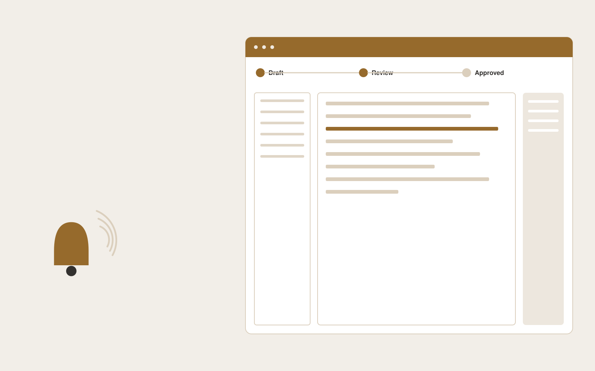

# Proactive service update platform

**Customer Support** · Also fits: Operations; Product Development; Writers

> For communications leads at software service providers, turn verified incident facts, affected services and message templates into approved incident messages and communication history. Address the recurring problem: customers receive unclear or contradictory incident updates. The value hypothesis is a more complete, reviewable deliverable with less repeated preparation; the pilot must establish whether that benefit is real.

| | |
|---|---|
| **Buyer** | Communications leads at software service providers |
| **Problem** | Customers receive unclear or contradictory incident updates. |
| **Format** | Source-based content workspace with editorial delivery |
| **USP** | Consistent wording across channels with one verified incident record. |

## The product
Key screens: Incident board, audience editor, approval timeline. Use a project list and editorial calendar beside a document editor. Keep original material and supporting passages in a collapsible side panel. Show outline, draft, review and approved stages. Provide tracked edits, comments, version comparisons and an export preview that reflects the final delivery format. In this product, the first view is incident board, followed by audience editor and approval timeline.

## Core functionality
1. Map affected audiences.
2. Draft status messages.
3. Preserve verified facts.
4. Coordinate channels.
5. Record approvals.
6. Publish resolution summaries.

## Customer workflow
Collect a structured brief and source material, identify unanswered questions, approve an outline, generate a draft, verify claims, gather reviewer edits, approve a final version and export the agreed formats. Start with verified incident facts, affected services and message templates and finish with approved incident messages and communication history.

## AI and human review
Extract and organize information, propose structure, draft prose and adapt approved content to audiences. Attach evidence to factual claims. Keep names, dates, amounts and quoted wording linked to their source. Editors resolve ambiguity and approve publication.

## Customer inputs
Verified incident facts, affected services and message templates

## Customer deliverables
Approved incident messages and communication history

## Accounts and administration
Client workspaces, source permissions, editorial assignments, change history, reviewer comments, approval gates, revision allowances and export templates.

## MVP scope
Begin with communications leads at software service providers and one recurring use case. Build the first two modules: map affected audiences; draft status messages. Provide operator assistance for the third module: preserve verified facts. Deliver approved incident messages and communication history through a manual review queue. Perform other necessary full-scope functions manually during the pilot. Include all applicable access, accuracy and professional-review controls from the start.

## After MVP validation
After paid pilots establish value, automate the remaining modules: coordinate channels; record approvals; publish resolution summaries. Add one validated source integration, reusable customer configuration and recurring delivery. Expand to additional teams, document formats or languages only after testing the new scope.

## Build dependencies
Document parsing, a source-linked editor, tracked revisions, reviewer workflow and reliable document export. Rich presentation or print output needs format-specific QA.

## Integrations and data access
Support inboxes, help centers, order records and customer feedback systems. Document storage, word processor export, content management systems and approved publishing channels. Pilot with uploads and downloadable drafts before adding write integrations. These are candidate integration categories, not verified supported connectors.

## Defensibility
Customer-approved terminology, reusable structures, source libraries and editorial feedback tied to a specific audience and recurring publishing workflow. For this idea, build around consistent wording across channels with one verified incident record. This advantage requires execution and accumulated customer trust; the base model alone is not a defensible asset.

## Alternatives and positioning
Writers, editors, agencies, internal document templates and general-purpose chat tools. Differentiate on this specific proposed advantage: consistent wording across channels with one verified incident record. Test it against the buyer's current method on the same task. Competitor coverage and uniqueness have not been established.

## Revenue model and test pricing (USD)
Test USD 400-1,500 for a tightly scoped initial content package. Convert repeated work to a monthly retainer with explicit deliverable and revision limits. Specialist review and substantial research are separately scoped. Prices are hypotheses.

## Main delivery costs
Research and interview time, transcription, model usage, factual verification, subject-matter review, editing and revisions.

## Marketing message to test
> Proactive service update platform for communications leads at software service providers. Consistent wording across channels with one verified incident record. Demonstrate the claim through a coordinated sample incident communication sequence.

## Acquisition channels
Incident management consultants

## Lead magnet
A coordinated sample incident communication sequence

## First 30 days of marketing
- Week 1: interview five prospective buyers in this segment: communications leads at software service providers. Ask to see a recent example of the problem and their current process.
- Week 2: prepare this demonstration using authorized or synthetic material: a coordinated sample incident communication sequence.
- Week 3: present it through incident management consultants and seek one narrowly scoped paid pilot.
- Week 4: review update preparation time, correction frequency, total delivery effort and a concrete renewal decision before increasing scope.

## Paid pilot and validation
Complete one existing brief using the customer’s actual sources. Record reviewer edits, factual corrections and preparation time. Ask the same buyer to commission a second comparable deliverable. For this idea, use verified incident facts, affected services and message templates and evaluate approved incident messages and communication history. Agree success thresholds with the buyer before starting; collect a baseline for update preparation time, correction frequency. A positive signal is payment and repeat use with acceptable quality and delivery cost, not a favorable demo reaction alone.

## Success metrics
Update preparation time, correction frequency

## Retention and expansion
Maintain the approved source and voice library, schedule recurring editorial work, and expand into additional formats only after the core deliverable is repeatedly accepted.

## Operating controls and limitations
Keep customer account access scoped. Escalate missing evidence and consequential exceptions to staff. Review quality alongside any speed measure. Validate source access and reviewer availability during the pilot. Maintain customer-level access, data deletion controls and a record of final approvals.

## Brand style (concept)

- Colors: `#915527` primary · `#548bc9` accent · `#f1eae4` surface · `#22201e` ink
- Type: Playfair Display for headings, Source Sans 3 for text
- Voice: Warm, clear, calm under pressure
- Demo site: [https://nexibeo.com/solutions/proactive-service-update-platform/demo/](https://nexibeo.com/solutions/proactive-service-update-platform/demo/)

## Investment indication

Indicative build budget, from MVP to full product. This is a planning range, not a quote; it excludes running costs such as model usage, hosting and reviewer hours. Built with Nexibeo's AI software development factory, most implementations take days to a few weeks of creation time, depending on availability.

| Phase | Scope | Creation time | Indicative budget |
|---|---|---|---|
| MVP | One buyer segment, one recurring use case; first modules: map affected audiences; draft status messages. Manual review in the loop. | 4 days | $8,000 |
| Paid pilot | Accounts, roles, review states, audit trail and the first integration, hardened for two to three paying pilot customers. | 5 days | $9,000 |
| Full product | Remaining modules: coordinate channels; record approvals; publish resolution summaries. Self-serve onboarding, billing, monitoring and the wider integration set. | 9 days | $13,000 |
| **Total** | | about 4 weeks | **$30,000** |

### Running costs per month (rough indication, untested)

| Stage | Hosting and infrastructure | AI usage | Total per month |
|---|---|---|---|
| MVP and paid pilot (about 3 customers) | $30–$60 | $70–$140 | **$100–$200** |
| Full product (about 50 customers) | $110–$210 | $700–$1,400 | **$810–$1,610** |

**Get this built:** [contact Nexibeo](https://nexibeo.com/solutions/proactive-service-update-platform/#apply). We build it with our AI software factory, usually in days to a few weeks, for you to run internally or offer to your clients.

## Research status
Concept proposal expanded from the 315-idea conversation. Demand, pricing, differentiation, build scope and integration feasibility are hypotheses, not verified market findings. Category link is inspiration rather than evidence of business viability.

## Credits and next steps

- **Estimation and having it built:** see the full solution page on [nexibeo.com](https://nexibeo.com/solutions/proactive-service-update-platform/) for more detail on estimation. Nexibeo builds it for you as a custom AI implementation, to run internally or to offer to your own clients.
- **Become an AI-optimized specialist for Customer Support:** [Complete AI Training](https://completeaitraining.com/certification/12b-ai-certification-for-customer-support-specialists/).
- Field news: [AI news for Customer Support](https://completeaitraining.com/all-ai-news-for-customer-support/).
