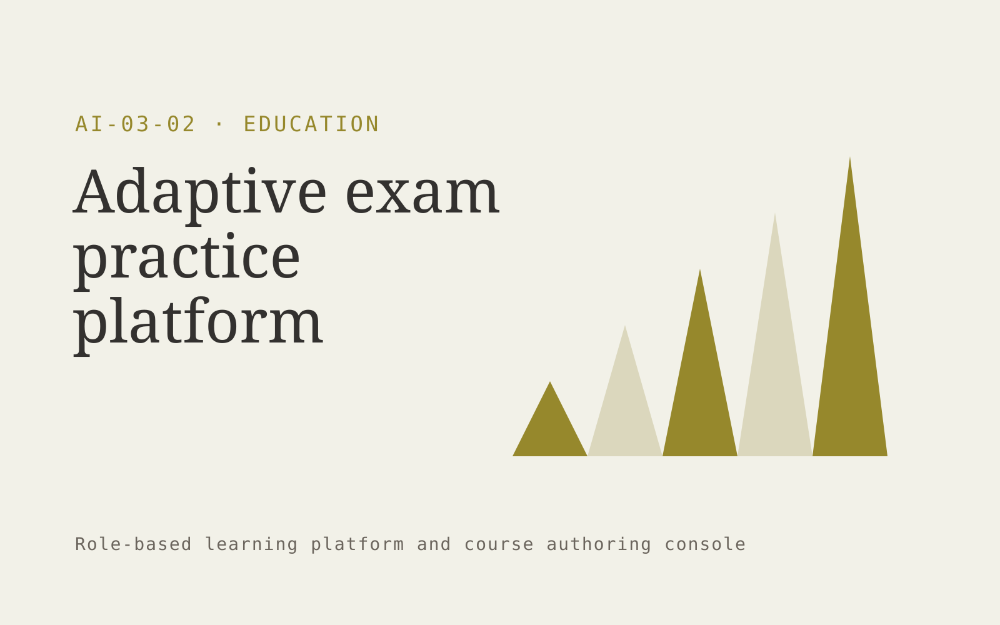

# Adaptive exam practice platform

**Education** · Also fits: Human Resources; Management

> For independent professional certification tutors, turn licensed syllabus, reviewed questions and learner responses into adaptive practice program and revision report. Address the recurring problem: learners repeatedly practice topics they already understand. The value hypothesis is a more complete, reviewable deliverable with less repeated preparation; the pilot must establish whether that benefit is real.

| | |
|---|---|
| **Buyer** | Independent professional certification tutors |
| **Problem** | Learners repeatedly practice topics they already understand. |
| **Format** | Role-based learning platform and course authoring console |
| **USP** | Adaptation tied to an explicit syllabus and reviewed question bank. |

## The product
Key screens: Diagnostic test, study plan, explanation panel. Provide a learner home with the next useful lesson, a practice activity and progress evidence. Give authors a source-linked course editor and assessment review queue. Supervisors see completed tasks and explicit sign-offs. Use short modules that work on mobile as well as desktop. In this product, the first view is diagnostic test, followed by study plan and explanation panel.

## Core functionality
1. Map syllabus objectives.
2. Serve reviewed questions.
3. Explain solutions.
4. Identify weak concepts.
5. Schedule revision.
6. Track mastery evidence.

## Customer workflow
Define learning objectives, map approved source material, review lessons and questions, assess the learner’s starting point, deliver targeted practice, collect evidence of competence, and update affected lessons when sources change. Start with licensed syllabus, reviewed questions and learner responses and finish with adaptive practice program and revision report.

## AI and human review
Draft lesson structure, examples, explanations and practice questions from approved material. Adapt practice using demonstrated responses. Educators validate answer keys and content. Completion status is distinct from demonstrated ability.

## Customer inputs
Licensed syllabus, reviewed questions and learner responses

## Customer deliverables
Adaptive practice program and revision report

## Accounts and administration
Learner enrollment, content versions, assessment review, role pathways, accessibility options, supervisor sign-off, progress records and source update alerts.

## MVP scope
Begin with independent professional certification tutors and one recurring use case. Build the first two modules: map syllabus objectives; serve reviewed questions. Provide operator assistance for the third module: explain solutions. Deliver adaptive practice program and revision report through a manual review queue. Perform other necessary full-scope functions manually during the pilot. Include all applicable access, accuracy and professional-review controls from the start.

## After MVP validation
After paid pilots establish value, automate the remaining modules: identify weak concepts; schedule revision; track mastery evidence. Add one validated source integration, reusable customer configuration and recurring delivery. Expand to additional teams, document formats or languages only after testing the new scope.

## Build dependencies
Clear objectives, licensed or approved sources, validated assessments, learner state and source-change tracking. Media and accessibility requirements affect production effort.

## Integrations and data access
Learning resources, course portals and educator review processes. Learning portals, employee or member directories and completion exports. Validate standards and identity requirements before promising native LMS compatibility. These are candidate integration categories, not verified supported connectors.

## Defensibility
A reviewed niche curriculum, realistic practice tasks and evidence of useful learning outcomes in a defined role. For this idea, build around adaptation tied to an explicit syllabus and reviewed question bank. This advantage requires execution and accumulated customer trust; the base model alone is not a defensible asset.

## Alternatives and positioning
Courses, internal trainers, learning management systems and static training documents. Differentiate on this specific proposed advantage: adaptation tied to an explicit syllabus and reviewed question bank. Test it against the buyer's current method on the same task. Competitor coverage and uniqueness have not been established.

## Revenue model and test pricing (USD)
Test USD 15-39 per learner monthly for one exam syllabus and reviewed question bank. Offer tutor account bundles with learner management. Include content licensing and educator review in the cost model. Prices are hypotheses.

## Main delivery costs
Instructional design, subject review, media production, assessment validation, learner support and content refreshes.

## Marketing message to test
> Adaptive exam practice platform for independent professional certification tutors. Adaptation tied to an explicit syllabus and reviewed question bank. Demonstrate the claim through a diagnostic quiz with a topic-level revision plan.

## Acquisition channels
Certification tutor partnerships

## Lead magnet
A diagnostic quiz with a topic-level revision plan

## First 30 days of marketing
- Week 1: interview five prospective buyers in this segment: independent professional certification tutors. Ask to see a recent example of the problem and their current process.
- Week 2: prepare this demonstration using authorized or synthetic material: a diagnostic quiz with a topic-level revision plan.
- Week 3: present it through certification tutor partnerships and seek one narrowly scoped paid pilot.
- Week 4: review question accuracy, retained learning, total delivery effort and a concrete renewal decision before increasing scope.

## Paid pilot and validation
Teach one important task to a small cohort. Compare performance before and after on different examples, gather educator review and check whether learners can apply the skill outside the lesson. For this idea, use licensed syllabus, reviewed questions and learner responses and evaluate adaptive practice program and revision report. Agree success thresholds with the buyer before starting; collect a baseline for question accuracy, retained learning. A positive signal is payment and repeat use with acceptable quality and delivery cost, not a favorable demo reaction alone.

## Success metrics
Question accuracy, retained learning

## Retention and expansion
Refresh lessons when their source changes, add task-specific practice and review real application of the learning. Expand into adjacent roles after proving usefulness.

## Operating controls and limitations
Use educator-reviewed content and answer keys. Apply appropriate access and consent for learner records and distinguish completion from demonstrated learning. Validate source access and reviewer availability during the pilot. Maintain customer-level access, data deletion controls and a record of final approvals.

## Brand style (concept)

- Colors: `#917327` primary · `#5654c9` accent · `#f1ede4` surface · `#22201e` ink
- Type: Manrope for headings, Manrope for text
- Voice: Encouraging, patient, precise
- Demo site: [https://nexibeo.com/ideas/adaptive-exam-practice-platform/demo/](https://nexibeo.com/ideas/adaptive-exam-practice-platform/demo/)

## Investment indication

Indicative build budget, from MVP to full product. This is a planning range, not a quote; it excludes running costs such as model usage, hosting and reviewer hours.

| Phase | Scope | Timeline | Indicative budget |
|---|---|---|---|
| MVP | One buyer segment, one recurring use case; first modules: map syllabus objectives; serve reviewed questions. Manual review in the loop. | 5 weeks | $10,500 |
| Paid pilot | Accounts, roles, review states, audit trail and the first integration, hardened for two to three paying pilot customers. | 7 weeks | $13,500 |
| Full product | Remaining modules: identify weak concepts; schedule revision; track mastery evidence. Self-serve onboarding, billing, monitoring and the wider integration set. | 12 weeks | $18,500 |
| **Total** | | 24 weeks | **$42,500** |

**Co-create this project with us:** [contact Nexibeo](https://nexibeo.com/ideas/adaptive-exam-practice-platform/#apply) and we build it with you.

## Research status
Concept proposal expanded from the 315-idea conversation. Demand, pricing, differentiation, build scope and integration feasibility are hypotheses, not verified market findings. Category link is inspiration rather than evidence of business viability.

## Credits and next steps

- **Estimation and building this idea:** see the full idea page on [nexibeo.com](https://nexibeo.com/ideas/adaptive-exam-practice-platform/) for more detail on estimation, and to co-create and build this idea with Nexibeo.
- **Become an AI-optimized specialist for Education:** [Complete AI Training](https://completeaitraining.com/tag/education/?contentType=ai-certification).
- Field news: [AI news for Education](https://completeaitraining.com/all-ai-news-for-education/).
