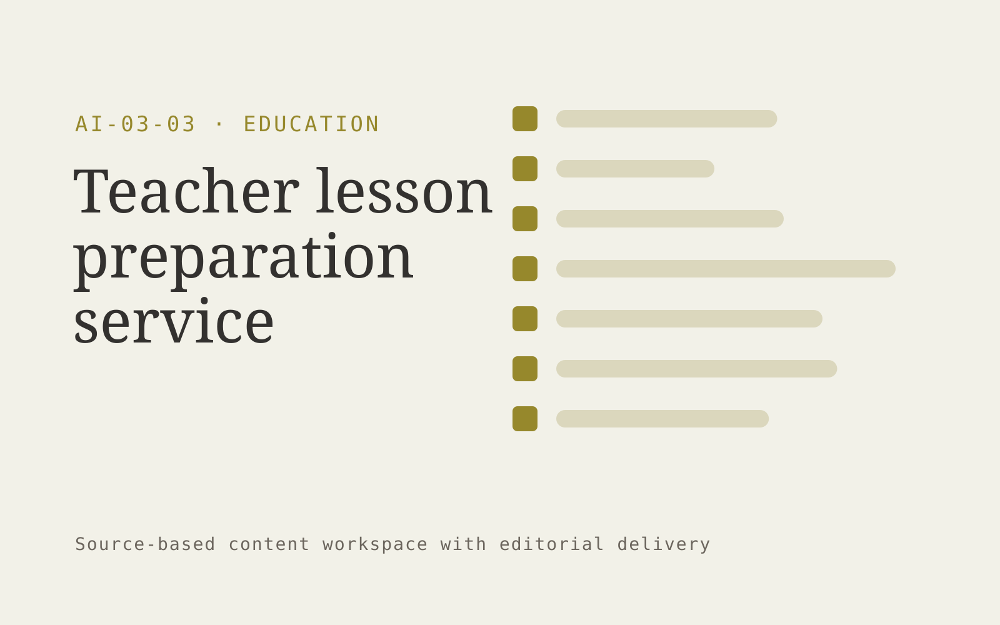

# Teacher lesson preparation service

**AI-03-03 · Education** · Also fits: Human Resources; Management; Writers

> For primary school curriculum coordinators, turn curriculum objectives, approved resources and class context into editable lesson plans and classroom materials. Address the recurring problem: teachers repeatedly adapt lessons to different classroom needs. The value hypothesis is a more complete, reviewable deliverable with less repeated preparation; the pilot must establish whether that benefit is real.

| | |
|---|---|
| **Buyer** | Primary school curriculum coordinators |
| **Problem** | Teachers repeatedly adapt lessons to different classroom needs. |
| **Format** | Source-based content workspace with editorial delivery |
| **USP** | Curriculum mapping remains visible while teachers adapt classroom activities. |

## The product
Key screens: Lesson planner, activity editor, curriculum map. Use a project list and editorial calendar beside a document editor. Keep original material and supporting passages in a collapsible side panel. Show outline, draft, review and approved stages. Provide tracked edits, comments, version comparisons and an export preview that reflects the final delivery format. In this product, the first view is lesson planner, followed by activity editor and curriculum map.

## Core functionality
1. Map learning objectives.
2. Draft lesson sequences.
3. Differentiate activities.
4. Prepare worksheets.
5. Check source alignment.
6. Export teaching packs.

## Customer workflow
Collect a structured brief and source material, identify unanswered questions, approve an outline, generate a draft, verify claims, gather reviewer edits, approve a final version and export the agreed formats. Start with curriculum objectives, approved resources and class context and finish with editable lesson plans and classroom materials.

## AI and human review
Extract and organize information, propose structure, draft prose and adapt approved content to audiences. Attach evidence to factual claims. Keep names, dates, amounts and quoted wording linked to their source. Editors resolve ambiguity and approve publication.

## Customer inputs
Curriculum objectives, approved resources and class context

## Customer deliverables
Editable lesson plans and classroom materials

## Accounts and administration
Client workspaces, source permissions, editorial assignments, change history, reviewer comments, approval gates, revision allowances and export templates.

## MVP scope
Begin with primary school curriculum coordinators and one recurring use case. Build the first two modules: map learning objectives; draft lesson sequences. Provide operator assistance for the third module: differentiate activities. Deliver editable lesson plans and classroom materials through a manual review queue. Perform other necessary full-scope functions manually during the pilot. Include all applicable access, accuracy and professional-review controls from the start.

## After MVP validation
After paid pilots establish value, automate the remaining modules: prepare worksheets; check source alignment; export teaching packs. Add one validated source integration, reusable customer configuration and recurring delivery. Expand to additional teams, document formats or languages only after testing the new scope.

## Build dependencies
Document parsing, a source-linked editor, tracked revisions, reviewer workflow and reliable document export. Rich presentation or print output needs format-specific QA.

## Integrations and data access
Learning resources, course portals and educator review processes. Document storage, word processor export, content management systems and approved publishing channels. Pilot with uploads and downloadable drafts before adding write integrations. These are candidate integration categories, not verified supported connectors.

## Defensibility
Customer-approved terminology, reusable structures, source libraries and editorial feedback tied to a specific audience and recurring publishing workflow. For this idea, build around curriculum mapping remains visible while teachers adapt classroom activities. This advantage requires execution and accumulated customer trust; the base model alone is not a defensible asset.

## Alternatives and positioning
Writers, editors, agencies, internal document templates and general-purpose chat tools. Differentiate on this specific proposed advantage: curriculum mapping remains visible while teachers adapt classroom activities. Test it against the buyer's current method on the same task. Competitor coverage and uniqueness have not been established.

## Revenue model and test pricing (USD)
Test USD 400-1,500 for a tightly scoped initial content package. Convert repeated work to a monthly retainer with explicit deliverable and revision limits. Specialist review and substantial research are separately scoped. Prices are hypotheses.

## Main delivery costs
Research and interview time, transcription, model usage, factual verification, subject-matter review, editing and revisions.

## Marketing message to test
> Teacher lesson preparation service for primary school curriculum coordinators. Curriculum mapping remains visible while teachers adapt classroom activities. Demonstrate the claim through a differentiated lesson pack for one objective.

## Acquisition channels
Teacher communities and school consultants

## Lead magnet
A differentiated lesson pack for one objective

## First 30 days of marketing
- Week 1: interview five prospective buyers in this segment: primary school curriculum coordinators. Ask to see a recent example of the problem and their current process.
- Week 2: prepare this demonstration using authorized or synthetic material: a differentiated lesson pack for one objective.
- Week 3: present it through teacher communities and school consultants and seek one narrowly scoped paid pilot.
- Week 4: review teacher editing time, curriculum alignment, total delivery effort and a concrete renewal decision before increasing scope.

## Paid pilot and validation
Complete one existing brief using the customer’s actual sources. Record reviewer edits, factual corrections and preparation time. Ask the same buyer to commission a second comparable deliverable. For this idea, use curriculum objectives, approved resources and class context and evaluate editable lesson plans and classroom materials. Agree success thresholds with the buyer before starting; collect a baseline for teacher editing time, curriculum alignment. A positive signal is payment and repeat use with acceptable quality and delivery cost, not a favorable demo reaction alone.

## Success metrics
Teacher editing time, curriculum alignment

## Retention and expansion
Maintain the approved source and voice library, schedule recurring editorial work, and expand into additional formats only after the core deliverable is repeatedly accepted.

## Operating controls and limitations
Use educator-reviewed content and answer keys. Apply appropriate access and consent for learner records and distinguish completion from demonstrated learning. Validate source access and reviewer availability during the pilot. Maintain customer-level access, data deletion controls and a record of final approvals.

## Brand style (concept)

- Colors: `#918327` primary · `#5481c9` accent · `#f1efe4` surface · `#22201e` ink
- Type: Manrope for headings, Manrope for text
- Voice: Encouraging, patient, precise
- Demo site: [https://nexibeo.com/ideas/teacher-lesson-preparation-service/demo/](https://nexibeo.com/ideas/teacher-lesson-preparation-service/demo/)

## Investment indication

Indicative build budget, from MVP to full product. This is a planning range, not a quote; it excludes running costs such as model usage, hosting and reviewer hours.

| Phase | Scope | Timeline | Indicative budget |
|---|---|---|---|
| MVP | One buyer segment, one recurring use case; first modules: map learning objectives; draft lesson sequences. Manual review in the loop. | 3 weeks | $5,500 |
| Paid pilot | Accounts, roles, review states, audit trail and the first integration, hardened for two to three paying pilot customers. | 4 weeks | $5,000 |
| Full product | Remaining modules: prepare worksheets; check source alignment; export teaching packs. Self-serve onboarding, billing, monitoring and the wider integration set. | 7 weeks | $7,000 |
| **Total** | | 14 weeks | **$17,500** |

**Co-create this project with us:** [contact Nexibeo](https://nexibeo.com/ideas/teacher-lesson-preparation-service/#apply) and we build it with you.

## Research status
Concept proposal expanded from the 315-idea conversation. Demand, pricing, differentiation, build scope and integration feasibility are hypotheses, not verified market findings. Category link is inspiration rather than evidence of business viability.

## Credits and next steps

- **Estimation and building this idea:** see the full idea page on [nexibeo.com](https://nexibeo.com/ideas/teacher-lesson-preparation-service/) for more detail on estimation, and to co-create and build this idea with Nexibeo.
- **Become an AI-optimized specialist for Education:** [Complete AI Training](https://completeaitraining.com/tag/education/?contentType=ai-certification).
- Field news: [AI news for Education](https://completeaitraining.com/all-ai-news-for-education/).
