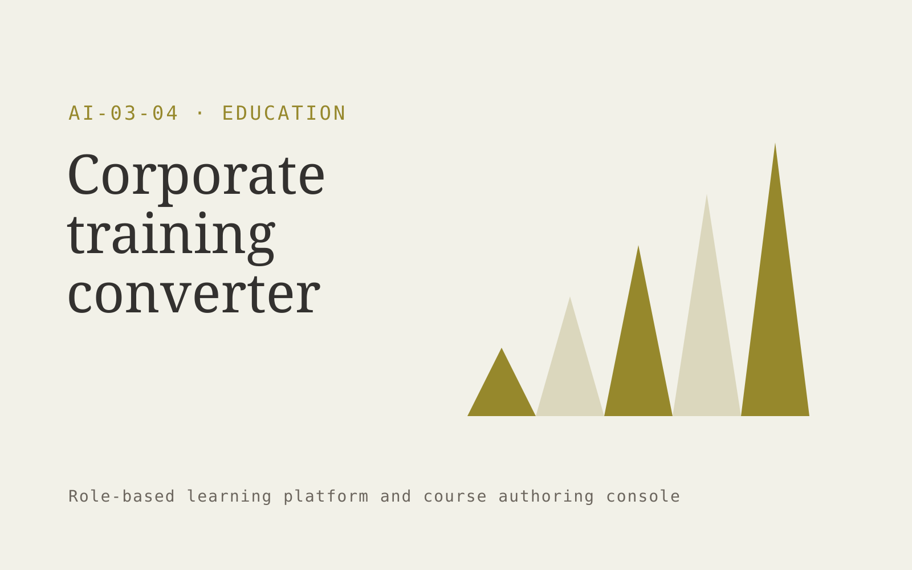

# Corporate training converter

**Education** · Also fits: Human Resources; Management

> For learning leads at multi-location service businesses, turn approved procedures, process recordings and role definitions into role-specific training modules and completion records. Address the recurring problem: procedures are available but rarely learned or applied. The value hypothesis is a more complete, reviewable deliverable with less repeated preparation; the pilot must establish whether that benefit is real.

| | |
|---|---|
| **Buyer** | Learning leads at multi-location service businesses |
| **Problem** | Procedures are available but rarely learned or applied. |
| **Format** | Role-based learning platform and course authoring console |
| **USP** | Training stays linked to the operating procedure it teaches. |

## The product
Key screens: Course builder, learner portal, competency dashboard. Provide a learner home with the next useful lesson, a practice activity and progress evidence. Give authors a source-linked course editor and assessment review queue. Supervisors see completed tasks and explicit sign-offs. Use short modules that work on mobile as well as desktop. In this product, the first view is course builder, followed by learner portal and competency dashboard.

## Core functionality
1. Break procedures into lessons.
2. Generate demonstrations.
3. Draft scenario questions.
4. Assign role paths.
5. Record completion.
6. Flag source changes.

## Customer workflow
Define learning objectives, map approved source material, review lessons and questions, assess the learner’s starting point, deliver targeted practice, collect evidence of competence, and update affected lessons when sources change. Start with approved procedures, process recordings and role definitions and finish with role-specific training modules and completion records.

## AI and human review
Draft lesson structure, examples, explanations and practice questions from approved material. Adapt practice using demonstrated responses. Educators validate answer keys and content. Completion status is distinct from demonstrated ability.

## Customer inputs
Approved procedures, process recordings and role definitions

## Customer deliverables
Role-specific training modules and completion records

## Accounts and administration
Learner enrollment, content versions, assessment review, role pathways, accessibility options, supervisor sign-off, progress records and source update alerts.

## MVP scope
Begin with learning leads at multi-location service businesses and one recurring use case. Build the first two modules: break procedures into lessons; generate demonstrations. Provide operator assistance for the third module: draft scenario questions. Deliver role-specific training modules and completion records through a manual review queue. Perform other necessary full-scope functions manually during the pilot. Include all applicable access, accuracy and professional-review controls from the start.

## After MVP validation
After paid pilots establish value, automate the remaining modules: assign role paths; record completion; flag source changes. Add one validated source integration, reusable customer configuration and recurring delivery. Expand to additional teams, document formats or languages only after testing the new scope.

## Build dependencies
Clear objectives, licensed or approved sources, validated assessments, learner state and source-change tracking. Media and accessibility requirements affect production effort.

## Integrations and data access
Learning resources, course portals and educator review processes. Learning portals, employee or member directories and completion exports. Validate standards and identity requirements before promising native LMS compatibility. These are candidate integration categories, not verified supported connectors.

## Defensibility
A reviewed niche curriculum, realistic practice tasks and evidence of useful learning outcomes in a defined role. For this idea, build around training stays linked to the operating procedure it teaches. This advantage requires execution and accumulated customer trust; the base model alone is not a defensible asset.

## Alternatives and positioning
Courses, internal trainers, learning management systems and static training documents. Differentiate on this specific proposed advantage: training stays linked to the operating procedure it teaches. Test it against the buyer's current method on the same task. Competitor coverage and uniqueness have not been established.

## Revenue model and test pricing (USD)
Test USD 750-3,000 for one custom learning pathway, then USD 10-40 per active learner monthly with a minimum account fee. Public memberships may use lower fixed subscriptions. Prices are experiments, not benchmarks.

## Main delivery costs
Instructional design, subject review, media production, assessment validation, learner support and content refreshes.

## Marketing message to test
> Corporate training converter for learning leads at multi-location service businesses. Training stays linked to the operating procedure it teaches. Demonstrate the claim through one procedure converted into a complete learning module.

## Acquisition channels
Operations consultants and training agencies

## Lead magnet
One procedure converted into a complete learning module

## First 30 days of marketing
- Week 1: interview five prospective buyers in this segment: learning leads at multi-location service businesses. Ask to see a recent example of the problem and their current process.
- Week 2: prepare this demonstration using authorized or synthetic material: one procedure converted into a complete learning module.
- Week 3: present it through operations consultants and training agencies and seek one narrowly scoped paid pilot.
- Week 4: review time to proficiency, reviewed assessment performance, total delivery effort and a concrete renewal decision before increasing scope.

## Paid pilot and validation
Teach one important task to a small cohort. Compare performance before and after on different examples, gather educator review and check whether learners can apply the skill outside the lesson. For this idea, use approved procedures, process recordings and role definitions and evaluate role-specific training modules and completion records. Agree success thresholds with the buyer before starting; collect a baseline for time to proficiency, reviewed assessment performance. A positive signal is payment and repeat use with acceptable quality and delivery cost, not a favorable demo reaction alone.

## Success metrics
Time to proficiency, reviewed assessment performance

## Retention and expansion
Refresh lessons when their source changes, add task-specific practice and review real application of the learning. Expand into adjacent roles after proving usefulness.

## Operating controls and limitations
Use educator-reviewed content and answer keys. Apply appropriate access and consent for learner records and distinguish completion from demonstrated learning. Validate source access and reviewer availability during the pilot. Maintain customer-level access, data deletion controls and a record of final approvals.

## Brand style (concept)

- Colors: `#8f9127` primary · `#5464c9` accent · `#f1f1e4` surface · `#22201e` ink
- Type: Manrope for headings, Manrope for text
- Voice: Encouraging, patient, precise
- Demo site: [https://nexibeo.com/ideas/corporate-training-converter/demo/](https://nexibeo.com/ideas/corporate-training-converter/demo/)

## Investment indication

Indicative build budget, from MVP to full product. This is a planning range, not a quote; it excludes running costs such as model usage, hosting and reviewer hours. Built with Nexibeo's AI software development factory, most implementations take days to a few weeks of creation time, depending on availability.

| Phase | Scope | Creation time | Indicative budget |
|---|---|---|---|
| MVP | One buyer segment, one recurring use case; first modules: break procedures into lessons; generate demonstrations. Manual review in the loop. | 6 days | $10,500 |
| Paid pilot | Accounts, roles, review states, audit trail and the first integration, hardened for two to three paying pilot customers. | 7 days | $13,500 |
| Full product | Remaining modules: assign role paths; record completion; flag source changes. Self-serve onboarding, billing, monitoring and the wider integration set. | 3 weeks | $18,500 |
| **Total** | | about 5 weeks | **$42,500** |

### Running costs per month (rough indication, untested)

| Stage | Hosting and infrastructure | AI usage | Total per month |
|---|---|---|---|
| MVP and paid pilot (about 3 customers) | $30–$60 | $50–$110 | **$80–$170** |
| Full product (about 50 customers) | $110–$210 | $420–$840 | **$530–$1,050** |

**Co-create this project with us:** [contact Nexibeo](https://nexibeo.com/ideas/corporate-training-converter/#apply) and we build it with you.

## Research status
Concept proposal expanded from the 315-idea conversation. Demand, pricing, differentiation, build scope and integration feasibility are hypotheses, not verified market findings. Category link is inspiration rather than evidence of business viability.

## Credits and next steps

- **Estimation and building this idea:** see the full idea page on [nexibeo.com](https://nexibeo.com/ideas/corporate-training-converter/) for more detail on estimation, and to co-create and build this idea with Nexibeo.
- **Become an AI-optimized specialist for Education:** [Complete AI Training](https://completeaitraining.com/tag/education/?contentType=ai-certification).
- Field news: [AI news for Education](https://completeaitraining.com/all-ai-news-for-education/).
