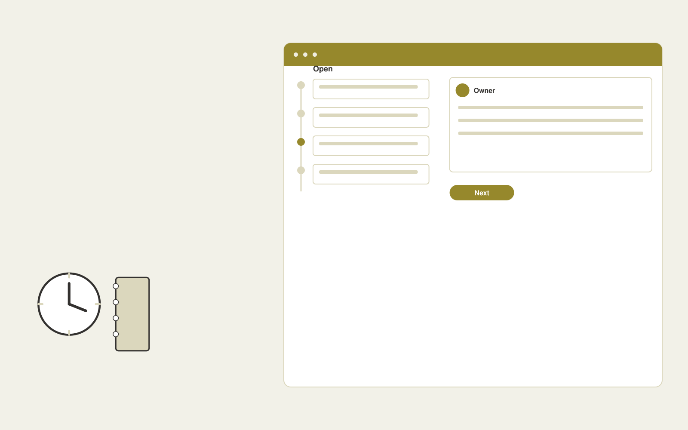

# Tutor administration assistant

**Education** · Also fits: Human Resources; Management

> For independent tutoring agencies, turn session notes, learning goals and homework templates into lesson summaries and approved progress communications. Address the recurring problem: tutors spend unpaid time on repetitive lesson administration. The value hypothesis is a more complete, reviewable deliverable with less repeated preparation; the pilot must establish whether that benefit is real.

| | |
|---|---|
| **Buyer** | Independent tutoring agencies |
| **Problem** | Tutors spend unpaid time on repetitive lesson administration. |
| **Format** | Operational coordination portal |
| **USP** | Lesson administration follows each learner's actual goals and recent work. |

## The product
Key screens: Student workspace, lesson summary, parent updates. Use a queue or timeline as the opening view, with clear owners, dates and current states. Each case opens into its source context, proposed actions and discussion. Give external participants a limited form or status page. Make the next required action visible without opening every record. In this product, the first view is student workspace, followed by lesson summary and parent updates.

## Core functionality
1. Structure session notes.
2. Draft homework.
3. Track commitments.
4. Prepare progress summaries.
5. Schedule reminders.
6. Approve parent messages.

## Customer workflow
Create a case from approved inputs, identify required actions, confirm owners and dates, request missing information, approve proposed communications or changes, track completion, and retain a handover record. Start with session notes, learning goals and homework templates and finish with lesson summaries and approved progress communications.

## AI and human review
Extract candidate actions and relevant context, classify requests and draft communications. Use explicit rules for scheduling, state transitions and permissions. People confirm obligations and approve consequential actions before execution.

## Customer inputs
Session notes, learning goals and homework templates

## Customer deliverables
Lesson summaries and approved progress communications

## Accounts and administration
Role permissions, task ownership, deadlines, reminders, approval gates, exception handling, action history, duplicate prevention and reversible configuration.

## MVP scope
Begin with independent tutoring agencies and one recurring use case. Build the first two modules: structure session notes; draft homework. Provide operator assistance for the third module: track commitments. Deliver lesson summaries and approved progress communications through a manual review queue. Perform other necessary full-scope functions manually during the pilot. Include all applicable access, accuracy and professional-review controls from the start.

## After MVP validation
After paid pilots establish value, automate the remaining modules: prepare progress summaries; schedule reminders; approve parent messages. Add one validated source integration, reusable customer configuration and recurring delivery. Expand to additional teams, document formats or languages only after testing the new scope.

## Build dependencies
Explicit state definitions, owner mapping, approval rules, idempotent actions, notifications and recovery procedures. Workflow reliability matters more than fluent text.

## Integrations and data access
Learning resources, course portals and educator review processes. Calendars, email, task managers and relevant business records. Use draft actions and supervised handoffs first, then enable only specifically authorized writes. These are candidate integration categories, not verified supported connectors.

## Defensibility
Customer-specific workflow rules, reliable handoffs, operational history and integrations that make the service part of daily work. For this idea, build around lesson administration follows each learner's actual goals and recent work. This advantage requires execution and accumulated customer trust; the base model alone is not a defensible asset.

## Alternatives and positioning
Shared inboxes, spreadsheets, task boards and existing workflow automation products. Differentiate on this specific proposed advantage: lesson administration follows each learner's actual goals and recent work. Test it against the buyer's current method on the same task. Competitor coverage and uniqueness have not been established.

## Revenue model and test pricing (USD)
Test USD 750-2,500 setup plus USD 200-800 monthly for one bounded workflow and team. Cap case volume and implementation scope. Larger operational integrations need separate quotes. Prices are hypotheses.

## Main delivery costs
Workflow configuration, integration maintenance, model calls, notification delivery, exception support and monitoring.

## Marketing message to test
> Tutor administration assistant for independent tutoring agencies. Lesson administration follows each learner's actual goals and recent work. Demonstrate the claim through a complete post-lesson administration example.

## Acquisition channels
Tutor associations and practice management partners

## Lead magnet
A complete post-lesson administration example

## First 30 days of marketing
- Week 1: interview five prospective buyers in this segment: independent tutoring agencies. Ask to see a recent example of the problem and their current process.
- Week 2: prepare this demonstration using authorized or synthetic material: a complete post-lesson administration example.
- Week 3: present it through tutor associations and practice management partners and seek one narrowly scoped paid pilot.
- Week 4: review administration minutes, tutor retention, total delivery effort and a concrete renewal decision before increasing scope.

## Paid pilot and validation
Run one recurring workflow with a small team. Track every handoff and exception, verify completed actions, and compare handling time and missed commitments with the prior process. For this idea, use session notes, learning goals and homework templates and evaluate lesson summaries and approved progress communications. Agree success thresholds with the buyer before starting; collect a baseline for administration minutes, tutor retention. A positive signal is payment and repeat use with acceptable quality and delivery cost, not a favorable demo reaction alone.

## Success metrics
Administration minutes, tutor retention

## Retention and expansion
Report completed actions and recurring exceptions. Maintain the workflow as policies change, then add one adjacent handoff with clear ownership.

## Operating controls and limitations
Use educator-reviewed content and answer keys. Apply appropriate access and consent for learner records and distinguish completion from demonstrated learning. Validate source access and reviewer availability during the pilot. Maintain customer-level access, data deletion controls and a record of final approvals.

## Brand style (concept)

- Colors: `#916e27` primary · `#5466c9` accent · `#f1ede4` surface · `#22201e` ink
- Type: Manrope for headings, Manrope for text
- Voice: Encouraging, patient, precise
- Demo site: [https://nexibeo.com/solutions/tutor-administration-assistant/demo/](https://nexibeo.com/solutions/tutor-administration-assistant/demo/)

## Investment indication

Indicative build budget, from MVP to full product. This is a planning range, not a quote; it excludes running costs such as model usage, hosting and reviewer hours. Built with Nexibeo's AI software development factory, most implementations take days to a few weeks of creation time, depending on availability.

| Phase | Scope | Creation time | Indicative budget |
|---|---|---|---|
| MVP | One buyer segment, one recurring use case; first modules: structure session notes; draft homework. Manual review in the loop. | 3 days | $6,000 |
| Paid pilot | Accounts, roles, review states, audit trail and the first integration, hardened for two to three paying pilot customers. | 4 days | $6,000 |
| Full product | Remaining modules: prepare progress summaries; schedule reminders; approve parent messages. Self-serve onboarding, billing, monitoring and the wider integration set. | 6 days | $8,000 |
| **Total** | | about 3 weeks | **$20,000** |

### Running costs per month (rough indication, untested)

| Stage | Hosting and infrastructure | AI usage | Total per month |
|---|---|---|---|
| MVP and paid pilot (about 3 customers) | $30–$60 | $40–$90 | **$70–$150** |
| Full product (about 50 customers) | $110–$210 | $280–$560 | **$390–$770** |

**Get this built:** [contact Nexibeo](https://nexibeo.com/solutions/tutor-administration-assistant/#apply). We build it with our AI software factory, usually in days to a few weeks, for you to run internally or offer to your clients.

## Research status
Concept proposal expanded from the 315-idea conversation. Demand, pricing, differentiation, build scope and integration feasibility are hypotheses, not verified market findings. Category link is inspiration rather than evidence of business viability.

## Credits and next steps

- **Estimation and having it built:** see the full solution page on [nexibeo.com](https://nexibeo.com/solutions/tutor-administration-assistant/) for more detail on estimation. Nexibeo builds it for you as a custom AI implementation, to run internally or to offer to your own clients.
- **Become an AI-optimized specialist for Education:** [Complete AI Training](https://completeaitraining.com/tag/education/?contentType=ai-certification).
- Field news: [AI news for Education](https://completeaitraining.com/all-ai-news-for-education/).
