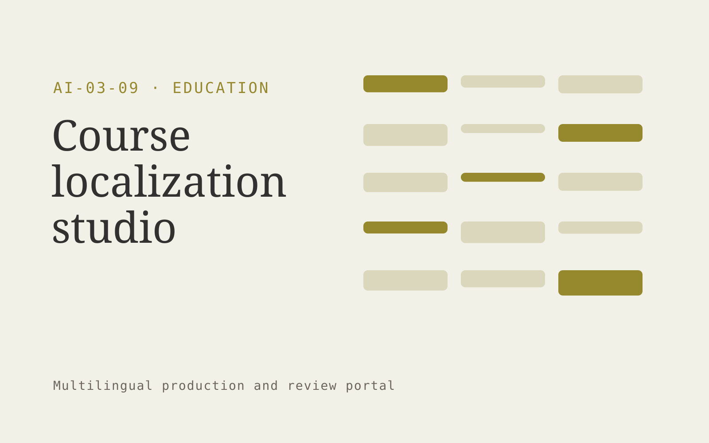

# Course localization studio

**Education** · Also fits: Human Resources; Management; PR and Communications

> For online course publishers expanding internationally, turn licensed course content, glossaries and regional requirements into localized course package and terminology guide. Address the recurring problem: literal translations miss examples and cultural context. The value hypothesis is a more complete, reviewable deliverable with less repeated preparation; the pilot must establish whether that benefit is real.

| | |
|---|---|
| **Buyer** | Online course publishers expanding internationally |
| **Problem** | Literal translations miss examples and cultural context. |
| **Format** | Multilingual production and review portal |
| **USP** | One coordinated localization process across lessons, assessments and media. |

## The product
Key screens: Course map, bilingual editor, locale review. Use aligned source and target language panes with shared terminology highlights. Include a language status grid, reviewer assignment queue, and layout or timeline preview. Show unresolved ambiguities next to the affected passage. Keep approvals separate for each language and version. In this product, the first view is course map, followed by bilingual editor and locale review.

## Core functionality
1. Translate lesson content.
2. Adapt examples.
3. Localize quizzes.
4. Align subtitles.
5. Check terminology.
6. Manage regional approvals.

## Customer workflow
Upload authorized source content, confirm target languages and terminology, create translation drafts, assign qualified reviewers, reconcile source changes, check layout or timing, and deliver approved language versions. Start with licensed course content, glossaries and regional requirements and finish with localized course package and terminology guide.

## AI and human review
Draft translations, transcribe media when applicable, suggest terminology and detect inconsistencies. Deterministic checks compare dates, numbers and identifiers. Qualified language reviewers decide idiomatic phrasing and specialist meaning. Voice work requires explicit permissions for the intended use.

## Customer inputs
Licensed course content, glossaries and regional requirements

## Customer deliverables
Localized course package and terminology guide

## Accounts and administration
Language permissions, glossary versions, reviewer assignments, segment comments, source-change alerts, per-language approvals and delivery history.

## MVP scope
Begin with online course publishers expanding internationally and one recurring use case. Build the first two modules: translate lesson content; adapt examples. Provide operator assistance for the third module: localize quizzes. Deliver localized course package and terminology guide through a manual review queue. Perform other necessary full-scope functions manually during the pilot. Include all applicable access, accuracy and professional-review controls from the start.

## After MVP validation
After paid pilots establish value, automate the remaining modules: align subtitles; check terminology; manage regional approvals. Add one validated source integration, reusable customer configuration and recurring delivery. Expand to additional teams, document formats or languages only after testing the new scope.

## Build dependencies
Segment alignment, glossary enforcement, multilingual text handling, comparison views and qualified reviewers. Media projects also need timing and audio/video QA.

## Integrations and data access
Learning resources, course portals and educator review processes. Document formats, subtitle formats, media storage and publishing systems. Confirm language, font and layout support for each requested output. These are candidate integration categories, not verified supported connectors.

## Defensibility
Customer-controlled approved terminology, reviewed translation examples and dependable specialist reviewer relationships. For this idea, build around one coordinated localization process across lessons, assessments and media. This advantage requires execution and accumulated customer trust; the base model alone is not a defensible asset.

## Alternatives and positioning
Translation agencies, freelance linguists, generic machine translation and internal bilingual staff. Differentiate on this specific proposed advantage: one coordinated localization process across lessons, assessments and media. Test it against the buyer's current method on the same task. Competitor coverage and uniqueness have not been established.

## Revenue model and test pricing (USD)
Quote an initial USD 300-1,200 batch for a defined word count or media duration and one target language. Charge separately for extra languages, specialist review and dubbing. Test recurring volume agreements after the pilot; prices are hypotheses.

## Main delivery costs
Source preparation, translation volume, transcription or dubbing, qualified reviewers, glossary maintenance and changed-source rework.

## Marketing message to test
> Course localization studio for online course publishers expanding internationally. One coordinated localization process across lessons, assessments and media. Demonstrate the claim through a localized lesson plus assessment sample.

## Acquisition channels
Course production agencies

## Lead magnet
A localized lesson plus assessment sample

## First 30 days of marketing
- Week 1: interview five prospective buyers in this segment: online course publishers expanding internationally. Ask to see a recent example of the problem and their current process.
- Week 2: prepare this demonstration using authorized or synthetic material: a localized lesson plus assessment sample.
- Week 3: present it through course production agencies and seek one narrowly scoped paid pilot.
- Week 4: review native reviewer acceptance, learner comprehension, total delivery effort and a concrete renewal decision before increasing scope.

## Paid pilot and validation
Translate a representative sample and have an independent qualified reviewer assess it. Include a source revision to measure update handling. Track corrections, meaning preservation and total delivery effort. For this idea, use licensed course content, glossaries and regional requirements and evaluate localized course package and terminology guide. Agree success thresholds with the buyer before starting; collect a baseline for native reviewer acceptance, learner comprehension. A positive signal is payment and repeat use with acceptable quality and delivery cost, not a favorable demo reaction alone.

## Success metrics
Native reviewer acceptance, learner comprehension

## Retention and expansion
Maintain approved terminology and reviewer continuity. Charge for ongoing source updates and add languages only when the buyer has a real publishing need.

## Operating controls and limitations
Use educator-reviewed content and answer keys. Apply appropriate access and consent for learner records and distinguish completion from demonstrated learning. Validate source access and reviewer availability during the pilot. Maintain customer-level access, data deletion controls and a record of final approvals.

## Brand style (concept)

- Colors: `#918d27` primary · `#5476c9` accent · `#f1f0e4` surface · `#22201e` ink
- Type: Manrope for headings, Manrope for text
- Voice: Encouraging, patient, precise
- Demo site: [https://nexibeo.com/ideas/course-localization-studio/demo/](https://nexibeo.com/ideas/course-localization-studio/demo/)

## Investment indication

Indicative build budget, from MVP to full product. This is a planning range, not a quote; it excludes running costs such as model usage, hosting and reviewer hours. Built with Nexibeo's AI software development factory, most implementations take days to a few weeks of creation time, depending on availability.

| Phase | Scope | Creation time | Indicative budget |
|---|---|---|---|
| MVP | One buyer segment, one recurring use case; first modules: translate lesson content; adapt examples. Manual review in the loop. | 5 days | $9,500 |
| Paid pilot | Accounts, roles, review states, audit trail and the first integration, hardened for two to three paying pilot customers. | 6 days | $11,500 |
| Full product | Remaining modules: align subtitles; check terminology; manage regional approvals. Self-serve onboarding, billing, monitoring and the wider integration set. | 2 weeks | $16,000 |
| **Total** | | about 4 weeks | **$37,000** |

### Running costs per month (rough indication, untested)

| Stage | Hosting and infrastructure | AI usage | Total per month |
|---|---|---|---|
| MVP and paid pilot (about 3 customers) | $40–$80 | $100–$200 | **$140–$280** |
| Full product (about 50 customers) | $160–$320 | $1,230–$2,450 | **$1,390–$2,770** |

**Co-create this project with us:** [contact Nexibeo](https://nexibeo.com/ideas/course-localization-studio/#apply) and we build it with you.

## Research status
Concept proposal expanded from the 315-idea conversation. Demand, pricing, differentiation, build scope and integration feasibility are hypotheses, not verified market findings. Category link is inspiration rather than evidence of business viability.

## Credits and next steps

- **Estimation and building this idea:** see the full idea page on [nexibeo.com](https://nexibeo.com/ideas/course-localization-studio/) for more detail on estimation, and to co-create and build this idea with Nexibeo.
- **Become an AI-optimized specialist for Education:** [Complete AI Training](https://completeaitraining.com/tag/education/?contentType=ai-certification).
- Field news: [AI news for Education](https://completeaitraining.com/all-ai-news-for-education/).
