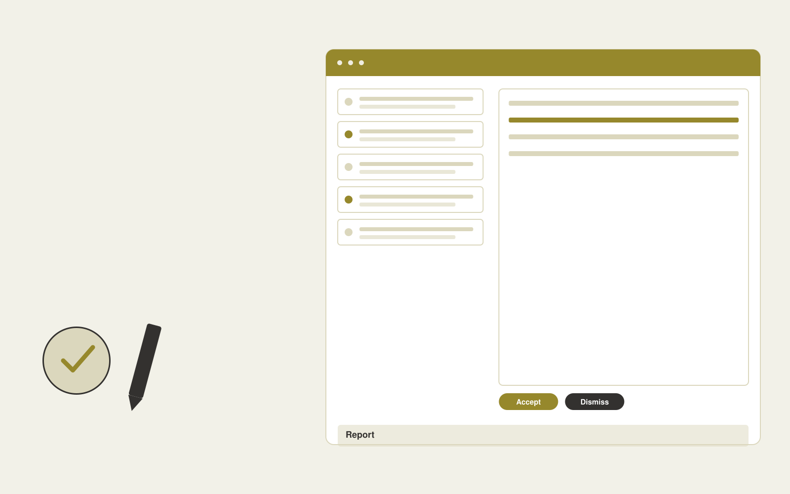

# Assessment feedback assistant

**Education** · Also fits: Human Resources; Management; Operations

> For teachers marking rubric-based writing assignments, turn student submissions, assessment rubrics and exemplar feedback into teacher-approved feedback with evidence references. Address the recurring problem: useful feedback takes longer than assigning a grade. The value hypothesis is a more complete, reviewable deliverable with less repeated preparation; the pilot must establish whether that benefit is real.

| | |
|---|---|
| **Buyer** | Teachers marking rubric-based writing assignments |
| **Problem** | Useful feedback takes longer than assigning a grade. |
| **Format** | Evidence review and quality assurance workspace |
| **USP** | Feedback grounded in the teacher's rubric with grading retained by the teacher. |

## The product
Key screens: Submission queue, rubric evidence, feedback editor. Open on a review queue ordered by reviewer-selected priorities. Show each finding beside the original evidence and applicable rule. Provide accept, dismiss and needs-information controls with reasons. A separate report view summarizes confirmed findings and unresolved items, not raw AI flags. In this product, the first view is submission queue, followed by rubric evidence and feedback editor.

## Core functionality
1. Map evidence to criteria.
2. Draft actionable comments.
3. Identify missing reasoning.
4. Compare exemplar standards.
5. Let teachers revise judgments.
6. Export approved feedback.

## Customer workflow
Agree review criteria, ingest a sample, generate candidate findings, inspect supporting evidence, let reviewers confirm or dismiss each item, assign corrections, and recheck the affected material. Start with student submissions, assessment rubrics and exemplar feedback and finish with teacher-approved feedback with evidence references.

## AI and human review
Propose possible inconsistencies, omissions and rubric matches. Combine extraction with deterministic checks where rules are explicit. Reviewers make the final judgment. Keep false positives and missed cases visible during evaluation.

## Customer inputs
Student submissions, assessment rubrics and exemplar feedback

## Customer deliverables
Teacher-approved feedback with evidence references

## Accounts and administration
Versioned review criteria, evidence links, reviewer decisions, disagreement handling, correction assignments, recheck status and exportable review history.

## MVP scope
Begin with teachers marking rubric-based writing assignments and one recurring use case. Build the first two modules: map evidence to criteria; draft actionable comments. Provide operator assistance for the third module: identify missing reasoning. Deliver teacher-approved feedback with evidence references through a manual review queue. Perform other necessary full-scope functions manually during the pilot. Include all applicable access, accuracy and professional-review controls from the start.

## After MVP validation
After paid pilots establish value, automate the remaining modules: compare exemplar standards; let teachers revise judgments; export approved feedback. Add one validated source integration, reusable customer configuration and recurring delivery. Expand to additional teams, document formats or languages only after testing the new scope.

## Build dependencies
Evidence coordinates, versioned rules, reviewer decisions and a representative reference set. Measure misses as well as confirmed findings before scaling.

## Integrations and data access
Learning resources, course portals and educator review processes. Source repositories, task trackers and report exports. Keep findings as review proposals until authorized owners accept the resulting actions. These are candidate integration categories, not verified supported connectors.

## Defensibility
A domain-specific review rubric and rights-cleared examples of confirmed defects, false alarms and reviewer reasoning. For this idea, build around feedback grounded in the teacher's rubric with grading retained by the teacher. This advantage requires execution and accumulated customer trust; the base model alone is not a defensible asset.

## Alternatives and positioning
Manual reviewers, checklists, generic scanning tools and specialist audit services. Differentiate on this specific proposed advantage: feedback grounded in the teacher's rubric with grading retained by the teacher. Test it against the buyer's current method on the same task. Competitor coverage and uniqueness have not been established.

## Revenue model and test pricing (USD)
Test USD 500-2,000 for a defined audit sample and report. Offer recurring review priced by reviewed items and specialist hours. Software-only access can follow a reliable reviewed service. All prices require validation.

## Main delivery costs
Document or media processing, model evaluation, expert review, false-positive handling, rechecks and customer-specific rubric calibration.

## Marketing message to test
> Assessment feedback assistant for teachers marking rubric-based writing assignments. Feedback grounded in the teacher's rubric with grading retained by the teacher. Demonstrate the claim through a rubric-aligned feedback demonstration.

## Acquisition channels
Teacher subject associations

## Lead magnet
A rubric-aligned feedback demonstration

## First 30 days of marketing
- Week 1: interview five prospective buyers in this segment: teachers marking rubric-based writing assignments. Ask to see a recent example of the problem and their current process.
- Week 2: prepare this demonstration using authorized or synthetic material: a rubric-aligned feedback demonstration.
- Week 3: present it through teacher subject associations and seek one narrowly scoped paid pilot.
- Week 4: review teacher editing time, rubric agreement, total delivery effort and a concrete renewal decision before increasing scope.

## Paid pilot and validation
Have a qualified reviewer independently assess the same sample. Compare confirmed findings, false alarms and omissions. Repeat on unseen material before agreeing recurring volume. For this idea, use student submissions, assessment rubrics and exemplar feedback and evaluate teacher-approved feedback with evidence references. Agree success thresholds with the buyer before starting; collect a baseline for teacher editing time, rubric agreement. A positive signal is payment and repeat use with acceptable quality and delivery cost, not a favorable demo reaction alone.

## Success metrics
Teacher editing time, rubric agreement

## Retention and expansion
Offer recurring reviews and rechecks of previously confirmed issues. Expand document or case types after validating the new rubric with qualified reviewers.

## Operating controls and limitations
Use educator-reviewed content and answer keys. Apply appropriate access and consent for learner records and distinguish completion from demonstrated learning. Validate source access and reviewer availability during the pilot. Maintain customer-level access, data deletion controls and a record of final approvals.

## Brand style (concept)

- Colors: `#8c9127` primary · `#7054c9` accent · `#f0f1e4` surface · `#22201e` ink
- Type: Archivo for headings, Lora for text
- Voice: Encouraging, patient, precise
- Demo site: [https://nexibeo.com/ideas/assessment-feedback-assistant/demo/](https://nexibeo.com/ideas/assessment-feedback-assistant/demo/)

## Investment indication

Indicative build budget, from MVP to full product. This is a planning range, not a quote; it excludes running costs such as model usage, hosting and reviewer hours.

| Phase | Scope | Timeline | Indicative budget |
|---|---|---|---|
| MVP | One buyer segment, one recurring use case; first modules: map evidence to criteria; draft actionable comments. Manual review in the loop. | 3 weeks | $5,000 |
| Paid pilot | Accounts, roles, review states, audit trail and the first integration, hardened for two to three paying pilot customers. | 4 weeks | $4,500 |
| Full product | Remaining modules: compare exemplar standards; let teachers revise judgments; export approved feedback. Self-serve onboarding, billing, monitoring and the wider integration set. | 6 weeks | $6,500 |
| **Total** | | 13 weeks | **$16,000** |

### Running costs per month (rough indication, untested)

| Stage | Hosting and infrastructure | AI usage | Total per month |
|---|---|---|---|
| MVP and paid pilot (about 3 customers) | $30–$60 | $80–$160 | **$110–$220** |
| Full product (about 50 customers) | $110–$210 | $880–$1,750 | **$990–$1,960** |

**Co-create this project with us:** [contact Nexibeo](https://nexibeo.com/ideas/assessment-feedback-assistant/#apply) and we build it with you.

## Research status
Concept proposal expanded from the 315-idea conversation. Demand, pricing, differentiation, build scope and integration feasibility are hypotheses, not verified market findings. Category link is inspiration rather than evidence of business viability.

## Credits and next steps

- **Estimation and building this idea:** see the full idea page on [nexibeo.com](https://nexibeo.com/ideas/assessment-feedback-assistant/) for more detail on estimation, and to co-create and build this idea with Nexibeo.
- **Become an AI-optimized specialist for Education:** [Complete AI Training](https://completeaitraining.com/tag/education/?contentType=ai-certification).
- Field news: [AI news for Education](https://completeaitraining.com/all-ai-news-for-education/).
