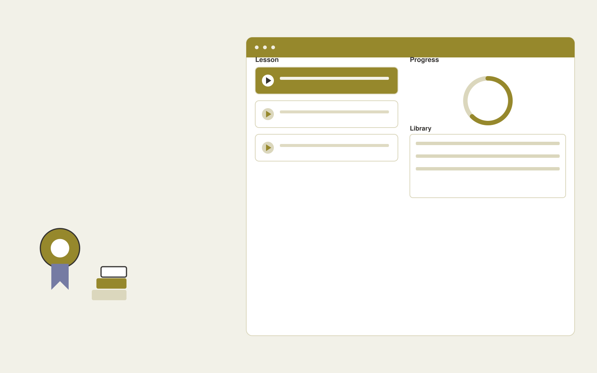

# Professional development membership

**Education** · Also fits: Human Resources; Management

> For professional associations serving small practice owners, turn profession-specific workflows and approved training examples into training membership and reusable workflow library. Address the recurring problem: members struggle to turn AI news into practical skills. The value hypothesis is a more complete, reviewable deliverable with less repeated preparation; the pilot must establish whether that benefit is real.

| | |
|---|---|
| **Buyer** | Professional associations serving small practice owners |
| **Problem** | Members struggle to turn AI news into practical skills. |
| **Format** | Role-based learning platform and course authoring console |
| **USP** | Practical tasks tailored to one profession with recurring implementation support. |

## The product
Key screens: Learning feed, practice lab, member library. Provide a learner home with the next useful lesson, a practice activity and progress evidence. Give authors a source-linked course editor and assessment review queue. Supervisors see completed tasks and explicit sign-offs. Use short modules that work on mobile as well as desktop. In this product, the first view is learning feed, followed by practice lab and member library.

## Core functionality
1. Publish short lessons.
2. Provide practice datasets.
3. Run live clinics.
4. Assess completed tasks.
5. Update workflows.
6. Track member goals.

## Customer workflow
Define learning objectives, map approved source material, review lessons and questions, assess the learner’s starting point, deliver targeted practice, collect evidence of competence, and update affected lessons when sources change. Start with profession-specific workflows and approved training examples and finish with training membership and reusable workflow library.

## AI and human review
Draft lesson structure, examples, explanations and practice questions from approved material. Adapt practice using demonstrated responses. Educators validate answer keys and content. Completion status is distinct from demonstrated ability.

## Customer inputs
Profession-specific workflows and approved training examples

## Customer deliverables
Training membership and reusable workflow library

## Accounts and administration
Learner enrollment, content versions, assessment review, role pathways, accessibility options, supervisor sign-off, progress records and source update alerts.

## MVP scope
Begin with professional associations serving small practice owners and one recurring use case. Build the first two modules: publish short lessons; provide practice datasets. Provide operator assistance for the third module: run live clinics. Deliver training membership and reusable workflow library through a manual review queue. Perform other necessary full-scope functions manually during the pilot. Include all applicable access, accuracy and professional-review controls from the start.

## After MVP validation
After paid pilots establish value, automate the remaining modules: assess completed tasks; update workflows; track member goals. Add one validated source integration, reusable customer configuration and recurring delivery. Expand to additional teams, document formats or languages only after testing the new scope.

## Build dependencies
Clear objectives, licensed or approved sources, validated assessments, learner state and source-change tracking. Media and accessibility requirements affect production effort.

## Integrations and data access
Learning resources, course portals and educator review processes. Learning portals, employee or member directories and completion exports. Validate standards and identity requirements before promising native LMS compatibility. These are candidate integration categories, not verified supported connectors.

## Defensibility
A reviewed niche curriculum, realistic practice tasks and evidence of useful learning outcomes in a defined role. For this idea, build around practical tasks tailored to one profession with recurring implementation support. This advantage requires execution and accumulated customer trust; the base model alone is not a defensible asset.

## Alternatives and positioning
Courses, internal trainers, learning management systems and static training documents. Differentiate on this specific proposed advantage: practical tasks tailored to one profession with recurring implementation support. Test it against the buyer's current method on the same task. Competitor coverage and uniqueness have not been established.

## Revenue model and test pricing (USD)
Test USD 29-79 per member monthly for one profession, with task-based lessons and limited group clinics. Offer association licenses separately. Measure active use and renewal before expanding the content library. Prices are hypotheses.

## Main delivery costs
Instructional design, subject review, media production, assessment validation, learner support and content refreshes.

## Marketing message to test
> Professional development membership for professional associations serving small practice owners. Practical tasks tailored to one profession with recurring implementation support. Demonstrate the claim through a free workflow workshop with a usable output.

## Acquisition channels
Professional associations and niche newsletters

## Lead magnet
A free workflow workshop with a usable output

## First 30 days of marketing
- Week 1: interview five prospective buyers in this segment: professional associations serving small practice owners. Ask to see a recent example of the problem and their current process.
- Week 2: prepare this demonstration using authorized or synthetic material: a free workflow workshop with a usable output.
- Week 3: present it through professional associations and niche newsletters and seek one narrowly scoped paid pilot.
- Week 4: review paid member retention, completed workplace applications, total delivery effort and a concrete renewal decision before increasing scope.

## Paid pilot and validation
Teach one important task to a small cohort. Compare performance before and after on different examples, gather educator review and check whether learners can apply the skill outside the lesson. For this idea, use profession-specific workflows and approved training examples and evaluate training membership and reusable workflow library. Agree success thresholds with the buyer before starting; collect a baseline for paid member retention, completed workplace applications. A positive signal is payment and repeat use with acceptable quality and delivery cost, not a favorable demo reaction alone.

## Success metrics
Paid member retention, completed workplace applications

## Retention and expansion
Refresh lessons when their source changes, add task-specific practice and review real application of the learning. Expand into adjacent roles after proving usefulness.

## Operating controls and limitations
Use educator-reviewed content and answer keys. Apply appropriate access and consent for learner records and distinguish completion from demonstrated learning. Validate source access and reviewer availability during the pilot. Maintain customer-level access, data deletion controls and a record of final approvals.

## Brand style (concept)

- Colors: `#917c27` primary · `#6054c9` accent · `#f1eee4` surface · `#22201e` ink
- Type: Archivo for headings, Lora for text
- Voice: Encouraging, patient, precise
- Demo site: [https://nexibeo.com/ideas/professional-development-membership/demo/](https://nexibeo.com/ideas/professional-development-membership/demo/)

## Investment indication

Indicative build budget, from MVP to full product. This is a planning range, not a quote; it excludes running costs such as model usage, hosting and reviewer hours.

| Phase | Scope | Timeline | Indicative budget |
|---|---|---|---|
| MVP | One buyer segment, one recurring use case; first modules: publish short lessons; provide practice datasets. Manual review in the loop. | 5 weeks | $10,500 |
| Paid pilot | Accounts, roles, review states, audit trail and the first integration, hardened for two to three paying pilot customers. | 7 weeks | $13,500 |
| Full product | Remaining modules: assess completed tasks; update workflows; track member goals. Self-serve onboarding, billing, monitoring and the wider integration set. | 12 weeks | $18,500 |
| **Total** | | 24 weeks | **$42,500** |

### Running costs per month (rough indication, untested)

| Stage | Hosting and infrastructure | AI usage | Total per month |
|---|---|---|---|
| MVP and paid pilot (about 3 customers) | $30–$60 | $50–$110 | **$80–$170** |
| Full product (about 50 customers) | $110–$210 | $420–$840 | **$530–$1,050** |

**Co-create this project with us:** [contact Nexibeo](https://nexibeo.com/ideas/professional-development-membership/#apply) and we build it with you.

## Research status
Concept proposal expanded from the 315-idea conversation. Demand, pricing, differentiation, build scope and integration feasibility are hypotheses, not verified market findings. Category link is inspiration rather than evidence of business viability.

## Credits and next steps

- **Estimation and building this idea:** see the full idea page on [nexibeo.com](https://nexibeo.com/ideas/professional-development-membership/) for more detail on estimation, and to co-create and build this idea with Nexibeo.
- **Become an AI-optimized specialist for Education:** [Complete AI Training](https://completeaitraining.com/tag/education/?contentType=ai-certification).
- Field news: [AI news for Education](https://completeaitraining.com/all-ai-news-for-education/).
