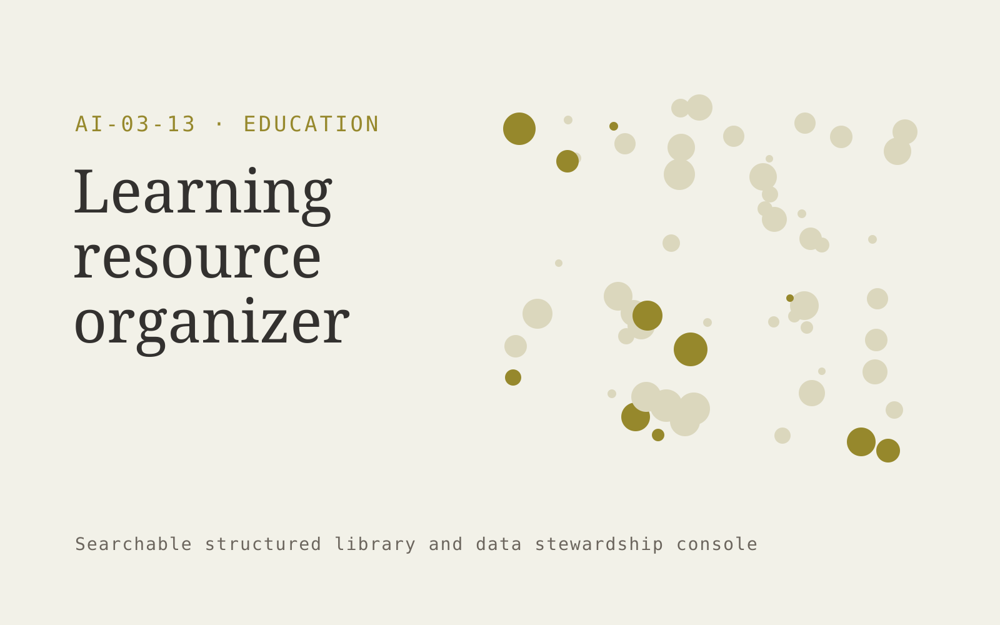

# Learning resource organizer

**Education** · Also fits: Human Resources; Management; IT and Development

> For curriculum leads at training organizations, turn licensed teaching resources and curriculum metadata into curated searchable learning resource library. Address the recurring problem: useful materials are scattered and difficult to reuse. The value hypothesis is a more complete, reviewable deliverable with less repeated preparation; the pilot must establish whether that benefit is real.

| | |
|---|---|
| **Buyer** | Curriculum leads at training organizations |
| **Problem** | Useful materials are scattered and difficult to reuse. |
| **Format** | Searchable structured library and data stewardship console |
| **USP** | Curriculum-aware discovery with visible ownership and reuse permissions. |

## The product
Key screens: Resource search, curriculum filters, ownership panel. Use a searchable table or visual gallery with filters for the domain’s important attributes. Open each item into a detail drawer containing source records, ownership and history. Put proposed merges and field changes in a separate review queue. Provide a preview before any bulk export. In this product, the first view is resource search, followed by curriculum filters and ownership panel.

## Core functionality
1. Tag learning objectives.
2. Detect duplicates.
3. Record licenses.
4. Suggest related resources.
5. Flag stale materials.
6. Manage educator collections.

## Customer workflow
Import a limited collection, define canonical fields, suggest tags or mappings, review uncertain records, publish approved items, search and reuse them, and request periodic owner updates. Start with licensed teaching resources and curriculum metadata and finish with curated searchable learning resource library.

## AI and human review
Suggest classifications, semantic tags, duplicate candidates and field mappings. Preserve original values. Use explicit validation for identifiers and units. Human stewards approve ambiguous merges and factual changes.

## Customer inputs
Licensed teaching resources and curriculum metadata

## Customer deliverables
Curated searchable learning resource library

## Accounts and administration
Record ownership, access permissions, change proposals, original-value retention, version history, review dates, bulk import/export and duplicate resolution.

## MVP scope
Begin with curriculum leads at training organizations and one recurring use case. Build the first two modules: tag learning objectives; detect duplicates. Provide operator assistance for the third module: record licenses. Deliver curated searchable learning resource library through a manual review queue. Perform other necessary full-scope functions manually during the pilot. Include all applicable access, accuracy and professional-review controls from the start.

## After MVP validation
After paid pilots establish value, automate the remaining modules: suggest related resources; flag stale materials; manage educator collections. Add one validated source integration, reusable customer configuration and recurring delivery. Expand to additional teams, document formats or languages only after testing the new scope.

## Build dependencies
Stable identifiers, an agreed data schema, reversible imports, mapping review and source ownership. Data quality work can exceed model development effort.

## Integrations and data access
Learning resources, course portals and educator review processes. Source systems, catalog exports and cloud file storage. Start with reversible CSV or file imports and validate identifiers before any direct writes. These are candidate integration categories, not verified supported connectors.

## Defensibility
A useful niche taxonomy, customer-approved mappings and accumulated correction history that improve retrieval and reduce repeated cleanup. For this idea, build around curriculum-aware discovery with visible ownership and reuse permissions. This advantage requires execution and accumulated customer trust; the base model alone is not a defensible asset.

## Alternatives and positioning
Spreadsheets, shared folders, existing asset or information management systems and manual data cleanup. Differentiate on this specific proposed advantage: curriculum-aware discovery with visible ownership and reuse permissions. Test it against the buyer's current method on the same task. Competitor coverage and uniqueness have not been established.

## Revenue model and test pricing (USD)
Test USD 500-2,500 for one collection cleanup and launch, followed by USD 100-500 monthly for maintenance within agreed record limits. Larger migrations and complex rights management are separately scoped. Prices are hypotheses.

## Main delivery costs
Import cleanup, extraction, storage, indexing, steward review, duplicate investigation and recurring source updates.

## Marketing message to test
> Learning resource organizer for curriculum leads at training organizations. Curriculum-aware discovery with visible ownership and reuse permissions. Demonstrate the claim through a searchable pilot collection mapped to curriculum topics.

## Acquisition channels
Training provider associations

## Lead magnet
A searchable pilot collection mapped to curriculum topics

## First 30 days of marketing
- Week 1: interview five prospective buyers in this segment: curriculum leads at training organizations. Ask to see a recent example of the problem and their current process.
- Week 2: prepare this demonstration using authorized or synthetic material: a searchable pilot collection mapped to curriculum topics.
- Week 3: present it through training provider associations and seek one narrowly scoped paid pilot.
- Week 4: review search success, resource reuse, total delivery effort and a concrete renewal decision before increasing scope.

## Paid pilot and validation
Clean and organize one representative collection. Have users perform real search or mapping tasks. Check every proposed merge in the sample and compare search success with the existing system. For this idea, use licensed teaching resources and curriculum metadata and evaluate curated searchable learning resource library. Agree success thresholds with the buyer before starting; collect a baseline for search success, resource reuse. A positive signal is payment and repeat use with acceptable quality and delivery cost, not a favorable demo reaction alone.

## Success metrics
Search success, resource reuse

## Retention and expansion
Provide owner reminders and periodic cleanup. Add another collection only after record quality and retrieval are stable in the initial one.

## Operating controls and limitations
Use educator-reviewed content and answer keys. Apply appropriate access and consent for learner records and distinguish completion from demonstrated learning. Validate source access and reviewer availability during the pilot. Maintain customer-level access, data deletion controls and a record of final approvals.

## Brand style (concept)

- Colors: `#916f27` primary · `#548bc9` accent · `#f1ede4` surface · `#22201e` ink
- Type: Archivo for headings, Lora for text
- Voice: Encouraging, patient, precise
- Demo site: [https://nexibeo.com/solutions/learning-resource-organizer/demo/](https://nexibeo.com/solutions/learning-resource-organizer/demo/)

## Investment indication

Indicative build budget, from MVP to full product. This is a planning range, not a quote; it excludes running costs such as model usage, hosting and reviewer hours. Built with Nexibeo's AI software development factory, most implementations take days to a few weeks of creation time, depending on availability.

| Phase | Scope | Creation time | Indicative budget |
|---|---|---|---|
| MVP | One buyer segment, one recurring use case; first modules: tag learning objectives; detect duplicates. Manual review in the loop. | 2 days | $5,000 |
| Paid pilot | Accounts, roles, review states, audit trail and the first integration, hardened for two to three paying pilot customers. | 3 days | $4,500 |
| Full product | Remaining modules: suggest related resources; flag stale materials; manage educator collections. Self-serve onboarding, billing, monitoring and the wider integration set. | 5 days | $6,500 |
| **Total** | | 10 days | **$16,000** |

### Running costs per month (rough indication, untested)

| Stage | Hosting and infrastructure | AI usage | Total per month |
|---|---|---|---|
| MVP and paid pilot (about 3 customers) | $30–$60 | $50–$100 | **$80–$160** |
| Full product (about 50 customers) | $110–$210 | $350–$700 | **$460–$910** |

**Get this built:** [contact Nexibeo](https://nexibeo.com/solutions/learning-resource-organizer/#apply). We build it with our AI software factory, usually in days to a few weeks, for you to run internally or offer to your clients.

## Research status
Concept proposal expanded from the 315-idea conversation. Demand, pricing, differentiation, build scope and integration feasibility are hypotheses, not verified market findings. Category link is inspiration rather than evidence of business viability.

## Credits and next steps

- **Estimation and having it built:** see the full solution page on [nexibeo.com](https://nexibeo.com/solutions/learning-resource-organizer/) for more detail on estimation. Nexibeo builds it for you as a custom AI implementation, to run internally or to offer to your own clients.
- **Become an AI-optimized specialist for Education:** [Complete AI Training](https://completeaitraining.com/tag/education/?contentType=ai-certification).
- Field news: [AI news for Education](https://completeaitraining.com/all-ai-news-for-education/).
