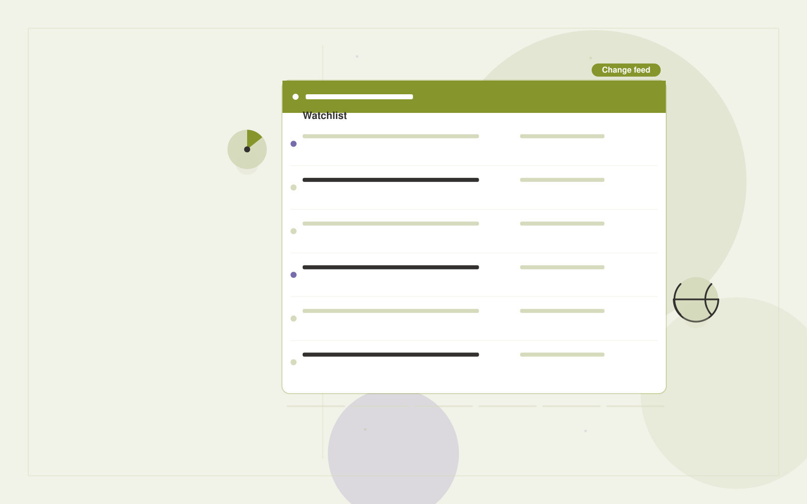

# Competitor intelligence subscription

**Executives and Strategy** · Also fits: Finance; Science and Research

> For strategy leads at specialist B2B software firms, turn selected public websites, filings and announcement feeds into source-linked competitor briefs. Address the recurring problem: competitor changes are noticed too late. The value hypothesis is a more complete, reviewable deliverable with less repeated preparation; the pilot must establish whether that benefit is real.

| | |
|---|---|
| **Buyer** | Strategy leads at specialist B2B software firms |
| **Problem** | Competitor changes are noticed too late. |
| **Format** | Watchlist, change detection and briefing subscription |
| **USP** | A narrow competitor set with documented changes and business implications. |

## The product
Key screens: Watchlist, change timeline, evidence brief. Use a watchlist with source health and last-checked dates, a chronological change feed, and a reviewable briefing editor. Display original evidence beside each alert. Let users mute irrelevant topics and record whether a change led to action. In this product, the first view is watchlist, followed by change timeline and evidence brief.

## Core functionality
1. Define competitors.
2. Capture dated changes.
3. Classify strategic relevance.
4. Link original evidence.
5. Produce weekly briefs.
6. Record analyst judgments.

## Customer workflow
Agree a narrow watchlist, confirm lawful source access, collect dated snapshots, detect candidate changes, review relevance and accuracy, deliver a concise digest, and refine the watchlist from buyer feedback. Start with selected public websites, filings and announcement feeds and finish with source-linked competitor briefs.

## AI and human review
Classify source material, group related developments and summarize verified changes. Use deterministic snapshot comparison for factual changes where possible. Distinguish observed publication content from analyst interpretation and uncertain implications.

## Customer inputs
Selected public websites, filings and announcement feeds

## Customer deliverables
Source-linked competitor briefs

## Accounts and administration
Watchlist ownership, source health, dated evidence, deduplication, topic filters, editorial review, delivery preferences and alert feedback.

## MVP scope
Begin with strategy leads at specialist B2B software firms and one recurring use case. Build the first two modules: define competitors; capture dated changes. Provide operator assistance for the third module: classify strategic relevance. Deliver source-linked competitor briefs through a manual review queue. Perform other necessary full-scope functions manually during the pilot. Include all applicable access, accuracy and professional-review controls from the start.

## After MVP validation
After paid pilots establish value, automate the remaining modules: link original evidence; produce weekly briefs; record analyst judgments. Add one validated source integration, reusable customer configuration and recurring delivery. Expand to additional teams, document formats or languages only after testing the new scope.

## Build dependencies
Reliable permitted source access, change history, publication dates, deduplication and editorial QA. Coverage limits and inaccessible sources must be visible.

## Integrations and data access
Internal reports, public company information and decision registers. Permitted feeds, published document sources, email digests and internal briefing channels. Verify collection rights and source reliability before selling coverage commitments. These are candidate integration categories, not verified supported connectors.

## Defensibility
A curated source network, historical change archive and buyer-specific relevance judgments within a narrow topic. For this idea, build around a narrow competitor set with documented changes and business implications. This advantage requires execution and accumulated customer trust; the base model alone is not a defensible asset.

## Alternatives and positioning
Newsletters, search alerts, analysts and general media or website monitoring tools. Differentiate on this specific proposed advantage: a narrow competitor set with documented changes and business implications. Test it against the buyer's current method on the same task. Competitor coverage and uniqueness have not been established.

## Revenue model and test pricing (USD)
Test USD 100-500 monthly for a narrow shared briefing, or USD 750-2,500 monthly for bespoke analyst coverage. Licensed source access and unusual collection requirements are extra. Prices require validation.

## Main delivery costs
Source licensing, collection reliability, change processing, analyst verification, missed-signal review and digest production.

## Marketing message to test
> Competitor intelligence subscription for strategy leads at specialist B2B software firms. A narrow competitor set with documented changes and business implications. Demonstrate the claim through a seven-day competitor change briefing.

## Acquisition channels
Industry newsletters and strategy communities

## Lead magnet
A seven-day competitor change briefing

## First 30 days of marketing
- Week 1: interview five prospective buyers in this segment: strategy leads at specialist B2B software firms. Ask to see a recent example of the problem and their current process.
- Week 2: prepare this demonstration using authorized or synthetic material: a seven-day competitor change briefing.
- Week 3: present it through industry newsletters and strategy communities and seek one narrowly scoped paid pilot.
- Week 4: review relevant alerts, paid briefing renewals, total delivery effort and a concrete renewal decision before increasing scope.

## Paid pilot and validation
Deliver several scheduled digests for a small watchlist. Have the buyer label useful and irrelevant items, independently check important missed developments and assess whether the briefing changes a decision. For this idea, use selected public websites, filings and announcement feeds and evaluate source-linked competitor briefs. Agree success thresholds with the buyer before starting; collect a baseline for relevant alerts, paid briefing renewals. A positive signal is payment and repeat use with acceptable quality and delivery cost, not a favorable demo reaction alone.

## Success metrics
Relevant alerts, paid briefing renewals

## Retention and expansion
Tune relevance from buyer feedback, preserve historical changes and offer deeper analyst review for selected topics. Add sources only when they improve useful coverage.

## Operating controls and limitations
Show source dates and distinguish evidence from strategic assumptions. Keep sensitive company plans restricted to authorized participants. Validate source access and reviewer availability during the pilot. Maintain customer-level access, data deletion controls and a record of final approvals.

## Brand style (concept)

- Colors: `#918f27` primary · `#5854c9` accent · `#f1f1e4` surface · `#22201e` ink
- Type: Space Grotesk for headings, Inter for text
- Voice: Brief, sharp, evidence-first
- Demo site: [https://nexibeo.com/ideas/competitor-intelligence-subscription/demo/](https://nexibeo.com/ideas/competitor-intelligence-subscription/demo/)

## Investment indication

Indicative build budget, from MVP to full product. This is a planning range, not a quote; it excludes running costs such as model usage, hosting and reviewer hours.

| Phase | Scope | Timeline | Indicative budget |
|---|---|---|---|
| MVP | One buyer segment, one recurring use case; first modules: define competitors; capture dated changes. Manual review in the loop. | 3 weeks | $5,500 |
| Paid pilot | Accounts, roles, review states, audit trail and the first integration, hardened for two to three paying pilot customers. | 4 weeks | $4,500 |
| Full product | Remaining modules: link original evidence; produce weekly briefs; record analyst judgments. Self-serve onboarding, billing, monitoring and the wider integration set. | 6 weeks | $6,500 |
| **Total** | | 13 weeks | **$16,500** |

**Co-create this project with us:** [contact Nexibeo](https://nexibeo.com/ideas/competitor-intelligence-subscription/#apply) and we build it with you.

## Research status
Concept proposal expanded from the 315-idea conversation. Demand, pricing, differentiation, build scope and integration feasibility are hypotheses, not verified market findings. Category link is inspiration rather than evidence of business viability.

## Credits and next steps

- **Estimation and building this idea:** see the full idea page on [nexibeo.com](https://nexibeo.com/ideas/competitor-intelligence-subscription/) for more detail on estimation, and to co-create and build this idea with Nexibeo.
- **Become an AI-optimized specialist for Executives and Strategy:** [Complete AI Training](https://completeaitraining.com/tag/executives-and-strategy/?contentType=ai-certification).
- Field news: [AI news for Executives and Strategy](https://completeaitraining.com/all-ai-news-for-executives-and-strategy/).
