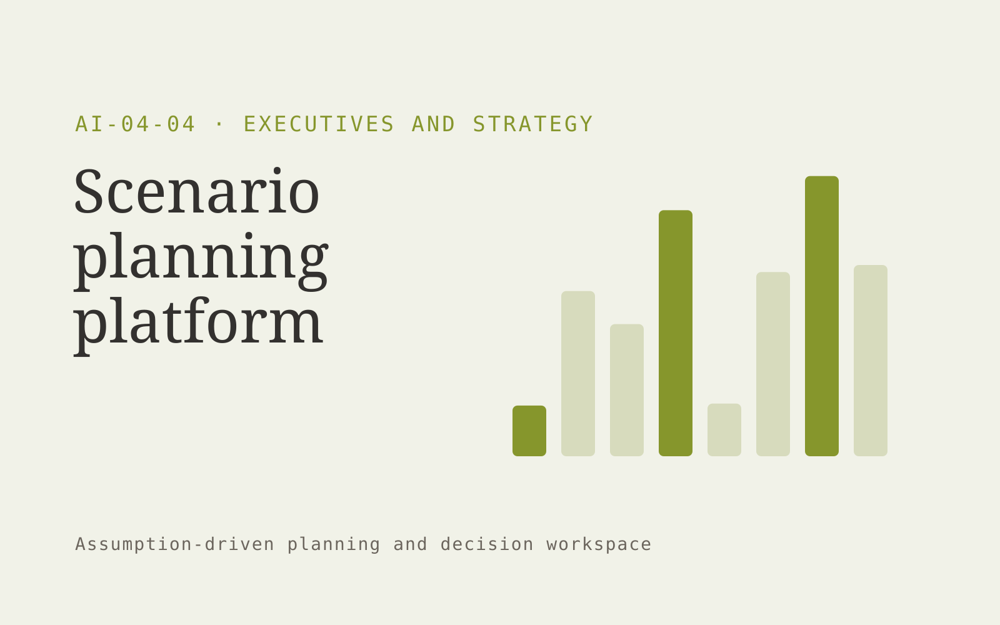

# Scenario planning platform

**AI-04-04 · Executives and Strategy** · Also fits: Finance; Science and Research

> For finance and strategy leads at service businesses, turn verified baseline data and editable business drivers into scenario model and assumption register. Address the recurring problem: plans conceal how outcomes depend on uncertain assumptions. The value hypothesis is a more complete, reviewable deliverable with less repeated preparation; the pilot must establish whether that benefit is real.

| | |
|---|---|
| **Buyer** | Finance and strategy leads at service businesses |
| **Problem** | Plans conceal how outcomes depend on uncertain assumptions. |
| **Format** | Assumption-driven planning and decision workspace |
| **USP** | Transparent driver math combined with readable scenario explanations. |

## The product
Key screens: Driver panel, scenario comparison, assumptions history. Place editable drivers and constraints beside a clearly labeled scenario output. Include a baseline view, comparison chart or schedule, and an assumptions history. Let users trace a proposed quantity or date back to its inputs. Keep forecasts distinct from actual results. In this product, the first view is driver panel, followed by scenario comparison and assumptions history.

## Core functionality
1. Validate baselines.
2. Expose key drivers.
3. Calculate alternative cases.
4. Explain sensitivities.
5. Record decision thresholds.
6. Track actual outcomes.

## Customer workflow
Validate baseline inputs, confirm definitions and constraints, select editable assumptions, calculate feasible alternatives, inspect sensitivities, let the responsible person approve a plan, and compare later actuals with the recorded assumptions. Start with verified baseline data and editable business drivers and finish with scenario model and assumption register.

## AI and human review
Extract input context and explain scenario differences. Use deterministic calculations or explicit optimization for quantities, compatibility, dates and prices. Show uncertain assumptions. Never let generated prose silently change the calculation rules.

## Customer inputs
Verified baseline data and editable business drivers

## Customer deliverables
Scenario model and assumption register

## Accounts and administration
Scenario versions, baseline reconciliation, constraint checks, assumption ownership, reviewer approvals, plan exports and actual-versus-plan tracking.

## MVP scope
Begin with finance and strategy leads at service businesses and one recurring use case. Build the first two modules: validate baselines; expose key drivers. Provide operator assistance for the third module: calculate alternative cases. Deliver scenario model and assumption register through a manual review queue. Perform other necessary full-scope functions manually during the pilot. Include all applicable access, accuracy and professional-review controls from the start.

## After MVP validation
After paid pilots establish value, automate the remaining modules: explain sensitivities; record decision thresholds; track actual outcomes. Add one validated source integration, reusable customer configuration and recurring delivery. Expand to additional teams, document formats or languages only after testing the new scope.

## Build dependencies
A defensible calculation model, explicit units, constraint validation and representative boundary tests. Advanced forecasting or optimization needs adequate historical data.

## Integrations and data access
Internal reports, public company information and decision registers. Read-only operational exports, calendars and finance or inventory records as relevant. Start with plan exports and retain human approval for execution. These are candidate integration categories, not verified supported connectors.

## Defensibility
A validated domain model, customer-approved constraints and forecast or decision history that improves practical planning. For this idea, build around transparent driver math combined with readable scenario explanations. This advantage requires execution and accumulated customer trust; the base model alone is not a defensible asset.

## Alternatives and positioning
Spreadsheets, planners, specialist forecasting tools and existing scheduling or configuration software. Differentiate on this specific proposed advantage: transparent driver math combined with readable scenario explanations. Test it against the buyer's current method on the same task. Competitor coverage and uniqueness have not been established.

## Revenue model and test pricing (USD)
Test USD 750-3,000 for a scoped planning setup and review, then USD 200-900 monthly for refreshes within agreed complexity. Data integration and optimization are separately scoped. All ranges are hypotheses.

## Main delivery costs
Data preparation, domain modeling, validation, scenario computation, reviewer support and ongoing assumption maintenance.

## Marketing message to test
> Scenario planning platform for finance and strategy leads at service businesses. Transparent driver math combined with readable scenario explanations. Demonstrate the claim through a three-scenario operating plan walkthrough.

## Acquisition channels
Fractional finance leaders

## Lead magnet
A three-scenario operating plan walkthrough

## First 30 days of marketing
- Week 1: interview five prospective buyers in this segment: finance and strategy leads at service businesses. Ask to see a recent example of the problem and their current process.
- Week 2: prepare this demonstration using authorized or synthetic material: a three-scenario operating plan walkthrough.
- Week 3: present it through fractional finance leaders and seek one narrowly scoped paid pilot.
- Week 4: review model reconciliation, decision usage, total delivery effort and a concrete renewal decision before increasing scope.

## Paid pilot and validation
Reproduce a known historical plan, test missing inputs and boundary constraints, then run a new scenario. Compare feasibility, reconciliation and observed error rather than judging the quality of the explanation alone. For this idea, use verified baseline data and editable business drivers and evaluate scenario model and assumption register. Agree success thresholds with the buyer before starting; collect a baseline for model reconciliation, decision usage. A positive signal is payment and repeat use with acceptable quality and delivery cost, not a favorable demo reaction alone.

## Success metrics
Model reconciliation, decision usage

## Retention and expansion
Refresh inputs, compare recorded assumptions with actual outcomes and refine validated constraints. Expand scenario complexity only when the buyer uses it for a decision.

## Operating controls and limitations
Show source dates and distinguish evidence from strategic assumptions. Keep sensitive company plans restricted to authorized participants. Validate source access and reviewer availability during the pilot. Maintain customer-level access, data deletion controls and a record of final approvals.

## Brand style (concept)

- Colors: `#8f9127` primary · `#5474c9` accent · `#f1f1e4` surface · `#22201e` ink
- Type: Space Grotesk for headings, Inter for text
- Voice: Brief, sharp, evidence-first
- Demo site: [https://nexibeo.com/ideas/scenario-planning-platform/demo/](https://nexibeo.com/ideas/scenario-planning-platform/demo/)

## Investment indication

Indicative build budget, from MVP to full product. This is a planning range, not a quote; it excludes running costs such as model usage, hosting and reviewer hours.

| Phase | Scope | Timeline | Indicative budget |
|---|---|---|---|
| MVP | One buyer segment, one recurring use case; first modules: validate baselines; expose key drivers. Manual review in the loop. | 4 weeks | $6,500 |
| Paid pilot | Accounts, roles, review states, audit trail and the first integration, hardened for two to three paying pilot customers. | 5 weeks | $7,000 |
| Full product | Remaining modules: explain sensitivities; record decision thresholds; track actual outcomes. Self-serve onboarding, billing, monitoring and the wider integration set. | 8 weeks | $9,500 |
| **Total** | | 17 weeks | **$23,000** |

**Co-create this project with us:** [contact Nexibeo](https://nexibeo.com/ideas/scenario-planning-platform/#apply) and we build it with you.

## Research status
Concept proposal expanded from the 315-idea conversation. Demand, pricing, differentiation, build scope and integration feasibility are hypotheses, not verified market findings. Category link is inspiration rather than evidence of business viability.

## Credits and next steps

- **Estimation and building this idea:** see the full idea page on [nexibeo.com](https://nexibeo.com/ideas/scenario-planning-platform/) for more detail on estimation, and to co-create and build this idea with Nexibeo.
- **Become an AI-optimized specialist for Executives and Strategy:** [Complete AI Training](https://completeaitraining.com/tag/executives-and-strategy/?contentType=ai-certification).
- Field news: [AI news for Executives and Strategy](https://completeaitraining.com/all-ai-news-for-executives-and-strategy/).
