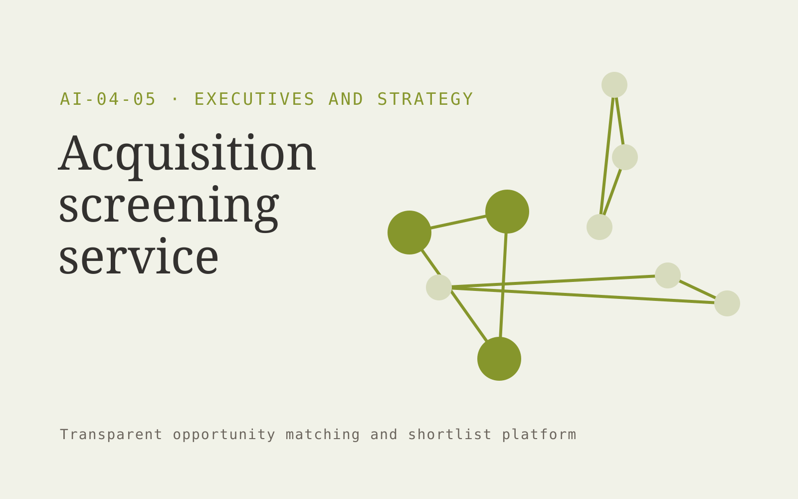

# Acquisition screening service

**AI-04-05 · Executives and Strategy** · Also fits: Finance; Science and Research; Sales

> For small business acquisition teams, turn public company records and buyer-defined criteria into target profiles and diligence questions. Address the recurring problem: initial target research consumes scarce deal team time. The value hypothesis is a more complete, reviewable deliverable with less repeated preparation; the pilot must establish whether that benefit is real.

| | |
|---|---|
| **Buyer** | Small business acquisition teams |
| **Problem** | Initial target research consumes scarce deal team time. |
| **Format** | Transparent opportunity matching and shortlist platform |
| **USP** | Transparent screening criteria with missing evidence kept visible. |

## The product
Key screens: Target list, evidence profile, review shortlist. Open with a filterable opportunity feed and clear fit explanations. Each profile shows source evidence, eligibility conditions and missing information. Keep saved, rejected and needs-review states. Include a deadline or next-action view without hiding the basis of recommendations. In this product, the first view is target list, followed by evidence profile and review shortlist.

## Core functionality
1. Define investment criteria.
2. Collect public indicators.
3. Flag missing data.
4. Explain fit factors.
5. Deduplicate targets.
6. Export review packs.

## Customer workflow
Define buyer-selected criteria, gather authorized opportunity information, apply explicit eligibility rules, propose matches with evidence, let the user review uncertain conditions, save a shortlist and track the resulting conversations or applications. Start with public company records and buyer-defined criteria and finish with target profiles and diligence questions.

## AI and human review
Extract criteria, normalize opportunity descriptions and explain possible fit. Use explicit rules for hard requirements. Do not invent missing eligibility facts or represent a suggested match as a verified qualification.

## Customer inputs
Public company records and buyer-defined criteria

## Customer deliverables
Target profiles and diligence questions

## Accounts and administration
Editable criteria, dated sources, eligibility evidence, missing-data flags, saved shortlists, rejection reasons, deadline alerts and owner follow-up.

## MVP scope
Begin with small business acquisition teams and one recurring use case. Build the first two modules: define investment criteria; collect public indicators. Provide operator assistance for the third module: flag missing data. Deliver target profiles and diligence questions through a manual review queue. Perform other necessary full-scope functions manually during the pilot. Include all applicable access, accuracy and professional-review controls from the start.

## After MVP validation
After paid pilots establish value, automate the remaining modules: explain fit factors; deduplicate targets; export review packs. Add one validated source integration, reusable customer configuration and recurring delivery. Expand to additional teams, document formats or languages only after testing the new scope.

## Build dependencies
Current source information, explicit eligibility rules, entity identity checks and inspectable fit reasoning. Sparse evidence limits match quality.

## Integrations and data access
Internal reports, public company information and decision registers. Permitted opportunity feeds, customer profiles, calendars and CRM exports. Keep initial outreach or applications as user-reviewed drafts. These are candidate integration categories, not verified supported connectors.

## Defensibility
A maintained niche opportunity dataset and documented relevance feedback, supported by relationships with the intended buyer community. For this idea, build around transparent screening criteria with missing evidence kept visible. This advantage requires execution and accumulated customer trust; the base model alone is not a defensible asset.

## Alternatives and positioning
Manual research, directories, generic databases, referrals and existing opportunity marketplaces. Differentiate on this specific proposed advantage: transparent screening criteria with missing evidence kept visible. Test it against the buyer's current method on the same task. Competitor coverage and uniqueness have not been established.

## Revenue model and test pricing (USD)
Test USD 150-600 monthly for one narrow opportunity feed, or USD 750-2,500 for a bespoke researched shortlist. Price manual verification and custom research explicitly. These are pricing hypotheses.

## Main delivery costs
Source collection, profile updates, entity resolution, eligibility verification, analyst research and customer feedback review.

## Marketing message to test
> Acquisition screening service for small business acquisition teams. Transparent screening criteria with missing evidence kept visible. Demonstrate the claim through an evidence-backed five-company screening sample.

## Acquisition channels
Acquisition entrepreneur communities

## Lead magnet
An evidence-backed five-company screening sample

## First 30 days of marketing
- Week 1: interview five prospective buyers in this segment: small business acquisition teams. Ask to see a recent example of the problem and their current process.
- Week 2: prepare this demonstration using authorized or synthetic material: an evidence-backed five-company screening sample.
- Week 3: present it through acquisition entrepreneur communities and seek one narrowly scoped paid pilot.
- Week 4: review reviewer acceptance, time per screened target, total delivery effort and a concrete renewal decision before increasing scope.

## Paid pilot and validation
Produce a small shortlist and ask the buyer to verify fit independently. Record why each option is accepted or rejected and whether it leads to a useful next step. Review missed eligible options too. For this idea, use public company records and buyer-defined criteria and evaluate target profiles and diligence questions. Agree success thresholds with the buyer before starting; collect a baseline for reviewer acceptance, time per screened target. A positive signal is payment and repeat use with acceptable quality and delivery cost, not a favorable demo reaction alone.

## Success metrics
Reviewer acceptance, time per screened target

## Retention and expansion
Refresh opportunity profiles, improve criteria from accepted and rejected matches, and offer deeper verification for shortlisted options.

## Operating controls and limitations
Show source dates and distinguish evidence from strategic assumptions. Keep sensitive company plans restricted to authorized participants. Validate source access and reviewer availability during the pilot. Maintain customer-level access, data deletion controls and a record of final approvals.

## Brand style (concept)

- Colors: `#7f9127` primary · `#5456c9` accent · `#eff1e4` surface · `#22201e` ink
- Type: Space Grotesk for headings, Inter for text
- Voice: Brief, sharp, evidence-first
- Demo site: [https://nexibeo.com/ideas/acquisition-screening-service/demo/](https://nexibeo.com/ideas/acquisition-screening-service/demo/)

## Investment indication

Indicative build budget, from MVP to full product. This is a planning range, not a quote; it excludes running costs such as model usage, hosting and reviewer hours.

| Phase | Scope | Timeline | Indicative budget |
|---|---|---|---|
| MVP | One buyer segment, one recurring use case; first modules: define investment criteria; collect public indicators. Manual review in the loop. | 4 weeks | $7,500 |
| Paid pilot | Accounts, roles, review states, audit trail and the first integration, hardened for two to three paying pilot customers. | 5 weeks | $8,000 |
| Full product | Remaining modules: explain fit factors; deduplicate targets; export review packs. Self-serve onboarding, billing, monitoring and the wider integration set. | 9 weeks | $11,000 |
| **Total** | | 18 weeks | **$26,500** |

**Co-create this project with us:** [contact Nexibeo](https://nexibeo.com/ideas/acquisition-screening-service/#apply) and we build it with you.

## Research status
Concept proposal expanded from the 315-idea conversation. Demand, pricing, differentiation, build scope and integration feasibility are hypotheses, not verified market findings. Category link is inspiration rather than evidence of business viability.

## Credits and next steps

- **Estimation and building this idea:** see the full idea page on [nexibeo.com](https://nexibeo.com/ideas/acquisition-screening-service/) for more detail on estimation, and to co-create and build this idea with Nexibeo.
- **Become an AI-optimized specialist for Executives and Strategy:** [Complete AI Training](https://completeaitraining.com/tag/executives-and-strategy/?contentType=ai-certification).
- Field news: [AI news for Executives and Strategy](https://completeaitraining.com/all-ai-news-for-executives-and-strategy/).
