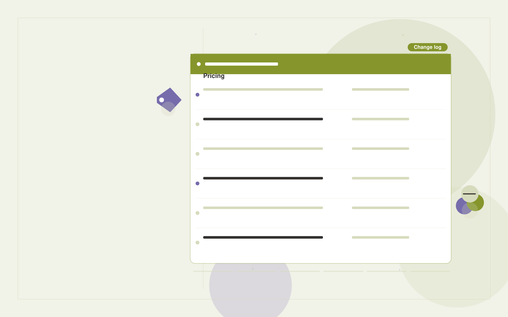

# Pricing intelligence service

**Executives and Strategy** · Also fits: Finance; Science and Research

> For commercial leads at vertical software companies, turn permitted public pricing pages and package documentation into pricing change alerts and comparison history. Address the recurring problem: competitor package changes are buried across websites. The value hypothesis is a more complete, reviewable deliverable with less repeated preparation; the pilot must establish whether that benefit is real.

| | |
|---|---|
| **Buyer** | Commercial leads at vertical software companies |
| **Problem** | Competitor package changes are buried across websites. |
| **Format** | Watchlist, change detection and briefing subscription |
| **USP** | Tracks packaging and conditions alongside headline prices. |

## The product
Key screens: Pricing matrix, change log, analyst notes. Use a watchlist with source health and last-checked dates, a chronological change feed, and a reviewable briefing editor. Display original evidence beside each alert. Let users mute irrelevant topics and record whether a change led to action. In this product, the first view is pricing matrix, followed by change log and analyst notes.

## Core functionality
1. Capture comparable plans.
2. Record usage limits.
3. Normalize billing periods.
4. Flag packaging changes.
5. Retain dated evidence.
6. Alert stakeholders.

## Customer workflow
Agree a narrow watchlist, confirm lawful source access, collect dated snapshots, detect candidate changes, review relevance and accuracy, deliver a concise digest, and refine the watchlist from buyer feedback. Start with permitted public pricing pages and package documentation and finish with pricing change alerts and comparison history.

## AI and human review
Classify source material, group related developments and summarize verified changes. Use deterministic snapshot comparison for factual changes where possible. Distinguish observed publication content from analyst interpretation and uncertain implications.

## Customer inputs
Permitted public pricing pages and package documentation

## Customer deliverables
Pricing change alerts and comparison history

## Accounts and administration
Watchlist ownership, source health, dated evidence, deduplication, topic filters, editorial review, delivery preferences and alert feedback.

## MVP scope
Begin with commercial leads at vertical software companies and one recurring use case. Build the first two modules: capture comparable plans; record usage limits. Provide operator assistance for the third module: normalize billing periods. Deliver pricing change alerts and comparison history through a manual review queue. Perform other necessary full-scope functions manually during the pilot. Include all applicable access, accuracy and professional-review controls from the start.

## After MVP validation
After paid pilots establish value, automate the remaining modules: flag packaging changes; retain dated evidence; alert stakeholders. Add one validated source integration, reusable customer configuration and recurring delivery. Expand to additional teams, document formats or languages only after testing the new scope.

## Build dependencies
Reliable permitted source access, change history, publication dates, deduplication and editorial QA. Coverage limits and inaccessible sources must be visible.

## Integrations and data access
Internal reports, public company information and decision registers. Permitted feeds, published document sources, email digests and internal briefing channels. Verify collection rights and source reliability before selling coverage commitments. These are candidate integration categories, not verified supported connectors.

## Defensibility
A curated source network, historical change archive and buyer-specific relevance judgments within a narrow topic. For this idea, build around tracks packaging and conditions alongside headline prices. This advantage requires execution and accumulated customer trust; the base model alone is not a defensible asset.

## Alternatives and positioning
Newsletters, search alerts, analysts and general media or website monitoring tools. Differentiate on this specific proposed advantage: tracks packaging and conditions alongside headline prices. Test it against the buyer's current method on the same task. Competitor coverage and uniqueness have not been established.

## Revenue model and test pricing (USD)
Test USD 100-500 monthly for a narrow shared briefing, or USD 750-2,500 monthly for bespoke analyst coverage. Licensed source access and unusual collection requirements are extra. Prices require validation.

## Main delivery costs
Source licensing, collection reliability, change processing, analyst verification, missed-signal review and digest production.

## Marketing message to test
> Pricing intelligence service for commercial leads at vertical software companies. Tracks packaging and conditions alongside headline prices. Demonstrate the claim through a dated competitor packaging comparison.

## Acquisition channels
Revenue operations consultants

## Lead magnet
A dated competitor packaging comparison

## First 30 days of marketing
- Week 1: interview five prospective buyers in this segment: commercial leads at vertical software companies. Ask to see a recent example of the problem and their current process.
- Week 2: prepare this demonstration using authorized or synthetic material: a dated competitor packaging comparison.
- Week 3: present it through revenue operations consultants and seek one narrowly scoped paid pilot.
- Week 4: review verified change accuracy, briefing usage, total delivery effort and a concrete renewal decision before increasing scope.

## Paid pilot and validation
Deliver several scheduled digests for a small watchlist. Have the buyer label useful and irrelevant items, independently check important missed developments and assess whether the briefing changes a decision. For this idea, use permitted public pricing pages and package documentation and evaluate pricing change alerts and comparison history. Agree success thresholds with the buyer before starting; collect a baseline for verified change accuracy, briefing usage. A positive signal is payment and repeat use with acceptable quality and delivery cost, not a favorable demo reaction alone.

## Success metrics
Verified change accuracy, briefing usage

## Retention and expansion
Tune relevance from buyer feedback, preserve historical changes and offer deeper analyst review for selected topics. Add sources only when they improve useful coverage.

## Operating controls and limitations
Show source dates and distinguish evidence from strategic assumptions. Keep sensitive company plans restricted to authorized participants. Validate source access and reviewer availability during the pilot. Maintain customer-level access, data deletion controls and a record of final approvals.

## Brand style (concept)

- Colors: `#918d27` primary · `#7054c9` accent · `#f1f0e4` surface · `#22201e` ink
- Type: Space Grotesk for headings, Inter for text
- Voice: Brief, sharp, evidence-first
- Demo site: [https://nexibeo.com/solutions/pricing-intelligence-service/demo/](https://nexibeo.com/solutions/pricing-intelligence-service/demo/)

## Investment indication

Indicative build budget, from MVP to full product. This is a planning range, not a quote; it excludes running costs such as model usage, hosting and reviewer hours. Built with Nexibeo's AI software development factory, most implementations take days to a few weeks of creation time, depending on availability.

| Phase | Scope | Creation time | Indicative budget |
|---|---|---|---|
| MVP | One buyer segment, one recurring use case; first modules: capture comparable plans; record usage limits. Manual review in the loop. | 2 days | $5,500 |
| Paid pilot | Accounts, roles, review states, audit trail and the first integration, hardened for two to three paying pilot customers. | 3 days | $4,500 |
| Full product | Remaining modules: flag packaging changes; retain dated evidence; alert stakeholders. Self-serve onboarding, billing, monitoring and the wider integration set. | 5 days | $6,500 |
| **Total** | | 10 days | **$16,500** |

### Running costs per month (rough indication, untested)

| Stage | Hosting and infrastructure | AI usage | Total per month |
|---|---|---|---|
| MVP and paid pilot (about 3 customers) | $30–$60 | $50–$100 | **$80–$160** |
| Full product (about 50 customers) | $110–$210 | $350–$700 | **$460–$910** |

**Get this built:** [contact Nexibeo](https://nexibeo.com/solutions/pricing-intelligence-service/#apply). We build it with our AI software factory, usually in days to a few weeks, for you to run internally or offer to your clients.

## Research status
Concept proposal expanded from the 315-idea conversation. Demand, pricing, differentiation, build scope and integration feasibility are hypotheses, not verified market findings. Category link is inspiration rather than evidence of business viability.

## Credits and next steps

- **Estimation and having it built:** see the full solution page on [nexibeo.com](https://nexibeo.com/solutions/pricing-intelligence-service/) for more detail on estimation. Nexibeo builds it for you as a custom AI implementation, to run internally or to offer to your own clients.
- **Become an AI-optimized specialist for Executives and Strategy:** [Complete AI Training](https://completeaitraining.com/tag/executives-and-strategy/?contentType=ai-certification).
- Field news: [AI news for Executives and Strategy](https://completeaitraining.com/all-ai-news-for-executives-and-strategy/).
