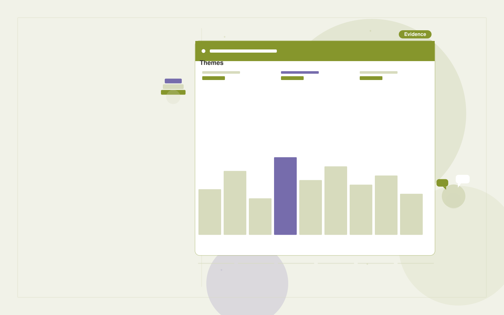

# Customer advisory synthesis

**Executives and Strategy** · Also fits: Finance; Science and Research

> For product strategy leads running customer advisory boards, turn authorized interviews, meeting transcripts and account context into advisory findings and follow-up commitments. Address the recurring problem: anecdotal meeting notes fail to distinguish shared needs. The value hypothesis is a more complete, reviewable deliverable with less repeated preparation; the pilot must establish whether that benefit is real.

| | |
|---|---|
| **Buyer** | Product strategy leads running customer advisory boards |
| **Problem** | Anecdotal meeting notes fail to distinguish shared needs. |
| **Format** | Evidence-backed analysis and reporting workspace |
| **USP** | Preserves disagreement and evidence instead of flattening feedback into consensus. |

## The product
Key screens: Theme board, quotation evidence, decision tracker. Open with a compact overview and filters for the relevant period or segment. Let users drill from each theme or metric into underlying records. Keep source definitions and missing-data notes near the result. Use an action panel to assign investigations and record what was learned. In this product, the first view is theme board, followed by quotation evidence and decision tracker.

## Core functionality
1. Group customer problems.
2. Retain dissenting views.
3. Distinguish requests from needs.
4. Link themes to accounts.
5. Record strategic responses.
6. Track follow-ups.

## Customer workflow
Agree definitions, import authorized data, validate coverage and identifiers, compute transparent measures, group relevant evidence, review findings, assign investigations or improvements, and repeat on a comparable period. Start with authorized interviews, meeting transcripts and account context and finish with advisory findings and follow-up commitments.

## AI and human review
Classify text, summarize evidence and propose explanations to investigate. Compute financial or operational measures with deterministic code. Separate observed patterns from causal claims and preserve examples that contradict the summary.

## Customer inputs
Authorized interviews, meeting transcripts and account context

## Customer deliverables
Advisory findings and follow-up commitments

## Accounts and administration
Dataset permissions, field mappings, metric definitions, source drill-down, saved filters, reviewer annotations, recurring reports and action ownership.

## MVP scope
Begin with product strategy leads running customer advisory boards and one recurring use case. Build the first two modules: group customer problems; retain dissenting views. Provide operator assistance for the third module: distinguish requests from needs. Deliver advisory findings and follow-up commitments through a manual review queue. Perform other necessary full-scope functions manually during the pilot. Include all applicable access, accuracy and professional-review controls from the start.

## After MVP validation
After paid pilots establish value, automate the remaining modules: link themes to accounts; record strategic responses; track follow-ups. Add one validated source integration, reusable customer configuration and recurring delivery. Expand to additional teams, document formats or languages only after testing the new scope.

## Build dependencies
Stable identifiers, consistent metric definitions, deterministic calculations, source lineage and representative review samples. Poor coverage must remain visible.

## Integrations and data access
Internal reports, public company information and decision registers. Read-only business data exports, reporting databases and task trackers. Reconcile source totals before scheduling recurring data refreshes. These are candidate integration categories, not verified supported connectors.

## Defensibility
Domain-specific definitions, trusted source mappings and a history connecting findings to actions and observed results. For this idea, build around preserves disagreement and evidence instead of flattening feedback into consensus. This advantage requires execution and accumulated customer trust; the base model alone is not a defensible asset.

## Alternatives and positioning
Analysts, business intelligence dashboards, spreadsheets and general text summarization tools. Differentiate on this specific proposed advantage: preserves disagreement and evidence instead of flattening feedback into consensus. Test it against the buyer's current method on the same task. Competitor coverage and uniqueness have not been established.

## Revenue model and test pricing (USD)
Test USD 500-2,000 for an initial analysis of one bounded dataset. Offer USD 250-1,000 monthly for repeat reporting at agreed volume. Data cleanup and specialist analysis are separately priced. These are test ranges.

## Main delivery costs
Data preparation, reconciliation, classification, expert interpretation, customer-specific definitions and recurring reporting support.

## Marketing message to test
> Customer advisory synthesis for product strategy leads running customer advisory boards. Preserves disagreement and evidence instead of flattening feedback into consensus. Demonstrate the claim through an anonymized advisory board insight brief.

## Acquisition channels
Customer advisory program consultants

## Lead magnet
An anonymized advisory board insight brief

## First 30 days of marketing
- Week 1: interview five prospective buyers in this segment: product strategy leads running customer advisory boards. Ask to see a recent example of the problem and their current process.
- Week 2: prepare this demonstration using authorized or synthetic material: an anonymized advisory board insight brief.
- Week 3: present it through customer advisory program consultants and seek one narrowly scoped paid pilot.
- Week 4: review evidence coverage, decisions informed, total delivery effort and a concrete renewal decision before increasing scope.

## Paid pilot and validation
Analyze one historical period and review findings with the responsible domain owner. Reconcile headline measures, inspect counterexamples and ask the buyer to choose a concrete follow-up action. For this idea, use authorized interviews, meeting transcripts and account context and evaluate advisory findings and follow-up commitments. Agree success thresholds with the buyer before starting; collect a baseline for evidence coverage, decisions informed. A positive signal is payment and repeat use with acceptable quality and delivery cost, not a favorable demo reaction alone.

## Success metrics
Evidence coverage, decisions informed

## Retention and expansion
Repeat the same definitions each reporting period and track whether findings lead to useful action. Expand data sources without breaking historical comparability.

## Operating controls and limitations
Show source dates and distinguish evidence from strategic assumptions. Keep sensitive company plans restricted to authorized participants. Validate source access and reviewer availability during the pilot. Maintain customer-level access, data deletion controls and a record of final approvals.

## Brand style (concept)

- Colors: `#8c9127` primary · `#5e54c9` accent · `#f0f1e4` surface · `#22201e` ink
- Type: Playfair Display for headings, Source Sans 3 for text
- Voice: Brief, sharp, evidence-first
- Demo site: [https://nexibeo.com/ideas/customer-advisory-synthesis/demo/](https://nexibeo.com/ideas/customer-advisory-synthesis/demo/)

## Investment indication

Indicative build budget, from MVP to full product. This is a planning range, not a quote; it excludes running costs such as model usage, hosting and reviewer hours.

| Phase | Scope | Timeline | Indicative budget |
|---|---|---|---|
| MVP | One buyer segment, one recurring use case; first modules: group customer problems; retain dissenting views. Manual review in the loop. | 4 weeks | $6,500 |
| Paid pilot | Accounts, roles, review states, audit trail and the first integration, hardened for two to three paying pilot customers. | 5 weeks | $7,000 |
| Full product | Remaining modules: link themes to accounts; record strategic responses; track follow-ups. Self-serve onboarding, billing, monitoring and the wider integration set. | 8 weeks | $9,500 |
| **Total** | | 17 weeks | **$23,000** |

**Co-create this project with us:** [contact Nexibeo](https://nexibeo.com/ideas/customer-advisory-synthesis/#apply) and we build it with you.

## Research status
Concept proposal expanded from the 315-idea conversation. Demand, pricing, differentiation, build scope and integration feasibility are hypotheses, not verified market findings. Category link is inspiration rather than evidence of business viability.

## Credits and next steps

- **Estimation and building this idea:** see the full idea page on [nexibeo.com](https://nexibeo.com/ideas/customer-advisory-synthesis/) for more detail on estimation, and to co-create and build this idea with Nexibeo.
- **Become an AI-optimized specialist for Executives and Strategy:** [Complete AI Training](https://completeaitraining.com/tag/executives-and-strategy/?contentType=ai-certification).
- Field news: [AI news for Executives and Strategy](https://completeaitraining.com/all-ai-news-for-executives-and-strategy/).
