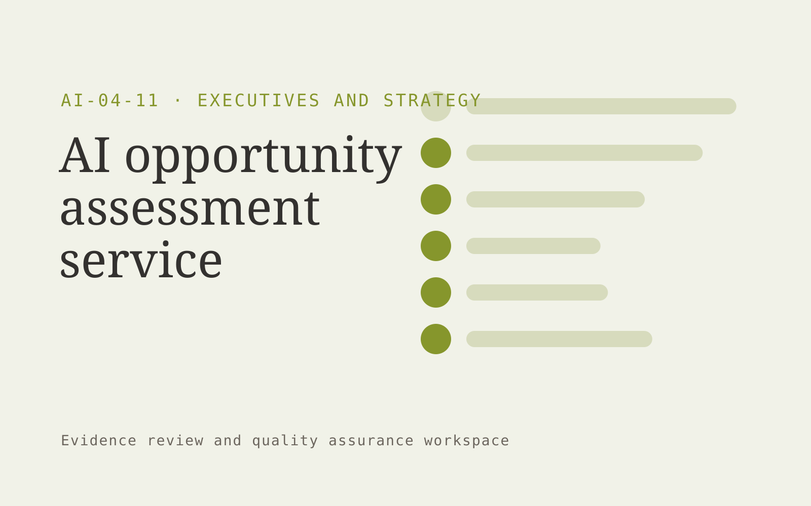

# AI opportunity assessment service

**Executives and Strategy** · Also fits: Finance; Science and Research; Operations

> For business owners considering their first AI implementation, turn process interviews, sample tasks and baseline effort into opportunity assessment and implementation brief. Address the recurring problem: tool enthusiasm precedes a measurable operational use case. The value hypothesis is a more complete, reviewable deliverable with less repeated preparation; the pilot must establish whether that benefit is real.

| | |
|---|---|
| **Buyer** | Business owners considering their first AI implementation |
| **Problem** | Tool enthusiasm precedes a measurable operational use case. |
| **Format** | Evidence review and quality assurance workspace |
| **USP** | A practical pilot specification with baseline measurement and review costs. |

## The product
Key screens: Process map, opportunity backlog, pilot design. Open on a review queue ordered by reviewer-selected priorities. Show each finding beside the original evidence and applicable rule. Provide accept, dismiss and needs-information controls with reasons. A separate report view summarizes confirmed findings and unresolved items, not raw AI flags. In this product, the first view is process map, followed by opportunity backlog and pilot design.

## Core functionality
1. Map repeated tasks.
2. Inspect data availability.
3. Estimate review burden.
4. Define measurable pilots.
5. Prioritize implementation dependencies.
6. Document results.

## Customer workflow
Agree review criteria, ingest a sample, generate candidate findings, inspect supporting evidence, let reviewers confirm or dismiss each item, assign corrections, and recheck the affected material. Start with process interviews, sample tasks and baseline effort and finish with opportunity assessment and implementation brief.

## AI and human review
Propose possible inconsistencies, omissions and rubric matches. Combine extraction with deterministic checks where rules are explicit. Reviewers make the final judgment. Keep false positives and missed cases visible during evaluation.

## Customer inputs
Process interviews, sample tasks and baseline effort

## Customer deliverables
Opportunity assessment and implementation brief

## Accounts and administration
Versioned review criteria, evidence links, reviewer decisions, disagreement handling, correction assignments, recheck status and exportable review history.

## MVP scope
Begin with business owners considering their first AI implementation and one recurring use case. Build the first two modules: map repeated tasks; inspect data availability. Provide operator assistance for the third module: estimate review burden. Deliver opportunity assessment and implementation brief through a manual review queue. Perform other necessary full-scope functions manually during the pilot. Include all applicable access, accuracy and professional-review controls from the start.

## After MVP validation
After paid pilots establish value, automate the remaining modules: define measurable pilots; prioritize implementation dependencies; document results. Add one validated source integration, reusable customer configuration and recurring delivery. Expand to additional teams, document formats or languages only after testing the new scope.

## Build dependencies
Evidence coordinates, versioned rules, reviewer decisions and a representative reference set. Measure misses as well as confirmed findings before scaling.

## Integrations and data access
Internal reports, public company information and decision registers. Source repositories, task trackers and report exports. Keep findings as review proposals until authorized owners accept the resulting actions. These are candidate integration categories, not verified supported connectors.

## Defensibility
A domain-specific review rubric and rights-cleared examples of confirmed defects, false alarms and reviewer reasoning. For this idea, build around a practical pilot specification with baseline measurement and review costs. This advantage requires execution and accumulated customer trust; the base model alone is not a defensible asset.

## Alternatives and positioning
Manual reviewers, checklists, generic scanning tools and specialist audit services. Differentiate on this specific proposed advantage: a practical pilot specification with baseline measurement and review costs. Test it against the buyer's current method on the same task. Competitor coverage and uniqueness have not been established.

## Revenue model and test pricing (USD)
Test USD 500-2,000 for a defined audit sample and report. Offer recurring review priced by reviewed items and specialist hours. Software-only access can follow a reliable reviewed service. All prices require validation.

## Main delivery costs
Document or media processing, model evaluation, expert review, false-positive handling, rechecks and customer-specific rubric calibration.

## Marketing message to test
> AI opportunity assessment service for business owners considering their first AI implementation. A practical pilot specification with baseline measurement and review costs. Demonstrate the claim through a paid workflow audit with one testable pilot.

## Acquisition channels
Small-business advisory networks

## Lead magnet
A paid workflow audit with one testable pilot

## First 30 days of marketing
- Week 1: interview five prospective buyers in this segment: business owners considering their first AI implementation. Ask to see a recent example of the problem and their current process.
- Week 2: prepare this demonstration using authorized or synthetic material: a paid workflow audit with one testable pilot.
- Week 3: present it through small-business advisory networks and seek one narrowly scoped paid pilot.
- Week 4: review pilot adoption, verified net time saved, total delivery effort and a concrete renewal decision before increasing scope.

## Paid pilot and validation
Have a qualified reviewer independently assess the same sample. Compare confirmed findings, false alarms and omissions. Repeat on unseen material before agreeing recurring volume. For this idea, use process interviews, sample tasks and baseline effort and evaluate opportunity assessment and implementation brief. Agree success thresholds with the buyer before starting; collect a baseline for pilot adoption, verified net time saved. A positive signal is payment and repeat use with acceptable quality and delivery cost, not a favorable demo reaction alone.

## Success metrics
Pilot adoption, verified net time saved

## Retention and expansion
Offer recurring reviews and rechecks of previously confirmed issues. Expand document or case types after validating the new rubric with qualified reviewers.

## Operating controls and limitations
Show source dates and distinguish evidence from strategic assumptions. Keep sensitive company plans restricted to authorized participants. Validate source access and reviewer availability during the pilot. Maintain customer-level access, data deletion controls and a record of final approvals.

## Brand style (concept)

- Colors: `#7c9127` primary · `#7d54c9` accent · `#eef1e4` surface · `#22201e` ink
- Type: Playfair Display for headings, Source Sans 3 for text
- Voice: Brief, sharp, evidence-first
- Demo site: [https://nexibeo.com/solutions/ai-opportunity-assessment-service/demo/](https://nexibeo.com/solutions/ai-opportunity-assessment-service/demo/)

## Investment indication

Indicative build budget, from MVP to full product. This is a planning range, not a quote; it excludes running costs such as model usage, hosting and reviewer hours. Built with Nexibeo's AI software development factory, most implementations take days to a few weeks of creation time, depending on availability.

| Phase | Scope | Creation time | Indicative budget |
|---|---|---|---|
| MVP | One buyer segment, one recurring use case; first modules: map repeated tasks; inspect data availability. Manual review in the loop. | 3 days | $6,500 |
| Paid pilot | Accounts, roles, review states, audit trail and the first integration, hardened for two to three paying pilot customers. | 4 days | $7,000 |
| Full product | Remaining modules: define measurable pilots; prioritize implementation dependencies; document results. Self-serve onboarding, billing, monitoring and the wider integration set. | 7 days | $10,000 |
| **Total** | | about 3 weeks | **$23,500** |

### Running costs per month (rough indication, untested)

| Stage | Hosting and infrastructure | AI usage | Total per month |
|---|---|---|---|
| MVP and paid pilot (about 3 customers) | $30–$60 | $80–$160 | **$110–$220** |
| Full product (about 50 customers) | $110–$210 | $880–$1,750 | **$990–$1,960** |

**Get this built:** [contact Nexibeo](https://nexibeo.com/solutions/ai-opportunity-assessment-service/#apply). We build it with our AI software factory, usually in days to a few weeks, for you to run internally or offer to your clients.

## Research status
Concept proposal expanded from the 315-idea conversation. Demand, pricing, differentiation, build scope and integration feasibility are hypotheses, not verified market findings. Category link is inspiration rather than evidence of business viability.

## Credits and next steps

- **Estimation and having it built:** see the full solution page on [nexibeo.com](https://nexibeo.com/solutions/ai-opportunity-assessment-service/) for more detail on estimation. Nexibeo builds it for you as a custom AI implementation, to run internally or to offer to your own clients.
- **Become an AI-optimized specialist for Executives and Strategy:** [Complete AI Training](https://completeaitraining.com/tag/executives-and-strategy/?contentType=ai-certification).
- Field news: [AI news for Executives and Strategy](https://completeaitraining.com/all-ai-news-for-executives-and-strategy/).
