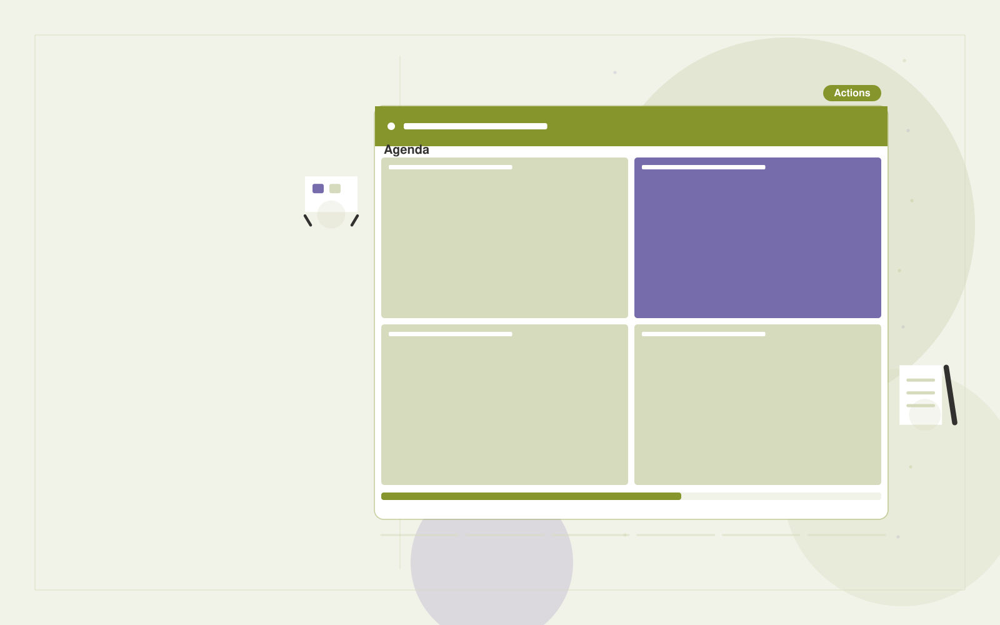

# Strategy workshop business

**Executives and Strategy** · Also fits: Finance; Science and Research; Education

> For leadership teams at owner-operated businesses, turn pre-work interviews, business data and decision topics into workshop decision pack and action plan. Address the recurring problem: remote planning sessions produce vague priorities without follow-through. The value hypothesis is a more complete, reviewable deliverable with less repeated preparation; the pilot must establish whether that benefit is real.

| | |
|---|---|
| **Buyer** | Leadership teams at owner-operated businesses |
| **Problem** | Remote planning sessions produce vague priorities without follow-through. |
| **Format** | Interactive practice or facilitated workshop platform |
| **USP** | Facilitated decision practice ending in owners and measurable commitments. |

## The product
Key screens: Workshop agenda, option board, action register. Use a scenario catalog with clear goals and difficulty settings. The main session area supports text, optional voice and visible context. Follow it with a replay or decision map, annotated feedback and a next-practice plan. Facilitators can author scenarios and review participant-selected sessions. In this product, the first view is workshop agenda, followed by option board and action register.

## Core functionality
1. Collect pre-work.
2. Prepare evidence prompts.
3. Facilitate scenario exercises.
4. Compare participant assumptions.
5. Document decisions.
6. Assign follow-up reviews.

## Customer workflow
Set the participant’s goal, choose or customize a scenario, conduct an interactive session, record choices or dialogue, review evidence-based feedback with a facilitator when needed, and repeat selected parts with changed constraints. Start with pre-work interviews, business data and decision topics and finish with workshop decision pack and action plan.

## AI and human review
Generate responsive dialogue, alternative situations and structured reflection prompts. Ground feedback in agreed goals or rubrics. Treat creative choices and facilitator judgment as authoritative. Evaluate specific actions rather than infer personality or hidden traits.

## Customer inputs
Pre-work interviews, business data and decision topics

## Customer deliverables
Workshop decision pack and action plan

## Accounts and administration
Participant-controlled session sharing, scenario versions, facilitator tools, replay history, rubric calibration, practice goals and exportable feedback.

## MVP scope
Begin with leadership teams at owner-operated businesses and one recurring use case. Build the first two modules: collect pre-work; prepare evidence prompts. Provide operator assistance for the third module: facilitate scenario exercises. Deliver workshop decision pack and action plan through a manual review queue. Perform other necessary full-scope functions manually during the pilot. Include all applicable access, accuracy and professional-review controls from the start.

## After MVP validation
After paid pilots establish value, automate the remaining modules: compare participant assumptions; document decisions; assign follow-up reviews. Add one validated source integration, reusable customer configuration and recurring delivery. Expand to additional teams, document formats or languages only after testing the new scope.

## Build dependencies
Scenario state management, coherent dialogue, explicit rubrics, session replay and reviewer feedback. Voice interaction adds latency and audio QA requirements.

## Integrations and data access
Internal reports, public company information and decision registers. Learning portals, calendar scheduling and authorized session exports. Make recording, sharing and retention controls explicit in the product. These are candidate integration categories, not verified supported connectors.

## Defensibility
Realistic domain scenarios, qualified facilitator relationships and reviewed examples of useful feedback and successful practice. For this idea, build around facilitated decision practice ending in owners and measurable commitments. This advantage requires execution and accumulated customer trust; the base model alone is not a defensible asset.

## Alternatives and positioning
Human coaching, workshops, static courses, roleplay with colleagues and general chat tools. Differentiate on this specific proposed advantage: facilitated decision practice ending in owners and measurable commitments. Test it against the buyer's current method on the same task. Competitor coverage and uniqueness have not been established.

## Revenue model and test pricing (USD)
Test USD 300-1,500 for a facilitated team pilot, or USD 20-80 per participant monthly for self-serve practice with limited usage. Bespoke workshops and expert coaching are separately scoped. Pricing is hypothetical.

## Main delivery costs
Scenario design, voice processing if used, model interaction length, facilitator review, rubric calibration and learner support.

## Marketing message to test
> Strategy workshop business for leadership teams at owner-operated businesses. Facilitated decision practice ending in owners and measurable commitments. Demonstrate the claim through a focused remote strategy decision session.

## Acquisition channels
Business coaches and leadership networks

## Lead magnet
A focused remote strategy decision session

## First 30 days of marketing
- Week 1: interview five prospective buyers in this segment: leadership teams at owner-operated businesses. Ask to see a recent example of the problem and their current process.
- Week 2: prepare this demonstration using authorized or synthetic material: a focused remote strategy decision session.
- Week 3: present it through business coaches and leadership networks and seek one narrowly scoped paid pilot.
- Week 4: review completed commitments, repeat workshop bookings, total delivery effort and a concrete renewal decision before increasing scope.

## Paid pilot and validation
Run a short scenario with representative participants, then repeat with a different case. Ask a qualified coach or facilitator to assess usefulness and observable improvement independently of the AI feedback. For this idea, use pre-work interviews, business data and decision topics and evaluate workshop decision pack and action plan. Agree success thresholds with the buyer before starting; collect a baseline for completed commitments, repeat workshop bookings. A positive signal is payment and repeat use with acceptable quality and delivery cost, not a favorable demo reaction alone.

## Success metrics
Completed commitments, repeat workshop bookings

## Retention and expansion
Release relevant new scenarios, support repeat practice and offer facilitator review. Expand to another role only with appropriate scenarios and calibrated feedback.

## Operating controls and limitations
Show source dates and distinguish evidence from strategic assumptions. Keep sensitive company plans restricted to authorized participants. Validate source access and reviewer availability during the pilot. Maintain customer-level access, data deletion controls and a record of final approvals.

## Brand style (concept)

- Colors: `#918f27` primary · `#545ec9` accent · `#f1f1e4` surface · `#22201e` ink
- Type: Playfair Display for headings, Source Sans 3 for text
- Voice: Brief, sharp, evidence-first
- Demo site: [https://nexibeo.com/ideas/strategy-workshop-business/demo/](https://nexibeo.com/ideas/strategy-workshop-business/demo/)

## Investment indication

Indicative build budget, from MVP to full product. This is a planning range, not a quote; it excludes running costs such as model usage, hosting and reviewer hours.

| Phase | Scope | Timeline | Indicative budget |
|---|---|---|---|
| MVP | One buyer segment, one recurring use case; first modules: collect pre-work; prepare evidence prompts. Manual review in the loop. | 4 weeks | $7,500 |
| Paid pilot | Accounts, roles, review states, audit trail and the first integration, hardened for two to three paying pilot customers. | 5 weeks | $8,500 |
| Full product | Remaining modules: compare participant assumptions; document decisions; assign follow-up reviews. Self-serve onboarding, billing, monitoring and the wider integration set. | 9 weeks | $12,000 |
| **Total** | | 18 weeks | **$28,000** |

**Co-create this project with us:** [contact Nexibeo](https://nexibeo.com/ideas/strategy-workshop-business/#apply) and we build it with you.

## Research status
Concept proposal expanded from the 315-idea conversation. Demand, pricing, differentiation, build scope and integration feasibility are hypotheses, not verified market findings. Category link is inspiration rather than evidence of business viability.

## Credits and next steps

- **Estimation and building this idea:** see the full idea page on [nexibeo.com](https://nexibeo.com/ideas/strategy-workshop-business/) for more detail on estimation, and to co-create and build this idea with Nexibeo.
- **Become an AI-optimized specialist for Executives and Strategy:** [Complete AI Training](https://completeaitraining.com/tag/executives-and-strategy/?contentType=ai-certification).
- Field news: [AI news for Executives and Strategy](https://completeaitraining.com/all-ai-news-for-executives-and-strategy/).
