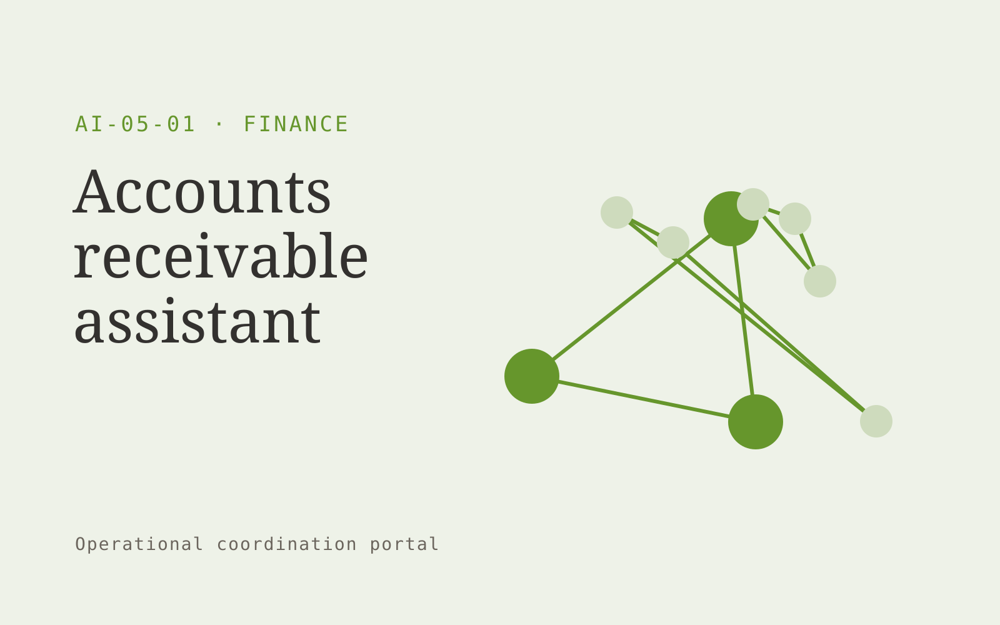

# Accounts receivable assistant

**Finance** · Also fits: Operations; Management

> For finance managers at creative agencies, turn invoice ledger, payment history and client correspondence into approved reminder drafts and collections priorities. Address the recurring problem: overdue invoices need context-sensitive follow-up. The value hypothesis is a more complete, reviewable deliverable with less repeated preparation; the pilot must establish whether that benefit is real.

| | |
|---|---|
| **Buyer** | Finance managers at creative agencies |
| **Problem** | Overdue invoices need context-sensitive follow-up. |
| **Format** | Operational coordination portal |
| **USP** | Collections workflow preserves client relationships and separates billing disputes. |

## The product
Key screens: Aging dashboard, reminder editor, dispute queue. Use a queue or timeline as the opening view, with clear owners, dates and current states. Each case opens into its source context, proposed actions and discussion. Give external participants a limited form or status page. Make the next required action visible without opening every record. In this product, the first view is aging dashboard, followed by reminder editor and dispute queue.

## Core functionality
1. Prioritize overdue balances.
2. Retrieve client context.
3. Draft reminders.
4. Distinguish disputes.
5. Schedule approved follow-ups.
6. Record payment outcomes.

## Customer workflow
Create a case from approved inputs, identify required actions, confirm owners and dates, request missing information, approve proposed communications or changes, track completion, and retain a handover record. Start with invoice ledger, payment history and client correspondence and finish with approved reminder drafts and collections priorities.

## AI and human review
Extract candidate actions and relevant context, classify requests and draft communications. Use explicit rules for scheduling, state transitions and permissions. People confirm obligations and approve consequential actions before execution.

## Customer inputs
Invoice ledger, payment history and client correspondence

## Customer deliverables
Approved reminder drafts and collections priorities

## Accounts and administration
Role permissions, task ownership, deadlines, reminders, approval gates, exception handling, action history, duplicate prevention and reversible configuration.

## MVP scope
Begin with finance managers at creative agencies and one recurring use case. Build the first two modules: prioritize overdue balances; retrieve client context. Provide operator assistance for the third module: draft reminders. Deliver approved reminder drafts and collections priorities through a manual review queue. Perform other necessary full-scope functions manually during the pilot. Include all applicable access, accuracy and professional-review controls from the start.

## After MVP validation
After paid pilots establish value, automate the remaining modules: distinguish disputes; schedule approved follow-ups; record payment outcomes. Add one validated source integration, reusable customer configuration and recurring delivery. Expand to additional teams, document formats or languages only after testing the new scope.

## Build dependencies
Explicit state definitions, owner mapping, approval rules, idempotent actions, notifications and recovery procedures. Workflow reliability matters more than fluent text.

## Integrations and data access
Accounting exports, invoice records and finance review processes. Calendars, email, task managers and relevant business records. Use draft actions and supervised handoffs first, then enable only specifically authorized writes. These are candidate integration categories, not verified supported connectors.

## Defensibility
Customer-specific workflow rules, reliable handoffs, operational history and integrations that make the service part of daily work. For this idea, build around collections workflow preserves client relationships and separates billing disputes. This advantage requires execution and accumulated customer trust; the base model alone is not a defensible asset.

## Alternatives and positioning
Shared inboxes, spreadsheets, task boards and existing workflow automation products. Differentiate on this specific proposed advantage: collections workflow preserves client relationships and separates billing disputes. Test it against the buyer's current method on the same task. Competitor coverage and uniqueness have not been established.

## Revenue model and test pricing (USD)
Test USD 750-2,500 setup plus USD 200-800 monthly for one bounded workflow and team. Cap case volume and implementation scope. Larger operational integrations need separate quotes. Prices are hypotheses.

## Main delivery costs
Workflow configuration, integration maintenance, model calls, notification delivery, exception support and monitoring.

## Marketing message to test
> Accounts receivable assistant for finance managers at creative agencies. Collections workflow preserves client relationships and separates billing disputes. Demonstrate the claim through a reviewed overdue-invoice action list.

## Acquisition channels
Bookkeeping firms serving agencies

## Lead magnet
A reviewed overdue-invoice action list

## First 30 days of marketing
- Week 1: interview five prospective buyers in this segment: finance managers at creative agencies. Ask to see a recent example of the problem and their current process.
- Week 2: prepare this demonstration using authorized or synthetic material: a reviewed overdue-invoice action list.
- Week 3: present it through bookkeeping firms serving agencies and seek one narrowly scoped paid pilot.
- Week 4: review overdue balance trend, staff handling time, total delivery effort and a concrete renewal decision before increasing scope.

## Paid pilot and validation
Run one recurring workflow with a small team. Track every handoff and exception, verify completed actions, and compare handling time and missed commitments with the prior process. For this idea, use invoice ledger, payment history and client correspondence and evaluate approved reminder drafts and collections priorities. Agree success thresholds with the buyer before starting; collect a baseline for overdue balance trend, staff handling time. A positive signal is payment and repeat use with acceptable quality and delivery cost, not a favorable demo reaction alone.

## Success metrics
Overdue balance trend, staff handling time

## Retention and expansion
Report completed actions and recurring exceptions. Maintain the workflow as policies change, then add one adjacent handoff with clear ownership.

## Operating controls and limitations
Reconcile calculations to approved records. Keep proposed entries and payment actions under finance-team control. Never invent missing financial inputs. Validate source access and reviewer availability during the pilot. Maintain customer-level access, data deletion controls and a record of final approvals.

## Brand style (concept)

- Colors: `#669127` primary · `#7754c9` accent · `#ecf1e4` surface · `#22201e` ink
- Type: Manrope for headings, Manrope for text
- Voice: Exact, sober, trustworthy
- Demo site: [https://nexibeo.com/solutions/accounts-receivable-assistant/demo/](https://nexibeo.com/solutions/accounts-receivable-assistant/demo/)

## Investment indication

Indicative build budget, from MVP to full product. This is a planning range, not a quote; it excludes running costs such as model usage, hosting and reviewer hours. Built with Nexibeo's AI software development factory, most implementations take days to a few weeks of creation time, depending on availability.

| Phase | Scope | Creation time | Indicative budget |
|---|---|---|---|
| MVP | One buyer segment, one recurring use case; first modules: prioritize overdue balances; retrieve client context. Manual review in the loop. | 6 days | $10,500 |
| Paid pilot | Accounts, roles, review states, audit trail and the first integration, hardened for two to three paying pilot customers. | 7 days | $13,000 |
| Full product | Remaining modules: distinguish disputes; schedule approved follow-ups; record payment outcomes. Self-serve onboarding, billing, monitoring and the wider integration set. | 3 weeks | $18,500 |
| **Total** | | about 5 weeks | **$42,000** |

### Running costs per month (rough indication, untested)

| Stage | Hosting and infrastructure | AI usage | Total per month |
|---|---|---|---|
| MVP and paid pilot (about 3 customers) | $50–$100 | $40–$90 | **$90–$190** |
| Full product (about 50 customers) | $190–$380 | $280–$560 | **$470–$940** |

**Get this built:** [contact Nexibeo](https://nexibeo.com/solutions/accounts-receivable-assistant/#apply). We build it with our AI software factory, usually in days to a few weeks, for you to run internally or offer to your clients.

## Research status
Concept proposal expanded from the 315-idea conversation. Demand, pricing, differentiation, build scope and integration feasibility are hypotheses, not verified market findings. Category link is inspiration rather than evidence of business viability.

## Credits and next steps

- **Estimation and having it built:** see the full solution page on [nexibeo.com](https://nexibeo.com/solutions/accounts-receivable-assistant/) for more detail on estimation. Nexibeo builds it for you as a custom AI implementation, to run internally or to offer to your own clients.
- **Become an AI-optimized specialist for Finance:** [Complete AI Training](https://completeaitraining.com/tag/finance/?contentType=ai-certification).
- Field news: [AI news for Finance](https://completeaitraining.com/all-ai-news-for-finance/).
