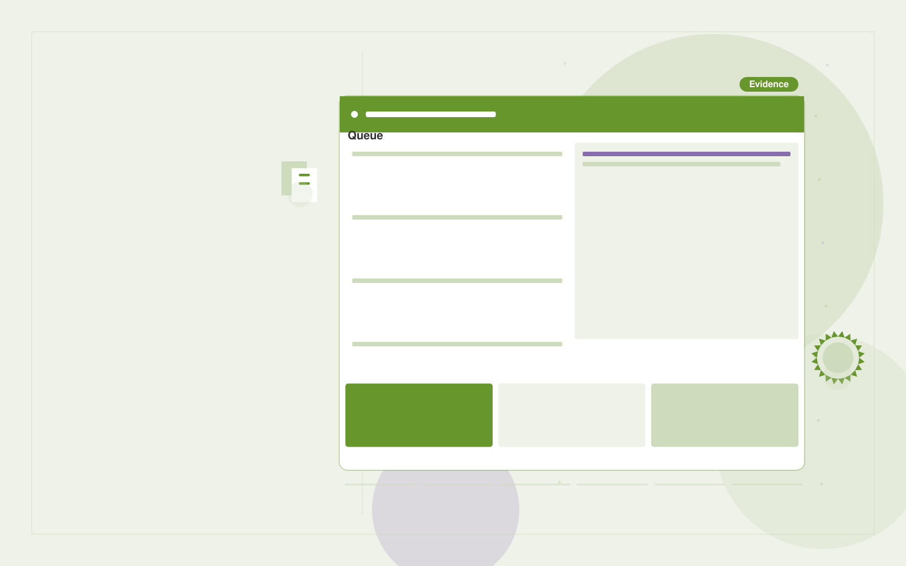

# Invoice exception detector

**Finance** · Also fits: Operations; Management

> For accounts payable teams at small wholesalers, turn invoices, supplier records and purchase orders into invoice exception register. Address the recurring problem: duplicate or mismatched invoices slip through manual checks. The value hypothesis is a more complete, reviewable deliverable with less repeated preparation; the pilot must establish whether that benefit is real.

| | |
|---|---|
| **Buyer** | Accounts payable teams at small wholesalers |
| **Problem** | Duplicate or mismatched invoices slip through manual checks. |
| **Format** | Evidence review and quality assurance workspace |
| **USP** | Evidence-led exception review before payment approval. |

## The product
Key screens: Invoice queue, exception evidence, reviewer decisions. Open on a review queue ordered by reviewer-selected priorities. Show each finding beside the original evidence and applicable rule. Provide accept, dismiss and needs-information controls with reasons. A separate report view summarizes confirmed findings and unresolved items, not raw AI flags. In this product, the first view is invoice queue, followed by exception evidence and reviewer decisions.

## Core functionality
1. Extract invoice fields.
2. Detect likely duplicates.
3. Compare order amounts.
4. Flag tax inconsistencies.
5. Record reviewer decisions.
6. Export exception reports.

## Customer workflow
Agree review criteria, ingest a sample, generate candidate findings, inspect supporting evidence, let reviewers confirm or dismiss each item, assign corrections, and recheck the affected material. Start with invoices, supplier records and purchase orders and finish with invoice exception register.

## AI and human review
Propose possible inconsistencies, omissions and rubric matches. Combine extraction with deterministic checks where rules are explicit. Reviewers make the final judgment. Keep false positives and missed cases visible during evaluation.

## Customer inputs
Invoices, supplier records and purchase orders

## Customer deliverables
Invoice exception register

## Accounts and administration
Versioned review criteria, evidence links, reviewer decisions, disagreement handling, correction assignments, recheck status and exportable review history.

## MVP scope
Begin with accounts payable teams at small wholesalers and one recurring use case. Build the first two modules: extract invoice fields; detect likely duplicates. Provide operator assistance for the third module: compare order amounts. Deliver invoice exception register through a manual review queue. Perform other necessary full-scope functions manually during the pilot. Include all applicable access, accuracy and professional-review controls from the start.

## After MVP validation
After paid pilots establish value, automate the remaining modules: flag tax inconsistencies; record reviewer decisions; export exception reports. Add one validated source integration, reusable customer configuration and recurring delivery. Expand to additional teams, document formats or languages only after testing the new scope.

## Build dependencies
Evidence coordinates, versioned rules, reviewer decisions and a representative reference set. Measure misses as well as confirmed findings before scaling.

## Integrations and data access
Accounting exports, invoice records and finance review processes. Source repositories, task trackers and report exports. Keep findings as review proposals until authorized owners accept the resulting actions. These are candidate integration categories, not verified supported connectors.

## Defensibility
A domain-specific review rubric and rights-cleared examples of confirmed defects, false alarms and reviewer reasoning. For this idea, build around evidence-led exception review before payment approval. This advantage requires execution and accumulated customer trust; the base model alone is not a defensible asset.

## Alternatives and positioning
Manual reviewers, checklists, generic scanning tools and specialist audit services. Differentiate on this specific proposed advantage: evidence-led exception review before payment approval. Test it against the buyer's current method on the same task. Competitor coverage and uniqueness have not been established.

## Revenue model and test pricing (USD)
Test USD 500-2,000 for a defined audit sample and report. Offer recurring review priced by reviewed items and specialist hours. Software-only access can follow a reliable reviewed service. All prices require validation.

## Main delivery costs
Document or media processing, model evaluation, expert review, false-positive handling, rechecks and customer-specific rubric calibration.

## Marketing message to test
> Invoice exception detector for accounts payable teams at small wholesalers. Evidence-led exception review before payment approval. Demonstrate the claim through a historical invoice exception audit.

## Acquisition channels
Accounting system implementers

## Lead magnet
A historical invoice exception audit

## First 30 days of marketing
- Week 1: interview five prospective buyers in this segment: accounts payable teams at small wholesalers. Ask to see a recent example of the problem and their current process.
- Week 2: prepare this demonstration using authorized or synthetic material: a historical invoice exception audit.
- Week 3: present it through accounting system implementers and seek one narrowly scoped paid pilot.
- Week 4: review confirmed exceptions, false positive rate, total delivery effort and a concrete renewal decision before increasing scope.

## Paid pilot and validation
Have a qualified reviewer independently assess the same sample. Compare confirmed findings, false alarms and omissions. Repeat on unseen material before agreeing recurring volume. For this idea, use invoices, supplier records and purchase orders and evaluate invoice exception register. Agree success thresholds with the buyer before starting; collect a baseline for confirmed exceptions, false positive rate. A positive signal is payment and repeat use with acceptable quality and delivery cost, not a favorable demo reaction alone.

## Success metrics
Confirmed exceptions, false positive rate

## Retention and expansion
Offer recurring reviews and rechecks of previously confirmed issues. Expand document or case types after validating the new rubric with qualified reviewers.

## Operating controls and limitations
Reconcile calculations to approved records. Keep proposed entries and payment actions under finance-team control. Never invent missing financial inputs. Validate source access and reviewer availability during the pilot. Maintain customer-level access, data deletion controls and a record of final approvals.

## Brand style (concept)

- Colors: `#569127` primary · `#9754c9` accent · `#eaf1e4` surface · `#22201e` ink
- Type: Manrope for headings, Manrope for text
- Voice: Exact, sober, trustworthy
- Demo site: [https://nexibeo.com/solutions/invoice-exception-detector/demo/](https://nexibeo.com/solutions/invoice-exception-detector/demo/)

## Investment indication

Indicative build budget, from MVP to full product. This is a planning range, not a quote; it excludes running costs such as model usage, hosting and reviewer hours. Built with Nexibeo's AI software development factory, most implementations take days to a few weeks of creation time, depending on availability.

| Phase | Scope | Creation time | Indicative budget |
|---|---|---|---|
| MVP | One buyer segment, one recurring use case; first modules: extract invoice fields; detect likely duplicates. Manual review in the loop. | 5 days | $9,500 |
| Paid pilot | Accounts, roles, review states, audit trail and the first integration, hardened for two to three paying pilot customers. | 6 days | $12,000 |
| Full product | Remaining modules: flag tax inconsistencies; record reviewer decisions; export exception reports. Self-serve onboarding, billing, monitoring and the wider integration set. | 2 weeks | $16,500 |
| **Total** | | about 5 weeks | **$38,000** |

### Running costs per month (rough indication, untested)

| Stage | Hosting and infrastructure | AI usage | Total per month |
|---|---|---|---|
| MVP and paid pilot (about 3 customers) | $50–$100 | $80–$160 | **$130–$260** |
| Full product (about 50 customers) | $190–$380 | $880–$1,750 | **$1,070–$2,130** |

**Get this built:** [contact Nexibeo](https://nexibeo.com/solutions/invoice-exception-detector/#apply). We build it with our AI software factory, usually in days to a few weeks, for you to run internally or offer to your clients.

## Research status
Concept proposal expanded from the 315-idea conversation. Demand, pricing, differentiation, build scope and integration feasibility are hypotheses, not verified market findings. Category link is inspiration rather than evidence of business viability.

## Credits and next steps

- **Estimation and having it built:** see the full solution page on [nexibeo.com](https://nexibeo.com/solutions/invoice-exception-detector/) for more detail on estimation. Nexibeo builds it for you as a custom AI implementation, to run internally or to offer to your own clients.
- **Become an AI-optimized specialist for Finance:** [Complete AI Training](https://completeaitraining.com/tag/finance/?contentType=ai-certification).
- Field news: [AI news for Finance](https://completeaitraining.com/all-ai-news-for-finance/).
