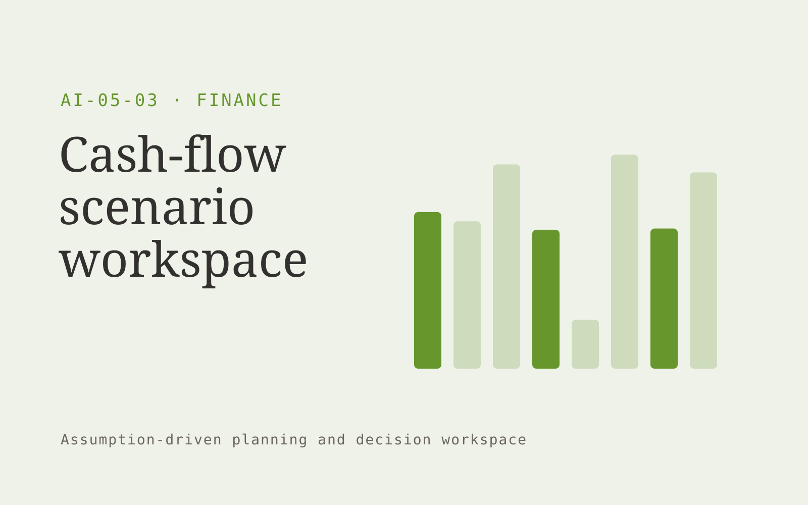

# Cash-flow scenario workspace

**Finance** · Also fits: Operations; Management

> For owners of project-based service companies, turn opening cash, receivables, payables and payment assumptions into editable cash scenarios and assumptions. Address the recurring problem: profitable projects still create cash timing surprises. The value hypothesis is a more complete, reviewable deliverable with less repeated preparation; the pilot must establish whether that benefit is real.

| | |
|---|---|
| **Buyer** | Owners of project-based service companies |
| **Problem** | Profitable projects still create cash timing surprises. |
| **Format** | Assumption-driven planning and decision workspace |
| **USP** | Explicit cash timing assumptions for project-based income. |

## The product
Key screens: Cash timeline, assumption editor, scenario comparison. Place editable drivers and constraints beside a clearly labeled scenario output. Include a baseline view, comparison chart or schedule, and an assumptions history. Let users trace a proposed quantity or date back to its inputs. Keep forecasts distinct from actual results. In this product, the first view is cash timeline, followed by assumption editor and scenario comparison.

## Core functionality
1. Validate opening balances.
2. Model payment timing.
3. Schedule commitments.
4. Compare collection scenarios.
5. Expose shortfall dates.
6. Reconcile actual movements.

## Customer workflow
Validate baseline inputs, confirm definitions and constraints, select editable assumptions, calculate feasible alternatives, inspect sensitivities, let the responsible person approve a plan, and compare later actuals with the recorded assumptions. Start with opening cash, receivables, payables and payment assumptions and finish with editable cash scenarios and assumptions.

## AI and human review
Extract input context and explain scenario differences. Use deterministic calculations or explicit optimization for quantities, compatibility, dates and prices. Show uncertain assumptions. Never let generated prose silently change the calculation rules.

## Customer inputs
Opening cash, receivables, payables and payment assumptions

## Customer deliverables
Editable cash scenarios and assumptions

## Accounts and administration
Scenario versions, baseline reconciliation, constraint checks, assumption ownership, reviewer approvals, plan exports and actual-versus-plan tracking.

## MVP scope
Begin with owners of project-based service companies and one recurring use case. Build the first two modules: validate opening balances; model payment timing. Provide operator assistance for the third module: schedule commitments. Deliver editable cash scenarios and assumptions through a manual review queue. Perform other necessary full-scope functions manually during the pilot. Include all applicable access, accuracy and professional-review controls from the start.

## After MVP validation
After paid pilots establish value, automate the remaining modules: compare collection scenarios; expose shortfall dates; reconcile actual movements. Add one validated source integration, reusable customer configuration and recurring delivery. Expand to additional teams, document formats or languages only after testing the new scope.

## Build dependencies
A defensible calculation model, explicit units, constraint validation and representative boundary tests. Advanced forecasting or optimization needs adequate historical data.

## Integrations and data access
Accounting exports, invoice records and finance review processes. Read-only operational exports, calendars and finance or inventory records as relevant. Start with plan exports and retain human approval for execution. These are candidate integration categories, not verified supported connectors.

## Defensibility
A validated domain model, customer-approved constraints and forecast or decision history that improves practical planning. For this idea, build around explicit cash timing assumptions for project-based income. This advantage requires execution and accumulated customer trust; the base model alone is not a defensible asset.

## Alternatives and positioning
Spreadsheets, planners, specialist forecasting tools and existing scheduling or configuration software. Differentiate on this specific proposed advantage: explicit cash timing assumptions for project-based income. Test it against the buyer's current method on the same task. Competitor coverage and uniqueness have not been established.

## Revenue model and test pricing (USD)
Test USD 750-3,000 for a scoped planning setup and review, then USD 200-900 monthly for refreshes within agreed complexity. Data integration and optimization are separately scoped. All ranges are hypotheses.

## Main delivery costs
Data preparation, domain modeling, validation, scenario computation, reviewer support and ongoing assumption maintenance.

## Marketing message to test
> Cash-flow scenario workspace for owners of project-based service companies. Explicit cash timing assumptions for project-based income. Demonstrate the claim through a thirteen-week cash timing scenario.

## Acquisition channels
Fractional CFO networks

## Lead magnet
A thirteen-week cash timing scenario

## First 30 days of marketing
- Week 1: interview five prospective buyers in this segment: owners of project-based service companies. Ask to see a recent example of the problem and their current process.
- Week 2: prepare this demonstration using authorized or synthetic material: a thirteen-week cash timing scenario.
- Week 3: present it through fractional CFO networks and seek one narrowly scoped paid pilot.
- Week 4: review forecast error, reconciled balances, total delivery effort and a concrete renewal decision before increasing scope.

## Paid pilot and validation
Reproduce a known historical plan, test missing inputs and boundary constraints, then run a new scenario. Compare feasibility, reconciliation and observed error rather than judging the quality of the explanation alone. For this idea, use opening cash, receivables, payables and payment assumptions and evaluate editable cash scenarios and assumptions. Agree success thresholds with the buyer before starting; collect a baseline for forecast error, reconciled balances. A positive signal is payment and repeat use with acceptable quality and delivery cost, not a favorable demo reaction alone.

## Success metrics
Forecast error, reconciled balances

## Retention and expansion
Refresh inputs, compare recorded assumptions with actual outcomes and refine validated constraints. Expand scenario complexity only when the buyer uses it for a decision.

## Operating controls and limitations
Reconcile calculations to approved records. Keep proposed entries and payment actions under finance-team control. Never invent missing financial inputs. Validate source access and reviewer availability during the pilot. Maintain customer-level access, data deletion controls and a record of final approvals.

## Brand style (concept)

- Colors: `#719127` primary · `#8754c9` accent · `#edf1e4` surface · `#22201e` ink
- Type: Manrope for headings, Manrope for text
- Voice: Exact, sober, trustworthy
- Demo site: [https://nexibeo.com/ideas/cash-flow-scenario-workspace/demo/](https://nexibeo.com/ideas/cash-flow-scenario-workspace/demo/)

## Investment indication

Indicative build budget, from MVP to full product. This is a planning range, not a quote; it excludes running costs such as model usage, hosting and reviewer hours.

| Phase | Scope | Timeline | Indicative budget |
|---|---|---|---|
| MVP | One buyer segment, one recurring use case; first modules: validate opening balances; model payment timing. Manual review in the loop. | 5 weeks | $9,500 |
| Paid pilot | Accounts, roles, review states, audit trail and the first integration, hardened for two to three paying pilot customers. | 7 weeks | $12,000 |
| Full product | Remaining modules: compare collection scenarios; expose shortfall dates; reconcile actual movements. Self-serve onboarding, billing, monitoring and the wider integration set. | 11 weeks | $17,000 |
| **Total** | | 23 weeks | **$38,500** |

### Running costs per month (rough indication, untested)

| Stage | Hosting and infrastructure | AI usage | Total per month |
|---|---|---|---|
| MVP and paid pilot (about 3 customers) | $50–$100 | $50–$100 | **$100–$200** |
| Full product (about 50 customers) | $190–$380 | $350–$700 | **$540–$1,080** |

**Co-create this project with us:** [contact Nexibeo](https://nexibeo.com/ideas/cash-flow-scenario-workspace/#apply) and we build it with you.

## Research status
Concept proposal expanded from the 315-idea conversation. Demand, pricing, differentiation, build scope and integration feasibility are hypotheses, not verified market findings. Category link is inspiration rather than evidence of business viability.

## Credits and next steps

- **Estimation and building this idea:** see the full idea page on [nexibeo.com](https://nexibeo.com/ideas/cash-flow-scenario-workspace/) for more detail on estimation, and to co-create and build this idea with Nexibeo.
- **Become an AI-optimized specialist for Finance:** [Complete AI Training](https://completeaitraining.com/tag/finance/?contentType=ai-certification).
- Field news: [AI news for Finance](https://completeaitraining.com/all-ai-news-for-finance/).
