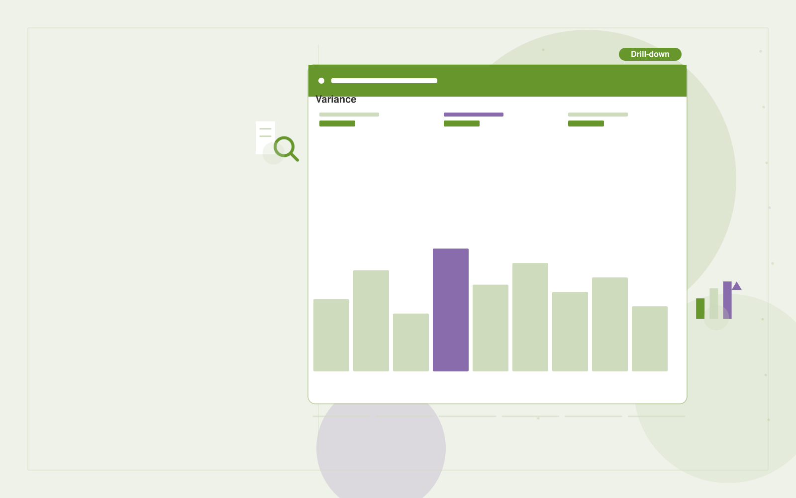

# Budget variance explainer

**Finance** · Also fits: Operations; Management; Science and Research

> For controllers at multi-department service businesses, turn budgets, actual ledgers and department explanations into reviewed variance commentary. Address the recurring problem: variance narratives are late and inconsistent. The value hypothesis is a more complete, reviewable deliverable with less repeated preparation; the pilot must establish whether that benefit is real.

| | |
|---|---|
| **Buyer** | Controllers at multi-department service businesses |
| **Problem** | Variance narratives are late and inconsistent. |
| **Format** | Evidence-backed analysis and reporting workspace |
| **USP** | Clear distinction between calculated variance and management's explanation. |

## The product
Key screens: Variance table, source drill-down, narrative approval. Open with a compact overview and filters for the relevant period or segment. Let users drill from each theme or metric into underlying records. Keep source definitions and missing-data notes near the result. Use an action panel to assign investigations and record what was learned. In this product, the first view is variance table, followed by source drill-down and narrative approval.

## Core functionality
1. Match reporting periods.
2. Calculate variance consistently.
3. Locate drivers.
4. Request owner context.
5. Draft explanations.
6. Preserve reviewer changes.

## Customer workflow
Agree definitions, import authorized data, validate coverage and identifiers, compute transparent measures, group relevant evidence, review findings, assign investigations or improvements, and repeat on a comparable period. Start with budgets, actual ledgers and department explanations and finish with reviewed variance commentary.

## AI and human review
Classify text, summarize evidence and propose explanations to investigate. Compute financial or operational measures with deterministic code. Separate observed patterns from causal claims and preserve examples that contradict the summary.

## Customer inputs
Budgets, actual ledgers and department explanations

## Customer deliverables
Reviewed variance commentary

## Accounts and administration
Dataset permissions, field mappings, metric definitions, source drill-down, saved filters, reviewer annotations, recurring reports and action ownership.

## MVP scope
Begin with controllers at multi-department service businesses and one recurring use case. Build the first two modules: match reporting periods; calculate variance consistently. Provide operator assistance for the third module: locate drivers. Deliver reviewed variance commentary through a manual review queue. Perform other necessary full-scope functions manually during the pilot. Include all applicable access, accuracy and professional-review controls from the start.

## After MVP validation
After paid pilots establish value, automate the remaining modules: request owner context; draft explanations; preserve reviewer changes. Add one validated source integration, reusable customer configuration and recurring delivery. Expand to additional teams, document formats or languages only after testing the new scope.

## Build dependencies
Stable identifiers, consistent metric definitions, deterministic calculations, source lineage and representative review samples. Poor coverage must remain visible.

## Integrations and data access
Accounting exports, invoice records and finance review processes. Read-only business data exports, reporting databases and task trackers. Reconcile source totals before scheduling recurring data refreshes. These are candidate integration categories, not verified supported connectors.

## Defensibility
Domain-specific definitions, trusted source mappings and a history connecting findings to actions and observed results. For this idea, build around clear distinction between calculated variance and management's explanation. This advantage requires execution and accumulated customer trust; the base model alone is not a defensible asset.

## Alternatives and positioning
Analysts, business intelligence dashboards, spreadsheets and general text summarization tools. Differentiate on this specific proposed advantage: clear distinction between calculated variance and management's explanation. Test it against the buyer's current method on the same task. Competitor coverage and uniqueness have not been established.

## Revenue model and test pricing (USD)
Test USD 500-2,000 for an initial analysis of one bounded dataset. Offer USD 250-1,000 monthly for repeat reporting at agreed volume. Data cleanup and specialist analysis are separately priced. These are test ranges.

## Main delivery costs
Data preparation, reconciliation, classification, expert interpretation, customer-specific definitions and recurring reporting support.

## Marketing message to test
> Budget variance explainer for controllers at multi-department service businesses. Clear distinction between calculated variance and management's explanation. Demonstrate the claim through a department variance commentary sample.

## Acquisition channels
FP&A communities

## Lead magnet
A department variance commentary sample

## First 30 days of marketing
- Week 1: interview five prospective buyers in this segment: controllers at multi-department service businesses. Ask to see a recent example of the problem and their current process.
- Week 2: prepare this demonstration using authorized or synthetic material: a department variance commentary sample.
- Week 3: present it through FP&A communities and seek one narrowly scoped paid pilot.
- Week 4: review narrative correction rate, reporting cycle time, total delivery effort and a concrete renewal decision before increasing scope.

## Paid pilot and validation
Analyze one historical period and review findings with the responsible domain owner. Reconcile headline measures, inspect counterexamples and ask the buyer to choose a concrete follow-up action. For this idea, use budgets, actual ledgers and department explanations and evaluate reviewed variance commentary. Agree success thresholds with the buyer before starting; collect a baseline for narrative correction rate, reporting cycle time. A positive signal is payment and repeat use with acceptable quality and delivery cost, not a favorable demo reaction alone.

## Success metrics
Narrative correction rate, reporting cycle time

## Retention and expansion
Repeat the same definitions each reporting period and track whether findings lead to useful action. Expand data sources without breaking historical comparability.

## Operating controls and limitations
Reconcile calculations to approved records. Keep proposed entries and payment actions under finance-team control. Never invent missing financial inputs. Validate source access and reviewer availability during the pilot. Maintain customer-level access, data deletion controls and a record of final approvals.

## Brand style (concept)

- Colors: `#689127` primary · `#9154c9` accent · `#ecf1e4` surface · `#22201e` ink
- Type: Manrope for headings, Manrope for text
- Voice: Exact, sober, trustworthy
- Demo site: [https://nexibeo.com/ideas/budget-variance-explainer/demo/](https://nexibeo.com/ideas/budget-variance-explainer/demo/)

## Investment indication

Indicative build budget, from MVP to full product. This is a planning range, not a quote; it excludes running costs such as model usage, hosting and reviewer hours. Built with Nexibeo's AI software development factory, most implementations take days to a few weeks of creation time, depending on availability.

| Phase | Scope | Creation time | Indicative budget |
|---|---|---|---|
| MVP | One buyer segment, one recurring use case; first modules: match reporting periods; calculate variance consistently. Manual review in the loop. | 5 days | $9,500 |
| Paid pilot | Accounts, roles, review states, audit trail and the first integration, hardened for two to three paying pilot customers. | 6 days | $12,000 |
| Full product | Remaining modules: request owner context; draft explanations; preserve reviewer changes. Self-serve onboarding, billing, monitoring and the wider integration set. | 2 weeks | $17,000 |
| **Total** | | about 5 weeks | **$38,500** |

### Running costs per month (rough indication, untested)

| Stage | Hosting and infrastructure | AI usage | Total per month |
|---|---|---|---|
| MVP and paid pilot (about 3 customers) | $50–$100 | $80–$160 | **$130–$260** |
| Full product (about 50 customers) | $190–$380 | $880–$1,750 | **$1,070–$2,130** |

**Co-create this project with us:** [contact Nexibeo](https://nexibeo.com/ideas/budget-variance-explainer/#apply) and we build it with you.

## Research status
Concept proposal expanded from the 315-idea conversation. Demand, pricing, differentiation, build scope and integration feasibility are hypotheses, not verified market findings. Category link is inspiration rather than evidence of business viability.

## Credits and next steps

- **Estimation and building this idea:** see the full idea page on [nexibeo.com](https://nexibeo.com/ideas/budget-variance-explainer/) for more detail on estimation, and to co-create and build this idea with Nexibeo.
- **Become an AI-optimized specialist for Finance:** [Complete AI Training](https://completeaitraining.com/tag/finance/?contentType=ai-certification).
- Field news: [AI news for Finance](https://completeaitraining.com/all-ai-news-for-finance/).
