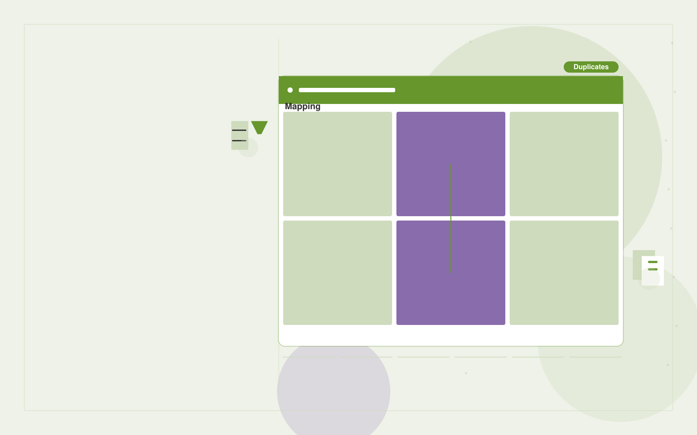

# Finance data cleanup service

**Finance** · Also fits: Operations; Management; IT and Development

> For finance teams integrating acquired small businesses, turn account lists, vendor records and mapping rules into cleaned reference tables and mapping audit trail. Address the recurring problem: vendor and account inconsistencies distort combined reports. The value hypothesis is a more complete, reviewable deliverable with less repeated preparation; the pilot must establish whether that benefit is real.

| | |
|---|---|
| **Buyer** | Finance teams integrating acquired small businesses |
| **Problem** | Vendor and account inconsistencies distort combined reports. |
| **Format** | Searchable structured library and data stewardship console |
| **USP** | Traceable mappings with ambiguous records kept out of automatic merges. |

## The product
Key screens: Mapping workbench, duplicates, reconciliation checks. Use a searchable table or visual gallery with filters for the domain’s important attributes. Open each item into a detail drawer containing source records, ownership and history. Put proposed merges and field changes in a separate review queue. Provide a preview before any bulk export. In this product, the first view is mapping workbench, followed by duplicates and reconciliation checks.

## Core functionality
1. Suggest entity matches.
2. Preserve original values.
3. Propose account mappings.
4. Flag ambiguous joins.
5. Require approval.
6. Export versioned mappings.

## Customer workflow
Import a limited collection, define canonical fields, suggest tags or mappings, review uncertain records, publish approved items, search and reuse them, and request periodic owner updates. Start with account lists, vendor records and mapping rules and finish with cleaned reference tables and mapping audit trail.

## AI and human review
Suggest classifications, semantic tags, duplicate candidates and field mappings. Preserve original values. Use explicit validation for identifiers and units. Human stewards approve ambiguous merges and factual changes.

## Customer inputs
Account lists, vendor records and mapping rules

## Customer deliverables
Cleaned reference tables and mapping audit trail

## Accounts and administration
Record ownership, access permissions, change proposals, original-value retention, version history, review dates, bulk import/export and duplicate resolution.

## MVP scope
Begin with finance teams integrating acquired small businesses and one recurring use case. Build the first two modules: suggest entity matches; preserve original values. Provide operator assistance for the third module: propose account mappings. Deliver cleaned reference tables and mapping audit trail through a manual review queue. Perform other necessary full-scope functions manually during the pilot. Include all applicable access, accuracy and professional-review controls from the start.

## After MVP validation
After paid pilots establish value, automate the remaining modules: flag ambiguous joins; require approval; export versioned mappings. Add one validated source integration, reusable customer configuration and recurring delivery. Expand to additional teams, document formats or languages only after testing the new scope.

## Build dependencies
Stable identifiers, an agreed data schema, reversible imports, mapping review and source ownership. Data quality work can exceed model development effort.

## Integrations and data access
Accounting exports, invoice records and finance review processes. Source systems, catalog exports and cloud file storage. Start with reversible CSV or file imports and validate identifiers before any direct writes. These are candidate integration categories, not verified supported connectors.

## Defensibility
A useful niche taxonomy, customer-approved mappings and accumulated correction history that improve retrieval and reduce repeated cleanup. For this idea, build around traceable mappings with ambiguous records kept out of automatic merges. This advantage requires execution and accumulated customer trust; the base model alone is not a defensible asset.

## Alternatives and positioning
Spreadsheets, shared folders, existing asset or information management systems and manual data cleanup. Differentiate on this specific proposed advantage: traceable mappings with ambiguous records kept out of automatic merges. Test it against the buyer's current method on the same task. Competitor coverage and uniqueness have not been established.

## Revenue model and test pricing (USD)
Test USD 500-2,500 for one collection cleanup and launch, followed by USD 100-500 monthly for maintenance within agreed record limits. Larger migrations and complex rights management are separately scoped. Prices are hypotheses.

## Main delivery costs
Import cleanup, extraction, storage, indexing, steward review, duplicate investigation and recurring source updates.

## Marketing message to test
> Finance data cleanup service for finance teams integrating acquired small businesses. Traceable mappings with ambiguous records kept out of automatic merges. Demonstrate the claim through a sample vendor normalization report.

## Acquisition channels
Accounting migration partners

## Lead magnet
A sample vendor normalization report

## First 30 days of marketing
- Week 1: interview five prospective buyers in this segment: finance teams integrating acquired small businesses. Ask to see a recent example of the problem and their current process.
- Week 2: prepare this demonstration using authorized or synthetic material: a sample vendor normalization report.
- Week 3: present it through accounting migration partners and seek one narrowly scoped paid pilot.
- Week 4: review approved match accuracy, reconciliation differences, total delivery effort and a concrete renewal decision before increasing scope.

## Paid pilot and validation
Clean and organize one representative collection. Have users perform real search or mapping tasks. Check every proposed merge in the sample and compare search success with the existing system. For this idea, use account lists, vendor records and mapping rules and evaluate cleaned reference tables and mapping audit trail. Agree success thresholds with the buyer before starting; collect a baseline for approved match accuracy, reconciliation differences. A positive signal is payment and repeat use with acceptable quality and delivery cost, not a favorable demo reaction alone.

## Success metrics
Approved match accuracy, reconciliation differences

## Retention and expansion
Provide owner reminders and periodic cleanup. Add another collection only after record quality and retrieval are stable in the initial one.

## Operating controls and limitations
Reconcile calculations to approved records. Keep proposed entries and payment actions under finance-team control. Never invent missing financial inputs. Validate source access and reviewer availability during the pilot. Maintain customer-level access, data deletion controls and a record of final approvals.

## Brand style (concept)

- Colors: `#5f9127` primary · `#7f54c9` accent · `#ebf1e4` surface · `#22201e` ink
- Type: Archivo for headings, Lora for text
- Voice: Exact, sober, trustworthy
- Demo site: [https://nexibeo.com/ideas/finance-data-cleanup-service/demo/](https://nexibeo.com/ideas/finance-data-cleanup-service/demo/)

## Investment indication

Indicative build budget, from MVP to full product. This is a planning range, not a quote; it excludes running costs such as model usage, hosting and reviewer hours. Built with Nexibeo's AI software development factory, most implementations take days to a few weeks of creation time, depending on availability.

| Phase | Scope | Creation time | Indicative budget |
|---|---|---|---|
| MVP | One buyer segment, one recurring use case; first modules: suggest entity matches; preserve original values. Manual review in the loop. | 5 days | $9,500 |
| Paid pilot | Accounts, roles, review states, audit trail and the first integration, hardened for two to three paying pilot customers. | 6 days | $12,000 |
| Full product | Remaining modules: flag ambiguous joins; require approval; export versioned mappings. Self-serve onboarding, billing, monitoring and the wider integration set. | 2 weeks | $17,000 |
| **Total** | | about 5 weeks | **$38,500** |

### Running costs per month (rough indication, untested)

| Stage | Hosting and infrastructure | AI usage | Total per month |
|---|---|---|---|
| MVP and paid pilot (about 3 customers) | $50–$100 | $50–$100 | **$100–$200** |
| Full product (about 50 customers) | $190–$380 | $350–$700 | **$540–$1,080** |

**Co-create this project with us:** [contact Nexibeo](https://nexibeo.com/ideas/finance-data-cleanup-service/#apply) and we build it with you.

## Research status
Concept proposal expanded from the 315-idea conversation. Demand, pricing, differentiation, build scope and integration feasibility are hypotheses, not verified market findings. Category link is inspiration rather than evidence of business viability.

## Credits and next steps

- **Estimation and building this idea:** see the full idea page on [nexibeo.com](https://nexibeo.com/ideas/finance-data-cleanup-service/) for more detail on estimation, and to co-create and build this idea with Nexibeo.
- **Become an AI-optimized specialist for Finance:** [Complete AI Training](https://completeaitraining.com/tag/finance/?contentType=ai-certification).
- Field news: [AI news for Finance](https://completeaitraining.com/all-ai-news-for-finance/).
