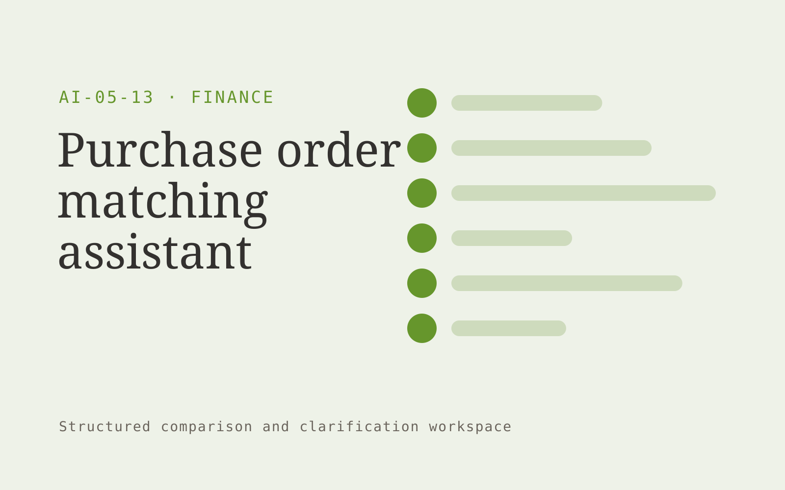

# Purchase order matching assistant

**Finance** · Also fits: Operations; Management

> For accounts payable leads at distributors, turn purchase orders, goods receipts and supplier invoices into matched invoice pack and discrepancy report. Address the recurring problem: invoices require manual cross-checks across three document types. The value hypothesis is a more complete, reviewable deliverable with less repeated preparation; the pilot must establish whether that benefit is real.

| | |
|---|---|
| **Buyer** | Accounts payable leads at distributors |
| **Problem** | Invoices require manual cross-checks across three document types. |
| **Format** | Structured comparison and clarification workspace |
| **USP** | Explains each mismatch using the corresponding order and receipt lines. |

## The product
Key screens: Matching matrix, discrepancy panel, approval queue. Use a side-by-side matrix with the same fields for every document or option. Clicking a value reveals its original passage. Highlight missing, different and uncertain items separately. Provide a clarification queue and reviewer annotations before exporting a decision pack. In this product, the first view is matching matrix, followed by discrepancy panel and approval queue.

## Core functionality
1. Link document identities.
2. Compare quantities.
3. Reconcile unit prices.
4. Apply agreed tolerances.
5. Flag partial receipts.
6. Prepare approval evidence.

## Customer workflow
Define comparison fields, upload source versions or offers, extract candidate values, normalize only agreed units, inspect differences, resolve questions with reviewers, and export an evidence-linked comparison. Start with purchase orders, goods receipts and supplier invoices and finish with matched invoice pack and discrepancy report.

## AI and human review
Align document sections and extract proposed comparable fields. Deterministic checks handle units and arithmetic. Preserve original wording and label assumptions. Professional reviewers assess the meaning and significance of differences.

## Customer inputs
Purchase orders, goods receipts and supplier invoices

## Customer deliverables
Matched invoice pack and discrepancy report

## Accounts and administration
Document versions, field definitions, source references, reviewer corrections, unresolved questions, comparison history and exportable matrices.

## MVP scope
Begin with accounts payable leads at distributors and one recurring use case. Build the first two modules: link document identities; compare quantities. Provide operator assistance for the third module: reconcile unit prices. Deliver matched invoice pack and discrepancy report through a manual review queue. Perform other necessary full-scope functions manually during the pilot. Include all applicable access, accuracy and professional-review controls from the start.

## After MVP validation
After paid pilots establish value, automate the remaining modules: apply agreed tolerances; flag partial receipts; prepare approval evidence. Add one validated source integration, reusable customer configuration and recurring delivery. Expand to additional teams, document formats or languages only after testing the new scope.

## Build dependencies
Document alignment, field provenance, unit normalization, missing-value handling and reviewer correction. Similar-looking documents may contain materially different terms.

## Integrations and data access
Accounting exports, invoice records and finance review processes. Document repositories, procurement or contract records and spreadsheet exports. Preserve originals and avoid writing back interpretations without approval. These are candidate integration categories, not verified supported connectors.

## Defensibility
A niche comparison schema, reviewed extraction examples and clear handling of the differences that matter to a specific buyer. For this idea, build around explains each mismatch using the corresponding order and receipt lines. This advantage requires execution and accumulated customer trust; the base model alone is not a defensible asset.

## Alternatives and positioning
Spreadsheet comparisons, professional reviewers, document diff tools and manual quote or contract review. Differentiate on this specific proposed advantage: explains each mismatch using the corresponding order and receipt lines. Test it against the buyer's current method on the same task. Competitor coverage and uniqueness have not been established.

## Revenue model and test pricing (USD)
Test USD 300-1,500 for one bounded comparison package, then USD 150-600 monthly for recurring volume with review limits. Complex expert interpretation is separately priced. Figures are hypotheses.

## Main delivery costs
Document parsing, field alignment, source verification, expert interpretation, clarification rounds and changing document formats.

## Marketing message to test
> Purchase order matching assistant for accounts payable leads at distributors. Explains each mismatch using the corresponding order and receipt lines. Demonstrate the claim through a three-way match demonstration with discrepancies.

## Acquisition channels
ERP implementation partners

## Lead magnet
A three-way match demonstration with discrepancies

## First 30 days of marketing
- Week 1: interview five prospective buyers in this segment: accounts payable leads at distributors. Ask to see a recent example of the problem and their current process.
- Week 2: prepare this demonstration using authorized or synthetic material: a three-way match demonstration with discrepancies.
- Week 3: present it through ERP implementation partners and seek one narrowly scoped paid pilot.
- Week 4: review match accuracy, exception handling time, total delivery effort and a concrete renewal decision before increasing scope.

## Paid pilot and validation
Compare a known set already reviewed by a domain expert. Check meaningful differences, false alarms and missing fields. Measure reviewer time including corrections rather than extraction speed alone. For this idea, use purchase orders, goods receipts and supplier invoices and evaluate matched invoice pack and discrepancy report. Agree success thresholds with the buyer before starting; collect a baseline for match accuracy, exception handling time. A positive signal is payment and repeat use with acceptable quality and delivery cost, not a favorable demo reaction alone.

## Success metrics
Match accuracy, exception handling time

## Retention and expansion
Save reviewer-approved comparison fields and recurring document formats. Offer repeat comparisons and explicit updates when the source options change.

## Operating controls and limitations
Reconcile calculations to approved records. Keep proposed entries and payment actions under finance-team control. Never invent missing financial inputs. Validate source access and reviewer availability during the pilot. Maintain customer-level access, data deletion controls and a record of final approvals.

## Brand style (concept)

- Colors: `#5a9127` primary · `#ac54c9` accent · `#eaf1e4` surface · `#22201e` ink
- Type: Archivo for headings, Lora for text
- Voice: Exact, sober, trustworthy
- Demo site: [https://nexibeo.com/ideas/purchase-order-matching-assistant/demo/](https://nexibeo.com/ideas/purchase-order-matching-assistant/demo/)

## Investment indication

Indicative build budget, from MVP to full product. This is a planning range, not a quote; it excludes running costs such as model usage, hosting and reviewer hours.

| Phase | Scope | Timeline | Indicative budget |
|---|---|---|---|
| MVP | One buyer segment, one recurring use case; first modules: link document identities; compare quantities. Manual review in the loop. | 5 weeks | $10,000 |
| Paid pilot | Accounts, roles, review states, audit trail and the first integration, hardened for two to three paying pilot customers. | 7 weeks | $12,000 |
| Full product | Remaining modules: apply agreed tolerances; flag partial receipts; prepare approval evidence. Self-serve onboarding, billing, monitoring and the wider integration set. | 11 weeks | $17,000 |
| **Total** | | 23 weeks | **$39,000** |

**Co-create this project with us:** [contact Nexibeo](https://nexibeo.com/ideas/purchase-order-matching-assistant/#apply) and we build it with you.

## Research status
Concept proposal expanded from the 315-idea conversation. Demand, pricing, differentiation, build scope and integration feasibility are hypotheses, not verified market findings. Category link is inspiration rather than evidence of business viability.

## Credits and next steps

- **Estimation and building this idea:** see the full idea page on [nexibeo.com](https://nexibeo.com/ideas/purchase-order-matching-assistant/) for more detail on estimation, and to co-create and build this idea with Nexibeo.
- **Become an AI-optimized specialist for Finance:** [Complete AI Training](https://completeaitraining.com/tag/finance/?contentType=ai-certification).
- Field news: [AI news for Finance](https://completeaitraining.com/all-ai-news-for-finance/).
