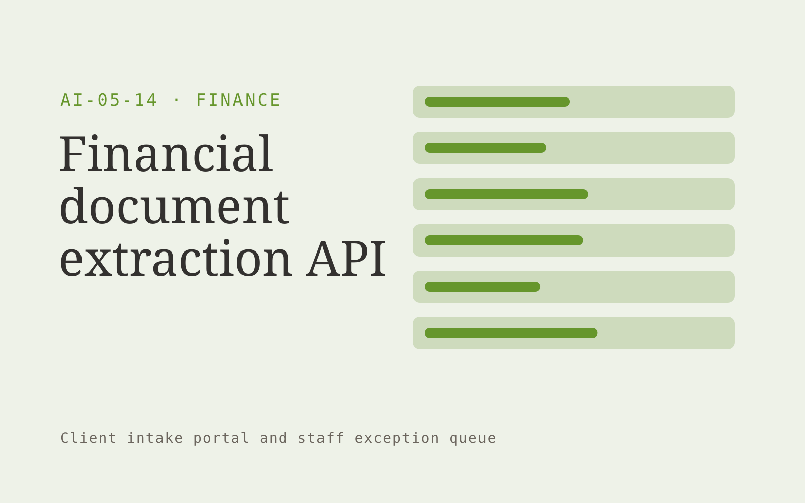

# Financial document extraction API

**AI-05-14 · Finance** · Also fits: Operations; Management; Customer Support

> For software vendors processing business financial documents, turn defined document types and customer field schemas into structured document data with source references. Address the recurring problem: document formats vary and break fixed extraction rules. The value hypothesis is a more complete, reviewable deliverable with less repeated preparation; the pilot must establish whether that benefit is real.

| | |
|---|---|
| **Buyer** | Software vendors processing business financial documents |
| **Problem** | Document formats vary and break fixed extraction rules. |
| **Format** | Client intake portal and staff exception queue |
| **USP** | Field-level provenance and schema validation for a narrow document niche. |

## The product
Key screens: Schema designer, extraction review, API usage. Give submitters a mobile-friendly step-by-step form with document uploads and a visible completeness checklist. Staff see a queue with missing items and extracted fields. Place the original document beside each uncertain value. Show submitted, clarification required and ready-for-review states. In this product, the first view is schema designer, followed by extraction review and API usage.

## Core functionality
1. Define extraction schemas.
2. Capture source coordinates.
3. Validate field formats.
4. Flag uncertain values.
5. Support correction feedback.
6. Deliver structured responses.

## Customer workflow
Choose the request type, collect declared facts and required documents, extract relevant fields, show missing or inconsistent information, let the submitter correct it, and route the complete package to an authorized reviewer. Start with defined document types and customer field schemas and finish with structured document data with source references.

## AI and human review
Classify submitted material, extract candidate fields and draft clarification questions. Deterministic rules test required fields and formats. Keep uncertain extraction visible and preserve the original statement. Do not infer missing material facts.

## Customer inputs
Defined document types and customer field schemas

## Customer deliverables
Structured document data with source references

## Accounts and administration
Secure uploads, configurable checklists, progress saving, duplicate handling, reviewer assignments, clarification threads, deadlines and submission history.

## MVP scope
Begin with software vendors processing business financial documents and one recurring use case. Build the first two modules: define extraction schemas; capture source coordinates. Provide operator assistance for the third module: validate field formats. Deliver structured document data with source references through a manual review queue. Perform other necessary full-scope functions manually during the pilot. Include all applicable access, accuracy and professional-review controls from the start.

## After MVP validation
After paid pilots establish value, automate the remaining modules: flag uncertain values; support correction feedback; deliver structured responses. Add one validated source integration, reusable customer configuration and recurring delivery. Expand to additional teams, document formats or languages only after testing the new scope.

## Build dependencies
Secure upload handling, reliable extraction, versioned completeness rules, submitter identity and staff routing. Third-party checklist changes require maintenance.

## Integrations and data access
Accounting exports, invoice records and finance review processes. Case management, customer records, document storage and notification systems. Begin with an exportable review pack before automating destination writes. These are candidate integration categories, not verified supported connectors.

## Defensibility
Document-type expertise, tested completeness rules and a low-friction client experience embedded in a repeat administrative process. For this idea, build around field-level provenance and schema validation for a narrow document niche. This advantage requires execution and accumulated customer trust; the base model alone is not a defensible asset.

## Alternatives and positioning
Email collection, generic web forms, spreadsheets and existing case management systems. Differentiate on this specific proposed advantage: field-level provenance and schema validation for a narrow document niche. Test it against the buyer's current method on the same task. Competitor coverage and uniqueness have not been established.

## Revenue model and test pricing (USD)
Test USD 500-2,000 setup plus USD 150-750 monthly for one form family and a capped submission volume. Quote specialist review and unusual document formats separately. Prices are experimental.

## Main delivery costs
Document processing, storage, exception review, support, checklist maintenance and customer-specific integration work.

## Marketing message to test
> Financial document extraction API for software vendors processing business financial documents. Field-level provenance and schema validation for a narrow document niche. Demonstrate the claim through a benchmark on representative customer documents.

## Acquisition channels
Vertical software developer communities

## Lead magnet
A benchmark on representative customer documents

## First 30 days of marketing
- Week 1: interview five prospective buyers in this segment: software vendors processing business financial documents. Ask to see a recent example of the problem and their current process.
- Week 2: prepare this demonstration using authorized or synthetic material: a benchmark on representative customer documents.
- Week 3: present it through vertical software developer communities and seek one narrowly scoped paid pilot.
- Week 4: review field accuracy, cost per accepted document, total delivery effort and a concrete renewal decision before increasing scope.

## Paid pilot and validation
Process a bounded set of historical and new submissions. Include missing, duplicate and unreadable documents. Compare complete submissions and clarification effort with the current intake method. For this idea, use defined document types and customer field schemas and evaluate structured document data with source references. Agree success thresholds with the buyer before starting; collect a baseline for field accuracy, cost per accepted document. A positive signal is payment and repeat use with acceptable quality and delivery cost, not a favorable demo reaction alone.

## Success metrics
Field accuracy, cost per accepted document

## Retention and expansion
Review incomplete submissions and simplify recurring friction. Expand to another form or document family after the first workflow reliably produces review-ready cases.

## Operating controls and limitations
Reconcile calculations to approved records. Keep proposed entries and payment actions under finance-team control. Never invent missing financial inputs. Validate source access and reviewer availability during the pilot. Maintain customer-level access, data deletion controls and a record of final approvals.

## Brand style (concept)

- Colors: `#759127` primary · `#545ac9` accent · `#edf1e4` surface · `#22201e` ink
- Type: Archivo for headings, Lora for text
- Voice: Exact, sober, trustworthy
- Demo site: [https://nexibeo.com/ideas/financial-document-extraction-api/demo/](https://nexibeo.com/ideas/financial-document-extraction-api/demo/)

## Investment indication

Indicative build budget, from MVP to full product. This is a planning range, not a quote; it excludes running costs such as model usage, hosting and reviewer hours.

| Phase | Scope | Timeline | Indicative budget |
|---|---|---|---|
| MVP | One buyer segment, one recurring use case; first modules: define extraction schemas; capture source coordinates. Manual review in the loop. | 5 weeks | $10,000 |
| Paid pilot | Accounts, roles, review states, audit trail and the first integration, hardened for two to three paying pilot customers. | 7 weeks | $13,000 |
| Full product | Remaining modules: flag uncertain values; support correction feedback; deliver structured responses. Self-serve onboarding, billing, monitoring and the wider integration set. | 12 weeks | $17,500 |
| **Total** | | 24 weeks | **$40,500** |

**Co-create this project with us:** [contact Nexibeo](https://nexibeo.com/ideas/financial-document-extraction-api/#apply) and we build it with you.

## Research status
Concept proposal expanded from the 315-idea conversation. Demand, pricing, differentiation, build scope and integration feasibility are hypotheses, not verified market findings. Category link is inspiration rather than evidence of business viability.

## Credits and next steps

- **Estimation and building this idea:** see the full idea page on [nexibeo.com](https://nexibeo.com/ideas/financial-document-extraction-api/) for more detail on estimation, and to co-create and build this idea with Nexibeo.
- **Become an AI-optimized specialist for Finance:** [Complete AI Training](https://completeaitraining.com/tag/finance/?contentType=ai-certification).
- Field news: [AI news for Finance](https://completeaitraining.com/all-ai-news-for-finance/).
