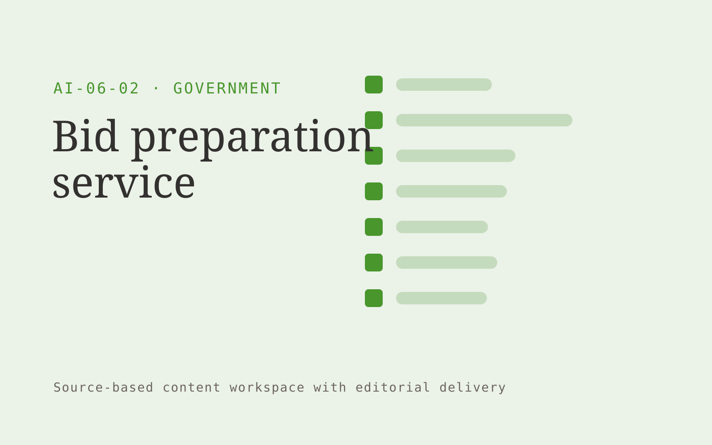

# Bid preparation service

**Government** · Also fits: Operations; Writers

> For small facilities suppliers bidding for public contracts, turn tender documents, verified credentials and past responses into reviewed bid draft and evidence matrix. Address the recurring problem: bid teams repeatedly reconstruct compliant response structures. The value hypothesis is a more complete, reviewable deliverable with less repeated preparation; the pilot must establish whether that benefit is real.

| | |
|---|---|
| **Buyer** | Small facilities suppliers bidding for public contracts |
| **Problem** | Bid teams repeatedly reconstruct compliant response structures. |
| **Format** | Source-based content workspace with editorial delivery |
| **USP** | Every response maps back to a requirement and verified supplier evidence. |

## The product
Key screens: Requirement matrix, response editor, compliance review. Use a project list and editorial calendar beside a document editor. Keep original material and supporting passages in a collapsible side panel. Show outline, draft, review and approved stages. Provide tracked edits, comments, version comparisons and an export preview that reflects the final delivery format. In this product, the first view is requirement matrix, followed by response editor and compliance review.

## Core functionality
1. Extract mandatory questions.
2. Map evidence.
3. Draft responses.
4. Flag unsupported claims.
5. Track word limits.
6. Assemble submission packs.

## Customer workflow
Collect a structured brief and source material, identify unanswered questions, approve an outline, generate a draft, verify claims, gather reviewer edits, approve a final version and export the agreed formats. Start with tender documents, verified credentials and past responses and finish with reviewed bid draft and evidence matrix.

## AI and human review
Extract and organize information, propose structure, draft prose and adapt approved content to audiences. Attach evidence to factual claims. Keep names, dates, amounts and quoted wording linked to their source. Editors resolve ambiguity and approve publication.

## Customer inputs
Tender documents, verified credentials and past responses

## Customer deliverables
Reviewed bid draft and evidence matrix

## Accounts and administration
Client workspaces, source permissions, editorial assignments, change history, reviewer comments, approval gates, revision allowances and export templates.

## MVP scope
Begin with small facilities suppliers bidding for public contracts and one recurring use case. Build the first two modules: extract mandatory questions; map evidence. Provide operator assistance for the third module: draft responses. Deliver reviewed bid draft and evidence matrix through a manual review queue. Perform other necessary full-scope functions manually during the pilot. Include all applicable access, accuracy and professional-review controls from the start.

## After MVP validation
After paid pilots establish value, automate the remaining modules: flag unsupported claims; track word limits; assemble submission packs. Add one validated source integration, reusable customer configuration and recurring delivery. Expand to additional teams, document formats or languages only after testing the new scope.

## Build dependencies
Document parsing, a source-linked editor, tracked revisions, reviewer workflow and reliable document export. Rich presentation or print output needs format-specific QA.

## Integrations and data access
Official publications, agency document stores and approved service workflows. Document storage, word processor export, content management systems and approved publishing channels. Pilot with uploads and downloadable drafts before adding write integrations. These are candidate integration categories, not verified supported connectors.

## Defensibility
Customer-approved terminology, reusable structures, source libraries and editorial feedback tied to a specific audience and recurring publishing workflow. For this idea, build around every response maps back to a requirement and verified supplier evidence. This advantage requires execution and accumulated customer trust; the base model alone is not a defensible asset.

## Alternatives and positioning
Writers, editors, agencies, internal document templates and general-purpose chat tools. Differentiate on this specific proposed advantage: every response maps back to a requirement and verified supplier evidence. Test it against the buyer's current method on the same task. Competitor coverage and uniqueness have not been established.

## Revenue model and test pricing (USD)
Test USD 400-1,500 for a tightly scoped initial content package. Convert repeated work to a monthly retainer with explicit deliverable and revision limits. Specialist review and substantial research are separately scoped. Prices are hypotheses.

## Main delivery costs
Research and interview time, transcription, model usage, factual verification, subject-matter review, editing and revisions.

## Marketing message to test
> Bid preparation service for small facilities suppliers bidding for public contracts. Every response maps back to a requirement and verified supplier evidence. Demonstrate the claim through a tender compliance matrix for one live opportunity.

## Acquisition channels
Procurement advisers serving small suppliers

## Lead magnet
A tender compliance matrix for one live opportunity

## First 30 days of marketing
- Week 1: interview five prospective buyers in this segment: small facilities suppliers bidding for public contracts. Ask to see a recent example of the problem and their current process.
- Week 2: prepare this demonstration using authorized or synthetic material: a tender compliance matrix for one live opportunity.
- Week 3: present it through procurement advisers serving small suppliers and seek one narrowly scoped paid pilot.
- Week 4: review complete requirements, review time, total delivery effort and a concrete renewal decision before increasing scope.

## Paid pilot and validation
Complete one existing brief using the customer’s actual sources. Record reviewer edits, factual corrections and preparation time. Ask the same buyer to commission a second comparable deliverable. For this idea, use tender documents, verified credentials and past responses and evaluate reviewed bid draft and evidence matrix. Agree success thresholds with the buyer before starting; collect a baseline for complete requirements, review time. A positive signal is payment and repeat use with acceptable quality and delivery cost, not a favorable demo reaction alone.

## Success metrics
Complete requirements, review time

## Retention and expansion
Maintain the approved source and voice library, schedule recurring editorial work, and expand into additional formats only after the core deliverable is repeatedly accepted.

## Operating controls and limitations
Preserve official source versions, accessibility and audit records. Confirm agency-specific procurement, records and data handling requirements during discovery. Validate source access and reviewer availability during the pilot. Maintain customer-level access, data deletion controls and a record of final approvals.

## Brand style (concept)

- Colors: `#569127` primary · `#8754c9` accent · `#eaf1e4` surface · `#22201e` ink
- Type: Space Grotesk for headings, Inter for text
- Voice: Plain-spoken, neutral, accountable
- Demo site: [https://nexibeo.com/ideas/bid-preparation-service/demo/](https://nexibeo.com/ideas/bid-preparation-service/demo/)

## Investment indication

Indicative build budget, from MVP to full product. This is a planning range, not a quote; it excludes running costs such as model usage, hosting and reviewer hours. Built with Nexibeo's AI software development factory, most implementations take days to a few weeks of creation time, depending on availability.

| Phase | Scope | Creation time | Indicative budget |
|---|---|---|---|
| MVP | One buyer segment, one recurring use case; first modules: extract mandatory questions; map evidence. Manual review in the loop. | 6 days | $11,000 |
| Paid pilot | Accounts, roles, review states, audit trail and the first integration, hardened for two to three paying pilot customers. | 7 days | $14,500 |
| Full product | Remaining modules: flag unsupported claims; track word limits; assemble submission packs. Self-serve onboarding, billing, monitoring and the wider integration set. | 3 weeks | $20,000 |
| **Total** | | about 5 weeks | **$45,500** |

### Running costs per month (rough indication, untested)

| Stage | Hosting and infrastructure | AI usage | Total per month |
|---|---|---|---|
| MVP and paid pilot (about 3 customers) | $50–$100 | $70–$140 | **$120–$240** |
| Full product (about 50 customers) | $190–$380 | $700–$1,400 | **$890–$1,780** |

**Co-create this project with us:** [contact Nexibeo](https://nexibeo.com/ideas/bid-preparation-service/#apply) and we build it with you.

## Research status
Concept proposal expanded from the 315-idea conversation. Demand, pricing, differentiation, build scope and integration feasibility are hypotheses, not verified market findings. Category link is inspiration rather than evidence of business viability.

## Credits and next steps

- **Estimation and building this idea:** see the full idea page on [nexibeo.com](https://nexibeo.com/ideas/bid-preparation-service/) for more detail on estimation, and to co-create and build this idea with Nexibeo.
- **Become an AI-optimized specialist for Government:** [Complete AI Training](https://completeaitraining.com/certification/12b-ai-certification-for-government-employees/).
- Field news: [AI news for Government](https://completeaitraining.com/all-ai-news-for-government/).
