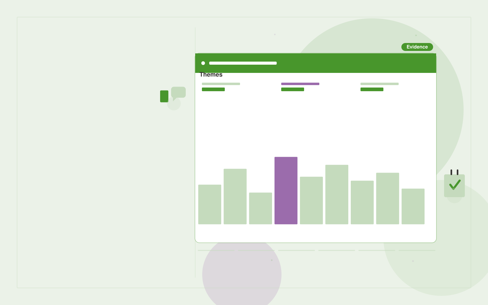

# Public consultation analyzer

**Government** · Also fits: Operations; Writers; Science and Research

> For policy teams handling public consultations, turn authorized submissions and consultation questions into consultation evidence report. Address the recurring problem: large submission volumes hide distinct minority perspectives. The value hypothesis is a more complete, reviewable deliverable with less repeated preparation; the pilot must establish whether that benefit is real.

| | |
|---|---|
| **Buyer** | Policy teams handling public consultations |
| **Problem** | Large submission volumes hide distinct minority perspectives. |
| **Format** | Evidence-backed analysis and reporting workspace |
| **USP** | Auditable synthesis that retains disagreement and source traceability. |

## The product
Key screens: Submission themes, evidence explorer, review log. Open with a compact overview and filters for the relevant period or segment. Let users drill from each theme or metric into underlying records. Keep source definitions and missing-data notes near the result. Use an action panel to assign investigations and record what was learned. In this product, the first view is submission themes, followed by evidence explorer and review log.

## Core functionality
1. Classify responses.
2. Preserve minority views.
3. Detect duplicates.
4. Link quoted evidence.
5. Distinguish frequency from importance.
6. Export transparent summaries.

## Customer workflow
Agree definitions, import authorized data, validate coverage and identifiers, compute transparent measures, group relevant evidence, review findings, assign investigations or improvements, and repeat on a comparable period. Start with authorized submissions and consultation questions and finish with consultation evidence report.

## AI and human review
Classify text, summarize evidence and propose explanations to investigate. Compute financial or operational measures with deterministic code. Separate observed patterns from causal claims and preserve examples that contradict the summary.

## Customer inputs
Authorized submissions and consultation questions

## Customer deliverables
Consultation evidence report

## Accounts and administration
Dataset permissions, field mappings, metric definitions, source drill-down, saved filters, reviewer annotations, recurring reports and action ownership.

## MVP scope
Begin with policy teams handling public consultations and one recurring use case. Build the first two modules: classify responses; preserve minority views. Provide operator assistance for the third module: detect duplicates. Deliver consultation evidence report through a manual review queue. Perform other necessary full-scope functions manually during the pilot. Include all applicable access, accuracy and professional-review controls from the start.

## After MVP validation
After paid pilots establish value, automate the remaining modules: link quoted evidence; distinguish frequency from importance; export transparent summaries. Add one validated source integration, reusable customer configuration and recurring delivery. Expand to additional teams, document formats or languages only after testing the new scope.

## Build dependencies
Stable identifiers, consistent metric definitions, deterministic calculations, source lineage and representative review samples. Poor coverage must remain visible.

## Integrations and data access
Official publications, agency document stores and approved service workflows. Read-only business data exports, reporting databases and task trackers. Reconcile source totals before scheduling recurring data refreshes. These are candidate integration categories, not verified supported connectors.

## Defensibility
Domain-specific definitions, trusted source mappings and a history connecting findings to actions and observed results. For this idea, build around auditable synthesis that retains disagreement and source traceability. This advantage requires execution and accumulated customer trust; the base model alone is not a defensible asset.

## Alternatives and positioning
Analysts, business intelligence dashboards, spreadsheets and general text summarization tools. Differentiate on this specific proposed advantage: auditable synthesis that retains disagreement and source traceability. Test it against the buyer's current method on the same task. Competitor coverage and uniqueness have not been established.

## Revenue model and test pricing (USD)
Test USD 500-2,000 for an initial analysis of one bounded dataset. Offer USD 250-1,000 monthly for repeat reporting at agreed volume. Data cleanup and specialist analysis are separately priced. These are test ranges.

## Main delivery costs
Data preparation, reconciliation, classification, expert interpretation, customer-specific definitions and recurring reporting support.

## Marketing message to test
> Public consultation analyzer for policy teams handling public consultations. Auditable synthesis that retains disagreement and source traceability. Demonstrate the claim through an analysis of a published historical consultation.

## Acquisition channels
Public-sector research consultancies

## Lead magnet
An analysis of a published historical consultation

## First 30 days of marketing
- Week 1: interview five prospective buyers in this segment: policy teams handling public consultations. Ask to see a recent example of the problem and their current process.
- Week 2: prepare this demonstration using authorized or synthetic material: an analysis of a published historical consultation.
- Week 3: present it through public-sector research consultancies and seek one narrowly scoped paid pilot.
- Week 4: review reviewer agreement, evidence coverage, total delivery effort and a concrete renewal decision before increasing scope.

## Paid pilot and validation
Analyze one historical period and review findings with the responsible domain owner. Reconcile headline measures, inspect counterexamples and ask the buyer to choose a concrete follow-up action. For this idea, use authorized submissions and consultation questions and evaluate consultation evidence report. Agree success thresholds with the buyer before starting; collect a baseline for reviewer agreement, evidence coverage. A positive signal is payment and repeat use with acceptable quality and delivery cost, not a favorable demo reaction alone.

## Success metrics
Reviewer agreement, evidence coverage

## Retention and expansion
Repeat the same definitions each reporting period and track whether findings lead to useful action. Expand data sources without breaking historical comparability.

## Operating controls and limitations
Preserve official source versions, accessibility and audit records. Confirm agency-specific procurement, records and data handling requirements during discovery. Validate source access and reviewer availability during the pilot. Maintain customer-level access, data deletion controls and a record of final approvals.

## Brand style (concept)

- Colors: `#479127` primary · `#a454c9` accent · `#e8f1e4` surface · `#22201e` ink
- Type: Space Grotesk for headings, Inter for text
- Voice: Plain-spoken, neutral, accountable
- Demo site: [https://nexibeo.com/solutions/public-consultation-analyzer/demo/](https://nexibeo.com/solutions/public-consultation-analyzer/demo/)

## Investment indication

Indicative build budget, from MVP to full product. This is a planning range, not a quote; it excludes running costs such as model usage, hosting and reviewer hours. Built with Nexibeo's AI software development factory, most implementations take days to a few weeks of creation time, depending on availability.

| Phase | Scope | Creation time | Indicative budget |
|---|---|---|---|
| MVP | One buyer segment, one recurring use case; first modules: classify responses; preserve minority views. Manual review in the loop. | 6 days | $11,000 |
| Paid pilot | Accounts, roles, review states, audit trail and the first integration, hardened for two to three paying pilot customers. | 7 days | $14,000 |
| Full product | Remaining modules: link quoted evidence; distinguish frequency from importance; export transparent summaries. Self-serve onboarding, billing, monitoring and the wider integration set. | 3 weeks | $19,000 |
| **Total** | | about 5 weeks | **$44,000** |

### Running costs per month (rough indication, untested)

| Stage | Hosting and infrastructure | AI usage | Total per month |
|---|---|---|---|
| MVP and paid pilot (about 3 customers) | $50–$100 | $80–$160 | **$130–$260** |
| Full product (about 50 customers) | $190–$380 | $880–$1,750 | **$1,070–$2,130** |

**Get this built:** [contact Nexibeo](https://nexibeo.com/solutions/public-consultation-analyzer/#apply). We build it with our AI software factory, usually in days to a few weeks, for you to run internally or offer to your clients.

## Research status
Concept proposal expanded from the 315-idea conversation. Demand, pricing, differentiation, build scope and integration feasibility are hypotheses, not verified market findings. Category link is inspiration rather than evidence of business viability.

## Credits and next steps

- **Estimation and having it built:** see the full solution page on [nexibeo.com](https://nexibeo.com/solutions/public-consultation-analyzer/) for more detail on estimation. Nexibeo builds it for you as a custom AI implementation, to run internally or to offer to your own clients.
- **Become an AI-optimized specialist for Government:** [Complete AI Training](https://completeaitraining.com/certification/12b-ai-certification-for-government-employees/).
- Field news: [AI news for Government](https://completeaitraining.com/all-ai-news-for-government/).
