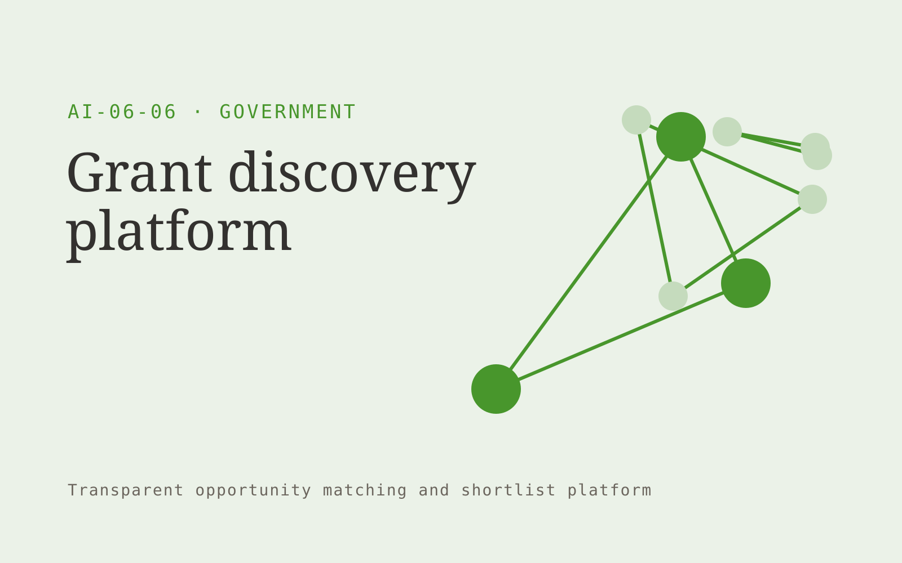

# Grant discovery platform

**AI-06-06 · Government** · Also fits: Operations; Writers; Sales

> For nonprofit development teams, turn published grant calls and organizational profiles into funding shortlist and eligibility evidence. Address the recurring problem: funding searches consume time on ineligible opportunities. The value hypothesis is a more complete, reviewable deliverable with less repeated preparation; the pilot must establish whether that benefit is real.

| | |
|---|---|
| **Buyer** | Nonprofit development teams |
| **Problem** | Funding searches consume time on ineligible opportunities. |
| **Format** | Transparent opportunity matching and shortlist platform |
| **USP** | Eligibility-first matching for a specific nonprofit segment. |

## The product
Key screens: Funding feed, eligibility matrix, deadline planner. Open with a filterable opportunity feed and clear fit explanations. Each profile shows source evidence, eligibility conditions and missing information. Keep saved, rejected and needs-review states. Include a deadline or next-action view without hiding the basis of recommendations. In this product, the first view is funding feed, followed by eligibility matrix and deadline planner.

## Core functionality
1. Match project themes.
2. Extract eligibility.
3. Compare funding limits.
4. Flag geographic restrictions.
5. Track call updates.
6. Save pursuit decisions.

## Customer workflow
Define buyer-selected criteria, gather authorized opportunity information, apply explicit eligibility rules, propose matches with evidence, let the user review uncertain conditions, save a shortlist and track the resulting conversations or applications. Start with published grant calls and organizational profiles and finish with funding shortlist and eligibility evidence.

## AI and human review
Extract criteria, normalize opportunity descriptions and explain possible fit. Use explicit rules for hard requirements. Do not invent missing eligibility facts or represent a suggested match as a verified qualification.

## Customer inputs
Published grant calls and organizational profiles

## Customer deliverables
Funding shortlist and eligibility evidence

## Accounts and administration
Editable criteria, dated sources, eligibility evidence, missing-data flags, saved shortlists, rejection reasons, deadline alerts and owner follow-up.

## MVP scope
Begin with nonprofit development teams and one recurring use case. Build the first two modules: match project themes; extract eligibility. Provide operator assistance for the third module: compare funding limits. Deliver funding shortlist and eligibility evidence through a manual review queue. Perform other necessary full-scope functions manually during the pilot. Include all applicable access, accuracy and professional-review controls from the start.

## After MVP validation
After paid pilots establish value, automate the remaining modules: flag geographic restrictions; track call updates; save pursuit decisions. Add one validated source integration, reusable customer configuration and recurring delivery. Expand to additional teams, document formats or languages only after testing the new scope.

## Build dependencies
Current source information, explicit eligibility rules, entity identity checks and inspectable fit reasoning. Sparse evidence limits match quality.

## Integrations and data access
Official publications, agency document stores and approved service workflows. Permitted opportunity feeds, customer profiles, calendars and CRM exports. Keep initial outreach or applications as user-reviewed drafts. These are candidate integration categories, not verified supported connectors.

## Defensibility
A maintained niche opportunity dataset and documented relevance feedback, supported by relationships with the intended buyer community. For this idea, build around eligibility-first matching for a specific nonprofit segment. This advantage requires execution and accumulated customer trust; the base model alone is not a defensible asset.

## Alternatives and positioning
Manual research, directories, generic databases, referrals and existing opportunity marketplaces. Differentiate on this specific proposed advantage: eligibility-first matching for a specific nonprofit segment. Test it against the buyer's current method on the same task. Competitor coverage and uniqueness have not been established.

## Revenue model and test pricing (USD)
Test USD 150-600 monthly for one narrow opportunity feed, or USD 750-2,500 for a bespoke researched shortlist. Price manual verification and custom research explicitly. These are pricing hypotheses.

## Main delivery costs
Source collection, profile updates, entity resolution, eligibility verification, analyst research and customer feedback review.

## Marketing message to test
> Grant discovery platform for nonprofit development teams. Eligibility-first matching for a specific nonprofit segment. Demonstrate the claim through a short list of documented eligible opportunities.

## Acquisition channels
Nonprofit support organizations

## Lead magnet
A short list of documented eligible opportunities

## First 30 days of marketing
- Week 1: interview five prospective buyers in this segment: nonprofit development teams. Ask to see a recent example of the problem and their current process.
- Week 2: prepare this demonstration using authorized or synthetic material: a short list of documented eligible opportunities.
- Week 3: present it through nonprofit support organizations and seek one narrowly scoped paid pilot.
- Week 4: review eligible match rate, paid renewals, total delivery effort and a concrete renewal decision before increasing scope.

## Paid pilot and validation
Produce a small shortlist and ask the buyer to verify fit independently. Record why each option is accepted or rejected and whether it leads to a useful next step. Review missed eligible options too. For this idea, use published grant calls and organizational profiles and evaluate funding shortlist and eligibility evidence. Agree success thresholds with the buyer before starting; collect a baseline for eligible match rate, paid renewals. A positive signal is payment and repeat use with acceptable quality and delivery cost, not a favorable demo reaction alone.

## Success metrics
Eligible match rate, paid renewals

## Retention and expansion
Refresh opportunity profiles, improve criteria from accepted and rejected matches, and offer deeper verification for shortlisted options.

## Operating controls and limitations
Preserve official source versions, accessibility and audit records. Confirm agency-specific procurement, records and data handling requirements during discovery. Validate source access and reviewer availability during the pilot. Maintain customer-level access, data deletion controls and a record of final approvals.

## Brand style (concept)

- Colors: `#419127` primary · `#c954c1` accent · `#e8f1e4` surface · `#22201e` ink
- Type: Space Grotesk for headings, Inter for text
- Voice: Plain-spoken, neutral, accountable
- Demo site: [https://nexibeo.com/ideas/grant-discovery-platform/demo/](https://nexibeo.com/ideas/grant-discovery-platform/demo/)

## Investment indication

Indicative build budget, from MVP to full product. This is a planning range, not a quote; it excludes running costs such as model usage, hosting and reviewer hours.

| Phase | Scope | Timeline | Indicative budget |
|---|---|---|---|
| MVP | One buyer segment, one recurring use case; first modules: match project themes; extract eligibility. Manual review in the loop. | 6 weeks | $11,000 |
| Paid pilot | Accounts, roles, review states, audit trail and the first integration, hardened for two to three paying pilot customers. | 8 weeks | $14,500 |
| Full product | Remaining modules: flag geographic restrictions; track call updates; save pursuit decisions. Self-serve onboarding, billing, monitoring and the wider integration set. | 13 weeks | $20,500 |
| **Total** | | 27 weeks | **$46,000** |

**Co-create this project with us:** [contact Nexibeo](https://nexibeo.com/ideas/grant-discovery-platform/#apply) and we build it with you.

## Research status
Concept proposal expanded from the 315-idea conversation. Demand, pricing, differentiation, build scope and integration feasibility are hypotheses, not verified market findings. Category link is inspiration rather than evidence of business viability.

## Credits and next steps

- **Estimation and building this idea:** see the full idea page on [nexibeo.com](https://nexibeo.com/ideas/grant-discovery-platform/) for more detail on estimation, and to co-create and build this idea with Nexibeo.
- **Become an AI-optimized specialist for Government:** [Complete AI Training](https://completeaitraining.com/certification/12b-ai-certification-for-government-employees/).
- Field news: [AI news for Government](https://completeaitraining.com/all-ai-news-for-government/).
