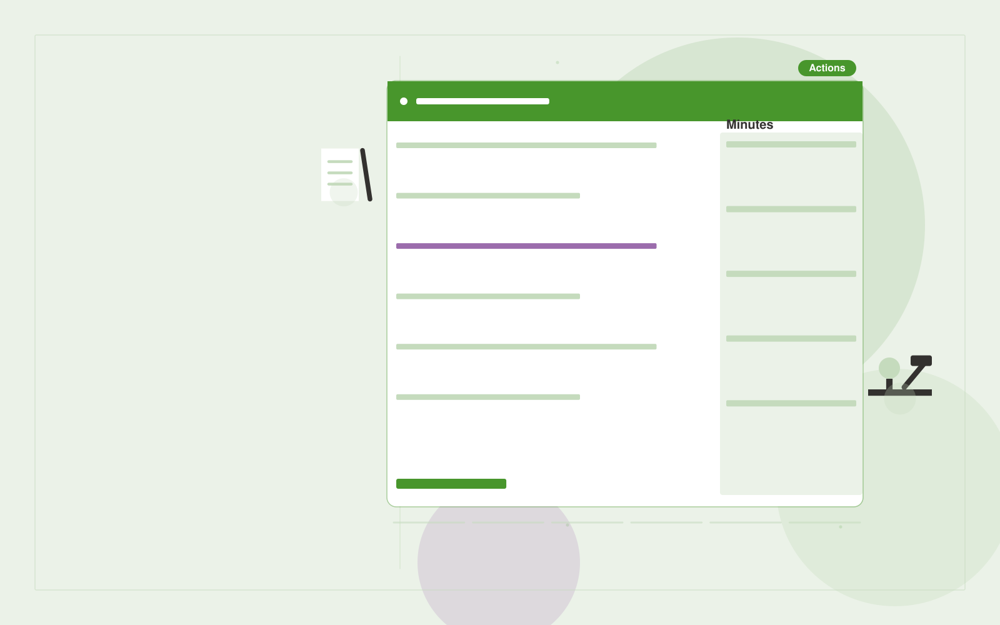

# Public meeting summary service

**Government** · Also fits: Operations; Writers

> For municipal clerks and meeting secretariats, turn authorized recordings, agenda and participant list into reviewed minutes and action register. Address the recurring problem: minutes and action records take too long to prepare. The value hypothesis is a more complete, reviewable deliverable with less repeated preparation; the pilot must establish whether that benefit is real.

| | |
|---|---|
| **Buyer** | Municipal clerks and meeting secretariats |
| **Problem** | Minutes and action records take too long to prepare. |
| **Format** | Source-based content workspace with editorial delivery |
| **USP** | Explicit motion and decision handling with recording references. |

## The product
Key screens: Meeting timeline, minutes editor, action register. Use a project list and editorial calendar beside a document editor. Keep original material and supporting passages in a collapsible side panel. Show outline, draft, review and approved stages. Provide tracked edits, comments, version comparisons and an export preview that reflects the final delivery format. In this product, the first view is meeting timeline, followed by minutes editor and action register.

## Core functionality
1. Transcribe proceedings.
2. Align agenda items.
3. Extract motions.
4. Distinguish discussion from decisions.
5. Assign verified actions.
6. Export minutes.

## Customer workflow
Collect a structured brief and source material, identify unanswered questions, approve an outline, generate a draft, verify claims, gather reviewer edits, approve a final version and export the agreed formats. Start with authorized recordings, agenda and participant list and finish with reviewed minutes and action register.

## AI and human review
Extract and organize information, propose structure, draft prose and adapt approved content to audiences. Attach evidence to factual claims. Keep names, dates, amounts and quoted wording linked to their source. Editors resolve ambiguity and approve publication.

## Customer inputs
Authorized recordings, agenda and participant list

## Customer deliverables
Reviewed minutes and action register

## Accounts and administration
Client workspaces, source permissions, editorial assignments, change history, reviewer comments, approval gates, revision allowances and export templates.

## MVP scope
Begin with municipal clerks and meeting secretariats and one recurring use case. Build the first two modules: transcribe proceedings; align agenda items. Provide operator assistance for the third module: extract motions. Deliver reviewed minutes and action register through a manual review queue. Perform other necessary full-scope functions manually during the pilot. Include all applicable access, accuracy and professional-review controls from the start.

## After MVP validation
After paid pilots establish value, automate the remaining modules: distinguish discussion from decisions; assign verified actions; export minutes. Add one validated source integration, reusable customer configuration and recurring delivery. Expand to additional teams, document formats or languages only after testing the new scope.

## Build dependencies
Document parsing, a source-linked editor, tracked revisions, reviewer workflow and reliable document export. Rich presentation or print output needs format-specific QA.

## Integrations and data access
Official publications, agency document stores and approved service workflows. Document storage, word processor export, content management systems and approved publishing channels. Pilot with uploads and downloadable drafts before adding write integrations. These are candidate integration categories, not verified supported connectors.

## Defensibility
Customer-approved terminology, reusable structures, source libraries and editorial feedback tied to a specific audience and recurring publishing workflow. For this idea, build around explicit motion and decision handling with recording references. This advantage requires execution and accumulated customer trust; the base model alone is not a defensible asset.

## Alternatives and positioning
Writers, editors, agencies, internal document templates and general-purpose chat tools. Differentiate on this specific proposed advantage: explicit motion and decision handling with recording references. Test it against the buyer's current method on the same task. Competitor coverage and uniqueness have not been established.

## Revenue model and test pricing (USD)
Test USD 400-1,500 for a tightly scoped initial content package. Convert repeated work to a monthly retainer with explicit deliverable and revision limits. Specialist review and substantial research are separately scoped. Prices are hypotheses.

## Main delivery costs
Research and interview time, transcription, model usage, factual verification, subject-matter review, editing and revisions.

## Marketing message to test
> Public meeting summary service for municipal clerks and meeting secretariats. Explicit motion and decision handling with recording references. Demonstrate the claim through annotated minutes from one public meeting.

## Acquisition channels
Municipal administration networks

## Lead magnet
Annotated minutes from one public meeting

## First 30 days of marketing
- Week 1: interview five prospective buyers in this segment: municipal clerks and meeting secretariats. Ask to see a recent example of the problem and their current process.
- Week 2: prepare this demonstration using authorized or synthetic material: annotated minutes from one public meeting.
- Week 3: present it through municipal administration networks and seek one narrowly scoped paid pilot.
- Week 4: review material corrections, publication turnaround, total delivery effort and a concrete renewal decision before increasing scope.

## Paid pilot and validation
Complete one existing brief using the customer’s actual sources. Record reviewer edits, factual corrections and preparation time. Ask the same buyer to commission a second comparable deliverable. For this idea, use authorized recordings, agenda and participant list and evaluate reviewed minutes and action register. Agree success thresholds with the buyer before starting; collect a baseline for material corrections, publication turnaround. A positive signal is payment and repeat use with acceptable quality and delivery cost, not a favorable demo reaction alone.

## Success metrics
Material corrections, publication turnaround

## Retention and expansion
Maintain the approved source and voice library, schedule recurring editorial work, and expand into additional formats only after the core deliverable is repeatedly accepted.

## Operating controls and limitations
Preserve official source versions, accessibility and audit records. Confirm agency-specific procurement, records and data handling requirements during discovery. Validate source access and reviewer availability during the pilot. Maintain customer-level access, data deletion controls and a record of final approvals.

## Brand style (concept)

- Colors: `#4e9127` primary · `#9154c9` accent · `#e9f1e4` surface · `#22201e` ink
- Type: Space Grotesk for headings, Inter for text
- Voice: Plain-spoken, neutral, accountable
- Demo site: [https://nexibeo.com/ideas/public-meeting-summary-service/demo/](https://nexibeo.com/ideas/public-meeting-summary-service/demo/)

## Investment indication

Indicative build budget, from MVP to full product. This is a planning range, not a quote; it excludes running costs such as model usage, hosting and reviewer hours.

| Phase | Scope | Timeline | Indicative budget |
|---|---|---|---|
| MVP | One buyer segment, one recurring use case; first modules: transcribe proceedings; align agenda items. Manual review in the loop. | 6 weeks | $11,000 |
| Paid pilot | Accounts, roles, review states, audit trail and the first integration, hardened for two to three paying pilot customers. | 8 weeks | $14,500 |
| Full product | Remaining modules: distinguish discussion from decisions; assign verified actions; export minutes. Self-serve onboarding, billing, monitoring and the wider integration set. | 13 weeks | $20,500 |
| **Total** | | 27 weeks | **$46,000** |

### Running costs per month (rough indication, untested)

| Stage | Hosting and infrastructure | AI usage | Total per month |
|---|---|---|---|
| MVP and paid pilot (about 3 customers) | $50–$100 | $70–$140 | **$120–$240** |
| Full product (about 50 customers) | $190–$380 | $700–$1,400 | **$890–$1,780** |

**Co-create this project with us:** [contact Nexibeo](https://nexibeo.com/ideas/public-meeting-summary-service/#apply) and we build it with you.

## Research status
Concept proposal expanded from the 315-idea conversation. Demand, pricing, differentiation, build scope and integration feasibility are hypotheses, not verified market findings. Category link is inspiration rather than evidence of business viability.

## Credits and next steps

- **Estimation and building this idea:** see the full idea page on [nexibeo.com](https://nexibeo.com/ideas/public-meeting-summary-service/) for more detail on estimation, and to co-create and build this idea with Nexibeo.
- **Become an AI-optimized specialist for Government:** [Complete AI Training](https://completeaitraining.com/certification/12b-ai-certification-for-government-employees/).
- Field news: [AI news for Government](https://completeaitraining.com/all-ai-news-for-government/).
