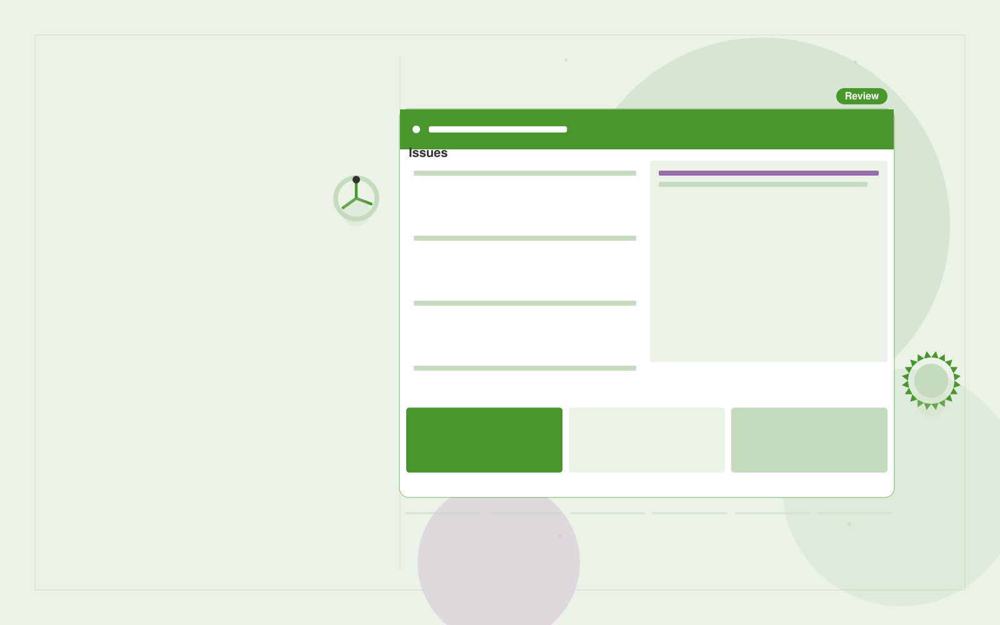

# Accessibility remediation service

**Government** · Also fits: Operations; Writers

> For public agency website owners, turn public websites, documents and testing criteria into remediated assets and test record. Address the recurring problem: legacy documents remain difficult to access. The value hypothesis is a more complete, reviewable deliverable with less repeated preparation; the pilot must establish whether that benefit is real.

| | |
|---|---|
| **Buyer** | Public agency website owners |
| **Problem** | Legacy documents remain difficult to access. |
| **Format** | Evidence review and quality assurance workspace |
| **USP** | Remediation plus reusable templates to prevent repeated defects. |

## The product
Key screens: Asset inventory, issue queue, remediation review. Open on a review queue ordered by reviewer-selected priorities. Show each finding beside the original evidence and applicable rule. Provide accept, dismiss and needs-information controls with reasons. A separate report view summarizes confirmed findings and unresolved items, not raw AI flags. In this product, the first view is asset inventory, followed by issue queue and remediation review.

## Core functionality
1. Scan document structure.
2. Inspect reading order.
3. Draft alternatives.
4. Repair approved templates.
5. Record manual tests.
6. Prioritize recurring issues.

## Customer workflow
Agree review criteria, ingest a sample, generate candidate findings, inspect supporting evidence, let reviewers confirm or dismiss each item, assign corrections, and recheck the affected material. Start with public websites, documents and testing criteria and finish with remediated assets and test record.

## AI and human review
Propose possible inconsistencies, omissions and rubric matches. Combine extraction with deterministic checks where rules are explicit. Reviewers make the final judgment. Keep false positives and missed cases visible during evaluation.

## Customer inputs
Public websites, documents and testing criteria

## Customer deliverables
Remediated assets and test record

## Accounts and administration
Versioned review criteria, evidence links, reviewer decisions, disagreement handling, correction assignments, recheck status and exportable review history.

## MVP scope
Begin with public agency website owners and one recurring use case. Build the first two modules: scan document structure; inspect reading order. Provide operator assistance for the third module: draft alternatives. Deliver remediated assets and test record through a manual review queue. Perform other necessary full-scope functions manually during the pilot. Include all applicable access, accuracy and professional-review controls from the start.

## After MVP validation
After paid pilots establish value, automate the remaining modules: repair approved templates; record manual tests; prioritize recurring issues. Add one validated source integration, reusable customer configuration and recurring delivery. Expand to additional teams, document formats or languages only after testing the new scope.

## Build dependencies
Evidence coordinates, versioned rules, reviewer decisions and a representative reference set. Measure misses as well as confirmed findings before scaling.

## Integrations and data access
Official publications, agency document stores and approved service workflows. Source repositories, task trackers and report exports. Keep findings as review proposals until authorized owners accept the resulting actions. These are candidate integration categories, not verified supported connectors.

## Defensibility
A domain-specific review rubric and rights-cleared examples of confirmed defects, false alarms and reviewer reasoning. For this idea, build around remediation plus reusable templates to prevent repeated defects. This advantage requires execution and accumulated customer trust; the base model alone is not a defensible asset.

## Alternatives and positioning
Manual reviewers, checklists, generic scanning tools and specialist audit services. Differentiate on this specific proposed advantage: remediation plus reusable templates to prevent repeated defects. Test it against the buyer's current method on the same task. Competitor coverage and uniqueness have not been established.

## Revenue model and test pricing (USD)
Test USD 500-2,000 for a defined audit sample and report. Offer recurring review priced by reviewed items and specialist hours. Software-only access can follow a reliable reviewed service. All prices require validation.

## Main delivery costs
Document or media processing, model evaluation, expert review, false-positive handling, rechecks and customer-specific rubric calibration.

## Marketing message to test
> Accessibility remediation service for public agency website owners. Remediation plus reusable templates to prevent repeated defects. Demonstrate the claim through an accessible-document improvement demonstration.

## Acquisition channels
Accessibility specialists and public web agencies

## Lead magnet
An accessible-document improvement demonstration

## First 30 days of marketing
- Week 1: interview five prospective buyers in this segment: public agency website owners. Ask to see a recent example of the problem and their current process.
- Week 2: prepare this demonstration using authorized or synthetic material: an accessible-document improvement demonstration.
- Week 3: present it through accessibility specialists and public web agencies and seek one narrowly scoped paid pilot.
- Week 4: review verified defects resolved, recurrence, total delivery effort and a concrete renewal decision before increasing scope.

## Paid pilot and validation
Have a qualified reviewer independently assess the same sample. Compare confirmed findings, false alarms and omissions. Repeat on unseen material before agreeing recurring volume. For this idea, use public websites, documents and testing criteria and evaluate remediated assets and test record. Agree success thresholds with the buyer before starting; collect a baseline for verified defects resolved, recurrence. A positive signal is payment and repeat use with acceptable quality and delivery cost, not a favorable demo reaction alone.

## Success metrics
Verified defects resolved, recurrence

## Retention and expansion
Offer recurring reviews and rechecks of previously confirmed issues. Expand document or case types after validating the new rubric with qualified reviewers.

## Operating controls and limitations
Preserve official source versions, accessibility and audit records. Confirm agency-specific procurement, records and data handling requirements during discovery. Validate source access and reviewer availability during the pilot. Maintain customer-level access, data deletion controls and a record of final approvals.

## Brand style (concept)

- Colors: `#3e9127` primary · `#ae54c9` accent · `#e7f1e4` surface · `#22201e` ink
- Type: Space Grotesk for headings, Inter for text
- Voice: Plain-spoken, neutral, accountable
- Demo site: [https://nexibeo.com/ideas/accessibility-remediation-service/demo/](https://nexibeo.com/ideas/accessibility-remediation-service/demo/)

## Investment indication

Indicative build budget, from MVP to full product. This is a planning range, not a quote; it excludes running costs such as model usage, hosting and reviewer hours. Built with Nexibeo's AI software development factory, most implementations take days to a few weeks of creation time, depending on availability.

| Phase | Scope | Creation time | Indicative budget |
|---|---|---|---|
| MVP | One buyer segment, one recurring use case; first modules: scan document structure; inspect reading order. Manual review in the loop. | 6 days | $11,000 |
| Paid pilot | Accounts, roles, review states, audit trail and the first integration, hardened for two to three paying pilot customers. | 7 days | $14,000 |
| Full product | Remaining modules: repair approved templates; record manual tests; prioritize recurring issues. Self-serve onboarding, billing, monitoring and the wider integration set. | 3 weeks | $19,000 |
| **Total** | | about 5 weeks | **$44,000** |

### Running costs per month (rough indication, untested)

| Stage | Hosting and infrastructure | AI usage | Total per month |
|---|---|---|---|
| MVP and paid pilot (about 3 customers) | $50–$100 | $80–$160 | **$130–$260** |
| Full product (about 50 customers) | $190–$380 | $880–$1,750 | **$1,070–$2,130** |

**Co-create this project with us:** [contact Nexibeo](https://nexibeo.com/ideas/accessibility-remediation-service/#apply) and we build it with you.

## Research status
Concept proposal expanded from the 315-idea conversation. Demand, pricing, differentiation, build scope and integration feasibility are hypotheses, not verified market findings. Category link is inspiration rather than evidence of business viability.

## Credits and next steps

- **Estimation and building this idea:** see the full idea page on [nexibeo.com](https://nexibeo.com/ideas/accessibility-remediation-service/) for more detail on estimation, and to co-create and build this idea with Nexibeo.
- **Become an AI-optimized specialist for Government:** [Complete AI Training](https://completeaitraining.com/certification/12b-ai-certification-for-government-employees/).
- Field news: [AI news for Government](https://completeaitraining.com/all-ai-news-for-government/).
