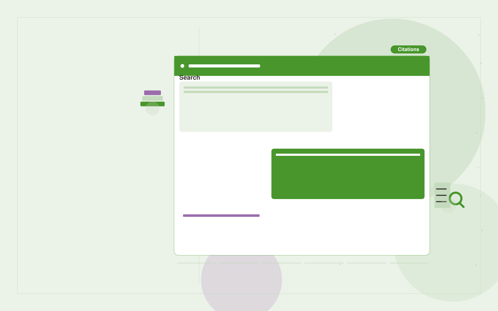

# Public records search assistant

**Government** · Also fits: Operations; Writers; IT and Development

> For journalists and civic research organizations, turn legitimately accessible records and document metadata into cited search results and research folders. Address the recurring problem: large public record collections are hard to search meaningfully. The value hypothesis is a more complete, reviewable deliverable with less repeated preparation; the pilot must establish whether that benefit is real.

| | |
|---|---|
| **Buyer** | Journalists and civic research organizations |
| **Problem** | Large public record collections are hard to search meaningfully. |
| **Format** | Source-linked assistant and administrator console |
| **USP** | Search results retain page-level provenance and publication context. |

## The product
Key screens: Collection search, passage viewer, citation export. Give end users a simple search or conversation surface with short answers and expandable citations. Administrators get source status, unanswered questions and handoff queues. Show the source date beside relevant answers. Keep conversation context available to the staff member receiving an escalation. In this product, the first view is collection search, followed by passage viewer and citation export.

## Core functionality
1. Index documents.
2. Recognize scanned text.
3. Filter dates and agencies.
4. Retrieve passages.
5. Preserve document context.
6. Export citations.

## Customer workflow
Add an approved collection, assign source owners and access rules, test representative questions, let users ask questions, retrieve supporting passages, answer or request clarification, and hand off unresolved cases with their context. Start with legitimately accessible records and document metadata and finish with cited search results and research folders.

## AI and human review
Retrieve permitted passages and generate answers constrained to those sources. Use structured rules for transactional facts. Detect missing context and refuse to invent unsupported details. Store reviewer corrections for evaluation and controlled knowledge updates.

## Customer inputs
Legitimately accessible records and document metadata

## Customer deliverables
Cited search results and research folders

## Accounts and administration
Source ownership, document permissions, freshness checks, conversation history, human handoff, feedback, test questions, usage limits and access logs.

## MVP scope
Begin with journalists and civic research organizations and one recurring use case. Build the first two modules: index documents; recognize scanned text. Provide operator assistance for the third module: filter dates and agencies. Deliver cited search results and research folders through a manual review queue. Perform other necessary full-scope functions manually during the pilot. Include all applicable access, accuracy and professional-review controls from the start.

## After MVP validation
After paid pilots establish value, automate the remaining modules: retrieve passages; preserve document context; export citations. Add one validated source integration, reusable customer configuration and recurring delivery. Expand to additional teams, document formats or languages only after testing the new scope.

## Build dependencies
Permission-filtered retrieval, document versioning, a question evaluation set, staff handoff and a source update process. Reliability depends on source quality and scope.

## Integrations and data access
Official publications, agency document stores and approved service workflows. Approved knowledge repositories, websites, service desks and staff messaging systems. Validate access inheritance and use read-only ingestion for the initial deployment. These are candidate integration categories, not verified supported connectors.

## Defensibility
A maintained domain knowledge collection, realistic evaluation questions, useful escalation paths and integrations in the customer’s daily work. For this idea, build around search results retain page-level provenance and publication context. This advantage requires execution and accumulated customer trust; the base model alone is not a defensible asset.

## Alternatives and positioning
Manual search, static FAQs, general chat tools and support or intranet suites. Differentiate on this specific proposed advantage: search results retain page-level provenance and publication context. Test it against the buyer's current method on the same task. Competitor coverage and uniqueness have not been established.

## Revenue model and test pricing (USD)
Test USD 500-2,000 setup plus USD 150-600 monthly for one defined source collection and usage allowance. Price multi-location deployments and specialist support separately. Validate willingness to pay; these are hypotheses.

## Main delivery costs
Document ingestion, retrieval and generation, source maintenance, support, evaluation and staff time handling unresolved cases.

## Marketing message to test
> Public records search assistant for journalists and civic research organizations. Search results retain page-level provenance and publication context. Demonstrate the claim through a searchable public-record collection demo.

## Acquisition channels
Investigative journalism communities

## Lead magnet
A searchable public-record collection demo

## First 30 days of marketing
- Week 1: interview five prospective buyers in this segment: journalists and civic research organizations. Ask to see a recent example of the problem and their current process.
- Week 2: prepare this demonstration using authorized or synthetic material: a searchable public-record collection demo.
- Week 3: present it through investigative journalism communities and seek one narrowly scoped paid pilot.
- Week 4: review relevant retrieval, citation accuracy, total delivery effort and a concrete renewal decision before increasing scope.

## Paid pilot and validation
Restrict the assistant to one collection and test answered, ambiguous and unanswerable questions. Run supervised use before wider rollout. Measure correctness, escalation quality and staff effort. For this idea, use legitimately accessible records and document metadata and evaluate cited search results and research folders. Agree success thresholds with the buyer before starting; collect a baseline for relevant retrieval, citation accuracy. A positive signal is payment and repeat use with acceptable quality and delivery cost, not a favorable demo reaction alone.

## Success metrics
Relevant retrieval, citation accuracy

## Retention and expansion
Review unanswered questions and source freshness monthly. Expand to another source collection or team only after the existing assistant meets its agreed accuracy and handoff criteria.

## Operating controls and limitations
Preserve official source versions, accessibility and audit records. Confirm agency-specific procurement, records and data handling requirements during discovery. Validate source access and reviewer availability during the pilot. Maintain customer-level access, data deletion controls and a record of final approvals.

## Brand style (concept)

- Colors: `#359127` primary · `#9e54c9` accent · `#e6f1e4` surface · `#22201e` ink
- Type: Playfair Display for headings, Source Sans 3 for text
- Voice: Plain-spoken, neutral, accountable
- Demo site: [https://nexibeo.com/ideas/public-records-search-assistant/demo/](https://nexibeo.com/ideas/public-records-search-assistant/demo/)

## Investment indication

Indicative build budget, from MVP to full product. This is a planning range, not a quote; it excludes running costs such as model usage, hosting and reviewer hours. Built with Nexibeo's AI software development factory, most implementations take days to a few weeks of creation time, depending on availability.

| Phase | Scope | Creation time | Indicative budget |
|---|---|---|---|
| MVP | One buyer segment, one recurring use case; first modules: index documents; recognize scanned text. Manual review in the loop. | 5 days | $10,000 |
| Paid pilot | Accounts, roles, review states, audit trail and the first integration, hardened for two to three paying pilot customers. | 6 days | $12,500 |
| Full product | Remaining modules: retrieve passages; preserve document context; export citations. Self-serve onboarding, billing, monitoring and the wider integration set. | 2 weeks | $17,000 |
| **Total** | | about 5 weeks | **$39,500** |

### Running costs per month (rough indication, untested)

| Stage | Hosting and infrastructure | AI usage | Total per month |
|---|---|---|---|
| MVP and paid pilot (about 3 customers) | $50–$100 | $60–$120 | **$110–$220** |
| Full product (about 50 customers) | $190–$380 | $530–$1,050 | **$720–$1,430** |

**Co-create this project with us:** [contact Nexibeo](https://nexibeo.com/ideas/public-records-search-assistant/#apply) and we build it with you.

## Research status
Concept proposal expanded from the 315-idea conversation. Demand, pricing, differentiation, build scope and integration feasibility are hypotheses, not verified market findings. Category link is inspiration rather than evidence of business viability.

## Credits and next steps

- **Estimation and building this idea:** see the full idea page on [nexibeo.com](https://nexibeo.com/ideas/public-records-search-assistant/) for more detail on estimation, and to co-create and build this idea with Nexibeo.
- **Become an AI-optimized specialist for Government:** [Complete AI Training](https://completeaitraining.com/certification/12b-ai-certification-for-government-employees/).
- Field news: [AI news for Government](https://completeaitraining.com/all-ai-news-for-government/).
