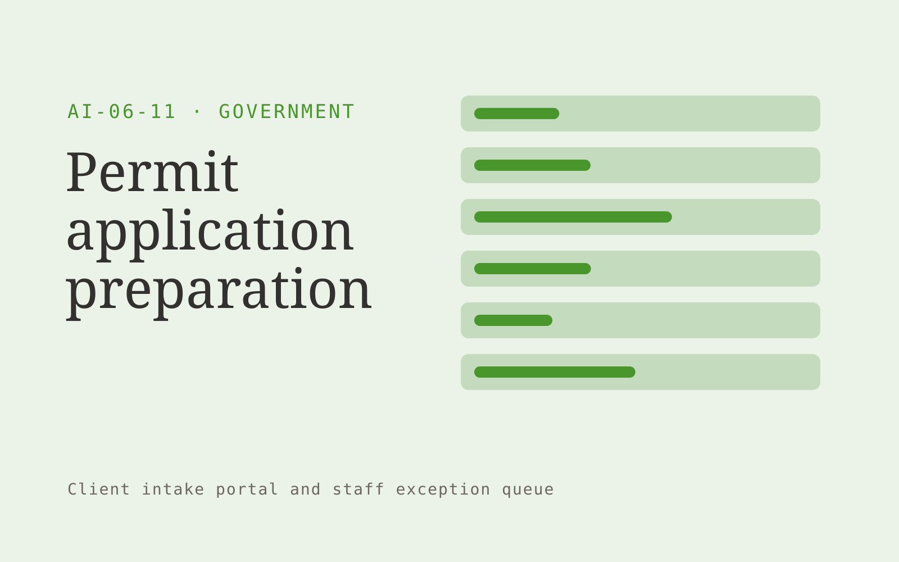

# Permit application preparation

**Government** · Also fits: Operations; Writers; Customer Support

> For small contractors submitting routine permits, turn published checklists, applicant documents and project details into applicant-reviewed permit document pack. Address the recurring problem: incomplete applications cause repeated administrative delays. The value hypothesis is a more complete, reviewable deliverable with less repeated preparation; the pilot must establish whether that benefit is real.

| | |
|---|---|
| **Buyer** | Small contractors submitting routine permits |
| **Problem** | Incomplete applications cause repeated administrative delays. |
| **Format** | Client intake portal and staff exception queue |
| **USP** | Completeness checks tied to the exact published permit checklist. |

## The product
Key screens: Application checklist, document review, submission pack. Give submitters a mobile-friendly step-by-step form with document uploads and a visible completeness checklist. Staff see a queue with missing items and extracted fields. Place the original document beside each uncertain value. Show submitted, clarification required and ready-for-review states. In this product, the first view is application checklist, followed by document review and submission pack.

## Core functionality
1. Select permit category.
2. Extract required fields.
3. Detect missing attachments.
4. Cross-check identifiers.
5. Track checklist versions.
6. Assemble applicant review.

## Customer workflow
Choose the request type, collect declared facts and required documents, extract relevant fields, show missing or inconsistent information, let the submitter correct it, and route the complete package to an authorized reviewer. Start with published checklists, applicant documents and project details and finish with applicant-reviewed permit document pack.

## AI and human review
Classify submitted material, extract candidate fields and draft clarification questions. Deterministic rules test required fields and formats. Keep uncertain extraction visible and preserve the original statement. Do not infer missing material facts.

## Customer inputs
Published checklists, applicant documents and project details

## Customer deliverables
Applicant-reviewed permit document pack

## Accounts and administration
Secure uploads, configurable checklists, progress saving, duplicate handling, reviewer assignments, clarification threads, deadlines and submission history.

## MVP scope
Begin with small contractors submitting routine permits and one recurring use case. Build the first two modules: select permit category; extract required fields. Provide operator assistance for the third module: detect missing attachments. Deliver applicant-reviewed permit document pack through a manual review queue. Perform other necessary full-scope functions manually during the pilot. Include all applicable access, accuracy and professional-review controls from the start.

## After MVP validation
After paid pilots establish value, automate the remaining modules: cross-check identifiers; track checklist versions; assemble applicant review. Add one validated source integration, reusable customer configuration and recurring delivery. Expand to additional teams, document formats or languages only after testing the new scope.

## Build dependencies
Secure upload handling, reliable extraction, versioned completeness rules, submitter identity and staff routing. Third-party checklist changes require maintenance.

## Integrations and data access
Official publications, agency document stores and approved service workflows. Case management, customer records, document storage and notification systems. Begin with an exportable review pack before automating destination writes. These are candidate integration categories, not verified supported connectors.

## Defensibility
Document-type expertise, tested completeness rules and a low-friction client experience embedded in a repeat administrative process. For this idea, build around completeness checks tied to the exact published permit checklist. This advantage requires execution and accumulated customer trust; the base model alone is not a defensible asset.

## Alternatives and positioning
Email collection, generic web forms, spreadsheets and existing case management systems. Differentiate on this specific proposed advantage: completeness checks tied to the exact published permit checklist. Test it against the buyer's current method on the same task. Competitor coverage and uniqueness have not been established.

## Revenue model and test pricing (USD)
Test USD 500-2,000 setup plus USD 150-750 monthly for one form family and a capped submission volume. Quote specialist review and unusual document formats separately. Prices are experimental.

## Main delivery costs
Document processing, storage, exception review, support, checklist maintenance and customer-specific integration work.

## Marketing message to test
> Permit application preparation for small contractors submitting routine permits. Completeness checks tied to the exact published permit checklist. Demonstrate the claim through a permit package completeness report.

## Acquisition channels
Building permit consultants

## Lead magnet
A permit package completeness report

## First 30 days of marketing
- Week 1: interview five prospective buyers in this segment: small contractors submitting routine permits. Ask to see a recent example of the problem and their current process.
- Week 2: prepare this demonstration using authorized or synthetic material: a permit package completeness report.
- Week 3: present it through building permit consultants and seek one narrowly scoped paid pilot.
- Week 4: review first-pass completeness, clarification rounds, total delivery effort and a concrete renewal decision before increasing scope.

## Paid pilot and validation
Process a bounded set of historical and new submissions. Include missing, duplicate and unreadable documents. Compare complete submissions and clarification effort with the current intake method. For this idea, use published checklists, applicant documents and project details and evaluate applicant-reviewed permit document pack. Agree success thresholds with the buyer before starting; collect a baseline for first-pass completeness, clarification rounds. A positive signal is payment and repeat use with acceptable quality and delivery cost, not a favorable demo reaction alone.

## Success metrics
First-pass completeness, clarification rounds

## Retention and expansion
Review incomplete submissions and simplify recurring friction. Expand to another form or document family after the first workflow reliably produces review-ready cases.

## Operating controls and limitations
Preserve official source versions, accessibility and audit records. Confirm agency-specific procurement, records and data handling requirements during discovery. Validate source access and reviewer availability during the pilot. Maintain customer-level access, data deletion controls and a record of final approvals.

## Brand style (concept)

- Colors: `#4f9127` primary · `#8d54c9` accent · `#e9f1e4` surface · `#22201e` ink
- Type: Playfair Display for headings, Source Sans 3 for text
- Voice: Plain-spoken, neutral, accountable
- Demo site: [https://nexibeo.com/ideas/permit-application-preparation/demo/](https://nexibeo.com/ideas/permit-application-preparation/demo/)

## Investment indication

Indicative build budget, from MVP to full product. This is a planning range, not a quote; it excludes running costs such as model usage, hosting and reviewer hours.

| Phase | Scope | Timeline | Indicative budget |
|---|---|---|---|
| MVP | One buyer segment, one recurring use case; first modules: select permit category; extract required fields. Manual review in the loop. | 6 weeks | $11,000 |
| Paid pilot | Accounts, roles, review states, audit trail and the first integration, hardened for two to three paying pilot customers. | 8 weeks | $14,500 |
| Full product | Remaining modules: cross-check identifiers; track checklist versions; assemble applicant review. Self-serve onboarding, billing, monitoring and the wider integration set. | 13 weeks | $20,500 |
| **Total** | | 27 weeks | **$46,000** |

### Running costs per month (rough indication, untested)

| Stage | Hosting and infrastructure | AI usage | Total per month |
|---|---|---|---|
| MVP and paid pilot (about 3 customers) | $50–$100 | $40–$90 | **$90–$190** |
| Full product (about 50 customers) | $190–$380 | $280–$560 | **$470–$940** |

**Co-create this project with us:** [contact Nexibeo](https://nexibeo.com/ideas/permit-application-preparation/#apply) and we build it with you.

## Research status
Concept proposal expanded from the 315-idea conversation. Demand, pricing, differentiation, build scope and integration feasibility are hypotheses, not verified market findings. Category link is inspiration rather than evidence of business viability.

## Credits and next steps

- **Estimation and building this idea:** see the full idea page on [nexibeo.com](https://nexibeo.com/ideas/permit-application-preparation/) for more detail on estimation, and to co-create and build this idea with Nexibeo.
- **Become an AI-optimized specialist for Government:** [Complete AI Training](https://completeaitraining.com/certification/12b-ai-certification-for-government-employees/).
- Field news: [AI news for Government](https://completeaitraining.com/all-ai-news-for-government/).
