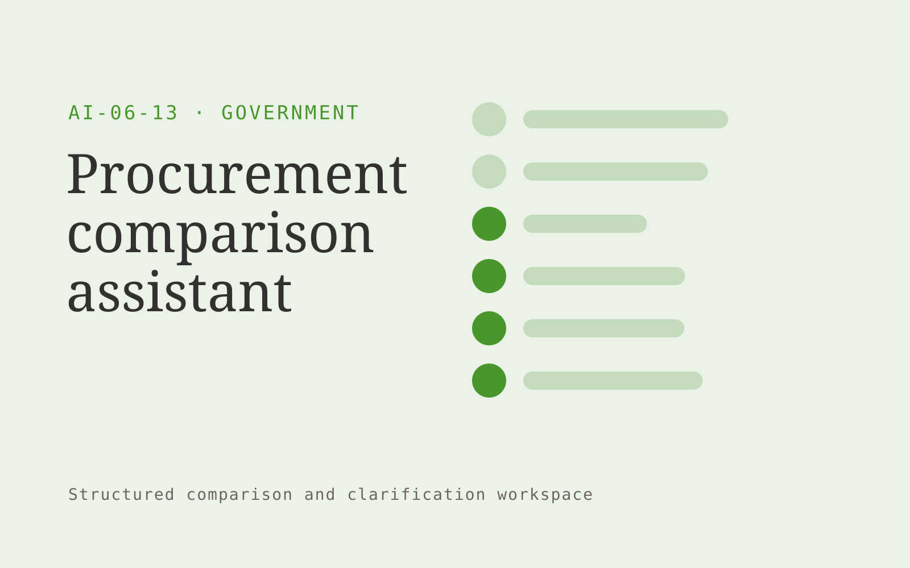

# Procurement comparison assistant

**Government** · Also fits: Operations; Writers

> For public procurement evaluation teams, turn proposals, disclosed criteria and scoring guidance into evaluation evidence matrix. Address the recurring problem: supplier proposals vary in structure and conceal missing responses. The value hypothesis is a more complete, reviewable deliverable with less repeated preparation; the pilot must establish whether that benefit is real.

| | |
|---|---|
| **Buyer** | Public procurement evaluation teams |
| **Problem** | Supplier proposals vary in structure and conceal missing responses. |
| **Format** | Structured comparison and clarification workspace |
| **USP** | Evidence organization follows disclosed criteria without replacing evaluators. |

## The product
Key screens: Comparison matrix, evidence panel, evaluator notes. Use a side-by-side matrix with the same fields for every document or option. Clicking a value reveals its original passage. Highlight missing, different and uncertain items separately. Provide a clarification queue and reviewer annotations before exporting a decision pack. In this product, the first view is comparison matrix, followed by evidence panel and evaluator notes.

## Core functionality
1. Map proposal sections.
2. Identify omissions.
3. Normalize comparable fields.
4. Cite supplier claims.
5. Capture evaluator judgments.
6. Preserve assessment history.

## Customer workflow
Define comparison fields, upload source versions or offers, extract candidate values, normalize only agreed units, inspect differences, resolve questions with reviewers, and export an evidence-linked comparison. Start with proposals, disclosed criteria and scoring guidance and finish with evaluation evidence matrix.

## AI and human review
Align document sections and extract proposed comparable fields. Deterministic checks handle units and arithmetic. Preserve original wording and label assumptions. Professional reviewers assess the meaning and significance of differences.

## Customer inputs
Proposals, disclosed criteria and scoring guidance

## Customer deliverables
Evaluation evidence matrix

## Accounts and administration
Document versions, field definitions, source references, reviewer corrections, unresolved questions, comparison history and exportable matrices.

## MVP scope
Begin with public procurement evaluation teams and one recurring use case. Build the first two modules: map proposal sections; identify omissions. Provide operator assistance for the third module: normalize comparable fields. Deliver evaluation evidence matrix through a manual review queue. Perform other necessary full-scope functions manually during the pilot. Include all applicable access, accuracy and professional-review controls from the start.

## After MVP validation
After paid pilots establish value, automate the remaining modules: cite supplier claims; capture evaluator judgments; preserve assessment history. Add one validated source integration, reusable customer configuration and recurring delivery. Expand to additional teams, document formats or languages only after testing the new scope.

## Build dependencies
Document alignment, field provenance, unit normalization, missing-value handling and reviewer correction. Similar-looking documents may contain materially different terms.

## Integrations and data access
Official publications, agency document stores and approved service workflows. Document repositories, procurement or contract records and spreadsheet exports. Preserve originals and avoid writing back interpretations without approval. These are candidate integration categories, not verified supported connectors.

## Defensibility
A niche comparison schema, reviewed extraction examples and clear handling of the differences that matter to a specific buyer. For this idea, build around evidence organization follows disclosed criteria without replacing evaluators. This advantage requires execution and accumulated customer trust; the base model alone is not a defensible asset.

## Alternatives and positioning
Spreadsheet comparisons, professional reviewers, document diff tools and manual quote or contract review. Differentiate on this specific proposed advantage: evidence organization follows disclosed criteria without replacing evaluators. Test it against the buyer's current method on the same task. Competitor coverage and uniqueness have not been established.

## Revenue model and test pricing (USD)
Test USD 300-1,500 for one bounded comparison package, then USD 150-600 monthly for recurring volume with review limits. Complex expert interpretation is separately priced. Figures are hypotheses.

## Main delivery costs
Document parsing, field alignment, source verification, expert interpretation, clarification rounds and changing document formats.

## Marketing message to test
> Procurement comparison assistant for public procurement evaluation teams. Evidence organization follows disclosed criteria without replacing evaluators. Demonstrate the claim through a structured comparison of sample bids.

## Acquisition channels
Procurement training and consulting firms

## Lead magnet
A structured comparison of sample bids

## First 30 days of marketing
- Week 1: interview five prospective buyers in this segment: public procurement evaluation teams. Ask to see a recent example of the problem and their current process.
- Week 2: prepare this demonstration using authorized or synthetic material: a structured comparison of sample bids.
- Week 3: present it through procurement training and consulting firms and seek one narrowly scoped paid pilot.
- Week 4: review evidence completeness, evaluator preparation time, total delivery effort and a concrete renewal decision before increasing scope.

## Paid pilot and validation
Compare a known set already reviewed by a domain expert. Check meaningful differences, false alarms and missing fields. Measure reviewer time including corrections rather than extraction speed alone. For this idea, use proposals, disclosed criteria and scoring guidance and evaluate evaluation evidence matrix. Agree success thresholds with the buyer before starting; collect a baseline for evidence completeness, evaluator preparation time. A positive signal is payment and repeat use with acceptable quality and delivery cost, not a favorable demo reaction alone.

## Success metrics
Evidence completeness, evaluator preparation time

## Retention and expansion
Save reviewer-approved comparison fields and recurring document formats. Offer repeat comparisons and explicit updates when the source options change.

## Operating controls and limitations
Preserve official source versions, accessibility and audit records. Confirm agency-specific procurement, records and data handling requirements during discovery. Validate source access and reviewer availability during the pilot. Maintain customer-level access, data deletion controls and a record of final approvals.

## Brand style (concept)

- Colors: `#2f9127` primary · `#c954c7` accent · `#e6f1e4` surface · `#22201e` ink
- Type: Playfair Display for headings, Source Sans 3 for text
- Voice: Plain-spoken, neutral, accountable
- Demo site: [https://nexibeo.com/solutions/procurement-comparison-assistant/demo/](https://nexibeo.com/solutions/procurement-comparison-assistant/demo/)

## Investment indication

Indicative build budget, from MVP to full product. This is a planning range, not a quote; it excludes running costs such as model usage, hosting and reviewer hours. Built with Nexibeo's AI software development factory, most implementations take days to a few weeks of creation time, depending on availability.

| Phase | Scope | Creation time | Indicative budget |
|---|---|---|---|
| MVP | One buyer segment, one recurring use case; first modules: map proposal sections; identify omissions. Manual review in the loop. | 6 days | $11,000 |
| Paid pilot | Accounts, roles, review states, audit trail and the first integration, hardened for two to three paying pilot customers. | 7 days | $14,000 |
| Full product | Remaining modules: cite supplier claims; capture evaluator judgments; preserve assessment history. Self-serve onboarding, billing, monitoring and the wider integration set. | 3 weeks | $19,000 |
| **Total** | | about 5 weeks | **$44,000** |

### Running costs per month (rough indication, untested)

| Stage | Hosting and infrastructure | AI usage | Total per month |
|---|---|---|---|
| MVP and paid pilot (about 3 customers) | $50–$100 | $50–$100 | **$100–$200** |
| Full product (about 50 customers) | $190–$380 | $350–$700 | **$540–$1,080** |

**Get this built:** [contact Nexibeo](https://nexibeo.com/solutions/procurement-comparison-assistant/#apply). We build it with our AI software factory, usually in days to a few weeks, for you to run internally or offer to your clients.

## Research status
Concept proposal expanded from the 315-idea conversation. Demand, pricing, differentiation, build scope and integration feasibility are hypotheses, not verified market findings. Category link is inspiration rather than evidence of business viability.

## Credits and next steps

- **Estimation and having it built:** see the full solution page on [nexibeo.com](https://nexibeo.com/solutions/procurement-comparison-assistant/) for more detail on estimation. Nexibeo builds it for you as a custom AI implementation, to run internally or to offer to your own clients.
- **Become an AI-optimized specialist for Government:** [Complete AI Training](https://completeaitraining.com/certification/12b-ai-certification-for-government-employees/).
- Field news: [AI news for Government](https://completeaitraining.com/all-ai-news-for-government/).
