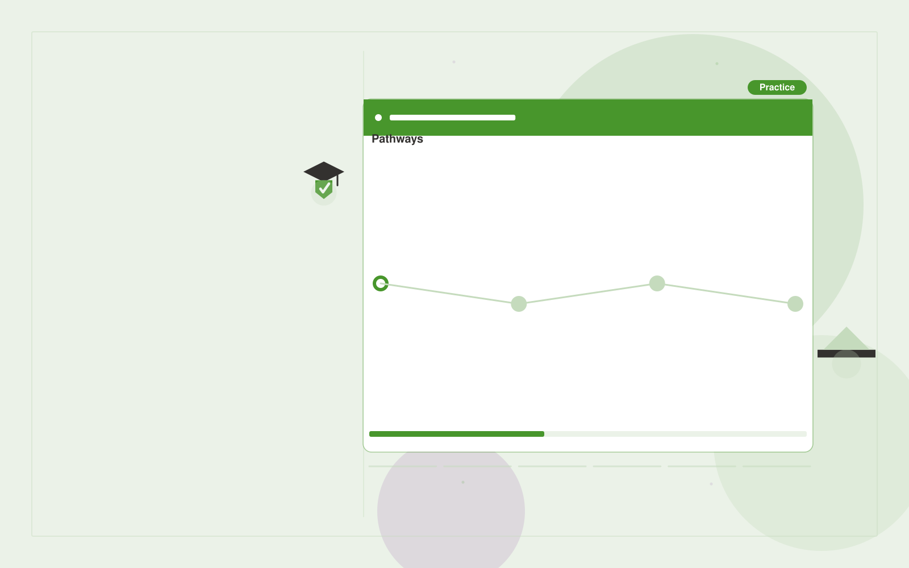

# Government workforce training

**Government** · Also fits: Operations; Writers; Education

> For public-sector learning and development teams, turn agency policies, role tasks and training examples into agency-specific AI learning program. Address the recurring problem: staff training lacks relevant approved-tool workflows. The value hypothesis is a more complete, reviewable deliverable with less repeated preparation; the pilot must establish whether that benefit is real.

| | |
|---|---|
| **Buyer** | Public-sector learning and development teams |
| **Problem** | Staff training lacks relevant approved-tool workflows. |
| **Format** | Role-based learning platform and course authoring console |
| **USP** | Role-specific practice aligned with the agency's actual tool permissions. |

## The product
Key screens: Role pathways, practice lab, manager overview. Provide a learner home with the next useful lesson, a practice activity and progress evidence. Give authors a source-linked course editor and assessment review queue. Supervisors see completed tasks and explicit sign-offs. Use short modules that work on mobile as well as desktop. In this product, the first view is role pathways, followed by practice lab and manager overview.

## Core functionality
1. Map approved use cases.
2. Create task exercises.
3. Explain data boundaries.
4. Assess outputs.
5. Run live clinics.
6. Refresh policy-linked lessons.

## Customer workflow
Define learning objectives, map approved source material, review lessons and questions, assess the learner’s starting point, deliver targeted practice, collect evidence of competence, and update affected lessons when sources change. Start with agency policies, role tasks and training examples and finish with agency-specific AI learning program.

## AI and human review
Draft lesson structure, examples, explanations and practice questions from approved material. Adapt practice using demonstrated responses. Educators validate answer keys and content. Completion status is distinct from demonstrated ability.

## Customer inputs
Agency policies, role tasks and training examples

## Customer deliverables
Agency-specific AI learning program

## Accounts and administration
Learner enrollment, content versions, assessment review, role pathways, accessibility options, supervisor sign-off, progress records and source update alerts.

## MVP scope
Begin with public-sector learning and development teams and one recurring use case. Build the first two modules: map approved use cases; create task exercises. Provide operator assistance for the third module: explain data boundaries. Deliver agency-specific AI learning program through a manual review queue. Perform other necessary full-scope functions manually during the pilot. Include all applicable access, accuracy and professional-review controls from the start.

## After MVP validation
After paid pilots establish value, automate the remaining modules: assess outputs; run live clinics; refresh policy-linked lessons. Add one validated source integration, reusable customer configuration and recurring delivery. Expand to additional teams, document formats or languages only after testing the new scope.

## Build dependencies
Clear objectives, licensed or approved sources, validated assessments, learner state and source-change tracking. Media and accessibility requirements affect production effort.

## Integrations and data access
Official publications, agency document stores and approved service workflows. Learning portals, employee or member directories and completion exports. Validate standards and identity requirements before promising native LMS compatibility. These are candidate integration categories, not verified supported connectors.

## Defensibility
A reviewed niche curriculum, realistic practice tasks and evidence of useful learning outcomes in a defined role. For this idea, build around role-specific practice aligned with the agency's actual tool permissions. This advantage requires execution and accumulated customer trust; the base model alone is not a defensible asset.

## Alternatives and positioning
Courses, internal trainers, learning management systems and static training documents. Differentiate on this specific proposed advantage: role-specific practice aligned with the agency's actual tool permissions. Test it against the buyer's current method on the same task. Competitor coverage and uniqueness have not been established.

## Revenue model and test pricing (USD)
Test USD 750-3,000 for one custom learning pathway, then USD 10-40 per active learner monthly with a minimum account fee. Public memberships may use lower fixed subscriptions. Prices are experiments, not benchmarks.

## Main delivery costs
Instructional design, subject review, media production, assessment validation, learner support and content refreshes.

## Marketing message to test
> Government workforce training for public-sector learning and development teams. Role-specific practice aligned with the agency's actual tool permissions. Demonstrate the claim through a practical workshop for one administrative role.

## Acquisition channels
Public-sector training providers

## Lead magnet
A practical workshop for one administrative role

## First 30 days of marketing
- Week 1: interview five prospective buyers in this segment: public-sector learning and development teams. Ask to see a recent example of the problem and their current process.
- Week 2: prepare this demonstration using authorized or synthetic material: a practical workshop for one administrative role.
- Week 3: present it through public-sector training providers and seek one narrowly scoped paid pilot.
- Week 4: review task competence, verified workplace adoption, total delivery effort and a concrete renewal decision before increasing scope.

## Paid pilot and validation
Teach one important task to a small cohort. Compare performance before and after on different examples, gather educator review and check whether learners can apply the skill outside the lesson. For this idea, use agency policies, role tasks and training examples and evaluate agency-specific AI learning program. Agree success thresholds with the buyer before starting; collect a baseline for task competence, verified workplace adoption. A positive signal is payment and repeat use with acceptable quality and delivery cost, not a favorable demo reaction alone.

## Success metrics
Task competence, verified workplace adoption

## Retention and expansion
Refresh lessons when their source changes, add task-specific practice and review real application of the learning. Expand into adjacent roles after proving usefulness.

## Operating controls and limitations
Preserve official source versions, accessibility and audit records. Confirm agency-specific procurement, records and data handling requirements during discovery. Validate source access and reviewer availability during the pilot. Maintain customer-level access, data deletion controls and a record of final approvals.

## Brand style (concept)

- Colors: `#3a9127` primary · `#c954ba` accent · `#e7f1e4` surface · `#22201e` ink
- Type: Playfair Display for headings, Source Sans 3 for text
- Voice: Plain-spoken, neutral, accountable
- Demo site: [https://nexibeo.com/solutions/government-workforce-training/demo/](https://nexibeo.com/solutions/government-workforce-training/demo/)

## Investment indication

Indicative build budget, from MVP to full product. This is a planning range, not a quote; it excludes running costs such as model usage, hosting and reviewer hours. Built with Nexibeo's AI software development factory, most implementations take days to a few weeks of creation time, depending on availability.

| Phase | Scope | Creation time | Indicative budget |
|---|---|---|---|
| MVP | One buyer segment, one recurring use case; first modules: map approved use cases; create task exercises. Manual review in the loop. | 7 days | $12,000 |
| Paid pilot | Accounts, roles, review states, audit trail and the first integration, hardened for two to three paying pilot customers. | 8 days | $16,000 |
| Full product | Remaining modules: assess outputs; run live clinics; refresh policy-linked lessons. Self-serve onboarding, billing, monitoring and the wider integration set. | 3 weeks | $22,000 |
| **Total** | | about 6 weeks | **$50,000** |

### Running costs per month (rough indication, untested)

| Stage | Hosting and infrastructure | AI usage | Total per month |
|---|---|---|---|
| MVP and paid pilot (about 3 customers) | $50–$100 | $50–$110 | **$100–$210** |
| Full product (about 50 customers) | $190–$380 | $420–$840 | **$610–$1,220** |

**Get this built:** [contact Nexibeo](https://nexibeo.com/solutions/government-workforce-training/#apply). We build it with our AI software factory, usually in days to a few weeks, for you to run internally or offer to your clients.

## Research status
Concept proposal expanded from the 315-idea conversation. Demand, pricing, differentiation, build scope and integration feasibility are hypotheses, not verified market findings. Category link is inspiration rather than evidence of business viability.

## Credits and next steps

- **Estimation and having it built:** see the full solution page on [nexibeo.com](https://nexibeo.com/solutions/government-workforce-training/) for more detail on estimation. Nexibeo builds it for you as a custom AI implementation, to run internally or to offer to your own clients.
- **Become an AI-optimized specialist for Government:** [Complete AI Training](https://completeaitraining.com/certification/12b-ai-certification-for-government-employees/).
- Field news: [AI news for Government](https://completeaitraining.com/all-ai-news-for-government/).
