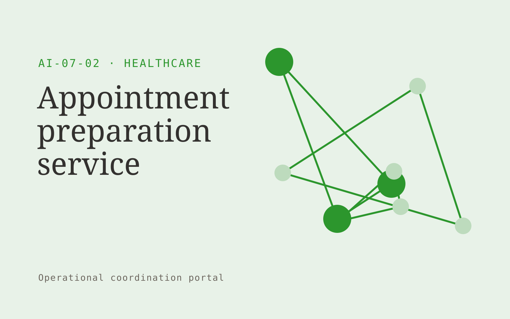

# Appointment preparation service

**Healthcare** · Also fits: Education; Operations; Management

> For operations managers at outpatient clinics, turn clinician-approved instructions and appointment categories into approved preparation messages and readiness checklist. Address the recurring problem: patients arrive without required documents or preparation information. The value hypothesis is a more complete, reviewable deliverable with less repeated preparation; the pilot must establish whether that benefit is real.

| | |
|---|---|
| **Buyer** | Operations managers at outpatient clinics |
| **Problem** | Patients arrive without required documents or preparation information. |
| **Format** | Operational coordination portal |
| **USP** | Correct approved instructions matched to appointment type and version. |

## The product
Key screens: Appointment queue, instruction preview, completion checklist. Use a queue or timeline as the opening view, with clear owners, dates and current states. Each case opens into its source context, proposed actions and discussion. Give external participants a limited form or status page. Make the next required action visible without opening every record. In this product, the first view is appointment queue, followed by instruction preview and completion checklist.

## Core functionality
1. Map appointment types.
2. Select approved instructions.
3. Personalize logistics.
4. Send authorized reminders.
5. Collect acknowledgments.
6. Escalate preparation questions.

## Customer workflow
Create a case from approved inputs, identify required actions, confirm owners and dates, request missing information, approve proposed communications or changes, track completion, and retain a handover record. Start with clinician-approved instructions and appointment categories and finish with approved preparation messages and readiness checklist.

## AI and human review
Extract candidate actions and relevant context, classify requests and draft communications. Use explicit rules for scheduling, state transitions and permissions. People confirm obligations and approve consequential actions before execution.

## Customer inputs
Clinician-approved instructions and appointment categories

## Customer deliverables
Approved preparation messages and readiness checklist

## Accounts and administration
Role permissions, task ownership, deadlines, reminders, approval gates, exception handling, action history, duplicate prevention and reversible configuration.

## MVP scope
Begin with operations managers at outpatient clinics and one recurring use case. Build the first two modules: map appointment types; select approved instructions. Provide operator assistance for the third module: personalize logistics. Deliver approved preparation messages and readiness checklist through a manual review queue. Perform other necessary full-scope functions manually during the pilot. Include all applicable access, accuracy and professional-review controls from the start.

## After MVP validation
After paid pilots establish value, automate the remaining modules: send authorized reminders; collect acknowledgments; escalate preparation questions. Add one validated source integration, reusable customer configuration and recurring delivery. Expand to additional teams, document formats or languages only after testing the new scope.

## Build dependencies
Explicit state definitions, owner mapping, approval rules, idempotent actions, notifications and recovery procedures. Workflow reliability matters more than fluent text.

## Integrations and data access
Clinic-approved content and administrative exports. Clinical integrations require separate assessment. Calendars, email, task managers and relevant business records. Use draft actions and supervised handoffs first, then enable only specifically authorized writes. These are candidate integration categories, not verified supported connectors.

## Defensibility
Customer-specific workflow rules, reliable handoffs, operational history and integrations that make the service part of daily work. For this idea, build around correct approved instructions matched to appointment type and version. This advantage requires execution and accumulated customer trust; the base model alone is not a defensible asset.

## Alternatives and positioning
Shared inboxes, spreadsheets, task boards and existing workflow automation products. Differentiate on this specific proposed advantage: correct approved instructions matched to appointment type and version. Test it against the buyer's current method on the same task. Competitor coverage and uniqueness have not been established.

## Revenue model and test pricing (USD)
Test USD 750-2,500 setup plus USD 200-800 monthly for one bounded workflow and team. Cap case volume and implementation scope. Larger operational integrations need separate quotes. Prices are hypotheses.

## Main delivery costs
Workflow configuration, integration maintenance, model calls, notification delivery, exception support and monitoring.

## Marketing message to test
> Appointment preparation service for operations managers at outpatient clinics. Correct approved instructions matched to appointment type and version. Demonstrate the claim through a sample preparation journey for one appointment type.

## Acquisition channels
Clinic management software consultants

## Lead magnet
A sample preparation journey for one appointment type

## First 30 days of marketing
- Week 1: interview five prospective buyers in this segment: operations managers at outpatient clinics. Ask to see a recent example of the problem and their current process.
- Week 2: prepare this demonstration using authorized or synthetic material: a sample preparation journey for one appointment type.
- Week 3: present it through clinic management software consultants and seek one narrowly scoped paid pilot.
- Week 4: review preparation completeness, staff clarification calls, total delivery effort and a concrete renewal decision before increasing scope.

## Paid pilot and validation
Run one recurring workflow with a small team. Track every handoff and exception, verify completed actions, and compare handling time and missed commitments with the prior process. For this idea, use clinician-approved instructions and appointment categories and evaluate approved preparation messages and readiness checklist. Agree success thresholds with the buyer before starting; collect a baseline for preparation completeness, staff clarification calls. A positive signal is payment and repeat use with acceptable quality and delivery cost, not a favorable demo reaction alone.

## Success metrics
Preparation completeness, staff clarification calls

## Retention and expansion
Report completed actions and recurring exceptions. Maintain the workflow as policies change, then add one adjacent handoff with clear ownership.

## Operating controls and limitations
Begin with administrative scope or clinician-reviewed material. Minimize sensitive patient data, restrict access and obtain required organizational review before connecting clinical systems. Validate source access and reviewer availability during the pilot. Maintain customer-level access, data deletion controls and a record of final approvals.

## Brand style (concept)

- Colors: `#2c9127` primary · `#a454c9` accent · `#e5f1e4` surface · `#22201e` ink
- Type: Manrope for headings, Manrope for text
- Voice: Careful, kind, clinically plain
- Demo site: [https://nexibeo.com/ideas/appointment-preparation-service/demo/](https://nexibeo.com/ideas/appointment-preparation-service/demo/)

## Investment indication

Indicative build budget, from MVP to full product. This is a planning range, not a quote; it excludes running costs such as model usage, hosting and reviewer hours.

| Phase | Scope | Timeline | Indicative budget |
|---|---|---|---|
| MVP | One buyer segment, one recurring use case; first modules: map appointment types; select approved instructions. Manual review in the loop. | 6 weeks | $12,000 |
| Paid pilot | Accounts, roles, review states, audit trail and the first integration, hardened for two to three paying pilot customers. | 8 weeks | $15,500 |
| Full product | Remaining modules: send authorized reminders; collect acknowledgments; escalate preparation questions. Self-serve onboarding, billing, monitoring and the wider integration set. | 14 weeks | $21,500 |
| **Total** | | 28 weeks | **$49,000** |

### Running costs per month (rough indication, untested)

| Stage | Hosting and infrastructure | AI usage | Total per month |
|---|---|---|---|
| MVP and paid pilot (about 3 customers) | $50–$100 | $40–$90 | **$90–$190** |
| Full product (about 50 customers) | $190–$380 | $280–$560 | **$470–$940** |

**Co-create this project with us:** [contact Nexibeo](https://nexibeo.com/ideas/appointment-preparation-service/#apply) and we build it with you.

## Research status
Concept proposal expanded from the 315-idea conversation. Demand, pricing, differentiation, build scope and integration feasibility are hypotheses, not verified market findings. Category link is inspiration rather than evidence of business viability.

## Credits and next steps

- **Estimation and building this idea:** see the full idea page on [nexibeo.com](https://nexibeo.com/ideas/appointment-preparation-service/) for more detail on estimation, and to co-create and build this idea with Nexibeo.
- **Become an AI-optimized specialist for Healthcare:** [Complete AI Training](https://completeaitraining.com/certification/12b-ai-certification-for-healthcare-specialists/).
- Field news: [AI news for Healthcare](https://completeaitraining.com/all-ai-news-for-healthcare/).
